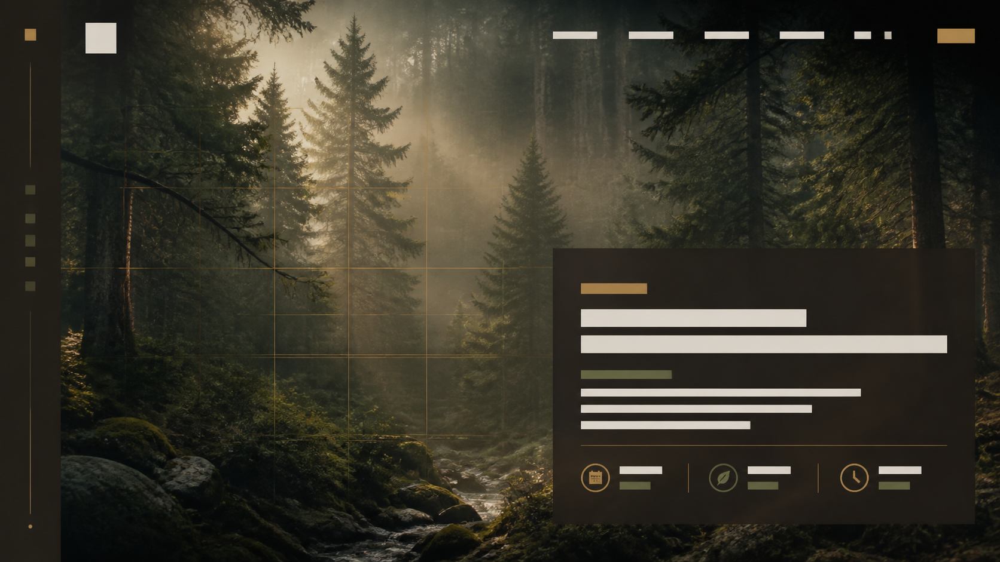
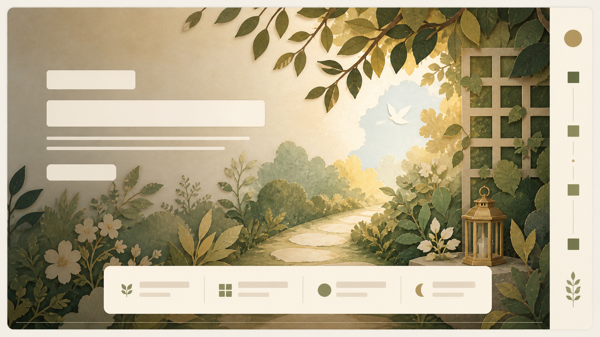
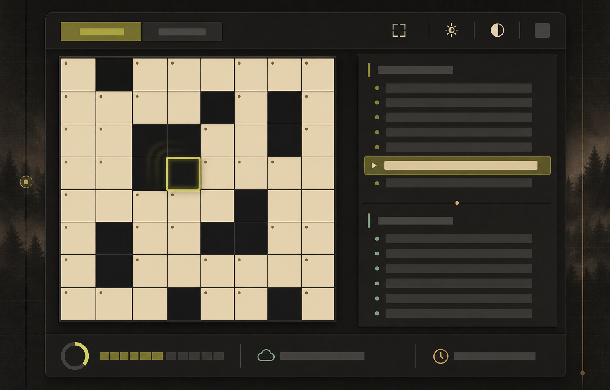
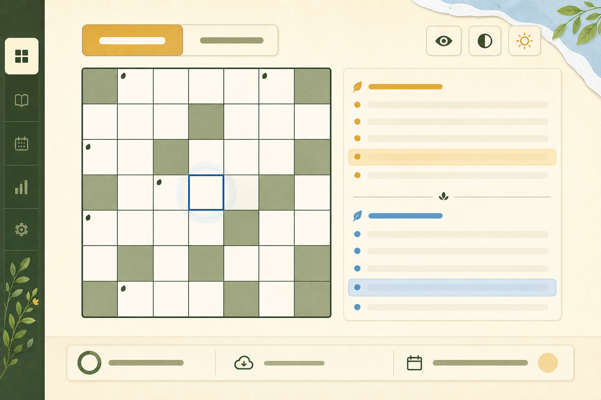
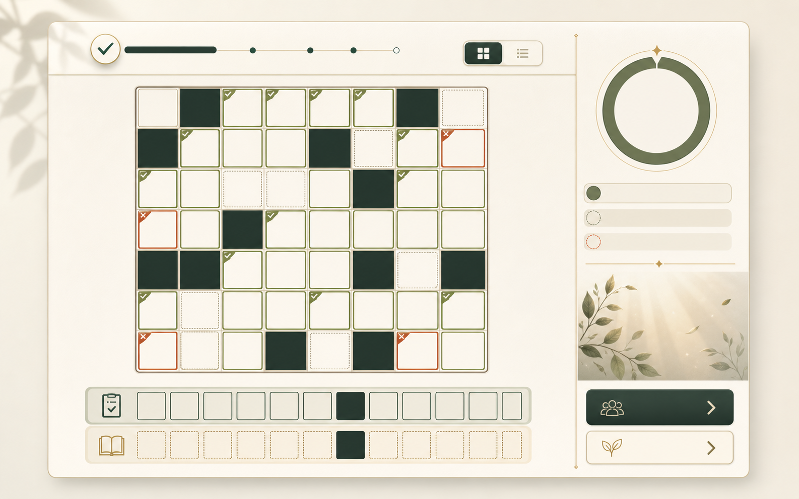
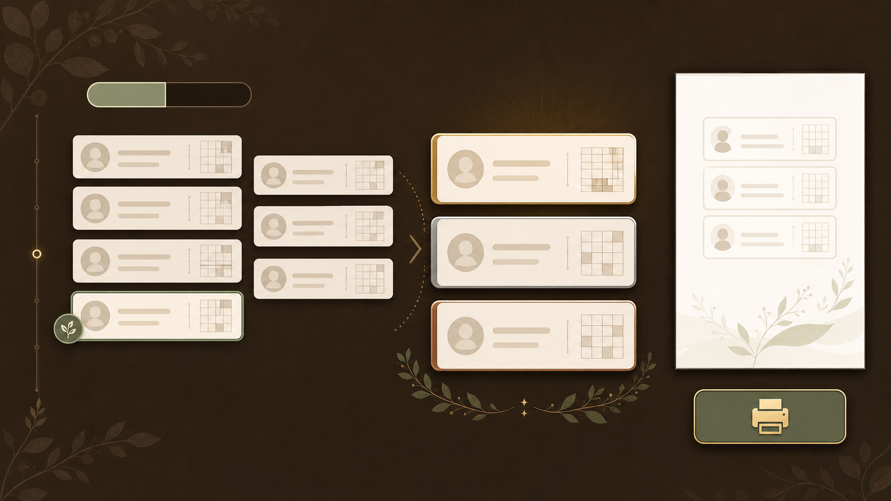
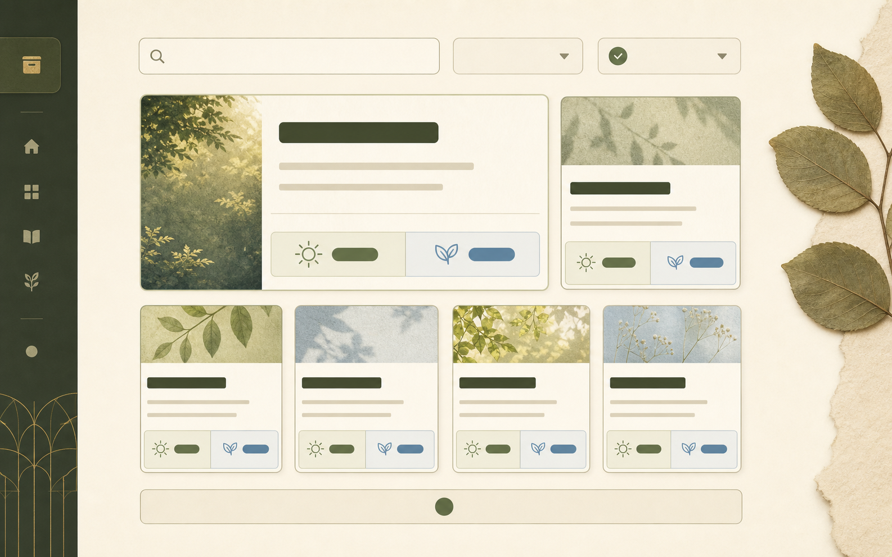
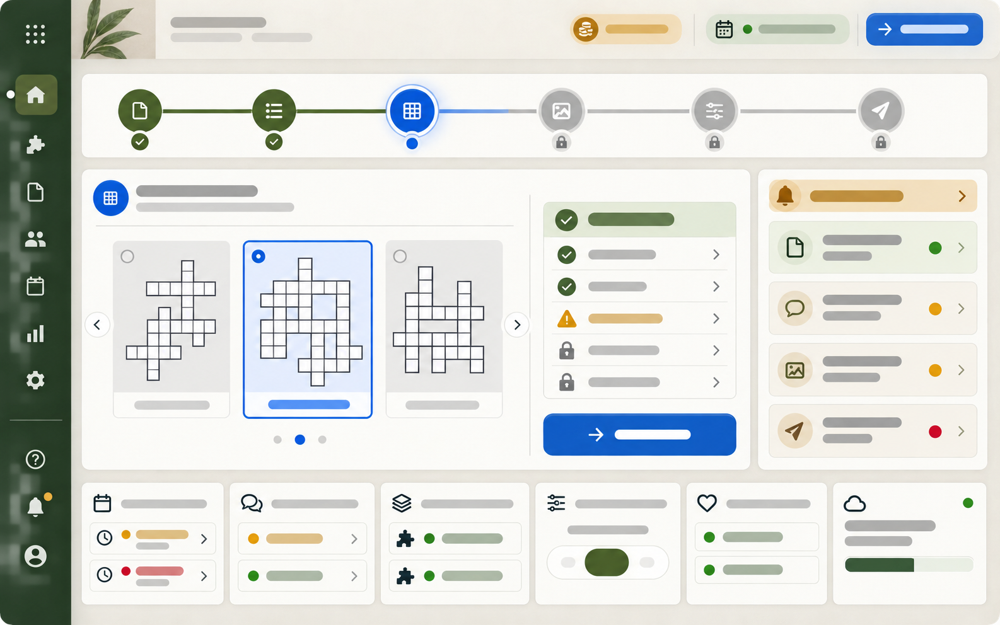

# Phase 7A 웹 디자인 시안

> 생성일: 2026-08-29, Asia/Seoul
> 상태: 8개 reference 전체 방향 사용자 승인 완료
> 승인일: 2026-08-29, Asia/Seoul
> 생성 방식: `imagegen-frontend-web` 지침 + built-in `imagegen`
> 용도: Phase 3~6 실제 React 화면 구현 전 시각 방향 reference

## 1. 디자인 방향

공통 concept spine은 **말씀이 자라는 조용한 정원**이다. 십자가·성경 사건·기성 종교 스톡 이미지 대신 숲, 새벽빛, 잎, 정원 길, 등불, 격자형 trellis를 사용해 교회 가족용 서비스의 차분함과 친근함을 함께 만든다.

- 공통: 넓은 여백, 절제된 기하학, 거의 불투명한 입력 패널, 얇은 세로 rhythm rail
- 라이트: Everforest 기반 아이보리·잎색·절제된 황동·하늘색
- 다크: Gruvbox 기반 짙은 갈색·크림·이끼색·아쿠아
- 장년: 사진적 숲과 새벽빛, 사색적이고 중후한 톤
- 어린이: 종이 cutout·gouache 자연 일러스트, 따뜻하지만 유아적이지 않은 톤
- 공통 컴포넌트: off-grid editorial frame, vertical rhythm line, layered image crop, product UI panel stack
- 모션 암시: cinematic fade-through, 완만한 parallax, cell·card의 짧은 stagger

이미지에는 실제 글자·숫자·로고·성경 구절·정답 음절을 생성하지 않았다. blank bar와 기하학 icon은 정보 위계만 보여주며 실제 문구와 접근성 label은 React/HTML 구현 단계에서 넣는다.

## 2. 섹션별 reference

### 1. 장년용 설교 hero·메타데이터

- 숲 사진을 전체 canvas로 사용하고 오른쪽 아래에 거의 불투명한 설교 정보 패널을 둔다.
- 왼쪽 세로 rail과 황동 trellis 선이 서비스 전체의 공통 visual motif다.
- 실제 구현에서는 설교 제목·설교일·장절·판본·공식 링크·AI 요약 고지를 구조화된 HTML로 배치한다.

### 2. 어린이용 설교 hero·메타데이터

- 같은 정보 구조를 종이 질감 정원·등불·비둘기 형태로 전환한다.
- 특정 인물, 교리적으로 민감한 성경 사건, 유아용 mascot을 사용하지 않는다.
- 데스크톱·모바일 실제 배경 자산은 Phase 7B에서 별도로 생성한다.

### 3. 장년용 퀴즈 workspace

- 1024px 이상은 격자 60%, 단서 40%의 두 열이다.
- 난이도, 크게 보기, 테마, 진행률, 로컬 저장, 정확한 마감 상태가 독립된 제어·상태 영역을 가진다.
- active·blocked·focused cell은 색뿐 아니라 면·선·marker 모양으로 구분한다.

### 4. 어린이용 퀴즈 workspace

- 장년용과 기능·정보량은 같고 표면·focus·방향 accent만 어린이 palette로 바꾼다.
- 유아용 game UI처럼 기능을 감추거나 과도한 보상 장식을 사용하지 않는다.
- 44px 이상 control과 큰 cell scale을 시각적으로 유지한다.

### 5. 제출 후 답안 비교

- 정답·오답·빈칸을 색 + check corner + x corner + dotted outline로 구분한다.
- 교차 셀은 한 번만 계산하고, 제출 답과 공식 정답은 아래의 두 band로 분리한다.
- 공식 정답 노출은 실제 성공 제출 뒤 또는 archived practice에서만 허용한다.

### 6. 참여 현황·Top N·출력

- 전체 참여 카드가 완전 정답자 Top N 카드로 전환되는 방향을 보여준다.
- 사용자 본인 카드는 outline과 icon으로 구분한다.
- 오른쪽 A4 preview와 출력 action은 같은 view model에서 PDF로 이어진다는 뜻이며, 일반 웹 화면 capture를 뜻하지 않는다.

### 7. 지난 퀴즈 아카이브

- 검색, 연도, 월 filter를 상단에 두고 설교일 최신순 카드를 이어 붙인다.
- 각 카드에는 어린이용·장년용 action을 별도로 제공하며 카드 전체를 모호한 링크로 만들지 않는다.
- 큰 최근 항목과 작은 이전 항목의 시각적 차이는 정보 우선순위일 뿐 pagination·정렬 규칙을 바꾸지 않는다.

### 8. 관리자 dashboard·6단계 흐름

- 통계보다 지금 이어서 할 한 작업을 가장 크게 보여준다.
- 6단계 stepper는 완료·현재·잠금을 색과 icon으로 함께 표시한다.
- 격자 배치 단계의 여러 완성 layout 비교, 하드 gate checklist, 다음 action을 한 작업 panel에 둔다.
- 비용, 삭제 예정 초안, 문의, 진행 중 퀴즈, Top N 설정, 서비스 상태·backup은 낮은 우선순위 영역이다.

## 3. 반응형 전환 규칙

- `>= 1024px`: 퀴즈 workspace는 `minmax(0, 3fr) minmax(320px, 2fr)` 두 열
- `< 1024px`: 격자 → 단서 → 진행·제출 순서의 한 열; 크게 보기는 cell·글자·간격 확대 기능으로 유지
- `320px~`: 상단 control은 2행까지 wrap하고 주요 action은 전체 폭, 일반 control 최소 touch target 44px 유지. 퍼즐 셀은 2026-08-31 사용자 결정 D-015에 따라 전체 격자가 들어오도록 축소하며, 이전/다음·방향 버튼은 최소 48px로 보완
- archive: 큰 featured 형태를 강제하지 않고 동일한 단일 카드 list로 순서 보존
- 결과·Top N: 요약 rail과 A4 preview를 본문 아래로 내려 reading order 유지
- 관리자: 고정 side rail은 compact navigation으로 전환하고 6단계 stepper는 2열/세로 단계로 바꿔 가로 scroll에 의존하지 않음
- 200% 확대에서도 핵심 action과 puzzle cell이 가로 viewport 밖으로 사라지지 않게 한다.
- 기본/크게 보기 모두 격자 일부를 잘라내거나 좌우로 이동하지 않는다. 셀 번호·입력 글자·방향 기호를 비례 배치하며 기존 56px/60px 최소 셀 기준은 D-015로 대체됐다. 시안 PNG 원본은 보존한다.

## 4. 승인된 검토 항목

1. 전체 분위기가 교회 가족용으로 차분하면서도 오래된 교회 template처럼 보이지 않는가?
2. 장년용 숲 사진과 어린이용 종이 정원의 차이가 충분하지만 한 서비스로 느껴지는가?
3. 퀴즈 workspace의 60:40 구조와 거의 불투명한 panel이 읽기·입력 중심에 맞는가?
4. 제출 결과의 check/x/dotted 상태와 Top N의 절제된 축하 방식이 적절한가?
5. 관리자 화면이 복잡해 보이더라도 ‘현재 단계와 다음 한 작업’이 가장 먼저 보이는가?
6. 실제 구현에서 반드시 줄이거나 바꿔야 할 장식은 현재 별도로 지정되지 않았다.

## 5. 승인 결과와 다음 단계

사용자가 8개 reference의 전체 방향을 승인했다. 이 시안들을 Phase 3~6 화면의 시각 기준으로 사용하고, 이후 의도적인 방향 변경은 기존 reference를 덮어쓰지 않고 문서와 versioned 산출물에 기록한다. 다음 작업은 `design-taste-frontend`를 적용한 Phase 3 공개 퀴즈·한글 입력 화면 구현이다.
