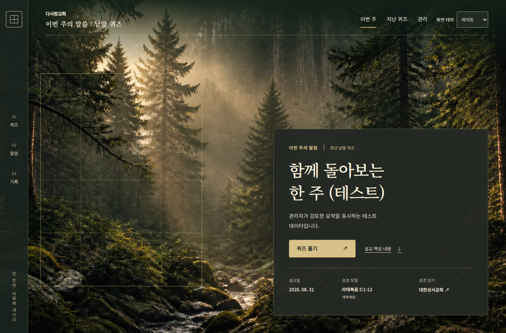
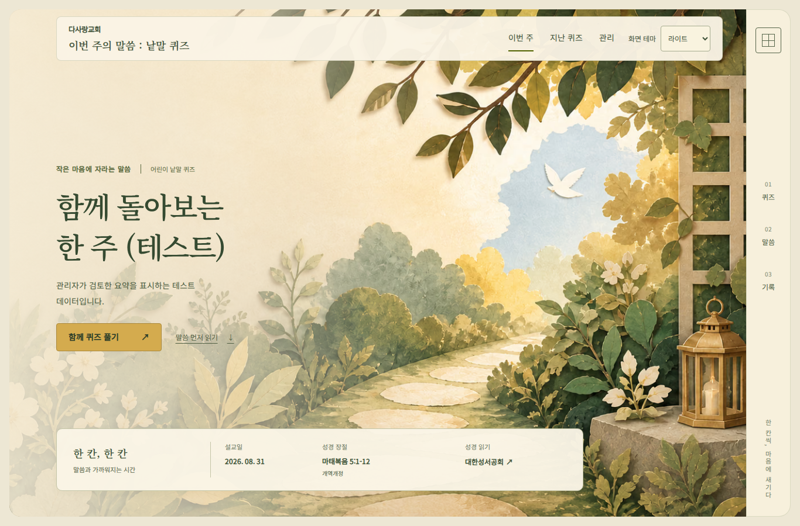

# P9-02 재작업 — 실제 구현 화면

2026-10-06. 918dba4의 시안 재현을 사용자가 거절한 뒤 다시 구현했다. [Phase7A 원본](../phase-7a/DESIGN_BRIEF.md)으로 배경4종을 새로 만들고 장년/어린이 구조를 분리했다. 아래 이미지는 **새 앱의 브라우저 캡처**이며, 합성 설교·문제·관리자 자료만 사용했다. 운영 사이트나 실제 사용자 자료가 아니다. 기존 버전 캡처는 Git918dba4에서 확인할 수 있다.

장년은 숲 전체 배경·왼쪽 세로 메뉴·오른쪽 아래 정보 패널이다.

어린이는 종이 정원·왼쪽 제목·아래 정보 띠·오른쪽 메뉴다.

| 화면 | 현재 캡처 |
|---|---|
| 장년 모바일 / 어두운 테마 | [모바일](adult-mobile.png), [어두운 테마](adult-dark.png) |
| 어린이 모바일 | [밝은 테마](child-mobile.png), [어두운 테마](child-mobile-dark.png) |
| 실제 풀이 | [장년](quiz-workspace.png), [어린이](child-workspace.png) |
| 제출 점수·답안 비교 | [결과](result-dark.png) |
| 참여·Top N·기존 축하 그림 | [참여 현황](participation.png) |
| 지난 퀴즈 | [PC](archive.png), [모바일](archive-mobile.png) |
| 관리자 현재 상태·다음 행동·6단계 | [PC](admin-desktop.png), [모바일](admin-mobile.png) |
| 현재 선택본·확정·9항목 | [내용 검토](admin-review.png) |
| 관리자 어두운 테마 | [검수 화면](admin-dark.png) |

본문과 상태는 실제 HTML이며 배경에 합성한 글자가 아니다. 실제 A4 출력 미리보기는 기존 `Top N 출력` 경로를 유지한다. 화면의 5×5/8×8 시험 격자와 미래 마감일은 합성 검사 자료이며 운영 설정이 아니다. 시안과 시험 자료가 달라지는 경우 텍스트 줄 수/카드 수/세로 길이는 달라진다.

[작업·기능 보존](../../work/P9-02.md) · [자산/생성 지시](../phase-7b/replacement-2026-10-06.json) · [검사 요약](verification.json). 사용자 화면 검수 전까지 P9-02는 검수 대기다. 자동 검사 통과를 시각 만족도나 실제 OS/한글 입력 검수의 대체 증거로 사용하지 않는다.
