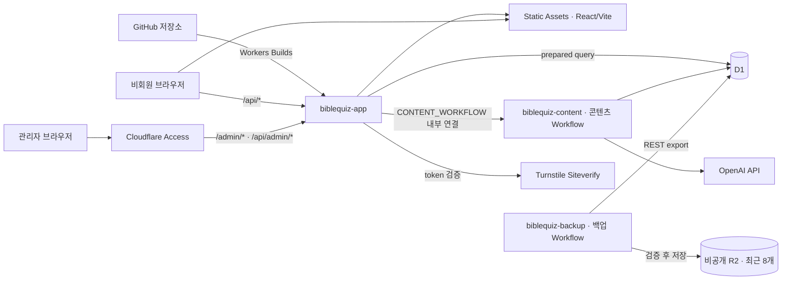

> 현재 분야별 명세. 기존 implementation 13장 기준을 옮겼으며 구현 일지는 보관본으로 분리했다. 플랫폼 가격·한도는 원래 확인일의 기록이며 운영 변경 직전에 공식 자료를 재확인한다. 읽는 것만으로 새 계측·유료 전환을 시작하지 않는다.
> [명세 목차](../../implementation.md) · [현재 상태](../STATUS.md) · [변경 전 원문](../archive/2026-09-21-p5-48/implementation.md#13-cloudflarereact-spa-기술-구조)

## 13. Cloudflare·React SPA 기술 구조

### 13.1 구성 요소를 쉬운 말로 설명

| 용어 | 역할 | v1 |
|---|---|---|
| GitHub | 소스 코드, 마이그레이션, 정적 이미지, 변경 이력 | 사용 |
| Cloudflare Worker | Cloudflare에 독립적으로 배포되어 요청이나 백그라운드 작업을 실행하는 프로그램 단위. 이 문서에서는 모호한 `웹 Worker`·`script` 대신 `Worker 배포 단위`라고 부름 | 사용 |
| `biblequiz-app` | 교인이 접속하는 Static Assets와 `/api/*` Hono 서버를 함께 가진 **메인 애플리케이션 Worker** | 사용 |
| Workers Static Assets | Vite가 만든 `index.html`·JS·CSS·이미지·폰트를 Worker와 함께 올리고 CDN에서 직접 제공하는 기능. 정적 요청은 Worker 코드를 실행하지 않음 | 사용 |
| `biblequiz-content` | 자막·OpenAI·격자 생성 Workflow만 가진 **비공개 콘텐츠 Worker**. 브라우저가 접속하는 URL과 일반 `fetch` endpoint가 없음 | 사용 |
| `biblequiz-backup` | D1 export와 private R2 보관 Workflow만 가진 **비공개 백업 Worker**. 브라우저가 접속하는 URL이 없음 | 사용 |
| Hono | `biblequiz-app` 안에서 `/api/*` 주소·middleware·응답을 정리하는 경량 router | 사용 |
| D1 | SQLite 방식의 서버리스 관계형 데이터베이스 | 사용 |
| Drizzle ORM | D1 schema와 query 결과를 TypeScript type으로 연결하는 데이터 접근 도구 | 사용 |
| R2 | 이미지·백업 같은 파일 객체 저장소. 공개 이미지에는 쓰지 않고 D1 비공개 백업에만 사용 | 백업 전용 사용 |
| KV | 빠른 키-값 캐시·설정 저장소. 관계형 데이터나 즉시 일관성이 필요한 제출에 부적합 | v1 미사용 |
| Cloudflare Access | 사이트 앞에서 승인된 관리자 이메일만 통과시키는 로그인 문 | 권장 기준안 |
| Turnstile | 계정 없이 봇 제출을 줄이는 CAPTCHA 대체 장치 | 권장 기준안 |
| React SPA | 화면 전체를 하나의 React 애플리케이션으로 구성하는 방식 | 사용 |
| Vite | React 개발 서버와 production 정적 파일 build 도구 | 사용 |

Worker와 D1/R2/KV는 경쟁하는 선택지가 아니다. Worker가 일을 하고, D1/R2/KV는 각기 다른 종류의 데이터를 저장한다. **D1은 퀴즈·제출처럼 SQL로 조회하고 관계를 지켜야 하는 장부**, **R2는 D1에서 내보낸 SQL 백업 파일을 통째로 두는 비공개 창고**다. 배경 이미지는 Git→Static Assets로 제공하고 R2 bucket은 공개하지 않는다. KV는 사용하지 않는다.

### 13.2 구조도



### 13.3 React SPA 실행 방식

- `React + Vite + TypeScript strict`를 기본으로 한다.
- React Router는 2026-08-25 확정한 **Data Mode**의 `createBrowserRouter`를 사용한다. Framework Mode·SSR·React Router 전용 server build는 도입하지 않는다.
- Vite가 만든 `dist/` 결과물은 `biblequiz-app`의 Workers Static Assets로 배포한다.
- 브라우저 route는 React Router가 담당하고, `/api/*` 요청만 같은 `biblequiz-app`의 Hono handler가 처리한다.
- `assets.not_found_handling = "single-page-application"`으로 `/quiz/:slug`, `/archive`, `/admin` 직접 접속·새로고침도 `index.html`에서 시작한다. 앱 안 이동은 전체 문서 새로고침 없이 처리한다.
- 최신 퀴즈·제출·순위는 API에서 받고, 브라우저 저장소에는 입력 중 임시 답안과 비민감 UI 설정만 둔다.
- route loader·action은 `/api/*` 호출과 pending/error 화면 조정에만 사용하고 DB·secret·공식 정답을 포함하지 않는다. 폼·API schema는 브라우저와 Worker가 Zod schema로 공유하되 공식 정답과 secret은 서버 전용으로 분리한다.
- 전역 상태 라이브러리는 v1에서 쓰지 않고 feature별 React `useReducer`와 서버 데이터를 조합한다.
- Tailwind CSS v4와 중앙 디자인 토큰을 기본으로 하고 복잡한 feature만 CSS Modules를 사용한다.

### 13.4 환경 분리

```text
local
preview (pull request / branch)
production
```

- local과 preview는 별도 D1 데이터베이스 또는 명확히 분리된 binding을 쓴다.
- preview에서 실제 참여자 데이터를 복사하지 않는다.
- production migration은 백업·검증 후 순차 적용한다.
- Workers branch/commit Preview는 전체 배포를 Worker-level Access로 보호한다. `biblequiz-app-preview`의 `workers.dev` 주소는 Access가 적용된 뒤에만 켠다. Production은 일반 공개 화면을 열어 두고 hostname/path 기반 Access로 `/admin/*`, `/api/admin/*`만 보호한다.

Worker 이름과 연결 대상도 환경별로 분리한다.

| 역할 | Preview | Production | 공개 주소 |
|---|---|---|---|
| 메인 애플리케이션 | `biblequiz-app-preview` | `biblequiz-app` | Preview URL / `biblequiz-app.<account>.workers.dev` |
| 콘텐츠 Workflow | `biblequiz-content-preview` | `biblequiz-content` | 없음; `workers_dev = false`, preview URL 비활성 |
| 백업 Workflow | `biblequiz-backup-preview` | `biblequiz-backup` | 없음; `workers_dev = false`, preview URL 비활성 |

- `biblequiz-app-preview.CONTENT_WORKFLOW`는 `biblequiz-content-preview`만, Production binding은 `biblequiz-content`만 가리킨다. 교차 환경 binding은 CI에서 실패시킨다.
- Preview D1/R2/secret은 non-production 자원만 사용한다. Production D1 export token과 production R2 bucket은 `biblequiz-backup`에만 존재한다.
- `biblequiz-app-preview`는 Worker-level Access의 `All traffic` 보호가 확인된 뒤 `workers_dev = true`로 전환하고, 고정 주소 하나만 사용하도록 버전별 `preview_urls = false`를 유지한다. 브라우저가 직접 호출하지 않는 콘텐츠·백업 Worker는 단순히 링크를 숨기는 것이 아니라 Wrangler에서 `workers_dev`와 preview URL을 끄고 route/custom domain도 등록하지 않는다.

### 13.5 관리자 인증

일반 회원 시스템을 만들지 않고 Cloudflare Access로 `/admin`, `/admin/*`, `/api/admin/*`를 보호한다.

초기 관리자 1명은 이미 사용하는 Cloudflare 계정으로 로그인한다. 앱은 관리자 계정·비밀번호·2단계 인증 정보를 생성하거나 D1에 저장하지 않는다. D1에는 Access가 검증한 관리자 이메일을 발행·수정·삭제·월간 점검 같은 관리자 조치의 감사 기록으로만 남긴다.

- 초기에는 Cloudflare 계정 구성원만 허용하는 사전 구성 `Cloudflare account` 정책을 사용한다. 현재 계정 구성원은 운영자 1명이다.
- 초기 Preview와 Production은 Cloudflare identity provider만 허용하고, 관리자의 기존 Cloudflare 계정과 가능하면 그 계정의 2단계 인증을 사용한다.
- `One-time PIN` identity provider는 Zero Trust 조직에 등록되어 있어도 초기 앱의 로그인 방식에서는 제외한다.
- 향후 다른 관리자에게 Cloudflare 대시보드 권한을 주지 않고 사이트 관리자 화면만 허용해야 할 때, 그 사람의 정확한 이메일을 allowlist한 뒤 OTP를 선택적으로 추가할 수 있다. 새 프로젝트를 만들 때마다 OTP를 추가한다는 뜻은 아니다.
- Access 세션은 현재 UI에서 선택 가능한 6시간으로 설정한다. 나중에 운영 편의에 따라 변경할 수 있다.
- `Include Everyone`, 모든 이메일 허용, 영구 bypass 정책은 금지한다.
- `biblequiz-app`의 관리자 API도 `Cf-Access-Jwt-Assertion`의 서명, issuer, audience를 검증한다.
- 관리자 조치는 검증된 이메일을 감사 로그에 기록한다.

첫 구현 route인 `POST /api/admin/quiz-sets/:id/close-now`를 포함한 모든 현재 관리자 route는 Access JWKS로 RS256 서명·issuer·audience·만료/발급 시각·email을 Worker 내부에서 다시 검증한다. local에서 실제 호출하려면 `ACCESS_TEAM_DOMAIN`, `ACCESS_AUD`를 해당 환경의 Access application 값으로 별도 연결해야 한다. Preview에는 두 값을 연결하고 보호 동작을 확인했다. Production은 Worker 전체 트래픽 보호를 프리뷰만으로 전환해 일반 방문을 공개하고 관리자 네 경로의 self-hosted Access와 backend audience 보호를 유지한다. 새 로그인 뒤 관리자 메뉴와 JWT/Origin 보호 갱신 API의 최신 집계 저장을 확인했다. 정책 세부·공개 gate는 [P8-02](../work/P8-02.md)에서 확인한다. 값이 없거나 JWKS를 안전하게 확인할 수 없으면 관리자 동작을 추측하지 않고 503으로 닫는다.

Cloudflare Access는 앱 자체 회원가입과 사용자 DB를 요구하지 않기 때문에 현재 단계에 적합하다.

2026-08-27 Preview 실제 적용에서는 `Workers & Pages → biblequiz-app-preview → Access`의 Worker 전용 간편 설정을 사용했다. 이 경로는 Access application 이름과 policy 이름을 별도로 입력하지 않고 Worker 연결 객체를 자동 생성하며, 사전 구성 정책명이 `Cloudflare account`로 표시된다. 따라서 상담 중 제안했던 `biblequiz-preview-access`·`biblequiz-preview-admin`을 수동 입력하지 않은 것은 누락이 아니다. `All traffic`, `Cloudflare account / Allow`, 세션 6시간만 선택했고 `Everyone`, `Email domain`, `Bypass`는 선택하지 않았다. 계정에 다른 구성원을 초대하면 그 사람도 Preview 접근 대상이 되므로 구성원 추가 시 이 정책을 재검토한다.

같은 날 `Workers Free`, `Zero Trust Teams Free Base`, zone `Free Plan`이 활성 상태이고 별도 유료 add-on이 없음을 Billing의 Subscriptions 화면에서 확인했다. 비로그인 상태의 `/`, `/api/health`, `/api/health/database`는 모두 Access 로그인으로 이동했고, 운영자 로그인 뒤 화면의 `기반 연결 정상 · biblequiz-app`과 D1 응답의 `database: d1`, `status: ok`를 확인했다. Preview 고정 주소는 `biblequiz-app-preview.jinkyu0105.workers.dev`이며 버전별 Preview URL은 비활성화한다.

Access 좌석은 프로젝트별 50명이 아니라 **같은 Cloudflare Zero Trust 조직 전체의 활성 고유 사용자**를 합산한다. 허용 목록에 이메일을 추가한 것만으로는 좌석을 쓰지 않고, 그 사용자가 Access 인증을 실제로 수행하면 1석을 사용한다. 같은 사용자가 여러 사이트·Access application에 여러 번 로그인해도 1석이며, 서로 다른 7명이 같은 조직의 여러 프로젝트에 로그인하면 총 7석이다. 다른 Cloudflare 계정/Zero Trust 조직은 별도 한도를 갖지만, 무료 한도 분산을 목적으로 프로젝트마다 조직을 나누지 않는다. 필요하면 1개월 이상의 비활성 좌석 자동 만료를 설정한다.

운영자는 2026-08-13 향후 다른 프로젝트도 본인이 관리하며, Access 무료 좌석을 나누기 위한 별도 Cloudflare 계정/Zero Trust 조직을 만들지 않기로 확정했다. 이 프로젝트의 초기 관리자는 1명이므로 현재 예상 Access 좌석 사용량은 1석이다.

- 현재 무료 플랜: Zero Trust 조직당 활성 사용자 최대 50명, 월 USD 0
- 50명을 넘는 시점의 저비용 대안: 현재 Pay-as-you-go 사용자당 월 USD 7. 가격은 도입 직전에 재확인한다.
- 좌석 현황은 `Zero Trust → Team & Resources → Users`에서 확인한다.

공식 문서: [Worker·Preview에 Access 적용](https://developers.cloudflare.com/workers/configuration/cloudflare-access/), [Access identity provider](https://developers.cloudflare.com/cloudflare-one/integrations/identity-providers/), [향후 선택 가능한 이메일 OTP](https://developers.cloudflare.com/cloudflare-one/integrations/identity-providers/one-time-pin/), [Access JWT 검증](https://developers.cloudflare.com/cloudflare-one/access-controls/applications/http-apps/authorization-cookie/validating-json/), [Access 좌석 관리](https://developers.cloudflare.com/cloudflare-one/team-and-resources/users/seat-management/), [Access 가격](https://www.cloudflare.com/sase/products/access/)

### 13.6 Secrets와 bindings

코드 저장소에 넣지 않는다.

OpenAI Project/키의 환경 분리는 기본 권장안이다. 2026-10-03 P8-02에서 사용자는 기존 보관 키를 Production 비공개 `biblequiz-content` Secret으로 재사용하는 구체적 묶음을 승인했다. 이번 연결은 별도 production Project/키를 새로 만들지 않으며 OpenAI 청구는 기존 키의 Project에 합산될 수 있다. 앱의 Production 호출·추정 비용은 Production D1에 별도로 기록한다. 키 값은 React bundle·브라우저·GitHub Actions log·D1·문서에 노출하거나 저장하지 않는다. 기존 비공개 파일에서 프로그램 표준입력으로 서버 Secret에 전달하고 새 로컬 사본을 만들지 않는다. 앱/백업/Preview 콘텐츠에는 전달하지 않으며, 연결 검수에서 새 유료 생성 시험을 실행하지 않는다.

앱은 AI 응답의 usage를 호출 목적·모델·pricing version과 함께 D1에 저장해 주간 예상 비용을 계산한다. 공식 청구 확인은 OpenAI의 project별 Usage/Costs 화면으로 연결한다. 비용 조회를 자동화한다는 이유로 조직 전체를 관리하는 OpenAI Admin Key를 앱에 보관하지 않는다. OpenAI Project의 알림 기능은 보조 수단으로 사용하되, 앞서 확정한 품질 우선 원칙에 따라 앱 자체가 관리자 재생성을 비용 때문에 강제 차단하지 않는다.

| 배포 단위 | Secret | 일반 변수·binding |
|---|---|---|
| `biblequiz-app` 메인 애플리케이션 Worker | `TURNSTILE_SECRET`, `SESSION_PEPPER`, `ARCHIVE_CURSOR_SECRET`, 필요 시 `CLOUDFLARE_ANALYTICS_TOKEN` | `TURNSTILE_EXPECTED_HOSTNAME`, `ACCESS_TEAM_DOMAIN`, `ACCESS_AUD`, `DB`, `CONTENT_WORKFLOW`, Static Assets |
| `biblequiz-content` 비공개 콘텐츠 Worker | 환경별 `OPENAI_API_KEY`, 필요할 때만 `TRANSCRIPT_PROVIDER_SECRET` | `DB`, 콘텐츠 Workflow 정의·binding |
| `biblequiz-backup` 비공개 백업 Worker | export 검수용 `D1_REST_API_TOKEN`(현재 계정 D1 Edit, backup에만 보관) | `CLOUDFLARE_ACCOUNT_ID`, production `D1_DATABASE_ID`, `BACKUP_BUCKET`, 백업 Workflow 정의·binding |

`OPENAI_API_KEY`는 실제 AI 호출을 수행하는 `biblequiz-content`에만 두고 `biblequiz-app`에는 주지 않는다. `D1_REST_API_TOKEN`은 Cloudflare 관리 API의 SQL export를 시작하기 위한 backup 전용 token이며 `biblequiz-backup`에만 둔다. Global API Key를 사용하지 않는다. 실제 Read token의 metadata GET200/export poll401과 기존 D1 Write OAuth의 동일 poll 허용을 확인했다. export-only/단일 DB 권한이 지원된다고 단정하지 않는다. 2026-10-02 사용자는 D1 Edit가 현재 계정 데이터베이스의 변경·삭제 권한도 포함한다는 설명 뒤 “네 그렇게 하세요”로 백업 전용 토큰의 권한 확대를 승인했다. 기존 BibleQuiz D1 Backup Read 토큰의 현재 계정 범위를 유지하고 D1 Read만 Edit로 변경한다. 토큰은 biblequiz-backup의 기존 D1_REST_API_TOKEN에서 재사용하며 앱/content에 주지 않는다. 이는 SQL 백업·readback/checksum·격리 복원 검수 승인이고 실제 Production 데이터 손실 복원·유료 전환·새 AI·main push 승인은 아니다. 권한 설정의 실제 저장·export 성공은 별도 검증 전 미완료다. `ACCESS_TEAM_DOMAIN`, `ACCESS_AUD`, account/database ID와 binding 이름은 식별·연결 정보이지 비밀값은 아니지만 환경별로 섞이지 않게 관리한다.

D1 binding은 `DB`, `biblequiz-app`에서 콘텐츠 Workflow를 시작·조회하는 내부 binding은 `CONTENT_WORKFLOW`, 비공개 백업 R2 binding은 `BACKUP_BUCKET`으로 통일한다. `CONTENT_WORKFLOW`는 URL·API key가 아니라 `wrangler.jsonc`에서 target Worker 이름을 `script_name`으로 지정하는 Cloudflare 계정 내부 연결이다. 이 binding은 Workflow instance 시작·상태 조회 권한만 제공하며 대상 Worker의 `OPENAI_API_KEY` 값을 호출자에게 전달하지 않는다. R2 binding과 `D1_REST_API_TOKEN`은 `biblequiz-backup`에만 주고 `biblequiz-app`·`biblequiz-content`에는 부여하지 않는다. 공식 참고: [Workers Workflow API와 다른 Worker의 Workflow binding](https://developers.cloudflare.com/workflows/build/workers-api/), [Workers bindings 설정](https://developers.cloudflare.com/workers/wrangler/configuration/), [D1→R2 Workflow 백업](https://developers.cloudflare.com/workflows/examples/backup-d1/)

운영자용 쉬운 구분:

- `SESSION_PEPPER`는 익명 참여자의 브라우저 식별값을 DB에 그대로 저장하지 않도록 섞어 주는 길고 무작위인 **비밀 문자열**이다. 사람이 기억하거나 직접 작명할 필요가 없다. 개발 과정에서 안전하게 생성해 Cloudflare Secret 저장소에 넣고, 코드·GitHub·운영 화면에는 값 자체를 남기지 않는다.
- D1/R2 `binding`은 비밀번호가 아니라 “이 코드에서 어느 Cloudflare 자원을 `DB` 또는 `BACKUP_BUCKET`이라는 이름으로 부를 것인가”를 연결하는 **내부 연결표**다. 실제 D1 database와 R2 bucket은 Cloudflare 계정에 있고 코드에는 연결 이름만 들어간다. 단, D1의 전체 SQL export는 일반 binding API가 제공하는 query 동작이 아니므로 backup Worker만 별도의 제한된 `D1_REST_API_TOKEN`을 사용한다.
- 따라서 Secret은 값이 노출되지 않게 보관해야 하고, binding 이름은 코드에 공개되어도 된다. binding을 안다고 해서 다른 사람이 D1/R2에 접근할 수 있는 것은 아니다.

### 13.7 콘텐츠·AI 백그라운드 작업 — 2026-08-13 확정

관리자 화면에서 빠르게 끝나는 저장·검사와 오래 걸릴 수 있는 주간 콘텐츠 생성을 분리한다.

**`biblequiz-app`이 요청 안에서 바로 처리하는 작업**

- YouTube URL 형식과 video ID 중복 확인
- 관리자가 수정한 제목·날짜·본문 주소·단서 저장
- 퀴즈 설정 변경, 미리보기 조회, 숨김·삭제
- 이미 검증이 끝난 퀴즈의 최종 발행 전 조건 확인과 발행

**Cloudflare Workflows가 백그라운드에서 처리하는 작업**

1. 공개 영상 메타데이터와 자막 가져오기
2. 불변 raw source·segment·checksum 저장 후 `awaiting_transcript_review`로 멈춤
3. 관리자가 직접 편집하거나 선택적으로 AI 교정 job을 실행하고, 사람의 `자막 확정`을 기다림
4. 현재 확정 자막 checksum을 고정한 뒤 `gpt-5.6-terra`로 근거가 연결된 설교 의도 분석
5. 별도 비판 단계로 의도 과장·근거 없는 결론·예화 오독 검사
6. `awaiting_intent_review`로 멈춰 관리자 수정·확정 대기
7. 확정된 분석에서 요약과 난이도별 답·단서 후보 생성
8. 서버의 결정적 가변 배치기로 후보 배치
9. 정답 형식·연결성·교차 밀도·확정 자막 근거 코드 검사와 관리자의 최종 품질 판단
10. `review_ready` 또는 `needs_revision`으로 종료

Workflows가 AI 계산 자체를 하는 것은 아니다. AI 계산은 선택한 외부 AI 제공자가 수행하고, Workflows는 네트워크 호출·순서·상태를 조정한다. 배치와 검증 코드는 각 Workflow step에서 실행되는 Worker 코드다.

콘텐츠 Workflow는 같은 GitHub 저장소·Cloudflare 계정 안의 `biblequiz-content`라는 별도 Worker 배포 단위에 둔다. 이 배포 단위는 브라우저가 호출할 공개 URL과 일반 `fetch` endpoint를 만들지 않으며 `OPENAI_API_KEY`를 전용 secret으로 가진다. `biblequiz-app`은 `CONTENT_WORKFLOW` 내부 binding으로 이 Workflow의 instance를 시작·조회한다. 공식 설정에서는 대상 배포 단위를 가리키는 필드 이름이 `script_name`이지만, 이 문서의 설명에서는 파일 하나로 오해하지 않도록 `대상 Worker 이름`이라고 부른다. 별도 서버나 별도 회원 계정, KV는 추가하지 않으며 R2는 `biblequiz-backup`의 비공개 bucket만 예외로 둔다.

관리자가 **퀴즈 초안 만들기**를 누르면 `biblequiz-app`은 작업을 한 번 등록하고 `CONTENT_WORKFLOW`를 시작한 뒤 `202 Accepted`와 `jobId`를 즉시 반환한다. 관리자 화면은 D1의 작업 상태를 조회해 `자막 가져오는 중 → 자막 확인 대기/AI 교정 중 → 설교 의도 분석 중 → 관리자 의도 확인 대기 → 요약·문제 생성 중 → 격자 검사 중 → 검토 준비`처럼 보여준다. 브라우저를 닫아도 작업과 결과는 사라지지 않는다. 일반 방문자의 퀴즈 조회·입력·제출·채점 때에는 이 Workflow가 실행되지 않는다.

운영 규칙:

- 동일 설교·동일 설정 revision의 중복 시작을 막는 idempotency key를 쓴다.
- 중복 요청으로 결과나 비용이 중복되지 않게 한다. AI 호출의 자동 재시도는 하지 않으며 관리자의 명시적 새 생성과 같은 요청의 재전송을 구분한다.
- 관리자가 결과를 평가한 뒤 누르는 수동 **다시 생성**에는 횟수 제한을 두지 않는다. 이는 같은 요청의 재전송과 구별하는 새 revision이다.
- 자막이 없으면 `TRANSCRIPT_NOT_FOUND`로 종료하고 관리자 화면에 11.3의 안내를 표시한다.
- AI나 자동 검사가 성공해도 자동 발행하지 않는다. 최종 상태는 관리자 검수가 필요한 `review_ready`다.
- Workflow 자체 상태의 무료 플랜 보존 기간에 의존하지 않는다. 진행 상태, 오류, 생성물 위치는 D1 `generation_jobs`를 정본으로 영구 기록한다.
- 승인된 자막 입력 범위와 간결한 결과를 먼저 지원하고, 격자 배치는 기존 탐색 예산을 둔다. 실제 문제 없이 새 분할 체계나 생성 후보 수 제한을 도입하지 않는다. 무제한 brute-force 탐색은 금지한다.
- 실행 로그에 전체 자막, AI 응답 전문, API key를 남기지 않는다. `jobId`, step, 소요 시간, 오류 code만 구조화해 남긴다.
- 자막 실패는 11.3의 sanitized diagnostic event를 D1에 남겨 관리자 화면과 `AI에게 전달할 진단 정보 복사`에서 재구성한다. 일반 공개 화면과 일반 로그에는 diagnostic bundle을 반환하지 않는다.
- 관리자 화면에는 해당 revision의 모델, 예상 비용, 완료 후 token 사용량과 추정 실제 비용을 표시한다. 비용은 경고·정보이며 생성 차단 조건이 아니다.

#### 무료 CPU 한도와 비용 판단

현재 무료 Workflows의 Worker 계산 한도는 **step당 10ms active CPU**다. 외부 AI 응답, 자막 다운로드, D1 응답을 기다리는 시간은 active CPU가 아니며, JSON 파싱·문자열 정리·격자 탐색·검증처럼 우리 코드가 실제 계산하는 시간만 CPU에 포함된다. 이 작업은 관리자가 보통 주 1회 초안을 만들 때만 실행되므로 요청량보다 한 step의 계산 복잡도가 핵심이다.

무료 적합성은 실제 입력과 승인된 후보 수로 검증한다. 한도를 넘으면 측정된 계산/조회 구간을 수정하고 재검증하며, 원문을 임의 분할·절단하거나 후보 수/품질을 낮춰 통과시키지 않는다. 2026-09-29 운영자는 무료 진행을 선택했다. 같은 P5-71에서 측정된 CPU 병목을 수정하고 원격 검증을 이어가며, 유료 전환을 재개 조건으로 요구하지 않는다.

공식 참고: [Workflows 개요](https://developers.cloudflare.com/workflows/), [Workflows 한도](https://developers.cloudflare.com/workflows/reference/limits/), [Workflows 가격](https://developers.cloudflare.com/workflows/reference/pricing/)

P5-71의 현재 구현 대조: 요청/Workflow 실행 구간별 불변 자료 재사용과 묶음 조회로 반복 D1 통신을 줄였다. 현재 선택/상태와 출처·hash·검수·비용·저장 직전 조건은 유지하며 실제 `step.do` 단위와 자동 재시도 0회를 사용한다. 승인된 Preview app/합성 content 연결·0007~0034 적용 후 첫 생성/재개는 저장됐지만 최종 HTTP 완료는 `exceededCpu`로 실패했다. 현재 생성/측정은 비활성이고 무료 원격 완주로 판정하지 않는다. [정확한 실측과 상태](../work/P5-71.md)를 따른다.

거절/깨진 응답의 원 바이트는 기존 D1의 비공개 `ai_response_archives`/chunk에 저장하도록 0035와 연결 코드를 준비했다. 요청을 먼저 영속 예약하며 실패/재시작으로 같은 호출을 자동 재전송하지 않는다. 응답은 JSON 검사 전에 저장하고 보관 실패라도 가능한 usage를 남긴 뒤 다음 생성으로 진행하지 않는다. headers/key·공개 route는 저장하지 않으며 SHA/길이/순서와 현재 정리 상태를 확인해 내부에서 회수한다. 기존 7일 초안 정리를 실행할 때 원문 chunk를 같이 정리하고 비용/manifest를 유지한다. `AI_RESPONSE_ARCHIVE_ENABLED=true`를 쓰기 전에 해당 환경 0035와 회수/실패/중복 방지를 검증해야 한다. 2026-09-29 사용자의 구체적 승인으로 기존 Preview에 0035를 적용했고 기존 행 보존을 확인했다. 원격 응답 보관과 운영 한도 검증 전에는 실제 provider를 활성화하지 않는다.

### 13.8 테스트·관측·배포 안전망 — 2026-08-13 확정

운영자가 코드를 직접 검토하지 않아도 AI의 변경이 실제 사이트에 곧바로 영향을 주지 않도록 **자동 검사 → 보호된 Preview → 운영자 승인 → Production**의 한 경로만 사용한다.

#### 자동 검사 계층

| 계층 | 도구 | 담당 범위 |
|---|---|---|
| 정적 검사 | TypeScript strict, ESLint | 잘못된 type, 금지된 import와 명백한 코드 문제 |
| 단위·통합 | Vitest + `@cloudflare/vitest-plugin` | 퍼즐·한글·채점·moderation, 메인 애플리케이션 Worker, D1 migration, Workflow |
| UI 컴포넌트 | React Testing Library | 버튼 상태, 오류 안내, 접근성 이름과 상태 전환 |
| 실제 브라우저 E2E | Playwright | 입력→부분 제출→정답보기→참여 현황→Top N 출력의 전체 흐름 |
| 시각·산출물 | Playwright screenshot + PDF 구조 검사 | 핵심 viewport 회귀, PDF 크기·페이지·한글 font 포함 |

매 변경마다 `typecheck → lint → unit/integration → production build → Chromium 핵심 E2E`를 실행한다. Safari 계열 WebKit, Firefox, 전체 반응형·PDF·접근성 행렬은 UI·입력·출력 관련 변경과 출시 전 QA에서 실행한다. 테스트가 하나라도 실패하면 Preview 검토나 Production 배포 완료로 간주하지 않는다.

Cloudflare Vitest 설정은 실제 production과 compatibility flag를 맞춘다. 테스트에서만 Node.js API가 우연히 허용되어 배포 후 실패하지 않도록 production에 없는 Node 전용 import를 금지하는 검사도 둔다.

#### Local·Preview·Production 분리

```text
local        개발자/AI의 로컬 fixture와 Local D1
preview      main 자동 배포의 Access 보호 고정 Preview URL + Preview D1
production   별도 승인 release + Production D1 + 실제 도메인
```

- Preview와 Production은 D1 database ID, secret, Workflow binding을 분리한다.
- Preview에는 실제 참여자 제출·관리자 이메일·production secret을 복사하지 않는다.
- Preview는 Cloudflare Access로 보호하고 검색엔진 `noindex`를 유지한다.
- 현재 Workers Builds는 `jinkyu0105-stack/bibleQuiz`의 `main`을 **`biblequiz-app-preview`에만** 연결한다. `main` push는 이 고정 Preview traffic을 자동 갱신하지만, Production Worker·D1·도메인에는 닿지 않는다.
- 현재 non-production branch build는 끈다. `codex/*` 또는 Pull Request별 고유 Preview URL이 정말 필요해지는 시점에 URL·Access·무료 build minutes 정책을 함께 다시 결정한다.
- 실제 Production 배포·migration은 아직 Workers Builds에 연결하지 않는다. **Production 준비를 시작할 때**, Worker·D1·도메인을 만들기 전에 배포 트리거(예: 보호된 release), 운영자 승인 방식, migration 순서와 rollback 기준을 운영자와 먼저 확정하고 이 절과 `docs/DECISIONS.md`에 기록한다. 그 합의 뒤에만 Production 자원 생성·연결·migration·배포 절차를 설계·실행한다.
- 운영자는 코드를 읽는 대신 Preview 주소에서 화면과 기능을 확인하고 “배포하세요”라고 승인한다. 승인 전에는 실제 도메인과 Production D1을 바꾸지 않는다.
- Production migration은 13.4의 환경 분리와 앞서 확정한 Drizzle migration의 백업·순차 적용 절차를 먼저 통과해야 한다. 앱 배포와 DB migration 대상 환경을 화면·로그에 명시한다.
- 배포 실패나 심각한 회귀에 대비해 직전 정상 Worker version으로 traffic을 되돌리는 절차와 호환 가능한 DB migration 원칙을 운영 문서에 둔다.

#### P8-02 운영 합의와 실행 승인 — 2026-10-02

사용자는 실제 운영 서버/저장소 준비·관리자 로그인/백업 연결·프로그램 배포/공개를 설명받은 뒤 “승인합니다”라고 답했다. [D-005](../DECISIONS.md#d-005--preview와-production을-물리적으로-분리)에 따라 수동 release 승인·사본 후 순차 SQL·호환 코드 복귀와 별도 데이터 복구 경계를 확정한다. 동일 승인 범위의 내부 단계를 다시 승인받지 않는다. 최초 Worker 생성/SQLite DO 등록은 공개 주소 false로 deploy하며 보호/무료/백업 검수 뒤 공개한다. 일반 코드 변경은 versions upload와 명시적 배포를 분리한다. main은 Preview만 대상으로 하며 이번 push는 제외한다.

Preview0037→0038과 새 빈 Production0000→0038을 별도로 확인한다. 이미 검수한 관리자 DO 계산을 Production에서도 재사용한다. 무료 workers.dev 후보를 기본으로 하고 새 유료 구매·Paid 전환·AI 호출은 제외한다. 실제 R2 구독/권한·보호·백업·자료/최종 산출물 검수를 확인한 뒤 상시 운영을 활성화한다. 계정 권한/checkout 등 사용자 조작이 필요한 장애는 실제 결과로 확인하며 알려진 미검수를 성공으로 바꾸지 않는다. 코드 version 복귀와 DB 복원을 구별하고 DO 수명 변경을 가로지르는 rollback은 하지 않는다. [적용 순서·검수/중지 기준](../work/P8-02.md).

#### 장기 구현 작업의 추적·한도·세션 규칙 — 2026-09-03 확정

AI와 운영자는 남은 Phase 작업을 `P4-17`처럼 고정된 `Phase-순번`으로 관리한다. `docs/STATUS.md`에는 활성 목록과 각 상태를, `docs/HANDOFF.md`에는 현재 한 작업의 정확한 재개 지점·하위 단계·검사 근거를 둔다. 구현·필수 검사·상태 문서가 모두 끝나기 전에는 완료나 다음 번호로 표시하지 않는다. 후속 구현·검수·실패가 있으면 같은 번호를 `진행 중` 또는 `검수 대기`로 유지하고, 한도에 맞춰 범위를 줄여도 같은 부모 번호를 유지한다. 최신 사용자 지시에 따라 새 a/b/c 번호는 만들지 않고 기존 번호 이력은 보존한다. 새 의존성은 기존 목록을 조용히 재정렬하지 않고 이유를 설명한 뒤 기록한다.

새 task 시작에는 현재 ID, 이번 범위·제외 범위, 추천 모델·추론 깊이를 명시한다. 종료 보고에는 현재 작업, 부모 상태, 다음 ID, 세션 판단, 다음 작업의 모델·추론 깊이와 이유를 남긴다. 5시간 한도는 40% 이상에서 현재 번호의 정상 한 작업, 20~39%에서 그 번호의 작은 하위 단계 하나만 진행한다. 10~19%에서는 새 구현을 시작하지 않고 검사·문서화·인수인계만 하며, 10% 미만이면 코드 변경을 중단하고 안전하게 인수인계한다. 현재 USD 200 Pro에서 별도 5시간 값이 표시되지 않으면 조회된 Pro 잔여율에 사용자가 지정한 10을 곱한 Plus 환산 잔여량으로 같은 문턱을 적용한다. 이 ×10은 공식 상품 배수 확인값이 아닌 사용자 지정 계산 기준이며 과거 Pro 5x·Plus 사용률을 이어 쓰지 않는다. 한도 복구나 새 세션 뒤에도 미완료 부모 번호부터 재개한다.

새 세션은 대화 길이만으로 권하지 않는다. 현재 번호가 완료되고 검사·`STATUS`·`HANDOFF` 갱신이 끝났으며 다음 번호가 독립된 경계일 때만 권한다. 장기·도구 중심 작업, 한도 중단, 여러 주제로 넓어진 대화 또는 컨텍스트 압축 뒤에는 이 판단을 먼저 알린다. 코드 변경·테스트·실기기 검수·migration·배포가 진행 중이거나 현재 번호가 미완료면 새 세션으로 넘기지 않는다.

#### 오류 기록과 개인정보

Cloudflare Workers Logs에는 짧은 구조화 이벤트만 남긴다.

```text
timestamp, environment, requestId/jobId, route/workflowStep,
status, durationMs, safeErrorCode, deploymentVersion
```

- 사용자 화면에는 내부 stack trace 대신 안전한 안내와 `requestId`를 보여준다.
- 자막 전문, AI 응답 전문, 성경 본문 전문, 참여자 이름·코멘트·답안, cookie, JWT, API key는 로그에 남기지 않는다.
- 3일보다 오래 남아야 하는 생성 작업 상태·오류 code는 `generation_jobs`, 관리자 조치는 감사 로그에 저장한다.
- 운영자가 매일 로그를 읽을 필요는 없다. 자막·AI 실패는 관리자 화면의 실패 상태로 지속 표시하고, 문제 발생 시 requestId/jobId로 로그를 찾는다.
- Sentry 같은 외부 오류 추적은 v1에서 사용하지 않는다. 오류를 늦게 발견하는 운영 문제가 실제로 생기면 무료 플랜부터 재검토한다.

현재 예상 규모에서는 Vitest, Playwright, GitHub 자동 검사, Workers Preview와 Logs를 월 USD 0 범위에서 운영하는 것을 목표로 한다. 로그 장기 보관·상시 알림·대규모 브라우저 병렬 실행이 실제로 필요해질 때만 유료 대안을 제안하며, 도입 전 가격과 개인정보 전송 범위를 다시 승인받는다.

공식 참고: [Cloudflare Vitest integration](https://developers.cloudflare.com/workers/testing/vitest-integration/), [Workers Builds GitHub integration](https://developers.cloudflare.com/workers/ci-cd/builds/git-integration/github-integration/), [Workers build branches·Preview](https://developers.cloudflare.com/workers/ci-cd/builds/build-branches/), [Workers Logs](https://developers.cloudflare.com/workers/observability/logs/workers-logs/), [Playwright browsers](https://playwright.dev/docs/browsers)

### 13.9 백업과 통합 비용·사용량 대시보드 — 2026-08-24 확정

#### D1 Time Travel + 비공개 R2 주간 백업

- 최근 사고는 별도 설정 없이 제공되는 D1 Time Travel을 1차 복구 수단으로 쓴다. Workers Free 기준 복구 가능 기간은 현재 7일이다.
- 장기 안전망으로 production D1 전체 schema+data SQL export를 주 1회 gzip 압축해 private R2 Standard bucket `biblequiz-backups`에 저장한다.
- backup Workflow는 Cloudflare D1 REST export endpoint를 `output_format=polling`으로 시작하고 완료될 때까지 bookmark를 사용해 재시도한 뒤 1시간 유효 signed download URL의 SQL을 받아 R2로 옮긴다. export 시작에는 실제 계정에서 export에 필요한 최소 권한을 검증한 backup 전용 `D1_REST_API_TOKEN`을 사용하며 URL·token은 log나 D1에 저장하지 않는다. 전용 export-only·단일 DB 범위가 지원된다고 가정하지 않는다.
- Cloudflare 공식 문서상 export 처리 중에는 대상 D1이 query를 제공하지 못할 수 있다. 주간 자동 실행은 실제 이용이 가장 적은 시간대로 정하고, Preview에서 실제 DB 크기의 export 소요 시간을 측정한 뒤 production schedule을 확정한다. export 중 공개 API가 일시 실패하면 `잠시 후 다시 시도해 주세요`와 requestId를 반환하고 브라우저의 미제출 격자 입력은 localStorage에 유지한다. migration 직전 수동 백업은 관리자에게 이 일시 영향과 시작 시각을 먼저 보여준다.
- bucket의 public access와 `r2.dev` 공개 주소를 켜지 않는다. 일반 방문자 API와 브라우저에는 bucket binding, object key, 다운로드 URL을 노출하지 않는다.
- 성공한 주간 백업을 정확히 8개만 순환 보관한다. 새 파일 업로드, 크기·checksum 검증, `backup_runs` 성공 기록까지 끝난 뒤에만 가장 오래된 초과 파일을 삭제한다. 실패한 파일은 정상 백업 수에 포함하지 않는다.
- production migration 직전에도 같은 백업 service를 실행한다. 복원은 전체 DB를 덮어쓰는 파괴적 작업이므로 일반 관리자 화면에 `복원` 한 번 클릭 버튼을 만들지 않는다. AI와 함께 대상 시각·백업 checksum·현재 DB 보존 여부를 검토하는 runbook으로만 실행한다.
- 개인정보 삭제 뒤 과거 백업을 복원하면 삭제된 정보가 되살아날 수 있다. `self_service_delete` 감사 행에서 `auditId`, `submissionId`, variant ID/revision, `deletedAt`만 추출한 version 1 deletion manifest를 별도 private object로 유지한다. 이름·코멘트·답안·session hash·idempotency/request hash·점수는 manifest에 넣지 않는다.
- 복원 직후 공개 재개 전에는 manifest를 항목별 D1 batch로 재적용한다. 복원된 제출이 있으면 이름·코멘트·답안을 null로 만들고 deleted 상태와 원래 삭제 시각을 복원하며 snapshot entry를 제거한다. DB backup에 해당 감사 행이 없으면 PII 없는 원본 감사 행도 함께 복원한다. 모든 항목이 `exact deleted tombstone 또는 submission 행 없음`, `exact self_service 감사 존재`, `snapshot 참조 없음`인지 별도 hard gate로 다시 확인하고, 하나라도 실패하면 public traffic을 열지 않는다. 항목별 적용 도중 실패하면 이미 적용한 삭제를 되돌리지 않고 같은 manifest를 멱등 재실행한다. 주간 백업은 8개 순환으로 최대 약 8주 뒤 자연 제거된다.
- 백업 실행·검증·회전에는 AI 호출이 없으며 OpenAI 비용에 포함하지 않는다.

공식 구현 기준: [Cloudflare D1 export API](https://developers.cloudflare.com/api/resources/d1/subresources/database/methods/export/), [D1을 R2로 저장하는 Workflow 예제](https://developers.cloudflare.com/workflows/examples/backup-d1/)

R2의 `구독 등록`은 정액 월 이용권을 사는 뜻이 아니라 Cloudflare 계정에서 사용량 기반 R2 제품을 활성화하는 checkout이다. 계정과 결제수단을 확인하고 약관에 동의하면 무료 포함량부터 사용하며, 포함량을 넘긴 부분은 등록 결제수단에 청구될 수 있다. 운영자는 Cloudflare Dashboard의 `Storage & databases → R2 → Overview`에서 활성화하고 private Standard bucket을 만든다. 사용량은 R2 bucket의 `Metrics`, 계정 `Billing → Billable Usage`, 아래 앱 대시보드에서 확인한다.

#### 관리자 `비용·사용량` 영역

`/admin`에는 기존 `이번 주 AI 예상 비용` pill을 유지하면서 별도의 `비용·사용량` 요약을 둔다. 첫 화면에는 서비스명, 현재 plan, 사용량/포함량, 예상 비용, 갱신 시각, 상태만 표시하고 누르면 route 이동 없는 drawer에서 세부 항목과 공식 관리 화면 링크를 연다.

| 서비스 | 앱에 표시할 값 | 비용 성격 |
|---|---|---|
| OpenAI API | 이번 quiz set·이번 달 모델별 token/전사량, 앱 기록 추정 비용, 호출 실패 제외 | 실제 사용량 과금. 생성 횟수·token을 앱이 강제 제한하지 않고 정보 제공 |
| R2 | 계정 전체와 backup bucket의 저장 bytes·object 수, 월 Class A/B 작업, 최근 8개 backup, 마지막 성공/실패 | 무료 포함량 초과 시 실제 과금 가능 |
| D1 | 계정/production DB의 일별 rows read·written, 저장 bytes, Time Travel 상태 | Workers Free에서는 한도 초과 시 중단 위험; paid 전환 시 과금 가능 |
| Workers | 계정 전체와 `biblequiz-app`·`biblequiz-content`·`biblequiz-backup`별 요청 수, CPU time, resource-limit 오류 | Free에서는 한도·실행 제한; Workers Paid를 명시적으로 켠 경우 과금 가능 |
| Workflows | 일별 instance·step 수, state storage, 실패·재시도 | Free 포함량 초과 시 중단; Paid에서 초과 과금 가능 |
| Workers Builds | 월 build minutes, 성공·실패 수, Preview·Production version 상태 | Free 월 3,000 build minutes 초과 시 새 build 중단 위험; 자동 Paid 전환 금지 |
| Cloudflare Access | 이 프로젝트 관리자 수와 가능하면 계정 active seat 수 | 무료 좌석 한도 위험; 자동 유료 전환 금지 |
| GitHub Actions | repository 공개/비공개, runner 종류, 최근 CI 사용 상태 | 공개 repository의 standard runner는 무료. private 전환·larger runner 사용 시 별도 경고·GitHub budget 필요 |
| 사용자 도메인 | 사용 여부와 다음 갱신일을 관리자가 등록했을 때만 표시 | 사용하면 등록기관의 연간 고정비; `workers.dev`면 USD 0 |

Turnstile, React, Vite, Tailwind, Hono, Drizzle은 현재 별도 사용량 과금 항목이 아니므로 숫자 카드를 만들지 않고 `현재 별도 과금 없음` 목록에 모은다. 아직 쓰지 않는 KV, 유료 transcript provider, Sentry 등은 표시하지 않으며 나중에 도입하는 서비스는 **배포 조건으로 이 표와 usage adapter를 먼저 추가**한다.

Cloudflare 수치는 읽기 전용 최소 권한 `CLOUDFLARE_ANALYTICS_TOKEN`으로 GraphQL Analytics/API에서 가져와 짧게 cache한다. R2·D1처럼 무료 포함량이 계정 단위인 항목은 이 프로젝트 값만 보여 주지 않고 **계정 전체 / 이 프로젝트 기여분**을 함께 표시한다. OpenAI는 앱의 `ai_usage_events`를 기본으로 사용해 조직 전체를 읽는 광범위한 Admin key를 production에 추가하지 않는다. 공식 OpenAI Usage/Costs 값과 앱 추정치는 차이가 날 수 있으므로 billing 확인 링크를 함께 둔다.

상태 규칙:

- 50% 미만: `여유`
- 50% 이상: `확인`
- 80% 이상: `주의`와 관리자 첫 화면 고정 배너
- metric 조회 실패 또는 24시간 초과: 초록색으로 추정하지 않고 `사용량 확인 지연`
- R2 새 백업을 반영한 예상 계정 사용량이 현재 무료 포함량의 80%를 넘으면 자동 업로드를 중단하고 기존 정상 8개를 보존한 채 관리자에게 알린다.
- OpenAI 비용 경고는 정보만 제공하며 사용자가 확정한 재생성 무제한 정책을 임의로 막지 않는다.
- Workers/D1/Workflows Free 한도는 초과 사용을 유료로 자동 전환하지 않는다. 서비스가 중단될 수 있음을 미리 경고하고 Paid 전환은 사용자 새 승인 없이는 금지한다.

요금 정책 자체의 변경은 사용량 API만으로 자동 판별할 수 없다. 따라서 서비스별 `pricing_checked_at`, 공식 source URL, 당시 포함량을 versioned 설정으로 저장하고 관리자 drawer에 표시한다. **매월 1일 00:00(Asia/Seoul)**부터 `이번 달 요금 정책 확인 필요` 배너를 띄운다. 관리자가 서비스별 공식 링크와 현재 등록값을 확인한 뒤 `이번 달 확인 완료`를 누르면 관리자 이메일·확인 시각·대상 연월을 기록하고 다음 달 1일까지 이 정책 확인 배너를 숨긴다. 12월 31일에 확인했더라도 다음 날인 1월 1일에는 새 달 확인이 다시 필요하다.

이 확인은 정책 reminder만 닫는다. 실제 사용량 50/80% 경고, 비용 발생, metric 조회 실패, 백업 실패는 `확인 완료`로 숨길 수 없다. 공식 정책이 달라졌다면 먼저 `pricing_catalog`와 계산 기준을 새 version으로 갱신한 뒤 확인 완료 처리한다. 배포 전 공식 가격표 재확인 gate도 유지한다. 월별 외부 알림이 필요하면 이후 Codex 자동 확인 작업을 별도 승인받아 추가하며, 현재 앱이 이메일을 보낸다고 가정하지 않는다.

공식 참고: [D1 Time Travel](https://developers.cloudflare.com/d1/reference/time-travel/), [D1 import/export](https://developers.cloudflare.com/d1/best-practices/import-export-data/), [R2 가격](https://developers.cloudflare.com/r2/pricing/), [R2 metrics](https://developers.cloudflare.com/r2/platform/metrics-analytics/), [D1 metrics](https://developers.cloudflare.com/d1/observability/metrics-analytics/), [Workers metrics](https://developers.cloudflare.com/workers/observability/metrics-and-analytics/), [Workflows 가격](https://developers.cloudflare.com/workflows/reference/pricing/), [Workers Builds limits](https://developers.cloudflare.com/workers/ci-cd/builds/limits-and-pricing/), [OpenAI Usage/Costs API](https://platform.openai.com/docs/api-reference/usage/audio_transcriptions_object), [GitHub Actions billing](https://docs.github.com/en/billing/concepts/product-billing/github-actions)

#### P8-01 로컬 운영 구현과 활성화 경계

2026-10-01. 백업 Workflow/service, 앱 Cron, 공개 요청 제한, 사용량·매뉴얼 API와 화면을 로컬에 구현한다. 0038은 운영 기록 4개 표만 추가한다. 로컬 검증과 원격 운영 완료를 구분하며, 기존 원격 binding·flag·Cron은 변경하지 않는다. 당시 Preview는 P5-71이었으며 현재 원격 상태는 STATUS를 따른다. [코드·공식 근거·검사](../work/P8-01.md)를 따른다.

백업은 환경별 running 고유 제약과 같은 run ID로 접수·재시도한다. D1 export 응답의 active/complete/error를 검증하며 active는 같은 bookmark를 계속 조회한다. API reference의 enum에는 active가 빠져 있으나 공식 Wrangler SDK 자료형·고정4.125 구현·실제 응답으로 지원을 확인했다. 불확실한 export 시작을 자동 재호출하지 않는다. bookmark polling → 압축·측정 → 계정 예산 확인 → 정해진 길이 stream PUT → 전체 readback SHA/크기 검증 → verified 순서다. SQL·signed URL을 step 결과, DB, 로그에 넣지 않는다. 검증된 주간 정상본 8개를 유지하며 수동·migration 직전 사본으로 주간 보관 기간을 줄이지 않는다. 수동 사본은 자동 삭제하지 않고 월간 필요성·개인정보 점검 때 명시적으로 정리한다. 새 보존 기간을 임의 확정하지 않았다.

별도 삭제 기록은 기존 본인·관리자 삭제 서비스가 만든 개인정보 없는 v1 manifest를 누적 병합한다. 오래된 DB로 복원해도 예전 삭제 증거를 버리지 않는다. 독립 manifest의 이전 검증 사본은 현재 실행보다 오래된 항목만 정리하며 최신 누적본은 유지한다. SQL은 별도 DB에 schema → data → index/trigger 순서로 import한 뒤 기존 삭제 재적용과 공개 재개 gate를 사용한다. 최신 source·manifest의 수집 범위가 불확실하면 공개 재개를 보류한다. 화면에는 복원 버튼을 두지 않는다.

앱 Cron은 OPERATIONS_CRON_ENABLED에서 기존 마감 writer와 독립 DRAFT_CLEANUP_ENABLED의 7일 정리만 호출한다. 일부 실패를 전체 성공으로 숨기지 않는다. 문의 자동 삭제 기간·새 정리 정책은 미확정으로 유지한다. P8-02의 기존 배포 승인과 원격 검수를 바탕으로 마감·정리는 5분, 삭제 manifest는 10분, 주간 SQL 백업은 월요일 04:00 KST(일요일 19:00 UTC)로 확정했다. content에는 중복 Cron을 넣지 않는다. 실제 예약 실행·사용량 결과와 활성 version은 STATUS/검증 기록을 따른다. 첫 주간 예약 시각 전에는 검증한 수동 정상본을 유지한다.

사용량은 최소 권한 GraphQL과 GET API의 허용된 숫자만 저장하고 5분 cache와 동시 갱신 lease를 쓴다. 오래된 값·실패·미연결·빈 analytics는 미확인이다. 이전 프로젝트 수치도 계정 갱신 실패 시 지연으로 표시하며 계정 전체와 프로젝트 기여를 분리한다. Workflows 관측 event를 청구 step으로 단정하지 않는다. CPU 합계·DO GB-s·state storage는 미확인이면 null이다. Builds는 공식 API의 분 한도 도달 여부를 표시하고 정확한 분·이력은 관리 화면을 사용한다. Access는 개인 응답을 버리고 Access/Gateway 고유 seat 합계만 남긴다. GitHub 공개 여부·runner와 도메인은 공급자 화면 점검을 안내한다. 한국 시간 월간 정책 확인은 현재 가격표 version에 대해 기록하며 실제 장애·비용·80%·백업 실패 경고를 닫지 않는다.

R2 업로드는 계정 순간 bytes에 새 객체 크기를 더하고 최근 31일 작업 관측을 비교한다. 포함량 80% 초과 또는 조회 실패면 중단한다. 분석 지연·GB-month·다른 청구 기간 때문에 청구 hard cap이라고 쓰지 않는다. 새 서비스·production 의존성·유료 플랜·OpenAI Admin key는 추가하지 않는다. P8-02의 실제 서버 준비·연결·배포/공개는2026-10-02 승인을 받았다. 새 AI 호출·Paid 전환·구매는 제외하며 현재 원격 적용 상태는 STATUS를 따른다.

### 13.10 운영·개발 매뉴얼 페이지 — 전체 기능 완료 뒤 구현

코드를 거의 읽지 않는 운영자가 몇 달 뒤에도 “이 서비스가 왜 필요한가, 어디서 확인하는가, 직접 무엇을 등록했는가”를 이해하고, 이후 AI나 개발자가 안전하게 수정할 수 있도록 Access 보호 route `/admin/manual`을 만든다. 사용자의 P8-01 매뉴얼 구현 지시에 따라 로컬 운영 구현·검사와 함께 현재 코드의 안내를 작성한다. 실제 배포/QA가 끝나기 전 원격 운영이 완료됐다고 쓰지 않고 P8-02 적용 결과를 마지막에 반영한다. 기존 구조와 완료 조건을 유지한다.

단, 향후 확장 판단처럼 시간이 지나면 맥락을 잃기 쉬운 결정 근거는 지금부터 `docs/future/`에 독립 문서로 보존한다. 이는 운영 매뉴얼 UI를 미리 구현한다는 뜻이 아니다. Phase 8에서 `/admin/manual`의 `나중에 확장할 기능` 목록과 연결하고, 각 문서는 별도 Access 보호 하위 route로 읽게 한다. 최초 기록은 `docs/future/notes.md`이며 최종 route는 `/admin/manual/future/member-auth`다.

정본 구조:

- 운영자용 서술 정본: repository의 `docs/operations-manual.md`
- 서비스별 구조화 정본: `src/config/service-registry.ts`
- 관리자 페이지: 위 두 정본과 runtime 사용량·마지막 확인 상태를 읽기 좋게 렌더링
- 개발 상세·전체 요구사항: 기존 `implementation.md`
- 변경 이력: Git history와 매뉴얼의 사람이 읽는 `주요 변경 기록`

2026-10-06 사용자 요청으로 Supadata의 service registry/앱 사용량 표시 연결만 출시 후로 보류한다. 기존 자동 자막 취득·Free 설정과 다른 서비스의 아래 계약은 유지한다. 구현되지 않은 표시를 완료로 기록하지 않고 [향후14절](../future/notes.md#14-향후-개발--supadata-사용량-표시)에 둔다.

`service-registry`는 사용량 dashboard와 manual 서비스 사전이 함께 사용한다. 새 서비스가 dashboard에는 있는데 manual에 설명이 없거나 반대인 상태를 CI에서 실패시킨다. 매뉴얼 HTML을 관리자가 직접 편집하게 하지 않고 Git에서 version 관리하여 잘못된 변경을 review·복구할 수 있게 한다.

매뉴얼의 필수 구성:

1. **이 프로그램은 무엇인가** — 공개 퀴즈, 관리자 발행, 제출·채점, 참여 현황, Top N, 출력, 아카이브를 짧게 설명
2. **화면·기능 지도** — 일반 사용자와 관리자 메뉴가 각각 무엇을 하는지
3. **전체 구조** — 브라우저 → `biblequiz-app` Static Assets/Hono → D1, `biblequiz-content`/OpenAI, `biblequiz-backup`/private R2의 관계를 쉬운 그림과 용어로 설명
4. **서비스 사전** — Cloudflare Access, GitHub Actions 같은 각 서비스를 왜 쓰는지, 멈추면 무엇이 안 되는지, 무료/과금 성격, 대체 가능성
5. **직접 등록·연결한 항목** — 계정 소유자, 가입/활성화 시점, 관리 화면 경로, 등록 절차 요약, plan, 필요한 secret/binding의 **이름만**, 연결 해제·교체 시 영향
6. **매주 운영** — 설교 등록부터 검수·발행·마감·오류 수정·출력까지
7. **매월 1일 확인** — 비용·사용량, 공식 요금 정책, R2 backup 8개, 미처리 문의, 관리자 계정 점검과 `이번 달 확인 완료`
8. **배포·수정 전 확인** — Preview, 자동 테스트, migration 전 backup, production 승인, rollback
9. **문제 발생 시** — 자막/AI/제출/마감/backup 실패의 관리자 진단 위치와 AI에게 안전하게 전달할 정보
10. **백업·복구** — D1 Time Travel과 R2의 차이, 복원 전후 점검, 삭제 tombstone 재적용, restore UI가 없는 이유
11. **개인정보·저작권** — 답안·이름·코멘트, 삭제 요청, 개역개정 reference-only와 AI 고지 운영 원칙
12. **보류·향후 기능** — 지금 쓰지 않는 KV·유료 자막·OAuth 등의 도입 조건
13. **주요 변경 기록** — 날짜, 변경 내용, 변경 이유, 영향 받은 서비스·DB, migration/backup 여부, 검증 결과
14. **용어집** — Access, Actions, D1, R2, Workflow, binding, migration 등을 비개발자 언어로 설명

서비스별 항목은 최소한 다음 필드를 가진다.

```text
name / plainLanguageName
purpose / featuresUsingIt / failureImpact
planAndCostType / freeAllowanceSummary
accountOwnerRole / registrationRequired
setupSummary / dashboardPath / officialDocsUrl
secretAndBindingNames          # 값은 절대 기록하지 않음
usageMetricSource / monthlyChecks
backupOrExitProcedure / replacementOptions
pricingCheckedAt / manualUpdatedAt
```

운영 체크:

- 매월 1일 정책 reminder에서 `매뉴얼의 이번 달 확인 항목 보기`를 바로 연결한다.
- 관리자가 각 공식 링크와 등록값을 확인하고 `이번 달 확인 완료`를 누르면 `YYYY-MM`, 관리자 이메일, 확인 시각, 당시 pricing version을 D1에 기록한다.
- 확인 완료 뒤 policy reminder는 다음 달 1일까지 숨기되 실제 장애·비용·사용량·backup 경고는 계속 보인다.
- 매뉴얼에는 `마지막 문서 갱신`, `마지막 전체 검증`, `현재 배포 version/Git SHA`를 표시해 오래된 설명을 구분한다.
- 매뉴얼 페이지에서 비밀값, 실제 token, 참여자 개인정보, 전체 자막을 보이거나 복사하지 않는다.
- 안전한 시스템 요약·배포 version·오류 ID만 모은 `AI에게 현재 시스템 정보 복사`를 제공할 수 있으나 secret과 개인정보 redaction test를 통과해야 한다.

갱신 규칙:

- 새 기능, 외부 서비스, secret/binding, DB migration, 비용 정책, 관리자 운영 절차가 바뀌는 PR은 관련 매뉴얼과 service registry를 함께 수정해야 CI를 통과한다.
- 화면 문구와 매뉴얼이 다르면 코드의 실제 schema·route·service registry를 기준으로 오류를 발견하고, 조용히 매뉴얼만 맞다고 간주하지 않는다.
- 매뉴얼 완성 뒤에도 `implementation.md`를 삭제하거나 대체하지 않는다. 전자는 운영자용, 후자는 AI·개발자용 상세 명세다.


### P5-71 Cloudflare 내부 최종 검사

사용자가 PC 실행 대안을 거절했으므로 생성과 최종 검사는 Cloudflare 안에서 수행한다. `CONTENT_FINAL_CHECK_WORKFLOW_ENABLED=true`인 환경의 완료 API는 기존 Content Workflow에 최종 검사 전용 실행을 맡기고 202와 requestKey를 반환한다. `final-<job 해시>-<requestKey>`로 동일 요청을 구분하며 이 경로는 provider를 호출하지 않는다. Workflow에는 소유자 ID와 작은 완료 결과만 남기고 내용·격자는 기존 D1에 유지한다. `GET /api/admin/sermons/:id/generation/:jobId/final-check/:requestKey`는 Access와 소유자를 검증하고 queued/running/review_ready/needs_revision/failed만 돌려준다. 화면은 최대 1분 동안 상태를 조회하고 늦어지거나 통신이 불확실하면 같은 요청을 다시 확인한다. 자동 Workflow restart는 하지 않는다. 기본 flag false에서는 기존 동기 로컬 경로를 유지한다.

관리자 화면은 상태·비용·내용·생성 이력·배치를 독립 HTTP 요청으로 읽고 받은 부분부터 표시한다. 입력/content/metadata·품질·작업/배치/quiz 변경 표식으로 응답의 일관성을 확인하고 실패/변경 시 화면에서 명시 재조회한다. 독립 SELECT는 같은 읽기 세션의 D1 batch로 묶고 Drizzle 관계 등록은 실제 관계 조회에 쓰는 두 표로 한정한다. 내용과 격자의 읽기 경로는 아래 저장 사본을 사용한다. [API 계약](api.md#p5-71-관리자-콘텐츠의-분할-조회).


### P5-71 저장된 표시 자료의 재사용

D-038의 내용 사본은 AI 결과의 `prepareLifecycleArtifact`와 사람 편집의 `appendHuman` 거래에 넣는다. 검증된 materialized snapshot·표시 의존 ID·원본 fingerprint만 복사하므로 GET은 `readStoredCurrent`의 작은 현재 참조와 표시 사본을 읽는다. 원본 사건 봉투·자막·provider 문맥을 다시 복원하지 않는다. 배치 선택·완료 거래는 이미 검증/계산한 어린이·장년 격자를 사본으로 저장한다. 배치 GET은 전체 ticket/source reader나 `searchCandidatePool`을 호출하지 않고 저장 사본과 현재 input/content·metadata·품질을 대조한다. 복구 버튼의 표시 가능 여부도 봉인된 복구/현재 입력/metadata 참조로 읽으며 실제 복구 요청은 기존 전체 출처 검사를 수행한다.

사본 SHA/구조·봉인 원본 fingerprint·소유자·현재 참조와 조회 전후 저장 버전을 확인한다. 사본이 없거나 손상되면 요청을 실패시키며 GET 안에서 원본 복원·격자 계산·자동 cache 쓰기로 우회하지 않는다. 원본 변경·손상 검증은 생성·편집·복구·검수·최종 검사·발행에서 기존 reader로 수행한다. 표시 자료는 DomainBasis/witness를 반환하지 않으며 원본 검증을 통과한 값으로 취급해 쓰기 경로에 전달하지 않는다. 기존 크기/바이트/출처/비용/사람 확인 조건과 공개 응답 분리를 유지한다.

관리자 UI의 실제 조회는 사본 목록과 사본별 HTTP 요청·난도별 격자 요청으로 나눈다. 원자적인 상태/비용 SQL은 같은 읽기 안에서 버전을 반환한다. 나머지 부분은 전후 버전과 client의 응답 간 버전을 모두 검사한다. 구조/geometry 검증을 통과한 객체만 private WeakSet에 등록해 같은 요청의 DTO 조합에서 재검증 비용을 피한다. 원본 데이터나 관리자 신원을 요청 간에 캐시하는 기능은 아니다. Access 공개키만 Cache-Control 범위와 최대300초 동안 재사용하며 매 요청 RS256 서명과 claim 검사를 유지한다. key rotation/만료/갱신 실패는 재검증/거절하고 만료키로 우회하지 않는다. startup에는 parser/route의 순수 초기화만 수행한다.

기존 자료의 명시적 `display-prepare` Workflow는 소유자 확인 → 불변 event별 SHA/출처 검사와 사본 저장 → 기존 완료 proof가 있는 ticket의 어린이/장년 격자 각각 준비 → 조합된 preview fingerprint와 원래 완료 proof 대조로 실행한다. 단계 결과에는 식별자와 작은 처리 결과만 남긴다. 새 생성·AI 전송·공개 발행·원문 재추출은 없고, 기존 완료 상태/호출/usage는 변경하지 않는다. 별도 flag/정확한 UUID 허용 목록은 기본 비활성이며 준비 이후 다시 닫는다. [Cloudflare 공식 한도](https://developers.cloudflare.com/workflows/reference/limits/)의 Free 10ms는 Workflow 단계에도 적용되므로 로컬 완료를 원격 CPU 통과로 간주하지 않는다. PC는 운영 서버가 아니며 계산과 영속 저장은 기존 Cloudflare D1/Workflow에 속한다.

### P5-71 관리자 계산의 분산

[D-039](../DECISIONS.md#d-039--관리자-요청의-계산을-비공개-durable-object로-분산)에 따라 현재 Preview는 `ADMIN_COMPUTE_ENABLED=true`인 관리자 요청을 비공개 SQLite `AdminCompute`에 전달한다. 일반 Worker는 URL의 관리자 경계와 shard만 선택하고 본문/응답을 스트림으로 전달한다. DO는 기존 Hono 관리자 라우터와 매 요청 Access 검증을 실행한다. 공개 요청은 DO로 보내지 않으며 내부 DO 자체도 관리자 경로 밖의 요청을404로 거절한다. binding 누락/전송 실패는 비공개503을 반환하고 자동 명령 재전송은 없다. flag가 없는 기존 로컬 환경은 직접 경로를 사용하며 Production에는 P8-02의 별도 설정으로 SQLite DO binding/클래스를 등록했으며 Preview namespace를 공유하지 않는다.

기존 상태·비용·이력·내용 목록·자료 한 건씩·어린이/장년 격자의 독립 요청과 도착 순서 표시를 유지한다. 두 요청 사이 DB 변경을 숨기는 DO 메모리 캐시를 만들지 않는다. D1 guard와 응답의 같은 viewRevision 대조가 계속 일관성을 보장한다. 자원별 요청은 고정8개 shard, 목록/공통 요청은1개를 사용하며 이는 제품 기능/자료 크기의 새 제한이 아니다. DO storage/알람/외부 공개URL은 없다. 최종검사와 표시 준비의 기존 Workflow 단계 분할은 변경하지 않는다.

Free DO 기본 CPU 한도30초와 일반 Worker10ms는 서로 다른 호출의 상한이다. DO로 이동해도 계산 자체의 CPU가 감소하지 않으며 일반 Worker의 전달 비용과 DO의 처리 비용/일일 사용량을 각각 확인한다. DevTools/V8 CPU 표본은 함수 병목을 찾는 로컬 진단이며 원격 native CPU 판정을 대신하지 않는다. 관련 인증/전송·세 자료 동등성·분할 화면·전체 검사 후, 승인된 Preview 배포에서 두 호출의 CPU와 오류·자료 보존을 검수한다. 새 D1 SQL migration은 없으며 DO 클래스 등록은 Wrangler의 `admin-compute-v1`이다. 승인된 기존 Preview에 적용·검수했으며 결과/관측 한계는 [P5-71 최신 기록](../work/P5-71.md#preview-관리자-do-적용과-무료-검수-완료)을 따른다. rollback은 flag false/직전app version 복원이며 D1·결과·namespace를 삭제하지 않는다.
