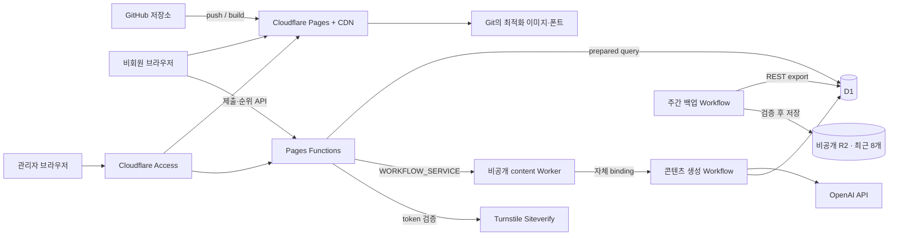

# 다사랑교회 「이번 주의 말씀 : 낱말 퀴즈」 구현 명세

> 문서 상태: 구현 전 기준안<br>
> 마지막 갱신: 2026-08-25 (Asia/Seoul)<br>
> 대상 배포: GitHub → Cloudflare Pages<br>
> 서비스 표기명: `이번 주의 말씀 : 낱말 퀴즈`<br>
> 교회 표기명: `다사랑교회`

## 0. 이 문서의 역할

이 파일은 여러 날·여러 Codex 세션에 걸친 개발의 단일 인수인계 문서다. 새 개발 세션은 작업 전에 이 파일 전체를 읽고, 아래의 **확정**, **출시 전 게이트**, **보류**를 구분해야 한다. 확정 사항을 조용히 바꾸지 말고, 변경이 필요하면 이유와 영향을 이 문서에 먼저 기록한다.

현재 단계에서는 제품 기획과 구현 사양만 확정한다. 아직 웹 코드, 데이터베이스, 배경 이미지, 디자인 시안은 만들지 않는다.

### 빠른 탐색

- 1~6장: 제품, 화면, 퍼즐, 한글 입력, 채점
- 7~8장: 제출 보안, 사칭·악성 내용 방어, 리더보드
- 9~10장: 주보/A4 출력, 시각 디자인과 이미지
- 11~12장: 주간 발행, YouTube 자막, 성경 본문
- 13~16장: Cloudflare/React SPA, D1, API, 저장소 구조
- 17~19장: 구현 단계, 지정 스킬, 테스트
- 20~23장: 위험, 완료 정의, 다음 세션 인수인계, 용어집

### 0.1 상태 용어

- **확정**: 별도 논의 없이 구현한다.
- **검토 중**: 현재 권장 기준안은 있으나 기술 상담과 사용자 승인을 거쳐야 확정한다.
- **출시 전 게이트**: 구현은 준비할 수 있지만, 조건을 충족하기 전에는 프로덕션 발행을 막는다.
- **보류**: v1 범위에서 만들지 않는다.
- **운영 선택**: 관리자 화면에서 매주 또는 필요할 때 선택한다.
- **최신 퀴즈(featured)**: 메인 최상단에 보이는 가장 최근 발행 퀴즈 한 개.
- **진행 중 퀴즈**: 아직 자기 `closes_at`에 도달하지 않아 정상 제출을 받는 `published + open` 퀴즈. 최신 퀴즈 외에도 동시에 존재할 수 있다.
- **마감된 퀴즈/지난 퀴즈**: `archived`로 전환되어 신규 순위 제출을 받지 않고 정답·기록을 공개한 퀴즈.

### 0.2 한눈에 보는 핵심 결정

| 항목 | 결정 | 상태 |
|---|---|---|
| 플랫폼 | 반응형 웹, GitHub 연동 Cloudflare Pages 배포 | 확정 |
| 런타임·패키지 관리 | local·GitHub Actions·Cloudflare 모두 Node.js 24, pnpm 11, `pnpm-lock.yaml` 단일 lockfile | 확정 |
| 프런트엔드 | React SPA + Vite + TypeScript strict | 확정 |
| UI/CSS | Tailwind CSS v4 + 중앙 디자인 토큰, 복잡한 기능만 CSS Modules | 확정 |
| 서버 | Cloudflare Pages Functions + Hono (`/api/*`) | 확정 |
| 데이터 | Cloudflare D1 + Drizzle ORM, 검토된 SQL migration | 확정 |
| 파일 저장 | 정적 이미지를 Git `public/assets`에 두고 Pages CDN으로 제공 | 확정 |
| R2 | 공개 이미지에는 쓰지 않고 비공개 D1 주간 백업 8개 순환 보관에만 사용 | 확정 |
| KV | v1에서 사용하지 않음 | 보류 |
| 일반 사용자 계정 | 회원가입 없음, 익명 브라우저 세션 사용 | 확정 |
| 관리자 로그인 | Cloudflare Access 이메일 허용 목록 + 이메일 일회용 코드(OTP) | 확정 |
| 콘텐츠 생성 작업 | Cloudflare Workflows로 백그라운드 실행 + D1에 영구 작업 상태 저장 | 확정 |
| AI 초안 | OpenAI API `gpt-5.6-terra`, 설교 의도 분석 품질 우선, 관리자 수동 재생성 무제한 | 확정 |
| YouTube 자막 | CC가 있으면 계정 없는 공개 자막 provider를 기술 spike하되 공식 API가 아님을 명시; 약관·교회 사용 권한 확인 후 production 채택 결정 | 출시 전 게이트 |
| 테스트·배포 안전망 | Vitest + Playwright + Access 보호 Preview + 환경별 D1 + 승인형 Production 배포 | 확정 |
| 운영 오류 확인 | Cloudflare Workers Logs + D1 영구 작업·감사 기록, Sentry는 v1 보류 | 확정 |
| 퀴즈 | 기본 5×5, 발행 전 관리자 화면에서 난이도별 5×5~10×10과 목표 단어 수 시험 | 확정 |
| 답안 | 한글 명사 중심, 설교의 핵심 표현이면 조사 포함 명사구 허용, 한 셀에 완성형 한글 한 음절 | 확정 |
| 교차 | 모든 단어 연결, 높은 교차 밀도를 발행 하드 게이트로 검사 | 확정 |
| 채점 | Pages Function이 D1의 비공개 정답으로 최종 채점 | 확정 |
| 제출 | 최소 한 칸 작성, 나머지 빈칸 허용 + 주차·난이도·세션당 1회 | 확정 |
| 제출 답안 공개 | 실제 제출 답안을 저장하고 같은 퀴즈를 제출한 사람의 참여 현황판에 공개 | 확정 |
| 정답 공개 | 현재 퀴즈는 제출 즉시 비교 채점, 지난 퀴즈는 풀이 없이도 공개 | 확정 |
| 참여 기간 | 각 퀴즈는 발행 즉시 시작해 기본 7일 뒤 독립적으로 마감; 새 퀴즈 발행은 기존 퀴즈를 조기 마감하지 않음 | 확정 |
| 발행 오류 대응 | 첫 제출 전 수정·취소 허용; 첫 제출 후 오탈자만 직접 수정하고 문제 오류는 접수 중지 + 별도 수정 revision으로 교체 | 확정 |
| 주보 편집 자료 | 번호가 있는 빈 격자 PNG/SVG + 별도로 복사 가능한 가로·세로 단서 텍스트 | 확정 |
| A4 출력 | 완전 정답자만 제출 순서로 표시하고 Top N을 강조한 여러 페이지 PNG/PDF | 확정 |
| 성경 본문 | v1은 `장절 + 개역개정 + 대한성서공회 공식 읽기 링크`만 표시. 본문은 저장·복사·출력하지 않음 | 확정 (2026-08-14) |
| 문제 오류 수정과 마감 | 진행 중 수정본은 기존 마감을 기본값으로 관리자가 확인·필요 시 연장. 마감 후에는 순위를 다시 열지 않고 정정된 지난 퀴즈만 제공 | 확정 (2026-08-24) |
| YouTube 채널 자동 연결 | OAuth 기반 자동화는 v1 이후 | 보류 |
| 이미지·코드 스킬 | 이 문서 18장의 순서와 범위로 이후 세션에서 사용 | 확정 |

### 0.3 v1 범위

v1에 포함한다.

- 최신 주간 퀴즈와 이전 퀴즈 아카이브
- 어린이용·장년용 전환
- 기본 5×5(발행 전 5×5~10×10 선택) 가로세로 낱말퀴즈, 한글 IME 입력, 임시 저장
- 서버 채점, 익명 제출, 진행 중에는 제출자 전용·마감 뒤에는 공개되는 참여 현황, 난이도별 Top N
- 이름·코멘트 필터, 사칭 방지, Turnstile, 중복 제출 제한
- 관리자 주간 발행, 미리보기, 마감, 발행 오류 수정·접수 중지, 숨김·복구·삭제
- 불변 자막 원본 확인, 사람 직접 수정, 선택적 AI 오타 교정 제안·diff, 사람 최종 자막 확정
- 주보용 빈 격자 PNG/SVG와 문제 텍스트 복사
- A4 세로 정답자·Top N 벽보 PNG 묶음과 PDF
- 라이트·다크 모드, `크게 보기`, 반응형·접근성

v1에서 제외한다.

- 일반 사용자 회원가입·로그인
- 네이티브 모바일 앱
- 교회 YouTube 채널 신규 영상 자동 감지
- 공개 이미지용 R2, KV, 별도 이미지 서버(비공개 DB 백업용 R2만 예외로 포함)
- 제출 승인 대기열
- 생성기가 임의로 격자를 확대하는 기능(관리자가 발행 전 직접 5×5~10×10을 시험·선택하는 기능은 포함)
- 현금·상품이 걸린 엄격한 1인 1회 대회 수준의 신원 확인
- TXT·VTT·SRT 파일 업로드(텍스트 직접 붙여넣기는 v1 무료 fallback으로 포함)

## 1. 제품 목표와 원칙

### 1.1 목표

1. 교인이 그 주의 설교 내용을 다시 떠올리며 어린이 또는 장년 난이도의 퀴즈를 푼다.
2. 휴대전화, 태블릿, PC에서 한글을 자연스럽게 입력한다.
3. 제출 결과와 참여 기록을 안전하고 보기 좋게 공유한다.
4. 관리자는 매주 YouTube 링크 하나에서 초안을 만들고, 검수한 뒤 발행한다.
5. 동일한 퀴즈 데이터로 웹, 주보용 빈 격자·복사 가능한 단서 텍스트, A4 리더보드를 재현한다.

### 1.2 비가역적 원칙

- 성경 본문은 AI가 생성·번역·교정·보완하지 않는다.
- 성경 판본은 `성경전서 개역개정판`으로 고정하며, 다른 한국어 번역본을 fallback으로 바꾸지 않는다.
- AI 요약과 단서는 설교자의 원문으로 오인되지 않게 표시한다.
- 제출 전 브라우저에는 공식 정답을 보내지 않고, 제출 성공 후 같은 세션에는 즉시 보낸다.
- 사용자 입력을 HTML로 해석하지 않는다.
- 사용자의 틀린 격자 글자는 참여 현황에서 정해진 공개 범위로만 보여주며, Top N 화면·PDF/PNG·주보 자료 같은 정답자 산출물에는 절대 넣지 않는다.
- 이미지 다운로드를 위해 AI를 다시 호출하거나 화면을 임의 캡처하지 않는다.
- 발행 후 제출이 생긴 퍼즐의 격자와 정답은 수정하지 않는다.

### 1.3 AI 고지 문구

설교 핵심 요약 아래의 고지는 실제 입력 source에 맞춰 선택한다.

공개 자막 또는 YouTube `스크립트 표시` 전문을 사용했을 때:

> 아래 내용은 설교 영상의 공개 자막을 바탕으로 AI가 요약한 것으로, 설교자의 원문이 아닙니다.

관리자가 설교 원고·요약본을 제공했을 때:

> 아래 내용은 관리자가 제공한 설교 자료를 바탕으로 AI가 요약한 것으로, 설교자의 원문이 아닙니다.

source type과 coverage에 맞지 않는 고지를 발행 화면에서 선택할 수 없게 하고 서버가 다시 검증한다. 관리자 미리보기에는 단서와 정답 역시 AI 초안이며 관리자가 검수했다는 운영 안내를 표시한다. 공개 화면에는 불필요하게 긴 설명을 반복하지 않아도 되지만, 요약 고지는 항상 노출한다.

## 2. 사용자·권한·정보 구조

### 2.1 사용자 역할

| 역할 | 인증 | 가능한 일 |
|---|---|---|
| 방문자 | 없음 | 퀴즈 열람·풀이, 아카이브 열람 |
| 익명 참여자 | 서버 발급 브라우저 세션 쿠키 | 난이도별 1회 제출, 본인 결과 확인 |
| 관리자 | Cloudflare Access에서 허용된 이메일 | 초안 작성·검수·발행·마감·숨김·삭제 |

입력 label은 설명을 덧붙이지 않고 `이름`으로만 표시한다. 실명·별명 사용을 별도로 권하거나 안내하지 않는다. 제출 전에는 7.5의 확정 동의 문구로 이름·답안·코멘트가 참여 현황에 공개되고 운영되는 동안 보관된다는 점을 알린다.

### 2.2 필수 경로

| 경로 | 내용 |
|---|---|
| `/` | 현재 발행된 최신 주간 퀴즈 |
| `/quiz/:slug` | 특정 설교 주차의 고유 퀴즈 |
| `/archive` | 이전 퀴즈 최신순 목록 |
| `/admin` | 관리자 대시보드 |
| `/admin/quiz/:id` | 주간 초안·검수·미리보기·발행 |
| `/admin/manual` | Access 보호 운영·개발 매뉴얼과 정기 확인 체크리스트 |
| `/admin/manual/future/member-auth` | Access 보호 향후 일반 회원가입·교회 공식 계정 연동 검토 기록 |
| `/quiz/:slug/print` | 빈 문제는 언제나 공개. Top N 벽보는 현재 퀴즈 제출 후 또는 마감된 퀴즈에서 누구나 사용하는 출력 화면 |
| `/api/*` | 공개·세션·제출 API |
| `/api/admin/*` | Access로 보호된 관리자 API |

### 2.3 최신 퀴즈 페이지 순서

1. 교회명과 서비스 제목
2. 난이도별 배경을 가진 설교 헤더
3. 설교 제목, 설교일, 성경 본문 주소, `개역개정`, 대한성서공회 공식 읽기 링크
4. `AI가 요약한 설교 핵심 내용`과 고지 문구
5. 어린이용 / 장년용 접근성 탭
6. `크게 보기`, 다크모드, 입력 안내
7. 격자와 단서
8. 진행률과 로컬 임시 저장 상태
9. 참여 마감 일시와 남은 기간. countdown만 쓰지 않고 정확한 한국 시간도 함께 표시
10. 이름(필수), 한 줄 코멘트(선택), 제출 확인
11. 제출 결과
12. 상태별 `참여 현황`과 `Top N` 전환: 진행 중 퀴즈는 제출자 전용, 마감된 퀴즈는 공개
13. 실제 제출 답안 카드와 축하 일러스트
14. 이전 퀴즈로 가는 아카이브 링크

### 2.4 난이도 전환

- 탭 명칭은 `어린이용`, `장년용`으로 고정한다.
- 탭은 WAI-ARIA tab 패턴과 키보드 좌우 이동을 지원한다.
- 난이도마다 퍼즐, 로컬 초안, 제출 제한, 순위가 완전히 분리된다.
- 어린이용 제출 후 장년용 제출은 가능하다.
- URL 쿼리 `?level=child|adult`를 허용해 공유·새로고침 상태를 보존한다.

### 2.5 지난 퀴즈 목록

메인 화면은 이번 주 퀴즈를 가장 크게 유지하고, 하단에 `지난 퀴즈` 영역과 최근 3개만 간단히 표시한다. `지난 퀴즈 전체 보기`를 누르면 SPA 안에서 `/archive`로 이동한다.

새 퀴즈가 발행되어도 기존 퀴즈의 7일 참여 기간은 그대로 유지될 수 있다. 이때 메인 최신 퀴즈 아래, 일반 아카이브보다 위에 `아직 참여할 수 있는 퀴즈`를 표시한다. 여기에는 featured가 아닌 `published + open` 세트만 마감 일시와 함께 최신순으로 보여준다. 이 퀴즈들도 제출 전 정답·참여 현황·Top N 보호 규칙은 최신 퀴즈와 같다. 마감된 뒤에만 일반 `지난 퀴즈` 목록으로 이동해 모든 공개 정책을 적용한다.

`/archive`의 기본 규칙:

- 설교일 최신순으로 정렬하고 같은 날짜는 `quiz_sets.id DESC`로 안정적으로 정렬한다. 설교일은 발행 필수값이므로 누락된 세트는 발행할 수 없다.
- 처음 12개를 표시하고 `더 보기`를 누르면 화면 전환 없이 다음 12개를 아래에 이어 붙인다.
- 카드에는 설교 제목, 설교일, 성경 장절, `어린이용`, `장년용` 진입 버튼을 표시한다.
- 카드 전체를 하나의 모호한 링크로 만들지 않고 난이도 버튼의 목적을 명확히 한다. 두 버튼 모두 같은 영구 slug에 `?level=child|adult`를 붙인다.
- 검색 대상은 설교 제목과 정규화된 성경 장절 label이다. 부분 일치를 허용하며 복잡한 전문 검색이나 AI 검색은 사용하지 않는다.
- 연도와 월 선택 필터를 제공한다. 월은 연도를 선택하지 않아도 사용할 수 있지만, 현재 데이터에 존재하는 값만 선택지로 보여준다.
- v1에는 설교 주제·목사·성경책 태그 체계를 만들지 않는다.
- 검색어·연도·월은 URL query string에 저장해 새로고침, 공유, 뒤로가기에 유지한다. `더 보기`로 펼친 개수와 scroll 위치는 브라우저 history state로 복원한다.
- 결과가 없으면 `찾는 지난 퀴즈가 없습니다`와 `검색 조건 지우기`를 표시한다.
- 목록의 장식 이미지는 lazy load하고, 이미지가 없어도 날짜·제목·장절과 난이도 버튼만으로 완전히 사용할 수 있어야 한다.

지난 퀴즈 상세 화면은 6.6의 정책에 따라 풀이 여부와 관계없이 정답·참여 현황·코멘트·확정 Top N·출력을 공개한다. 목록 검색과 pagination은 기존 D1·Pages Function 안에서 처리하며 별도 검색 서비스나 KV를 추가하지 않고, 백업용 R2를 공개 조회에 사용하지 않는다.

### 2.6 관리자 대시보드 첫 화면

관리자는 코드를 열거나 D1·터미널을 직접 다루지 않는 운영자를 기준으로 설계한다. `/admin` 첫 화면은 통계보다 **지금 이어서 할 한 가지 작업**을 가장 먼저 보여준다.

상단 고정 영역:

- 현재 편집 중인 `quiz_set`의 `이번 주 AI 예상 비용 $X.XX` pill. 누르면 route 이동 없이 상세 drawer를 연다.
- featured 퀴즈의 설교 제목·설교일·공개 상태와 바로가기, 함께 진행 중인 다른 퀴즈의 마감 일시.
- 미발행 작업이 없으면 주 CTA `이번 주 퀴즈 만들기`, 있으면 `계속 작업하기`.
- `이번 주 퀴즈 만들기`를 눌렀을 때 이미 미발행 주간 작업이 있으면 중복 세트를 만들지 않고 기존 작업으로 안내한다. 여러 AI revision은 동일한 `quiz_set` 안에서 관리한다.

주 CTA 아래에는 다음 운영 정보를 우선순위대로 둔다.

1. 현재 주간 작업 단계와 실패·확인 필요 상태
2. 하루 이내 자동 삭제 예정인 초안
3. 답변하지 않은 문의·삭제 요청 수
4. 진행 중인 퀴즈별 공개 제출 수와 `제출 기록 관리` 바로가기
5. 진행 중인 퀴즈별 난이도 Top N 인원 설정
6. 최근 발행한 퀴즈 목록
7. 전체 서비스 `비용·사용량` 최악 상태, 마지막 metric 갱신·요금 정책 확인 시각, R2 최근 백업 상태

각 진행 중 퀴즈 카드에는 `마감: 2026년 … (한국 시간)`, 남은 기간, `마감 일시 변경`, `지금 마감`을 제공한다. 여러 퀴즈가 동시에 열려도 어느 퀴즈를 조작하는지 제목·설교일·난이도별 제출 수를 확인창에 반복한다.

정상 상태의 기술 로그나 내부 ID는 첫 화면에 노출하지 않는다. 오류가 있을 때만 `자세히 보기` 안에 사람이 이해할 설명과 지원용 requestId/jobId를 제공한다.

### 2.7 관리자 6단계 작업 화면

`/admin/quiz/:id`에는 다음 stepper를 고정한다.

```text
1. 설교 영상 → 2. 설교 의도 → 3. 요약과 문제
→ 4. 격자 배치 → 5. 최종 확인 → 6. 발행
```

각 단계:

1. `설교 영상`: YouTube 주소, 영상 메타데이터, 자막 확보 상태, 설교 제목·일자·성경 장절 확인. 가져온 불변 자막 원본을 보며 직접 수정하거나 AI 교정 제안을 비교·선택하고 사람이 최종 수정한 뒤 `자막 확정`까지 수행
2. `설교 의도`: AI 의도 분석·비판 결과와 자막 근거를 검토하고 관리자가 직접 수정한 뒤 확정
3. `요약과 문제`: AI 요약, 어린이·장년 답·단서 후보를 수정·제외·잠금하고 난이도별 문제 확정
4. `격자 배치`: 코드가 5×5~10×10 후보를 시험하고 관리자가 크기·문제 수·배치를 선택
5. `최종 확인`: 웹·모바일·라이트·다크·크게 보기, 빈 격자·복사 단서, 난이도별 Top N 인원과 발행 검수표 확인
6. `발행`: 변경 불가능해지는 항목과 공개 범위를 다시 보여주고 명시적 확인 후 트랜잭션 발행

- 완료 단계는 check, 현재 단계는 강조, 아직 조건을 충족하지 못한 단계는 잠금 이유를 글로 표시한다.
- 완료한 이전 단계로 돌아가 수정할 수 있다. 다만 상위 단계의 확정 내용을 바꾸면 그 내용을 사용하는 이후 단계는 자동으로 `다시 확인 필요`가 된다. 기존 결과를 삭제하지 않고 새 revision에서 비교·재확정한다.
- AI 또는 Workflow가 실행 중이면 현재 화면에 진행 상태를 표시하되 다른 관리자 화면으로 이동하거나 브라우저를 닫을 수 있다. 다시 접속하면 D1 상태에서 동일 단계와 결과를 복원한다.
- 자동 저장은 편집 내용을 보호하고 명시적인 `초안 저장`은 revision snapshot을 만든다. 마지막 저장 시각과 삭제 예정일을 항상 확인할 수 있게 한다.
- 발행 뒤 첫 제출 전에는 기존 규칙 범위에서 수정할 수 있고, 첫 제출 뒤에는 정답·격자·채점 revision을 잠근다.
- 공개 퀴즈 관리 버튼은 서버의 실제 성공 제출 수에 따라 바뀐다. 0건이면 `발행 내용 수정`, `발행 취소`; 1건 이상이면 `표시 오탈자 수정`, `제출 일시 중지`, `문제 오류 처리`를 보여준다. 클라이언트가 기억한 상태가 아니라 D1 count와 variant 상태를 기준으로 한다.
- `문제 오류 처리` 화면은 접수 중지 → 영향 받는 난이도·제출 수 확인 → 수정 revision 편집·검증 → 수정본 발행의 순서를 한 흐름으로 안내한다. 잘못된 기존 점수의 재채점·이전, 이전 퀴즈 접수 재개, 오류본 Top N 공개는 선택지로 제공하지 않는다.

관리자 화면도 320px부터 깨지지 않게 구현하지만 역할은 다음처럼 안내한다.

- 휴대전화: 작업 상태 확인, 문의 답변, 제출 숨김·복구 같은 짧은 운영에 적합
- 태블릿·PC: 설교 의도·문제 검토, 격자 비교, 전체 미리보기와 발행에 권장
- 작은 화면에서도 기능을 인위적으로 막지는 않는다. 복잡한 편집을 열면 `넓은 화면에서 검토하면 더 편합니다`라는 비차단 안내만 표시한다.

## 3. 반응형 화면 사양

### 3.1 고정 수치

사용자가 수치를 별도로 정하지 않아도 되도록 아래를 구현 기준값으로 고정한다.

| 항목 | 값 |
|---|---|
| `body` 폭 | `100%` |
| 전체 콘텐츠 최대 폭 | `1440px` |
| 좌우 여백 | `clamp(16px, 4vw, 64px)` |
| 데스크톱 본문 | 격자 `60%`, 단서 `40%` |
| 데스크톱 열 정의 | `minmax(0, 3fr) minmax(320px, 2fr)` |
| 열 간격 | `clamp(24px, 3vw, 48px)` |
| 자동 1열 전환 | 뷰포트 `1024px` 미만 |
| 일반 셀 크기 | `clamp(56px, 7.5vw, 96px)` |
| 크게 보기 셀 크기 | `clamp(60px, 11vw, 112px)` |
| 최소 터치 영역 | `44×44px`; 주요 제출·이동 버튼은 가능하면 `48×48px` |
| 지원 폭 | 최소 `320px`, 기준 수동 검수는 `360px`부터 |

콘텐츠 컨테이너는 `width: min(100%, 1440px); margin-inline: auto; padding-inline: clamp(...)` 구조로 만든다. 초광폭 화면에서 격자와 단서가 무한히 벌어지지 않게 한다.

### 3.2 `크게 보기`

- 기본 데스크톱: 격자와 단서를 60:40 두 열로 배치한다.
- `크게 보기` 활성화: 격자와 단서를 각각 전체 폭인 2행 1열로 배치한다.
- 버튼은 `aria-pressed` 상태를 가지며 활성 시 이름을 `기본 보기`로 바꾼다.
- 1024px 미만은 원래 1열이므로, 이 버튼이 셀·글자·단서 간격을 확대하는 접근성 모드로도 작동한다.
- 상태는 `localStorage`에 저장하되, 저장 실패가 기능을 막지 않는다.

### 3.3 다크모드

- 첫 방문은 운영체제 `prefers-color-scheme`을 따른다.
- 사용자가 전환하면 `light | dark | system` 값을 로컬에 기억한다.
- 페이지 루트의 CSS 변수 세트 하나로 전환하며 섹션마다 제각각 반전하지 않는다.
- 라이트는 Everforest Light Medium을 바탕으로 한 따뜻하고 부드러운 숲 계열, 다크는 Gruvbox Dark Medium을 바탕으로 한 짙은 갈색·레트로 계열로 고정한다.
- 문제 패널은 두 모드 모두 거의 불투명하게 유지한다.
- 출력용 주보 PNG와 A4는 브라우저 다크모드와 무관한 고정 인쇄 테마를 쓴다.

### 3.4 접근성 기준

- WCAG 2.2 AA 대비를 목표로 한다.
- 격자 셀은 행·열, 단어 번호, 방향, 현재 입력값을 스크린리더에 전달한다.
- 색상만으로 활성·정답·오답을 구분하지 않고 테두리·기호·텍스트를 함께 쓴다.
- 모든 기능은 키보드만으로 사용할 수 있어야 한다.
- `prefers-reduced-motion`에서는 장식 애니메이션을 끈다.
- 200% 확대에서도 가로 스크롤 없이 핵심 기능을 사용할 수 있어야 한다.

## 4. 퍼즐 콘텐츠와 가변 격자 배치 규칙

### 4.1 난이도별 콘텐츠

| 구분 | 기본 5×5 권장 답 개수 | 답·단서 기준 |
|---|---:|---|
| 어린이용 | 5~6개 | 쉬운 성경 어휘, 직접적이고 짧은 단서 |
| 장년용 | 6~8개 | 설교의 논지·비유·적용을 이해해야 푸는 단서 |

위 개수는 초기 추천값이지 고정값이 아니다. 관리자는 발행 전에 난이도별 격자 크기와 목표 단어 수를 바꾸어 여러 배치를 시험한다. 5×5에서 긴 말이나 8개 답을 억지로 넣지 않으며, 실제 후보 길이와 교차 가능성에 따라 배치기가 성공·실패 이유와 추천 범위를 보여준다.

관리자 UI의 초기 안내 범위는 아래처럼 시작하되 하드 게이트로 사용하지 않는다. 짧은 답이 많으면 더 들어가고, 긴 명사구가 많으면 더 적게 들어간다.

| 격자 | 시작 안내 단어 수 |
|---:|---:|
| 5×5 | 5~7개 |
| 6×6 | 6~8개 |
| 7×7 | 7~10개 |
| 8×8 | 8~12개 |
| 9×9 | 9~13개 |
| 10×10 | 10~15개 |

두 난이도가 같은 명사 또는 명사구를 일부 공유할 수는 있지만, 단서를 그대로 복제하지 않는다. 모든 단서에는 자막의 근거 구간 또는 관리자 메모를 내부 데이터로 연결해 검수할 수 있게 한다. AI는 실제 배치 수보다 넉넉한 후보 pool을 만들되 조사 포함 여부를 자동 탈락 기준으로 쓰지 않는다. 관리자가 의미를 보고 정답·단서를 직접 수정·제외·잠금한 뒤 다음 단계로 넘긴다.

그다음 배치 코드는 5×5부터 10×10까지, 허용된 후보의 여러 부분집합과 **실제 가로·세로 위치·방향**을 함께 탐색한다. 크기와 문제 수를 추상적으로 먼저 추천한 뒤 별도로 배치하는 방식이 아니다. 코드가 여러 완성 격자를 실제로 만들어 하드 게이트와 교차 점수를 비교한 결과로 `추천 격자 크기 + 추천 문제 수 + 추천 완성 배치`를 한 번에 제안한다.

관리자가 잠근 후보는 반드시 포함하며, 의미의 중요도를 코드가 다시 판단하지 않는다. `배치 시험` 결과에는 각 답의 가로·세로 방향, 시작 행·열, 시작 번호, 교차 셀과 빠진 후보가 이미 확정된 실제 격자가 보인다. 관리자는 추천 배치를 채택하거나 다른 상위 완성 배치를 비교하고, 크기·목표 단어 수·후보 상태를 바꿔 다시 시험할 수 있다. 배치를 채택하면 5단계 최종 확인으로 넘어가며 별도의 AI 배치 단계는 없다. 후보 pool이 충분하면 이 과정에는 추가 AI 호출이 필요 없다.

### 4.2 정답 언어 규칙과 관리자 판단

- AI에는 짧고 분명한 한글 명사와 설교에서 실제로 반복·강조된 명사구를 넉넉히 제안하게 하며, 조사 포함 여부를 의미 판단 로직이나 탈락 gate로 만들지 않는다.
- 보통명사, 고유명사, 성경 인명·지명, 추상명사와 설교의 핵심 명사구를 허용한다.
- `하나님의 열심` 같은 조사 포함 표현도 그대로 후보에 둘 수 있고, 관리자가 채택·수정·제외한다. 임의로 조사를 떼어 뜻을 바꾸지 않는다.
- 후보는 `display_answer`와 `grid_answer`를 분리한다. 전자는 `하나님의 열심`처럼 원래 띄어쓰기를 보존하고, 후자는 격자 입력용 `하나님의열심`처럼 공백만 제거한다.
- `grid_answer`는 NFC 정규화된 완성형 한글 음절만 허용하고 길이는 2 이상, 선택한 격자 한 변 이하로 제한한다. 따라서 6음절인 `하나님의열심`은 5×5에는 들어갈 수 없고 6×6 이상을 선택해야 한다.
- 숫자, 기호, 문장부호, 이모지, 영문, 한자, 독립 자모는 허용하지 않는다.
- 조사처럼 보이는 음절로 끝난다는 이유로 자동 탈락시키지 않는다. 자동 검사는 형식·길이·중복·배치 가능성을 맡고, 의미와 표현의 적합성은 관리자가 후보별로 확정한다.
- 정답 후보에는 표시형, 격자형, 품사/구문 설명, 자막 근거, 선택 이유를 저장한다.

### 4.3 교차와 연결 하드 게이트

교차 셀은 가로 답 하나와 세로 답 하나가 같은 완성형 음절을 공유하는 셀이다. 단순히 옆에 닿는 것은 교차가 아니다.

- 모든 답은 하나의 연결 그래프에 속해야 한다.
- 고립된 답, 대각선 접촉, 의미 없는 인접 문자열은 금지한다.
- 모든 답은 최소 한 번 실제로 교차해야 한다.
- 답의 3분의 2 이상(`ceil(2W/3)`)은 두 개 이상의 교차 셀을 가져야 한다.
- 선택한 단어 수와 격자 크기에 맞는 교차 profile을 적용하고, 서로 다른 교차 셀 수와 단어별 교차 수를 함께 검사한다.
- 조건을 충족하지 못하면 조용히 기준을 낮추지 않고 발행을 차단한다.
- 현재 크기에서 불가능하면 관리자가 후보를 교체하거나 격자 크기·목표 단어 수를 직접 바꾼다. 생성기가 관리자 동의 없이 크기를 확대하지 않는다.

가로 단어가 `H`, 세로 단어가 `V`개이면 단어 쌍 기준 이론상 교차 상한은 `H×V`다. 교차 profile은 이 이론 상한, 단어 수, 각 단어 길이를 바탕으로 가능한 범위 안에서 촘촘함을 요구한다. “전체 교차가 2곳이면 충분하다”는 기준으로 후퇴하지 않으며, 실제 생성기는 통과한 배치 중 교차 수와 다중 교차 단어 수를 최대화한다. 구체 profile은 여러 실제 설교 후보로 Phase 2에서 보정한다.

### 4.4 가변 배치 생성기

배치기는 결정적 백트래킹/탐색 알고리즘으로 작성한다. 동일한 후보와 seed는 동일한 결과를 내야 한다.

평가 우선순위는 다음과 같다.

1. 모든 하드 게이트 통과
2. 서로 다른 교차 셀 수 최대화
3. 교차가 2개 이상인 답의 수 최대화
4. 사용한 전체 면적 최소화
5. 불필요한 막힌 칸과 비대칭 감소
6. 단어 시작 번호와 단서 읽기 순서의 자연스러움

각 배치는 `grid_size`, 목표/실제 단어 수, 행·열 좌표, 방향, 시작점, 길이, 교차 목록을 가진다. 시작 번호는 위에서 아래, 왼쪽에서 오른쪽 순서로 부여하며 같은 셀에서 가로·세로가 시작하면 같은 번호를 쓴다. 생성기와 화면은 5라는 숫자를 코드 곳곳에 고정하지 않고 설정값을 받는다.

배치 로직은 AI가 아니라 고전적인 제약 충족 탐색으로 구현한다.

1. 관리자가 확정한 후보를 길이·교차 가능한 공통 음절 수로 정렬한다.
2. 첫 단어를 중앙 가까이에 놓고 다음 단어의 동일 음절을 가로·세로로 교차시킨다.
3. 경계 초과, 다른 글자 충돌, 의도하지 않은 인접 문자열, 고립 단어가 생기는 배치는 즉시 버린다.
4. 막히면 이전 선택으로 돌아가는 backtracking으로 다른 위치·방향·후보 부분집합을 시도한다.
5. 5×5부터 10×10까지 제한된 seed와 탐색 budget 안에서 실행한다.
6. 유효 결과를 연결성, 교차 셀 수, 두 번 이상 교차하는 단어 수, 사용 면적, 빈칸·대칭으로 점수화한다.
7. 가장 작은 크기에서 품질 gate를 통과한 우수 배치를 기본 추천하되 다른 상위 결과도 비교하게 한다.

외부 퍼즐 AI나 특정 라이브러리에 정답 배치를 맡기지 않는다. TypeScript로 작은 순수 함수 엔진을 작성하고 seed 기반 단위 테스트로 같은 입력의 결과를 재현한다. 구현 난도는 중간 정도이며 핵심 위험은 알고리즘 자체보다 후보 조합이 나쁠 때 탐색량이 커지는 것이므로 후보 수·seed·시간 budget을 둔다.

### 4.5 발행 검증 보고서

관리자에게 다음을 한 화면에서 보여준다.

- 단어 수, 활성 셀 수, 교차 셀 수
- 각 답의 품사·길이·교차 수
- 연결 그래프 통과 여부
- 중복 답·중복 단서 여부
- 정답 표현·핵심 명사구 관리자 확인 상태
- 어린이·장년 단서 난이도 확인
- 자막 근거 링크
- 실패한 하드 게이트와 교체가 필요한 후보

### 4.6 발행 후 불변성

- 잠금 기준은 해당 주간 `quiz_set`의 어린이·장년을 합친 **첫 번째 성공 제출**이다. 어느 난이도에서든 한 건이 저장되면 두 난이도의 발행 정답·격자·채점 revision을 함께 잠근다. 실패한 요청이나 저장되지 않은 답안은 잠금을 만들지 않는다.
- 첫 제출 전에는 관리자 화면에 `발행 내용 수정`과 `발행 취소`를 제공한다. 제목·메타데이터·요약·단서·정답·격자를 새 revision에서 수정하고 전체 검증을 다시 통과한 뒤, 제출을 받기 전에만 원자적으로 교체할 수 있다.
- 첫 제출 전 `발행 취소`를 하면 잘못 발행한 새 퀴즈를 `review_ready`로 되돌려 계속 편집한다. 다른 `published + open` 퀴즈가 있으면 그중 최신 세트를 메인 featured로 올린다. 없으면 이미 `archived`가 된 이전 퀴즈를 메인에 **읽기 전용**으로 임시 소개할 수 있지만 제출을 다시 열지 않는다. 필요하면 `새 퀴즈를 준비하고 있습니다`를 표시하며 이전 퀴즈의 확정 기록과 Top N도 바꾸지 않는다.
- 첫 제출 후에는 `grid`, `entries`, `solutions`, 채점 기준과 해당 revision을 제자리에서 수정하지 않는다. 관리자 화면의 작업은 `표시 오탈자 수정`, `제출 일시 중지`, `문제 오류 처리`로 제한한다.
- `표시 오탈자 수정`은 설교 제목·AI 요약·단서 등에 있는 철자·띄어쓰기·문장부호처럼 의미와 정답 유도가 바뀌지 않는 수정만 허용한다. 수정 전·후, 사유, 관리자, 시각을 감사 로그에 남긴다. 단서의 뜻·난이도·정답 유도나 요약의 핵심 의미가 달라지면 이 기능으로 저장하지 못한다.
- 중대한 정답·격자·단서 의미 오류는 `문제 오류 처리`로 해결한다. 신규 제출을 먼저 일시 중지하고 영향 범위를 보여준 뒤, 기존 variant를 `superseded`로 보존하고 수정된 새 revision을 별도 variant로 생성한다. 새 revision은 전체 발행 검사를 통과해야 현재 문제로 교체된다.
- 잘못된 기존 제출을 새 정답으로 재채점하거나 새 순위로 옮기지 않는다. 기존 제출자에게는 오류 안내와 당시 `내 답안 / 정답` 기록을 보존하고, 수정본에 다시 참여할 수 있게 한다. 기존 오류 variant와 그 Top N은 일반 아카이브·벽보 출력에서 제외하며 관리자와 해당 제출자의 기록 확인 경로에서만 유지한다.
- 수정본 발행 실패 중에는 오류 있는 문제의 접수를 닫아 둔다. 이전 주 퀴즈를 접수 가능 상태로 되돌리는 fallback은 사용하지 않는다.
- 수동 편집·검증·재배치는 AI 비용이 없다. 관리자가 요약·문제 후보·최종 감사를 다시 AI로 생성한 경우에만 기존 주간 비용 합계에 해당 호출을 추가한다.

## 5. 한글 IME 입력 설계

### 5.1 핵심 선택

25개의 `maxlength=1` 입력창에 자모 규칙을 직접 구현하지 않는다. 브라우저와 운영체제의 네이티브 한글 조합기를 신뢰하는 **단일 실제 입력 버퍼 + 시각적 격자** 구조를 쓴다.

이 구조가 필요한 이유는 `감` 뒤에 `ㅂ`을 입력할 때, `갑`에 `ㅅ`을 더해 `값`을 만들 때, `갑세`처럼 다음 음절로 재분절할 때의 의도를 앱이 자모 단위로 완벽히 예측할 수 없기 때문이다.

### 5.2 입력 상태

입력 컴포넌트는 최소한 다음 상태를 가진다.

```text
activeCell
activeEntry
direction: across | down
cellValues: Map<CellId, string>
compositionText
isComposing
selectionIndex
```

- 사용자가 셀을 누르면 그 셀과 연결된 답이 활성화되고 단일 입력이 포커스를 받는다.
- 교차 셀을 다시 누르거나 방향 버튼을 누르면 가로·세로가 전환된다.
- 시각적 셀은 입력값을 투영할 뿐 개별 텍스트 입력 요소가 아니다.

### 5.3 조합 이벤트 규칙

- `compositionstart`: 조합 중 상태를 시작한다.
- `compositionupdate`: 화면 미리보기만 갱신한다.
- `compositionend`: 운영체제가 확정한 문자열을 `Intl.Segmenter('ko', {granularity:'grapheme'})`로 나눈 뒤 연속 셀에 분배한다.
- `InputEvent.isComposing === true`인 동안 포커스 이동, 값 잘라내기, 자동 다음 칸 이동을 하지 않는다.
- 확정된 문자열만 NFC로 정규화한다.
- `값`은 한 셀, `갑세`는 두 셀로 네이티브 IME 결과 그대로 배치한다.
- 브라우저별 이벤트 순서 차이를 수용하도록 `beforeinput`, `input`, composition 이벤트를 함께 테스트한다.

앱이 “이 자음은 앞 음절에 들어갈 수 없다”를 자체 판단해 강제로 옮기지 않는다. 조합기가 확정한 완성 음절 개수를 기준으로만 다음 칸으로 이동한다.

### 5.4 키보드와 모바일 조작

데스크톱:

- `Tab`: 현재 방향의 다음 활성 셀
- `Shift+Tab`: 이전 활성 셀
- 방향키: 물리적 인접 활성 셀
- `Backspace`: 현재 셀 삭제, 이미 비어 있으면 이전 셀로 이동
- `Enter`: 교차 셀 방향 전환 또는 다음 단서
- 붙여넣기: 확정된 한글 grapheme을 현재 답의 연속 셀로 분배

모바일·태블릿:

- 격자 바로 아래에 48px 높이 이상의 고정 조작 막대를 둔다.
- `이전`, `다음` 화살표와 `가로/세로` 전환 버튼을 제공한다.
- 활성 셀 옆에 작은 다음 화살표를 보조로 둘 수 있지만 격자 글자를 가리지 않아야 한다.
- 화면 키보드가 열려도 활성 셀이 가려지지 않게 `visualViewport` 변화를 반영한다.

### 5.5 자동 이동

- 조합 완료 후 완성형 음절 한 개가 확정되고 현재 셀에 들어가면 다음 셀로 이동한다.
- 여러 음절 붙여넣기 또는 조합 결과는 가능한 셀에 순서대로 분배한다.
- 답의 마지막 셀에서는 자동으로 다음 단서로 이동하지 않고 완료 상태를 알린다.
- 사용자가 화살표·Tab으로 언제든 자동 이동을 되돌릴 수 있다.

### 5.6 임시 저장

- 키: `bibleQuiz:draft:<quizId>:<variantRevision>`
- 값: 셀 값, 활성 답, 방향, 저장 시각
- 난이도 전환과 새로고침 후 복원한다.
- 발행 revision이 달라지면 이전 초안을 적용하지 않고 안내 후 폐기 선택을 제공한다.
- 제출 성공 후 초안은 결과 확인에 필요한 최소 시간 동안만 유지하고, 다음 주에는 자동 정리한다.

## 6. 서버 채점과 정답 노출 정책

### 6.1 “서버에서 최종 채점”의 의미

브라우저 채점은 공식 답을 JavaScript, 정적 JSON 또는 네트워크 응답에 미리 담아야 하므로 개발자 도구로 답을 볼 수 있고 사용자가 점수를 위조할 수 있다. 이 서비스에서 “서버”는 Cloudflare Pages Function을 뜻한다.

1. 브라우저가 작성한 셀, 이름, 코멘트만 Pages Function에 보낸다.
2. Function이 D1의 비공개 공식 정답을 읽는다.
3. Function이 각 활성 셀을 비교하고 점수와 correctness mask를 계산한다.
4. D1에는 서버 점수와 정오 위치만 저장한다.
5. 브라우저가 보낸 `score`, `rank`, `isCorrect`는 받지 않거나 무시한다.

Pages Functions는 계산을 수행하는 서버 코드이고, D1은 그 코드가 읽고 쓰는 데이터베이스다. 둘은 경쟁하는 선택지가 아니라 함께 쓰는 실행 계층과 저장 계층이다.

### 6.2 채점 기준

- 교차 셀은 한 번만 센다.
- `correct_cells / total_active_cells`를 기본 점수로 쓴다.
- 정수 정밀도는 `score_basis_points = round(correct_cells / total_cells × 10000)`이다.
- 완전히 맞힌 낱말 수도 피드백용으로 계산한다. Top N은 점수순이 아니라 `is_fully_correct`와 제출 시각만 사용한다.
- 동의어, 유사어, 띄어쓰기 변형은 자동 인정하지 않는다.

### 6.3 제출 후 즉시 정답 공개

이 서비스는 경쟁 시험이 아니라 말씀을 되새기는 퀴즈다. 현재 주차의 정답을 마감 때까지 엄격하게 숨기는 정책은 사용하지 않는다.

| 상태 | 보이는 내용 |
|---|---|
| 제출 전 | 문제·단서·자신의 입력만 표시; 참여 현황과 Top N 데이터는 비공개 |
| 제출 전 `정답보기` | 비활성. hover/focus/누르기 안내: `답안을 제출한 후 정답을 볼 수 있어요.` |
| 부분 또는 완성 답안 제출 성공 | 페이지 이동·새로고침 없이 즉시 `내 답안 / 정답` 비교 채점 화면으로 전환하고 `정답보기` 활성화 |
| 다른 화면을 본 뒤 돌아온 기제출자 | 활성화된 `정답보기`를 누르면 저장된 자기 답안과 공식 정답, 당시 정오 스타일을 그대로 복원 |
| 다음 방문 | 같은 브라우저의 세션 쿠키로 제출 여부를 확인해 `정답보기` 상태 복원 |

현재 `published` 퀴즈에서는 마감 시각이 아니라 제출 성공 여부만 정답보기의 조건이다.

위 표는 현재 `published` 퀴즈의 참여 모드에만 적용한다. `archived` 퀴즈는 제출·연습 여부와 관계없이 정답, 참여 현황, 확정 Top N, `Top N 출력`을 공개한다.

#### 6.3.1 내 답안과 정답 비교 화면

현재 퀴즈의 정상 제출자와 지난 퀴즈의 참여자·연습 사용자는 같은 `QuizResultComparison` 화면을 사용한다. route 이동이나 전체 새로고침 없이 현재 SPA 화면 안에서 편집 격자가 결과 격자로 전환된다.

- 상단에는 `맞은 칸 / 전체 칸`, 백분율, `맞힌 낱말 / 전체 낱말`을 큰 글자로 표시한다.
- 현재 퀴즈는 제출 성공 응답으로 점수·correctness mask·공식 정답을 함께 받아 즉시 `내 답안 / 정답`을 모두 펼친다. 사용자가 `정답보기`를 한 번 더 누를 필요가 없다.
- 이후 다른 화면에서 돌아오거나 다시 방문했을 때는 `정답보기`가 복원 진입점이다. 이를 누르면 D1에 저장된 자기 답안과 서버 정답으로 같은 비교 화면을 재구성한다.
- 기본 결과 격자는 사용자가 작성한 음절을 그대로 유지하고 각 칸의 정오를 표시한다.
- 맞은 칸은 청록·초록 계열 테두리와 `✓`, 틀린 칸은 주황·적색 계열 테두리와 `×`, 비워 둔 칸은 빗금 또는 점선과 `빈칸` 표식을 사용한다.
- 색만으로 구분하지 않고 아이콘, 테두리 모양, 접근성 label을 함께 사용한다. 다크모드와 색각 이상에서도 구분되어야 한다.
- 데스크톱은 `내 답안`과 `정답` 격자를 나란히, 좁은 화면은 위아래로 배치한다. 두 격자의 같은 셀 위치와 단어 번호를 유지해 바로 비교할 수 있게 한다.
- 틀린 칸을 누르거나 focus하면 `내 답: … / 정답: …`를 작은 설명으로 표시한다. 교차 셀은 한 칸으로 비교한다.
- 아래에는 틀리거나 미완성인 단어만 단서 번호별로 모아 `내 답 → 정답` 형태로 보여주되, 격자만 보아도 결과를 이해할 수 있어야 한다.
- 결과 표시용 정답은 서버 응답으로만 받고, 제출 전 현재 퀴즈의 bundle이나 일반 GET에는 넣지 않는다.

비교 화면에 사용할 `내 답안`의 우선순위는 다음처럼 고정한다.

| 상태 | `내 답안` 출처 |
|---|---|
| 현재 퀴즈 기제출자 | D1에 저장된 실제 제출 답안 |
| 현재 퀴즈 미참여자 | 비교 화면 접근 불가; `정답보기` 비활성 |
| 지난 퀴즈의 인식 가능한 기참여자 | D1에 저장된 당시 실제 제출 답안 |
| 지난 퀴즈 미참여자 + 이 브라우저의 연습 답안 있음 | localStorage의 연습 답안과 서버의 새 채점 결과 |
| 지난 퀴즈 미참여자 + 연습하지 않음 | 모든 활성 셀이 빈칸인 `내 답안`, 모든 칸 오답 표시, 공식 정답 격자 |

지난 퀴즈의 정답보기는 누구에게나 활성화한다. 정답을 먼저 본 뒤 연습하는 것도 막지 않는다. 이미 순위가 확정되어 있어 공정성 문제가 없으며, 스스로 먼저 풀 기회를 선택하는 문제로 본다.

답안을 작성하지 않은 사용자의 빈 비교 화면에는 `작성한 답안이 없습니다`를 명시해 0점이 실제 제출 기록으로 오해되지 않게 한다. 모든 빈 활성 셀은 오답 기호로 표시하지만 이 점수와 화면은 저장되지 않는다.

### 6.4 참여자의 실제 제출 답안 공개

제출 완료 세션이 `참여 현황`에 들어가면 각 참여자가 실제로 제출한 답안 격자를 이름과 함께 본다.

- 맞은 칸: 참여자가 제출한 실제 음절
- 틀린 칸: 참여자가 제출한 실제 음절을 그대로 표시하고 오답 스타일을 적용
- 비워 제출한 칸: 빈칸으로 표시
- 막힌 칸: 원래 막힌 칸
- 관리자가 숨김·삭제한 제출: 목록에서 제외

이 정책은 이전의 “틀린 글자를 `×`로 바꿔 공개” 계획을 폐기한다. 참여자가 어떤 답을 생각했는지 보는 것이 참여 현황판의 목적이므로 실제 제출값이 필요하다.

### 6.5 제출 답안 저장과 노출 경계

- Pages Function은 제출 답안을 정규화·검사한 뒤 D1의 `answers_json`에 저장한다.
- 현재 `published` 퀴즈에서는 일반 방문자와 검색 엔진에 제출 답안을 반환하지 않고, 같은 퀴즈·난이도를 성공적으로 제출한 세션에만 참여자의 실제 답안 목록을 반환한다.
- `archived` 퀴즈의 참여 현황은 실제 제출 답안과 코멘트를 포함해 공개한다. 별도 `noindex`를 강제하지 않지만 숨김·삭제된 기록은 언제나 제외한다.
- 응답은 `Cache-Control: private, no-store`로 설정한다.
- 관리자 moderation 화면은 신고·숨김 처리를 위해 실제 답안을 볼 수 있다.
- 서버 로그에는 요청 본문과 답안을 남기지 않는다.
- 삭제 시 이름·코멘트와 함께 실제 답안을 제거하고 중복 제출 방지 tombstone만 남긴다.

실제 오답을 저장·공개하면 격자로 악성 문구를 만들 위험이 다시 생긴다. 따라서 이름·코멘트 필터와 별도로 7.7의 **답안 격자 문자열 검사**를 제출 전에 수행하고, 관리자 숨김·삭제를 최종 안전망으로 둔다.

### 6.6 지난 퀴즈 풀어보기 (`practice` 내부 모드)

- 자기 마감 시각에 도달해 `archived`가 된 퀴즈도 누구나 열어 격자와 단서를 풀 수 있다.
- 화면 제목과 설명에는 `연습`이라는 단어를 사용하지 않는다. 사용자에게는 `지난 퀴즈 풀어보기`, 실행 버튼은 `채점하기`로 표시한다. `practice`는 코드·API·문서 안에서만 쓰는 내부 모드명이다.
- 이름·코멘트·개인정보 동의를 받지 않는다.
- 최소 한 칸 이상 작성한 뒤 결과를 확인할 수 있으며, 서버가 채점 결과·정오 표시·공식 정답 격자를 반환한다.
- 연습 답안과 점수는 D1 `submissions`에 저장하지 않고 참여 현황·Top N·제출 수에 포함하지 않는다. 브라우저의 임시 진행 상태만 localStorage에 둘 수 있다.
- 연습 결과는 6.3.1의 동일한 비교 화면으로 보여주며 맞은 칸, 틀린 칸, 빈칸과 공식 정답을 보기 좋게 비교한다.
- 정답, 당시 참여 현황과 코멘트, 확정 Top N, `Top N 출력`은 연습을 시작하거나 한 칸을 쓰지 않아도 공개한다. 먼저 스스로 풀고 싶은 사용자를 위해 정답 영역은 기본 접힘 상태로 둘 수 있지만 권한으로 차단하지 않는다.
- 연습 사용자의 답안·점수는 새 참여 기록이나 순위가 되지 않는다.
- 해당 퀴즈를 당시 실제로 제출한 세션은 저장된 자신의 제출 결과도 계속 볼 수 있다.
- 연습 답안을 저장한 localStorage가 없거나 지워졌으면 서버에서 개인 연습 답안을 복구하지 않는다. 이때 정답보기는 모든 칸이 빈 오답인 비교 화면으로 돌아간다.

## 7. 제출·중복 방지·악성 내용 방어

### 7.1 제출 전 조건

- 모든 칸을 채우지 않아도 제출할 수 있다. 모르는 칸은 빈칸으로 둔다.
- 최소 한 개의 활성 셀에는 완성형 한글 음절이 있어야 한다. 완전히 빈 답안은 제출하지 못한다.
- 클라이언트 검사와 별개로 서버가 활성 셀 ID·작성된 값·빈칸을 다시 확인한다.
- 각 값은 NFC 정규화 후 정확히 한 개의 완성형 한글 음절 `U+AC00–U+D7A3`이어야 한다.
- 제출 전 확인 화면에는 작성한 칸 수와 남은 빈칸 수를 보여주고 “빈칸은 오답으로 채점되며 제출 후 수정할 수 없습니다”라고 알린다.
- 검증 실패나 네트워크 오류는 제출 기회를 소모하지 않는다. D1 저장 성공만 최종 제출이다.

### 7.2 익명 세션

쿠키 이름은 `__Host-bq_session`으로 한다.

- 값: 암호학적으로 안전한 256비트 무작위 토큰
- 속성: `HttpOnly; Secure; SameSite=Lax; Path=/`
- `Domain` 속성 없음
- 권장 수명: 180일
- D1에는 원본 대신 `HMAC-SHA-256(SESSION_PEPPER, token)`만 저장
- `SESSION_PEPPER`는 Cloudflare Secret으로 보관

D1은 `(quiz_variant_id, session_hash)`에 고유 제약을 둔다. 한 브라우저는 같은 주차의 어린이용 1회, 장년용 1회 제출할 수 있고 다음 주에는 다시 참여할 수 있다. 숨김·삭제 후에도 최소 묘비 레코드를 남겨 같은 세션의 재제출을 막는다.

쿠키 삭제, 시크릿 창, 다른 기기를 이용한 재참여는 회원가입 없이 완전히 막을 수 없다. v1의 목표는 합리적인 장난·봇 방어이지 법적 신원 기반 1인 1회 보장이 아니다.

### 7.3 Turnstile

Cloudflare Turnstile은 계정을 만드는 기능이 아니라, 자동화된 대량 제출을 줄이는 CAPTCHA 계열 방어다. 대부분의 정상 사용자는 퍼즐을 고르라는 전통 CAPTCHA 없이 통과한다.

- 모든 최종 제출에 적용한다.
- 위젯 성공만 믿지 않고 Function이 Siteverify API로 토큰을 검증한다.
- 토큰은 짧게 유효하고 한 번만 쓸 수 있으므로 재시도는 같은 idempotency key를 쓴다.
- 검증 서비스 장애 시 제출을 저장하지 않고 재시도 안내를 보여준다.

공식 문서: [Turnstile 서버 검증](https://developers.cloudflare.com/turnstile/get-started/server-side-validation/)

### 7.4 멱등성과 속도 제한

- 제출 버튼을 누를 때 UUID idempotency key를 만든다.
- 같은 세션·variant·key의 동일 요청은 이전 결과를 반환한다.
- 같은 key에 다른 요청 본문이면 `409 IDEMPOTENCY_CONFLICT`를 반환한다.
- D1 고유 제약이 동시에 들어온 두 제출 중 하나만 성공시킨다.
- Cloudflare WAF의 제출 경로 속도 제한을 사용한다. 초기 관찰값은 한 IP에서 10초에 5회 초과 시 challenge 또는 짧은 차단이다.
- 교회 공용 Wi-Fi를 고려해 IP를 사람의 신원이나 1회 제한으로 쓰지 않는다.
- 기능·무료 한도는 배포 시점 Cloudflare 대시보드에서 다시 확인한다.

### 7.5 이름 규칙

- 공개 입력란 label은 설명을 덧붙이지 않고 단순히 `이름`으로 표시한다.
- 필수, 정규화 후 2~12 grapheme
- 한글, 영문, 숫자, 한 칸짜리 내부 공백만 허용
- 줄바꿈, URL, 이메일, 이모지, HTML 기호, 제어문자, bidi 제어문자, zero-width 문자 금지
- NFKC 비교값에서 대소문자, 공백, 구두점을 제거해 예약 이름을 검사

제출 버튼 위에 필수 체크박스 하나를 둔다. 공개 문구는 다음과 같다.

> 입력한 표시 이름, 답안 및 코멘트가 참여현황에 공개되고, 참여 기록이 운영되는 동안 보관되는 것에 동의합니다.

- 체크하지 않으면 제출할 수 없다.
- 입력란에는 `이름`만 표시하며 실명·별명에 관한 별도 권장 문구를 붙이지 않는다.
- 개인정보 처리방침에는 수집 항목, 참여 기록 공개 목적, 보관 기준, 동의 거부 시 제출할 수 없다는 점, 삭제 요청 방법을 짧게 적는다.

예약 범주:

- `다사랑교회`, `관리자`, `운영자`, `admin`, `official`
- `목사`, `목사님`, `담임목사`, `전도사`, `교역자` 등 공식 직함
- 실제 목회자·교역자 이름과 관리자가 등록한 띄어쓰기·별칭 변형

실제 인물은 관리자 화면에서 하나의 보호 대상 아래 여러 변형을 묶어 등록한다. 예를 들어 `홍길동` 보호 대상에 `홍길동`, `홍길동 목사`, `홍길동목사님`, `홍 목사`, `담임목사 홍길동`을 명시적으로 둔다. 서버는 원문과 정규화값을 모두 검사하며, 일치하면 보호 목록을 노출하지 않고 `사용할 수 없는 이름입니다. 다른 이름을 입력해 주세요.`라고 안내한다.

예약 이름은 이름 입력란에만 사칭 방지로 적용한다. 코멘트에서 `목사님 말씀 감사합니다`처럼 정상적으로 직함이나 이름을 언급하는 것까지 예약 이름 규칙으로 막지 않는다. 코멘트의 모욕·괴롭힘·악성 문구는 별도 moderation 규칙으로 검사한다.

정상 이름의 오탐을 줄이기 위해 모든 짧은 문자열에 광범위한 유사도 차단을 쓰지 않는다. 실제 인물의 변형은 관리자가 명시적으로 추가한다. 목회자 본인이 참여해야 한다면 일반 폼에서 예약어를 풀지 않고, 관리자가 별도의 `공식 참여` 레코드를 만들 수 있는 기능을 후속 범위로 둔다.

### 7.6 코멘트 규칙

- 선택, 한 줄, 0~80 grapheme
- 한글·영문·숫자·공백과 제한된 기본 문장부호만 허용
- URL, 이메일, 전화번호형 연락처, HTML/Markdown 기호, 제어문자, bidi·zero-width 문자 금지
- 욕설, 성적·혐오·괴롭힘, 사칭 표현의 서버 금지 목록 적용
- 과도한 반복 문자와 공백 우회 표기를 정규화해 검사
- 필터 규칙은 `moderation_terms`에서 관리자가 추가·비활성화할 수 있다.
- 거절 메시지는 어떤 단어가 걸렸는지 노출하지 않고 “공개하기 어려운 이름 또는 문구가 포함되어 있습니다. 다른 표현을 사용해 주세요.”로 통일한다.

v1은 제출마다 유료 AI moderation을 호출하지 않고 결정적 서버 규칙을 사용한다. 명백한 욕설·성적 표현·혐오·모욕·위협과 연락처·URL·markup·제어문자·우회 표기만 사전 차단한다. `죽음`, `심판`, `죄`, `지옥`, `간음`처럼 성경·설교 문맥에서 정상적으로 쓰일 수 있는 표현과 `목사님 말씀 감사합니다` 같은 직함 언급은 단어 하나만으로 차단하지 않는다.

관리자 moderation 화면은 금지 pattern의 scope·match mode·활성 상태와 함께 `시험 문구` 입력을 제공한다. 실제 공개 저장 없이 정규화 결과, 일치한 내부 rule ID, 차단/허용 결과를 확인한다. 정상 표현의 오탐은 `moderation_exceptions`에 좁은 exact 예외로 등록하고, 예외가 광범위한 금지 규칙을 무력화하는 경우 저장을 경고한다. 일반 사용자의 오류 메시지에는 rule ID·금지어·정규화 결과를 노출하지 않는다.

규칙 필터가 놓친 문구는 승인 대기열 없이 관리자 숨김·삭제로 대응하고 새 변형을 규칙에 추가한다. 실제 악성 문구가 반복되어 규칙 기반 방식으로 감당하기 어려운 근거가 생길 때만 외부/AI moderation의 정확도·개인정보·지연·월 예상비를 비교하고 별도 승인 후 도입한다.

승인 대기열은 두지 않는다. 검증을 통과하면 즉시 공개하고, 필터가 놓친 내용은 관리자가 숨김·삭제한다.

### 7.7 답안 격자 문자열 검사

실제 제출 답안을 다른 참여자에게 보여주므로 격자 자체도 공개 사용자 콘텐츠로 취급한다.

- 제출된 각 가로·세로 entry를 빈칸 기준으로 나누어 문자열을 검사한다.
- 선택한 격자의 각 행·열에서 연속으로 작성된 문자열도 함께 검사해 entry 경계를 이용한 우회를 줄인다.
- NFKC 비교용 복사본에서 반복·유사 문자 우회를 검사하되, 저장·표시는 사용자의 NFC 원문을 사용한다.
- 욕설, 성적·혐오·괴롭힘, 실제 인물 비방 표현이 발견되면 제출을 저장하지 않는다.
- 어떤 문자열이 차단됐는지는 응답에서 밝히지 않는다.
- 자동 필터는 완벽하지 않으므로 제출자 전용 공개, 관리자 즉시 숨김·삭제, 감사 로그를 함께 사용한다.
- 숨김 처리된 답안은 참여 현황과 Top N, 출력물에서 즉시 제외한다.

### 7.8 렌더링·요청 보안

- 사용자 문자열은 프레임워크 기본 이스케이프 또는 DOM `textContent`로만 렌더링한다.
- `innerHTML`, `dangerouslySetInnerHTML` 사용 금지다.
- D1 쿼리는 prepared statement와 바인딩만 사용한다.
- 제출 요청은 JSON, 정확한 서비스 Origin, 16KB 이하로 제한한다.
- 스키마에 없는 추가 필드는 무시하지 않고 거부한다.
- 세션·제출·관리자 응답은 `Cache-Control: private, no-store`를 사용한다.
- CSP, `frame-ancestors 'none'`, `X-Content-Type-Options: nosniff`, 제한적 Permissions-Policy를 적용한다.
- 로그에 이름, 코멘트, 답안, 쿠키, Turnstile token, 원 IP를 기록하지 않는다.

## 8. 리더보드·참여 기록·관리자 조치

### 8.1 정렬

어린이용과 장년용을 섞지 않는다.

`참여 현황`:

```text
visible 제출만
submitted_at ASC
id ASC
```

제출한 순서대로 모든 참여자를 보여준다. 점수나 정답 여부로 순서를 바꾸지 않는다.

`Top N`:

```text
visible 제출 중 is_fully_correct = true만
submitted_at ASC
id ASC
LIMIT winner_count
```

부분 점수 상위자가 아니라 **모든 활성 셀이 정답인 참여자**만 후보가 된다. 후보 중 서버 제출 시각이 빠른 순서대로 기본 3명을 선정한다. 완전 정답자가 N명보다 적으면 있는 사람만 표시한다. 서버 시각만 사용하며 순위 번호를 DB에 저장하지 않고 조회할 때 계산한다.

`winner_count` 기본값은 3이고 1~10 범위에서 변경 가능하게 설계한다. **관리자만 퀴즈별 설정 UI에서 변경**하며 모든 방문자와 출력물에 같은 값을 적용한다. 공개 화면 제목은 값에 맞춰 `Top 3`, `Top 5`처럼 자동 변경한다. 방문자가 임의로 N을 바꾸는 기능은 만들지 않는다.

### 8.2 제출자 전용 참여 현황판

- 접근 조건: 현재 브라우저가 같은 퀴즈·난이도에 성공적으로 제출함
- 제출 순번
- 이름
- 서버 제출 시각
- 필터를 통과한 짧은 코멘트
- 참여자가 실제로 제출한 해당 크기의 답안 격자(틀린 글자와 빈칸 포함)
- 본인의 카드는 `내 답안` 표식

제출하지 않은 방문자에게는 참여자의 이름·점수·답안 목록을 내려보내지 않고, `답안을 제출하면 참여 현황과 정답을 볼 수 있어요.` 안내만 표시한다.

현재 예상 참여자는 주 10~20명, 최대 50명 이하이므로 제출 후 참여 현황 데이터를 한 번에 받아 같은 화면에서 전환한다. v1에서는 페이지 이동이나 cursor pagination을 쓰지 않는다.

### 8.3 참여 현황 → Top N 애니메이션

페이지를 이동하지 않고 동일한 카드 그리드에서 전환한다.

1. 사용자가 `Top N 보기`를 누른다.
2. 완전 정답자가 아닌 카드는 opacity와 scale을 줄이며 사라진다.
3. 모든 완전 정답자 카드가 제출 시각순으로 부드럽게 재배치된다.
4. 그중 빠른 1~N위에 순위·당선 표식이 나타나고, N위 밖의 완전 정답자는 `정답 완료` 중립 스타일로 남는다.
5. 카드 주변에 축하 분위기의 글자 없는 일러스트 이미지와 절제된 장식 모션을 표시한다.
6. `참여 현황 보기`를 누르면 모든 visible 카드가 제출 순서대로 다시 나타난다.

구현은 layout animation(FLIP 또는 검증된 경량 모션 도구)을 사용한다. `prefers-reduced-motion`에서는 사라짐·재배치 애니메이션을 생략하고 즉시 상태만 바꾼다. 모바일에서 장식 이미지가 이름·격자·버튼을 가리지 않아야 한다.

축하 일러스트는 연령·난이도를 나누지 않고 **공용 디자인 자산 한 세트**만 사용한다. 화면과 인쇄에 같은 자산을 재사용해 이미지 생성 토큰, 저장 용량, 검수 작업을 줄인다. 실제 자산은 향후 기본 `imagegen`으로 한 번 제작하며, 이미지 안에는 `축하합니다`, 순위, 이름 같은 글자를 생성하지 않고 UI 텍스트로 겹친다.

### 8.4 정답자·Top N 카드

- 순위
- 이름
- 서버 제출 시각
- 완전 정답 답안 격자
- 필터를 통과한 코멘트(화면 공간이 충분할 때)

Top N 밖의 완전 정답자는 순위 당선 장식 없이 제출 시각순으로 이어서 표시한다. 따라서 전환 후 사라지는 사람은 오답 또는 부분 답안 참여자이고, 모든 정답자는 화면에 남는다.

완전 정답자가 한 명도 없으면 카드를 억지로 채우지 않고 `아직 모든 답을 맞힌 참여자가 없어요.`라고 표시한다.

### 8.5 숨김·삭제

- 참여자 `내 제출 삭제`: 같은 브라우저의 session cookie로 본인 제출을 확인하고, 재확인 대화상자 뒤 이름·답안·코멘트를 즉시 삭제
- 본인 삭제는 되돌릴 수 없고 해당 퀴즈·난이도에 다시 제출할 수 없음을 확인창에 표시
- 세션을 잃은 참여자는 사이트 내부 `문의·삭제 요청` 폼을 사용하며 개인 이메일이나 교회 대표 연락처를 공개하지 않음
- 문의 폼은 퀴즈 주차, 제출한 이름, 문의 종류, 짧은 설명만 받고 이메일·전화번호·첨부파일은 받지 않음
- 접수 뒤 `PRV-...` 형식의 추측하기 어려운 접수번호(내부적으로는 조회 token)를 발급하고 같은 브라우저에 저장해 처리 상태와 관리자 답변을 확인
- 접수번호는 단순 증가 숫자가 아니라 충분히 긴 무작위 값으로 만들며, 접수번호 자체가 비밀 조회키 역할을 한다. 서버에는 원문이 아닌 hash만 저장한다.
- 접수 완료 화면에는 `접수번호 복사`와 `처리 상태 보기`를 제공한다. 같은 브라우저에서는 `내 문의` 목록에서 자동 조회하고, 다른 기기에서는 접수번호를 직접 입력해 조회할 수 있다.
- 조회 화면에는 문의 종류·접수 시각·현재 상태(`접수됨`, `확인 중`, `처리 완료`, `처리 불가`)·관리자 답변만 표시하고, 관리자는 Access로 보호된 화면에서 상태와 답변을 갱신한다.
- 문의·삭제 요청은 Turnstile, Origin 검사, 길이 제한, 속도 제한을 적용하고 공개 화면에는 노출하지 않음
- `숨김`: 즉시 공개 목록과 순위에서 제외, 복구 가능
- `숨김 해제`: 다시 공개하고 조회 시 순위 재계산
- 관리자 `삭제`: 확인 대화상자와 사유 입력 후 이름·답안·코멘트를 제거, 복구 불가 표시
- 삭제 후 중복 제출 방지용 variant·session hash 묘비는 해당 퀴즈가 신규 제출을 받는 동안만 유지하고, 퀴즈가 archive되면 제거
- 순위를 행에 영구 저장하지 않고 조회할 때 계산
- 관리자 조치는 Access의 관리자 이메일, 이유, 시각과 함께 감사 로그에 기록하고, 참여자의 본인 삭제는 actor type `self_service`로 기록

### 8.6 보존 기본값

- 퀴즈, 공식 정답, 집계 점수: 사이트 아카이브가 운영되는 동안 유지
- 공개 이름·답안·코멘트: 해당 퀴즈의 참여 기록 아카이브가 공개되는 동안 유지하며, 12개월 자동 익명화·삭제 작업은 두지 않음
- 숨김 제출: 관리자가 복구하거나 삭제할 때까지 비공개 상태로 유지
- 삭제 제출: 이름·답안·코멘트를 즉시 제거하고 복구하지 않음
- 삭제·문의 방법은 `내 제출 삭제`와 사이트 내부 `문의·삭제 요청` 폼으로 제공하며 교회 대표 연락처나 운영자의 개인 이메일을 공개하지 않음
- 사이트 종료, 해당 퀴즈·참여 기록 영구 폐기, 또는 삭제 요청처럼 보존 목적이 끝나면 관련 개인정보를 삭제
- 제출 화면에서 `이름·답안·코멘트가 해당 퀴즈 참여자에게 공개되고 참여 기록 아카이브가 운영되는 동안 보관된다`고 명확히 안내

12개월이라는 기간은 법정 고정값이 아니며 이전의 보수적 제안이었다. 일정 기반 익명화 scheduler와 예외 처리를 만들지 않고, **아카이브 운영 목적이 유지되는 동안 보존 + 관리자/참여자 요청 삭제**로 단순화한다. 개인정보 보호의 기본 원칙상 목적이 끝난 뒤까지 무기한 보유한다는 뜻은 아니므로 서비스 종료·아카이브 폐기 시 삭제 절차는 남긴다.

개인정보 처리방침의 담당·요청 표기는 `개인정보 보호 담당: 말씀 낱말퀴즈 프로젝트 운영자`, `요청 방법: 사이트 내 내 제출 삭제 또는 문의·삭제 요청`으로 한다. 다사랑교회의 공식 서비스나 공식 개인정보 담당 부서로 오인될 표현은 사용하지 않는다.

## 9. 이미지·인쇄 내보내기

### 9.1 공통 원칙

두 출력물 모두 출력할 때 AI 이미지 생성을 다시 요청하거나 일반 웹 화면을 스크린샷으로 잘라 만들지 않는다. 일반 화면과 같은 검증된 데이터를 **전용 인쇄 route와 인쇄용 레이아웃**에 넣는다. 버튼·내비게이션·애니메이션이 섞이지 않고 같은 데이터에서 언제든 같은 결과를 다시 만들 수 있어야 한다.

기본 인쇄 파이프라인:

```text
사용자가 "Top N 출력" 선택과 동시에 결과용 새 탭 열기
→ 현재 퀴즈면 제출 세션을 검증하고, 지난 퀴즈면 공개된 확정 Top N export JSON 조회
→ 브라우저에서 pdf-lib + @pdf-lib/fontkit 지연 로드
→ 자체 호스팅 한글 TTF subset embedding
→ 새 탭의 "PDF 준비 중" 화면을 완성된 A4 PDF로 교체
→ PDF 뷰어의 프린터 아이콘으로 인쇄
→ 새 탭 표시 실패 시에만 PDF 자동 다운로드 fallback
```

- PDF는 처음부터 정확한 A4 210×297mm 페이지로 생성한다.
- 텍스트, 격자선, 순위 표식은 PDF의 글자·vector drawing으로 넣어 확대해도 선명하게 유지한다.
- 브라우저 웹페이지를 인쇄하지 않으므로 URL·날짜 머리글, 웹 버튼, 스크롤바, 다크모드 배경이 섞이지 않는다.
- 사용자가 브라우저의 `머리글/바닥글`, margin, background graphics 같은 설정을 만질 필요가 없다.
- 웹 보안상 사이트가 사용자의 실제 프린터로 확인 없이 바로 출력할 수는 없다. 최소 조작은 다운로드된 PDF를 열고 프린터 아이콘을 누르는 것이다.
- PDF 생성 중에는 새 탭에 `출력 파일을 준비하고 있어요` 진행 상태를 보여주고, 성공하면 PDF를 그 탭에서 바로 연다. 실패하면 원래 화면에 `PDF 파일 받기` fallback 버튼을 표시한다.
- 한글 폰트 파일은 저장소에 라이선스 문서와 함께 두고 PDF에 subset embedding한다.
- PDF library와 font는 `Top N 출력`을 누를 때만 불러와 일반 퀴즈 화면의 초기 용량을 늘리지 않는다.
- 흑백 프린터에서도 순위를 구분할 수 있게 색뿐 아니라 숫자·테두리·도형을 함께 쓴다.
- 빈 격자 출력과 복사 단서에는 정답을 넣지 않고, Top N 벽보에는 완전 정답자의 답안만 넣는다. 코멘트는 기본 제외한다.

브라우저 `window.print()`와 `@media print`는 개발 QA와 비상 fallback으로만 남긴다. 브라우저별 머리글·바닥글과 여백 설정이 달라 컴퓨터에 익숙하지 않은 출력 담당자의 기본 흐름으로 사용하지 않는다.

호환용 대안:

```text
동일한 print model
→ 전용 SVG renderer
→ @resvg/resvg-wasm + 자체 호스팅 한글 폰트
→ 페이지별 300dpi PNG
```

브라우저별 인쇄 결과 차이가 있거나 다른 문서에 이미지를 삽입해야 할 때 PNG를 사용한다. PNG를 다시 PDF 안에 넣는 방식을 기본으로 삼지 않는다. 그 방식은 글자까지 비트맵이 되어 PDF의 장점이 줄기 때문이다.

### 9.1.1 DPI와 파일 형식

- DPI/PPI는 픽셀 이미지를 실제 종이 크기로 환산할 때 중요하다.
- HTML/SVG의 글자와 선을 브라우저가 직접 인쇄하거나 PDF로 저장하면 벡터이므로 고정 DPI가 필요 없다.
- A4 전체를 PNG로 받을 때 300ppi 기준은 `2480×3508px`이다.
- 주보용 빈 격자 PNG는 정사각형 `1600×1600px`을 기본으로 한다. 주보에서 폭 100mm로 배치하면 약 406ppi, 폭 150mm로 크게 배치해도 약 271ppi여서 일반 인쇄에 충분하다. 더 큰 파일을 기본 제공하지 않고, 무손실 확대가 필요한 편집자에게 SVG를 제공한다.
- 공용 축하 일러스트가 투명 비트맵이면 A4에서 실제 배치될 최대 크기를 기준으로 300ppi 이상을 확보한다. 예를 들어 폭 100mm로 배치하면 최소 약 1181px이며, 여유를 두어 폭 1600~2000px 원본을 준비한다.
- 공용 축하 일러스트는 가능하면 투명 WebP/PNG master 한 세트로 만들고 화면용 WebP와 인쇄용 고해상도 PNG를 파생한다.

### 9.2 주보 편집용 빈 격자와 문제 텍스트

목적은 주보 편집자가 격자는 선명한 그림으로 삽입하고 문제 문장은 편집 가능한 텍스트로 직접 배치하게 하는 것이다.

문장까지 한 장의 이미지로 묶지 않는다. 긴 단서가 이미지 안에서 줄바꿈되면 주보 지면에 맞춰 다시 편집하기 어렵기 때문이다. 공식 정답, 참여 현황, 정답자 이름, Top N, 축하 일러스트도 주보 편집 자료에 포함하지 않는다.

기본 사양:

- 난이도별 별도 파일: 어린이용, 장년용
- 빈 격자 내부 원본: 벡터 SVG
- 기본 격자 다운로드: 정사각형 `1600×1600px` PNG
- 격자 이미지 내용: 막힌 칸, 답을 적을 빈칸, 가로·세로 단서와 연결되는 시작 번호만 포함
- 격자 이미지 제외: 문제 문장, 제목, 교회명, 설교 정보, 성경 주소, QR, 정답, 참여자 데이터, 웹 버튼과 입력 커서
- 문제 텍스트: 화면에서 선택할 수 있는 실제 HTML 텍스트로 표시하고 `문제 텍스트 복사` 버튼 제공
- 복사 형식: `[가로]`, 번호·단서, `[세로]`, 번호·단서 순서의 plain text. 답과 글자 수는 포함하지 않는다.
- 기본 테마: 흰 배경의 잉크 절약형, 굵은 검정 격자, 작은 시작 번호. 고급 설정에서 투명 배경 SVG를 제공할 수 있다.

웹 퀴즈 자체를 이미지로 만들지는 않는다. 격자·단서·메타데이터는 구조화된 데이터와 HTML로 유지해 반응형 입력, 접근성, 수정과 재사용을 보장한다. 다운로드할 때만 같은 데이터에서 **빈 격자 영역만** SVG/PNG로 만들고, 단서는 Clipboard API로 plain text를 복사한다.

컴퓨터에 익숙하지 않은 출력 담당자의 기본 흐름:

```text
빈 격자 받기 → 어린이용 / 장년용 / 둘 다 → 1600×1600 PNG 다운로드
문제 텍스트 복사 → 가로·세로 단서를 한글·Word에 붙여넣고 자유롭게 줄바꿈·배치
```

- 기본 화면에는 `빈 격자 받기`와 `문제 텍스트 복사`를 나란히 명확하게 보여준다.
- `둘 다`는 어린이용과 장년용 격자 PNG 두 파일을 알아보기 쉬운 파일명으로 내려받는다. 문제 텍스트도 난이도 제목을 포함해 한 번에 복사할 수 있다.
- 정답과 참여 데이터는 export model 단계에서부터 제외하며, 단순히 CSS로 가리지 않는다.
- 이미지 바깥은 격자 외곽선에 맞춰 정확히 자르고 고정된 최소 안전 여백만 둔다. 문제 문장을 위한 빈 공간은 이미지 안에 만들지 않는다.
- Clipboard API가 실패하면 읽기 전용 textarea의 전체 텍스트를 자동 선택하고 `Ctrl/Cmd+C` 안내를 보여준다.
- SVG 다운로드와 배경 투명 옵션은 `고급 설정` 안에 두어 일반 출력 담당자의 흐름을 복잡하게 하지 않는다.

출력 화면 옵션(로그인 불필요):

- 어린이/장년 선택
- 빈 격자 PNG와 SVG 다운로드
- 어린이/장년 단서 텍스트 복사

### 9.3 A4 정답자·Top N 벽보

알림판 포스터 성격을 고려해 기본 방향은 **A4 세로**로 고정한다. 웹에서 `Top N 보기`를 활성화한 상태가 벽보의 원형이다. 별개의 디자인을 만들지 않고 같은 `TopNBoard`의 view model을 화면과 PDF renderer가 공유한다.

- 물리 크기: A4 210×297mm
- PNG: `2480×3508px`, 300dpi 메타데이터
- PDF: 동일한 A4 페이지 크기, 글자·격자는 벡터 유지
- 어린이용과 장년용은 정답자와 Top N이 다르므로 별도 출력하거나, 출력하는 사람이 `둘 다`를 선택해 한 PDF 안의 별도 섹션으로 묶는다.
- 관리자 로그인은 필요 없다. 현재 퀴즈는 같은 퀴즈·난이도에 답안을 제출한 브라우저, 지난 퀴즈는 누구나 다운로드할 수 있다.

공개 범위:

- 빈 격자 PNG/SVG와 단서 텍스트 복사: 퀴즈가 발행되는 즉시 누구나 사용 가능
- A4 정답자·Top N PDF/PNG: 현재 퀴즈는 해당 난이도 제출 후, 지난 퀴즈는 누구나 즉시 생성·다운로드 가능
- 버튼 이름은 정확히 `Top N 출력`으로 사용하고 관리자 화면이 아니라 Top N 영역에 둔다. 현재 퀴즈의 미제출 방문자에게만 버튼을 렌더링하지 않는다.
- 출력 route와 Top N export endpoint는 관리자 token을 요구하지 않는다. 현재 퀴즈에서만 제출 권한을 서버에서 검증하며 지난 퀴즈는 공개한다.
- Top N 결과는 물리적 벽보로 모두에게 공개할 정보이므로 PDF에 포함되는 정답자 이름, 순위, 제출 시각, 완전 정답 격자도 공개 출력 데이터로 간주한다.
- 화면에서 버튼을 숨기는 것만 믿지 않고 `/top-n-export`가 현재 퀴즈의 제출 권한을 검사한다. archived 상태에서는 주소 직접 호출도 공개한다.

```text
주보 편집 자료
└─ 누구나 가능, 빈 격자 PNG/SVG + 복사 가능한 단서 텍스트, 정답·참여 데이터 없음

Top N 출력
├─ 현재 퀴즈: 해당 난이도 제출자
└─ 지난 퀴즈: 누구나 가능
```

출력 담당자는 관리자일 필요가 없다. 현재 주간 벽보는 해당 난이도에 한 칸 이상 작성해 제출한 뒤 받을 수 있고, 지난 퀴즈 벽보는 풀이 없이 바로 `Top N 출력`을 눌러 받을 수 있다. 출력자에게만 보이는 별도 정답은 없다.

1페이지:

- 교회명, 서비스 제목, 설교 제목·일자·성경 주소
- 현재 `winner_count`에 맞춘 Top N
- Top N의 공개 이름, 순위, 제출 시각, 완전 정답 격자
- 축하 분위기의 글자 없는 일러스트
- N위 밖의 완전 정답자를 제출 시각순으로 이어서 표시

화면과 인쇄의 관계:

- 데이터, 순위, 카드 순서, 축하 일러스트, 색상 토큰은 동일하다.
- 화면은 반응형 폭과 전환 애니메이션을 사용한다.
- PDF는 정확한 210×297mm 캔버스, 고정 여백, 정지 상태를 사용한다.
- `Top N 보기` 상태에서 `Top N 출력`을 누르면 같은 view model을 PDF renderer가 A4에 맞게 재배치한다.
- 웹 화면 자체를 그대로 캡처하지 않으므로 브라우저 주소창, 버튼, 다크모드 배경, 스크롤바가 출력되지 않는다.

2페이지 이후:

- 페이지당 기본 12명의 완전 정답자 카드
- 제출 시각 오름차순
- 각 카드에 정답 완료 순번, 공개 이름, 제출 시각, 완전 정답 격자
- 완전 정답자가 많으면 필요한 만큼 페이지를 추가

오답·부분 답안 참여자는 `Top N 보기` 전환 때 사라지는 것과 동일하게 벽보에서도 제외한다. 따라서 벽보는 전체 참여 현황 출력물이 아니라 **정답자 현황과 그중 Top N을 축하하는 출력물**이다.

A4는 생성 순간의 정답자 현황을 담은 정적 snapshot이다. 이후 새 정답자가 생겨도 이미 내려받거나 인쇄한 파일은 자동으로 바뀌지 않는다. 모든 페이지 footer에 `생성 시각`, `포함된 정답자 수`, `현재 Top N 기준`을 표시하고, 최신 상태가 필요하면 다시 다운로드한다.

다운로드:

- 기본: 완성된 다중 페이지 PDF 자동 다운로드
- 호환용: 페이지별 300dpi PNG
- 여러 PNG가 필요할 때: PNG ZIP

코멘트는 인쇄물에서 기본 제외한다. 나중에 옵션을 만들더라도 필터를 통과한 짧은 문구만 허용한다. 숨김·삭제된 참여자는 새로 생성한 출력물에서 즉시 제외한다.

### 9.4 출력 QA

- 100% 인쇄에서 선택한 크기의 격자선과 글자가 번지지 않아야 한다.
- 1명, 3명, 4명, 9명, 13명, 50명 데이터로 페이지 분할을 시험한다.
- 한국어 줄바꿈이 단서 번호와 분리되지 않아야 한다.
- 브라우저 라이트·다크 모드에 관계없이 같은 인쇄 결과가 나와야 한다.
- 출력 SVG/PNG/PDF에 숨김·삭제 답안이나 필터 차단 문구가 없는지 스냅샷 검사한다.

## 10. 시각 디자인과 이미지 자산

### 10.1 공통 디자인 방향

- 교회 사이트답되 과도하게 장식적이거나 기성 템플릿처럼 보이지 않게 한다.
- 말씀에 집중하는 중후함, 넓은 여백, 절제된 기하학을 공통 축으로 삼는다.
- 실제 퀴즈·단서·폼은 거의 불투명한 단색 패널 위에 둔다.
- 배경 이미지 자체에는 글자, 성경 구절, 로고, 워터마크를 넣지 않는다.
- bible.com의 이미지를 복사·가공하지 않고 분위기만 참고한다.
- 주간 이미지보다 읽기와 입력이 우선이다.

### 10.2 장년용 이미지

- 짙은 숲, 구름, 바다, 산맥, 사막, 새벽빛, 빛과 그림자
- 사진적이거나 회화적이어도 되지만 사색적이고 진지한 톤
- 인물은 기본 제외
- 과장된 렌즈 플레어, 값싼 종교 스톡 이미지, 이미지 안의 십자가 남용을 피한다.

### 10.3 어린이용 이미지

- 어린이가 좋아할 따뜻하고 독창적인 기독교 일러스트
- 자연, 교회 공동체, 빛, 열린 성경, 등불, 비둘기 같은 친근한 상징
- 어린이가 등장할 수 있으나 특정 실존 인물처럼 보이지 않게 한다.
- 유아용 캐릭터 상품처럼 지나치게 가볍게 만들지 않는다.
- 예수님의 외모나 성경 사건을 교리적으로 민감하게 재현하는 이미지는 관리자·목회자 검수 없이 사용하지 않는다.

### 10.4 데스크톱·모바일 자산

난이도마다 같은 원본을 억지로 자르지 않고 구성 자체가 다른 두 이미지를 준비한다.

```text
어린이용 desktop landscape
어린이용 mobile portrait
장년용 desktop landscape
장년용 mobile portrait
```

권장 원본 비율:

- 데스크톱: 16:9 또는 3:2 가로
- 모바일: 4:5 또는 9:16 세로

원본 master를 보관하고 배포본은 AVIF, WebP, JPEG fallback으로 변환한다. `<picture>`, `srcset`, `sizes`로 화면에 맞는 파일만 내려보낸다.

AVIF와 WebP는 JPEG/PNG보다 같은 화질에서 용량을 줄이기 좋은 웹 이미지 형식이다. AVIF를 모르는 사용자가 별도로 다룰 필요는 없으며 빌드가 자동 생성한다. 모든 브라우저 대응을 위해 JPEG fallback을 남긴다.

### 10.5 스크림과 가독성

스크림(scrim)은 배경 이미지와 글자 사이에 놓는 반투명 어두운 막이다. 사진의 밝고 복잡한 부분 위에서도 흰 글자를 읽기 쉽게 만든다.

- 이미지 위 헤더 텍스트 뒤에 `rgba(8, 14, 24, 0.45~0.72)` 범위의 스크림을 둔다.
- 실제 값은 이미지별 대비 검사로 조정한다.
- 퀴즈 본문 패널은 스크림에 의존하지 않고 자체 불투명 표면을 가진다.
- 이미지가 없어도 단색 fallback으로 전체 기능이 정상 동작해야 한다.

### 10.6 디자인 토큰 초안

테마의 기준 팔레트는 확정하고, 실제 컴포넌트 조합은 디자인 시안 단계에서 WCAG 2.2 AA 대비를 통과하도록 다듬는다. 원본 테마는 에디터용 색상 체계이므로 색 이름을 그대로 UI 역할로 기계적으로 옮기지 않는다.

라이트 모드 — Everforest Light Medium 기반:

```text
page          #FDF6E3
surface       #F4F0D9
surface-muted #EFEBD4
border        #BDC3AF
text          #5C6A72
accent-green  #8DA101
accent-aqua   #35A77C
focus-blue    #3A94C5
danger        #F85552
warning       #DFA000
```

다크 모드 — Gruvbox Dark Medium 기반:

```text
page          #282828
surface       #3C3836
surface-raised #504945
border        #665C54
text          #EBDBB2
text-muted    #A89984
accent-green  #B8BB26
accent-aqua   #8EC07C
focus-blue    #83A598
danger        #FB4934
warning       #FABD2F
```

- 위 accent 원색을 작은 글자의 전경색이나 버튼 배경으로 무조건 사용하지 않는다. 실제 foreground/background pair는 대비 검사 후 더 짙거나 밝은 파생 토큰을 사용한다.
- 라이트는 새하얀 종이 느낌보다 따뜻한 아이보리와 잎색을, 다크는 순수 검정보다 Gruvbox의 갈색 섞인 짙은 표면과 크림색 글자를 사용한다.
- 테마 전환은 색상 토큰만 바꾸며 정보 구조·간격·글자 크기·정오 기호는 바꾸지 않는다.
- 배경 사진 위 스크림은 각 테마의 page 계열을 섞어 이질적인 검정 막처럼 보이지 않게 하되, 텍스트 대비를 우선한다.
- 맞음·틀림·경고는 팔레트 색뿐 아니라 `✓`, `×`, 경고 기호와 테두리 모양으로도 구분한다.

- 서체: 제목 `Noto Serif KR` 계열, UI·격자 `Pretendard Variable` 또는 `Noto Sans KR`
- 어린이 강조색: 따뜻한 금색, 잎색, 하늘색 중 절제된 2색
- 장년 강조색: 황동, 이끼색, 깊은 남청 중 절제된 1~2색
- 정답: 색 + 체크 기호
- 오답: 색 + `×` 기호
- 기본 Top3의 금·은·동은 작은 면적에만 사용하고 N이 4 이상이면 4위부터 중립 순위 스타일을 쓴다.

주간 이미지 4종을 매주 새로 만들면 Git이 빠르게 커진다. 이미지 자산은 `asset catalog`에서 재사용 가능 여부를 기록하고, 설교 분위기에 맞는 기존 배경을 우선 돌려 쓸 수 있게 한다. 새 이미지는 원본과 최적화본 용량을 검토한 뒤 커밋한다.

축하 일러스트는 어린이·장년 공용 한 세트만 둔다. `celebration-screen.webp`와 같은 화면 최적화본과 `celebration-print.png`와 같은 투명 고해상도 인쇄본을 하나의 master에서 파생하고 모든 주차에서 재사용한다.

## 11. 매주 발행 흐름

### 11.1 콘텐츠 상태

```text
draft → review_ready → published → archived
          ↘ needs_revision
```

- `draft`: 자막·메타데이터·AI 초안 수집 중
- `review_ready`: 두 난이도, 개역개정 장절·공식 링크가 모든 자동 검사 통과
- `needs_revision`: 조사, 교차, 성경 장절·링크, 자막 등 하드 게이트 실패
- `published`: 발행되어 독립적인 7일 참여 기간이 진행 중인 세트. 여러 세트가 동시에 `published`일 수 있으며, 그중 `featured_quiz_set_id` 하나만 메인 최상단에 노출된다.
- `archived`: 각 세트의 `closes_at` 도달 또는 관리자 `지금 마감` 처리 후 참여 제출·순위를 확정하고 신규 기록 제출을 종료. 정답·참여 현황·코멘트·확정 Top N·출력은 누구에게나 공개하고, 새 방문자는 기록되지 않는 연습 모드로 선택적으로 풀이·채점할 수 있다.

한 설교의 어린이·장년 variant가 모두 검수를 통과해야 주간 세트를 발행할 수 있다.

`quiz_set.status`와 별도로 현재 접수 상태를 `open | paused`로 둔다. `published + paused`는 문제 오류 확인이나 수정본 준비 때문에 신규 제출만 잠시 막힌 상태이며, 이미 저장된 본인 결과를 지우지 않는다. 첫 제출 전 발행을 취소하면 세트는 `review_ready`로 돌아가고 featured에서 빠진다. 다음으로 최신인 `published + open` 세트가 있으면 메인 featured를 그 세트로 바꾸고, 없으면 최근 `archived` 세트를 읽기 전용으로 보여주거나 준비 안내만 표시한다. archived 세트의 상태를 `published`로 되돌리거나 신규 제출을 받지 않는다.

발행 시 `opens_at = published_at`, `closes_at = published_at + 7일`을 기본값으로 저장한다. 시각은 DB에 UTC로 저장하고 모든 공개·관리 화면에서는 `Asia/Seoul`로 표시한다. 여기서 7일은 발행 순간부터 정확히 7×24시간이다. 관리자는 발행 확인창에서 마감 일시를 볼 수 있고 발행 후에도 사유를 적어 변경할 수 있다. 이미 제출이 있으면 연장·단축의 영향을 경고하고 감사 로그를 남기며, 과거 시각으로 단축하면 `지금 마감`과 같은 확인 절차를 거친다.

새 퀴즈 발행은 기존 published 세트의 `closes_at`, 접수 상태, 제출, Top N을 변경하지 않는다. 따라서 발행 간격이 7일보다 짧으면 여러 퀴즈가 동시에 정상 참여를 받을 수 있다.

variant 공개 수명은 다음과 같이 관리한다.

```text
active → superseded   # 첫 제출 후 수정본으로 교체된 버전
   ↘ withdrawn        # 첫 제출 전에 교체·발행 취소된 버전
```

- `active`: 현재 풀이·제출에 쓰는 난이도 revision
- `superseded`: 첫 제출 후 오류가 확인되어 수정본으로 대체된 보존 revision. 일반 아카이브와 Top N 출력에서는 제외
- `withdrawn`: 제출이 하나도 없을 때 철회된 revision. 공개 목록에서는 제외

### 11.2 관리자 주간 절차

1. YouTube URL 입력
2. video ID 형식과 중복 여부 확인
3. 영상 제목·게시 정보와 공개 자막 가져오기
4. 설교 제목·설교일·성경 주소 확인
5. 성경 주소를 결정적 파서 또는 선택 UI로 정규화
6. 개역개정 장절을 정규화하고 대한성서공회 공식 읽기 링크 미리보기
7. 가져온 자막 원본을 보면서 직접 수정하거나 `AI 오타 교정 제안` 실행
8. AI 제안은 원본과 변경점을 대조해 항목별 수락·거절하고, 사람이 한 번 더 수정한 뒤 `자막 확정`
9. 확정 자막을 기반으로 설교 의도 분석과 별도 비판 검토
10. 관리자가 의도 분석을 직접 수정하고 `설교 의도 확정`
11. 확정된 의도에서 AI 요약과 어린이·장년 답·단서 후보 생성
12. 관리자가 요약·답·단서·자막 근거를 직접 수정하거나 필요한 범위만 재생성
13. 난이도별 5×5~10×10과 목표 단어 수를 시험하고 선택한 배치의 교차 하드 게이트 검수
14. 어린이/장년, 데스크톱/모바일, 라이트/다크, 크게 보기 미리보기
15. 빈 격자 이미지와 복사 단서 텍스트 미리보기
16. 현재 revision 전체 발행 확인
17. D1 트랜잭션으로 새 세트를 `published + open`, `opens_at = now`, 기본 `closes_at = now + 7일`, 새 featured 세트로 전환. 기존 published 세트는 변경하지 않음
18. 각 세트가 자기 `closes_at`에 도달하면 Top N snapshot과 archive 전환을 원자적으로 수행하고 정답·참여 현황·확정 Top N·출력을 공개하며 신규 방문자에게 기록 없는 선택적 연습 채점 제공

#### 11.2.1 마감 실행과 실패 안전장치

- 공개 API와 제출 API는 DB의 status만 믿지 않고 매 요청에서 서버 현재 시각과 `closes_at`을 비교한다. `now >= closes_at`이면 archive 작업이 아직 실행되지 않았어도 신규 제출을 즉시 거부한다.
- 기존의 scheduled Worker가 마감 대상 세트를 주기적으로 찾아 `finalizeDueQuizSet`을 실행한다. 같은 함수는 마감된 세트 조회 시에도 lazy fallback으로 호출할 수 있다.
- `finalizeDueQuizSet`은 idempotent D1 트랜잭션으로 난이도별 Top N snapshot을 한 번만 만들고 `status = archived`, `archived_at`을 기록한다. 중복 실행돼도 snapshot이나 순위가 중복되지 않는다.
- 관리자의 `지금 마감`은 `closes_at = now`로 바꾸고 같은 finalization을 즉시 실행한다. 제출이 있는 경우 영향을 요약하는 확인창과 사유 입력을 제공한다.
- 예약 작업이 늦거나 실패해도 마감 시각 이후 제출은 저장되지 않는다. 관리자 대시보드에는 `마감 정리 지연`을 표시하고 다시 실행할 수 있게 한다.
- 이 처리에는 AI 호출이 없고 별도 유료 저장소도 필요 없다.

### 11.3 YouTube 자막

#### 현재 운영 제약과 v1 결정 — 2026-08-13 확정

현재 운영자는 교회 YouTube 채널 관리자 계정 권한을 받을 수 없다. 영상 플레이어에 CC 버튼이 보인다는 것은 일반 시청자가 사용할 공개 caption track이 있다는 뜻이다. `AccountlessPublicTranscriptProvider`는 채널 로그인 없이 그 track의 텍스트와 timestamp를 읽는 기술 spike다.

이 provider는 공개 영상의 player 응답에서 한국어 caption track을 찾고 YouTube 내부 player/timed-text 경로로 `text, start, duration` segment를 가져온다. 수동 한국어 자막을 우선하고, 없으면 한국어 자동 생성 자막을 사용한다. 다른 언어를 AI로 번역해 한국어 자막인 것처럼 저장하지 않는다.

이는 YouTube가 외부 개발자에게 안정성이나 사용 권한을 보장하는 공식 `captions.download` 계약이 아니다. 공식 API의 caption 다운로드는 해당 영상을 편집할 수 있는 OAuth 권한을 요구한다. 계정 없는 라이브러리는 watch/player/timed-text 내부 경로를 자동으로 읽는 방식이라 형식 변경이나 Cloudflare 데이터센터 IP 차단으로 CC가 있어도 실패할 수 있다. YouTube 이용약관은 명시적 허용이나 사전 서면 허가 없는 콘텐츠 다운로드·자동 접근을 제한하고, API 개발자 정책도 scraping과 시청각 콘텐츠 다운로드·오디오 분리를 제한한다. 따라서 이를 `CC가 있으면 별문제 없이 항상 성공하는 공식 기능`으로 설명하거나 출시 확정하지 않는다.

production 채택 전에는 다음을 모두 확인한다.

1. 실제 교회 영상의 저작권자 또는 운영 주체에게 이 개인 프로젝트가 공개 설교 자막·음성을 AI 분석에 사용하는 것에 대한 포괄적 허락을 받는다. 매주 원고 요청 대신 한 번의 운영 허락을 목표로 한다.
2. 계정 없는 자동 추출을 사용한다면 YouTube 약관 위험을 운영자가 이해하고 수용할지 결정한다. 교회 허락은 콘텐츠 권리 문제를 줄이지만 YouTube 플랫폼의 자동 접근 제한까지 없애지는 않는다.
3. 실제 Cloudflare 환경 성공률과 차단 여부를 측정한다.
4. 위험을 수용하지 않거나 성공률이 낮으면 관리자에게 YouTube의 `스크립트 표시` 내용을 직접 붙여넣게 하는 경로를 사용한다.

공식 참고: [YouTube 이용약관](https://kr.youtube.com/t/terms), [YouTube API 개발자 정책](https://developers.google.com/youtube/terms/developer-policies), [공식 captions.download 권한](https://developers.google.com/youtube/v3/docs/captions/download)

Phase 0 기술 spike는 로컬 성공만으로 통과시키지 않는다.

1. 실제 Cloudflare Preview/Worker 환경에 배포한다.
2. 교회 영상과 공개 한국어 영상에서 수동 자막·자동 자막을 각각 시험한다.
3. timestamp, 전체 segment 수, 앞·중간·끝 표본을 YouTube 화면과 비교한다.
4. 같은 영상을 여러 번 호출해 IP 차단과 일시 오류를 구분한다.
5. package를 쓴다면 license, 최근 유지보수, transitive dependency, Worker compatibility를 검토하고 버전을 고정한다.
6. YouTube 약관·교회 영상 이용 범위를 출시 전에 다시 검토한다.

무료 공개 CORS proxy는 자막 URL 유출, 무보장, 갑작스러운 종료 위험이 있어 production fallback으로 사용하지 않는다. headless browser를 상시 실행하는 별도 서버도 v1에 추가하지 않는다.

저장 메타데이터:

- `youtube_video_id`
- 원본 URL
- 자막 언어·track 식별자
- 수동/자동 생성 여부
- source mode: `public_unofficial | manual_paste | sermon_notes` (`manual_upload`, `youtube_oauth`는 향후 추가 가능)
- 가져온 시각
- 원문 SHA-256
- provider 버전

실패 원인을 한 문구로 뭉개지 않는다.

| code | 관리자 안내 |
|---|---|
| `INVALID_YOUTUBE_URL` | YouTube 영상 주소나 video ID 형식을 확인해 주세요. |
| `VIDEO_UNAVAILABLE` | 영상이 삭제·비공개·로그인 필요·지역 제한 상태인지 확인해 주세요. provider가 확인한 세부 reason도 기술 정보에 표시합니다. |
| `VIDEO_METADATA_FETCH_FAILED` | 영상 기본 정보를 가져오는 단계에서 실패했습니다. |
| `PLAYER_RESPONSE_MISSING` | YouTube player 응답을 받지 못했거나 예상한 player data가 없습니다. |
| `TRANSCRIPTS_DISABLED` | 이 영상에는 공개 자막이 없습니다. |
| `CAPTION_TRACKS_EMPTY` | player 응답은 받았지만 공개 caption track 목록이 비어 있습니다. |
| `KOREAN_TRANSCRIPT_NOT_FOUND` | 공개 자막은 있지만 한국어 자막을 찾지 못했습니다. |
| `CAPTION_TRACK_FORBIDDEN` | 선택한 자막 track 요청이 HTTP 401/403으로 거부되었습니다. |
| `CAPTION_TRACK_RATE_LIMITED` | 선택한 자막 track 요청이 HTTP 429 또는 이에 준하는 제한 응답을 받았습니다. |
| `CAPTION_TRACK_EMPTY` | 자막 track 응답은 성공했지만 segment가 없거나 본문이 비어 있습니다. |
| `TRANSCRIPT_SOURCE_BLOCKED` | YouTube가 현재 서버의 자막 요청을 차단했습니다. 영상의 자막 존재 여부와 다른 문제입니다. |
| `TRANSCRIPT_FORMAT_CHANGED` | YouTube 응답 형식이 바뀌어 자막 가져오기 기능을 점검해야 합니다. |
| `TRANSCRIPT_TIMEOUT` | 지정 시간 안에 YouTube 응답을 받지 못했습니다. |
| `TRANSCRIPT_NETWORK_FAILED` | DNS·TLS·연결 종료 등 네트워크 단계에서 실패했습니다. 세부 cause는 기술 정보에 표시합니다. |
| `TRANSCRIPT_FETCH_FAILED` | 위 범주로 분류하지 못한 가져오기 오류입니다. 기술 정보를 복사해 점검합니다. |

관리자 화면은 위의 사람이 읽기 쉬운 안내를 먼저 표시하고, 바로 아래에 접을 수 있는 `기술 정보`와 `AI에게 전달할 진단 정보 복사`를 제공한다. 운영자는 개발 용어와 상세 오류를 보는 것을 허용하므로 단순 code 하나만 보여주지 않는다.

`기술 정보`에 표시할 항목:

- 발생 시각(KST와 UTC), 배포 version·Git commit, Cloudflare colo
- video ID, provider 이름·고정된 version, 실행 단계와 attempt 번호
- `generationJobId`, Workflow instance ID, requestId, 오류 fingerprint
- 단계별 시작·종료·소요 시간과 `메타데이터 → player 응답 → caption track 탐색 → timed-text 요청 → parsing → 저장` timeline
- upstream HTTP status, content-type, 응답 byte 수, redirect 수, timeout·DNS·TLS·rate-limit 구분
- 발견한 caption track 수, 언어 code, 수동/자동 여부. 자막 URL 자체와 원문은 표시하지 않는다.
- parser 실패 위치, 기대한 field/path, 실제로 관찰한 key 목록, schema/version 불일치 정보
- 자동 재시도 횟수·다음 재시도 시각·마지막 실패 단계
- 비밀값을 제거한 stack trace의 상위 frame과 안전한 오류 cause chain

`AI에게 전달할 진단 정보 복사`는 위 내용을 구조화된 JSON 또는 plain text 한 덩어리로 clipboard에 복사한다. 관리자가 다른 AI 대화에 그대로 붙여넣어도 다음 값은 포함하지 않는다.

- Cloudflare Access JWT, cookie, session token, Turnstile token
- OpenAI·YouTube·Cloudflare API key와 Authorization header
- signed caption URL과 query parameter, visitor/session 식별값
- 전체 upstream raw body, 전체 자막, AI 응답 전문, 참여자 정보

형식 변경 진단에 응답 일부가 꼭 필요하면 raw body 대신 redaction 후 최대 4KB의 text excerpt, key shape, 전체 body SHA-256만 저장·표시한다. excerpt는 HTML로 해석하지 않고 code block의 text로 렌더링한다. secret·URL query·email·cookie 패턴을 제거한 뒤에도 안전성을 확신할 수 없으면 excerpt를 생략하고 hash와 구조만 남긴다.

관리자에게는 `다시 시도`, `진단 정보 복사`, `텍스트 직접 붙여넣기`를 함께 제공한다. 수동 다시 시도 횟수는 제한하지 않으며, 동일 attempt의 자동 재시도만 유한 backoff로 종료한다.

위 실패에서는 자막 내용을 추측하지 않는다. 최근 업로드라면 YouTube 자동 자막 처리가 끝나지 않았을 수 있으므로 `나중에 다시 확인`을 먼저 안내한다. 자동 자막은 한국어를 지원하지만 품질이 일정하지 않고 처리 완료 시점도 보장되지 않으므로 관리자가 원문과 표본을 확인한다.

계정 없는 v1 provider는 YouTube에 이미 공개된 수동 자막을 우선하고, 없으면 이미 생성·공개된 한국어 자동 자막 track을 읽는다. 우리 사이트가 YouTube에 자동 자막 생성을 요청하거나 즉석에서 생성하는 것은 아니다. YouTube의 공식 `captions.download`는 영상 편집 권한이 있는 OAuth 사용자를 요구하므로 현재 조건에서는 사용하지 않는다.

공개 자막이 끝내 없을 때의 fallback 우선순위는 다음과 같다.

1. 월 USD 0: YouTube `스크립트 표시` 전문, 받을 수 있는 설교 원고·요약본을 관리자 textarea에 직접 붙여넣는다. `YouTube 스크립트`, `설교 원고`, `설교 요약본` 중 source type을 선택하고 내용을 미리본 뒤 확정한다. 요약본만 사용한 결과는 `전체 영상 자막 기반`이라고 표시하지 않고 `partial_notes`로 남긴다. TXT·VTT·SRT 파일 업로드는 v1에서 제외한다.
2. 합법적으로 사용할 수 있는 MP3·MP4·M4A·WAV·WebM 등 원본 녹음 파일이 있다면 관리자 전용 `음성 파일 전사`를 실행한다. OpenAI 파일 전사 API는 YouTube URL이 아니라 실제 audio/video file upload를 받으며 현재 파일당 25MB 제한이 있으므로 긴 설교는 브라우저 또는 임시 처리 단계에서 분할해야 한다.
3. YouTube URL만 있는 경우 `gpt-transcribe`, `gpt-4o-transcribe`, Whisper에 URL을 직접 건네 전사할 수 없다. 먼저 YouTube audio bytes를 확보해야 하는데, yt-dlp류 downloader를 서버에 넣는 것은 기술적으로 가능해도 YouTube 자동 접근·다운로드 제한, 데이터센터 IP 차단, 형식 변경 위험 때문에 production 기본 경로로 만들지 않는다.
4. 추후 교회가 원본 녹음 파일 공유나 채널 OAuth를 허용하면 공식·안정 경로로 교체한다.

음성 전사는 `gpt-5.6-terra`가 직접 하는 일이 아니다. 별도의 speech-to-text 모델이 transcript를 만든 뒤 Terra가 그 텍스트를 분석한다. 파일이 확보되면 AI transcript 생성 자체는 확실히 구현할 수 있지만, 전사 문구의 100% 정확성은 보장할 수 없으므로 성경 인명·지명·고유명사는 검수한다. OpenAI 공식 문서는 현재 녹음 파일 전사에 `gpt-transcribe`부터 시작하라고 권장하며, 정확도·한국어·비용 비교에서 `gpt-4o-transcribe`, mini, Whisper도 시험한다. 공식 참고: [OpenAI 파일 전사](https://developers.openai.com/api/docs/guides/speech-to-text)

계정 없는 추출이 약관 검토에서 채택되지 않거나 production에서 반복 차단되면 22장의 후속 작업 순서에 따라 먼저 월 USD 0인 원고·요약본·YouTube 표시 스크립트 붙여넣기를 사용한다. 원본 음성 파일이 확보될 때만 AI 전사를 제안하고, 유료 transcript API 또는 residential relay는 URL 음원 획득의 약관 문제를 대신 해결해 주는 것이 아니므로 사용자 승인 없이 추가하지 않는다.

현재 참고 후보들은 공개 자막을 내부 player/timed-text 경로로 가져올 수 있다고 설명하지만, 일부는 Cloudflare Workers 같은 데이터센터 IP가 차단될 수 있음을 명시한다. 그러므로 실제 배포 spike가 출시 게이트다. 참고: [Cloudflare Worker 구현 사례](https://github.com/youtube-transcript-plus/youtube-transcript-api), [서버리스 IP 차단을 명시한 TypeScript 구현](https://github.com/hallelx2/youtube-transcript-ts), [YouTube 공식 자막 다운로드 권한 조건](https://developers.google.com/youtube/v3/docs/captions/download)

#### 11.3.1 자막 검수·AI 교정·최종 확정

공개 자막 또는 향후 음성 전사 결과를 가져오는 데 성공해도 곧바로 설교 의도 분석을 시작하지 않는다. 자동 자막의 발음 오인식, 띄어쓰기, 성경 인명·지명·신학 용어 오류를 사람이 보완할 수 있도록 관리자 6단계 흐름 안에 `자막 검수`를 의도 분석보다 먼저 둔다.

```text
가져온 원본(불변)
  → 사람이 직접 작업본 수정 또는 AI 오타 교정 제안
  → 원본/현재 작업본/AI 제안 변경점 비교
  → 항목별 수락·거절
  → 사람이 최종 수정
  → 자막 확정
  → 설교 의도 분석 시작
```

원본 segment의 `segment_id`, `start`, `duration`, 원문을 불변으로 보존한다. 사람이 입력하거나 AI 제안을 반영한 내용은 별도 작업 revision에 저장하며 원본을 덮어쓰지 않는다. 관리자는 언제든 `원본 보기`, `현재 작업본 보기`, `이 revision으로 되돌리기`를 사용할 수 있다.

직접 수정 editor:

- timestamp가 붙은 segment 목록과 전체 이어보기 두 모드를 제공한다.
- 검색·바꾸기, 실행 취소·다시 실행, 영상 해당 시각 열기, 자동 저장을 제공한다.
- 일반 텍스트처럼 수정할 수 있으나 segment를 합치거나 나눌 때 timestamp 범위를 잃지 않게 한다.
- 저장할 때 새 revision을 만들되 키 입력마다 revision을 만들지는 않는다.
- 같은 화면의 주 동작으로 `자막 확정` 버튼을 제공한다. 관리자가 직접 수정만으로 충분하다고 판단하면 AI 교정을 실행하지 않고 현재 작업본을 곧바로 최종 확정할 수 있다.
- `AI 오타 교정 제안`은 `자막 확정`과 나란히 보이는 선택 동작이며 선행 필수 단계가 아니다. AI 제안을 실행하지 않았다는 이유로 경고하거나 확정을 막지 않는다.

`AI 오타 교정 제안`은 optional AI 호출이며 자동 적용하지 않는다. AI에는 다음 범위만 허용한다.

- 명백한 음성 인식 오류, 띄어쓰기, 맞춤법, 문장부호
- 자막과 주변 문맥에서 확인되는 성경 인명·지명·신학 용어 표기
- 반복·말더듬은 설교 의미가 바뀌지 않는 범위에서만 제안하고, 삭제는 더 엄격하게 표시

AI는 요약, 문장 미화, 설교 논지 재작성, 빠진 내용을 상상한 보충, 신학적 해석 변경을 해서는 안 된다. 확신할 수 없는 부분은 고치지 않고 `확인 필요`로 표시한다. timestamp와 segment ID를 보존하고 각 제안마다 `원문`, `제안`, `변경 유형`, `짧은 이유`, `confidence`, 앞뒤 문맥을 구조화해 반환한다.

비교 화면:

- 기본은 바뀐 구간만 목록으로 보여주고, 필요하면 전체 문맥을 펼친다.
- 삭제는 취소선, 추가는 별도 색·밑줄을 쓰되 색만으로 구분하지 않는다.
- `수락`, `거절`, `모두 수락`, `모두 거절`과 미결정 항목 filter를 제공한다.
- 성경 인명·지명·신학 용어, 숫자, 부정 표현, 의미 있는 삭제는 `주의 검토`로 강조한다.
- `모두 수락`도 확인창을 거치며 AI 제안을 원본에 직접 반영하지 않고 새 작업 revision을 만든다.
- AI 제안 뒤에도 동일 editor에서 사람이 추가 수정할 수 있다.

`자막 확정` 전에는 설교 의도 분석 버튼을 비활성화하고 이유를 표시한다. 확정 시 `confirmed_transcript_sha256`, 확정 관리자, 시각, 바탕 revision을 기록한다. 확정 뒤 자막을 다시 편집하면 새 자막 revision을 만들고 기존 의도 분석·요약·문제·감사를 삭제하지 않은 채 모두 `다시 확인 필요`로 바꾼다. 새 확정본을 기준으로 다시 분석하기 전에는 발행할 수 없다.

직접 수정 경로에서 `자막 확정`을 누르면 현재 자동 저장이 끝났는지 서버가 확인하고, 미저장 변경이 있으면 먼저 저장한 뒤 같은 요청 흐름에서 확정한다. 성공하면 페이지 이동·새로고침 없이 확정 상태와 다음 단계 `설교 의도 분석 시작`을 표시한다. 비어 있는 자막, 저장 revision과 checksum 불일치, 동시 편집 충돌이 있을 때만 확정을 거부하고 구체적인 이유를 보여준다.

AI 교정은 호출 횟수 제한을 두지 않고 주간 AI 비용에 `자막 교정`으로 합산한다. 원본·작업 revision·AI 변경 제안은 비공개이며 일반 사용자에게 제공하지 않는다. 발행 뒤 text 보존 여부는 source별 이용 조건을 따른다. 원문을 장기 보존할 수 없는 source는 정리 시 원본·작업 text를 삭제하되 raw/confirmed checksum, provider, 확정 기록과 발행 결과 provenance는 남긴다.

### 11.4 AI 생성 경계와 품질 우선 원칙 — 2026-08-13 확정

v1 기본 제공자는 OpenAI API, 모델은 `gpt-5.6-terra`다. `reasoning.effort`는 설교 의도 파악을 우선해 `high`로 시작하고 Phase 0의 실제 설교 평가에서 품질·비용·지연 시간을 함께 기록한다. 코드에서는 `AiDraftProvider` adapter 뒤에 두어 향후 모델 교체가 전체 Workflow를 바꾸지 않게 한다.

AI에 보내도 되는 데이터:

- 공개 설교 자막
- 설교 메타데이터
- 난이도·명사·단서·배치 JSON 스키마

AI에 보내지 않는 데이터:

- 성경 본문 전문
- 참여자 이름·코멘트·답안
- 관리자 이메일과 비밀값

AI는 다음을 JSON structured output으로 반환한다.

- 설교의 중심 주장, 설교자가 청중에게 기대하는 반응, 논지 전개, 반복 강조, 적용과 주의점
- 위 분석에 근거한 설교 요약 초안
- 난이도별 명사 후보와 단서
- 각 후보의 자막 근거 구간
- 어린이/장년 난이도 설명

#### 설교 의도 분석 절차

한 번의 프롬프트에서 요약과 퍼즐을 동시에 성급하게 만들지 않는다. 기본 콘텐츠 생성 한 회는 아래의 AI 호출 6회로 분리하며, 격자 탐색은 AI 호출이 아니다. 자막 검수 단계에서 관리자가 `AI 오타 교정 제안`을 누르면 이 6회보다 앞에 별도 AI 호출 1회 이상이 추가된다.

1. AI 호출 1 — 자막 순서와 timestamp를 보존해 중심 명제, 설교 목적, 논지의 단계, 반복 표현, 예화, 적용, 경고를 근거 구간과 함께 분석한다.
2. AI 호출 2 — 별도 비판 검토로 `의도를 과장했는가`, `자막에 없는 결론인가`, `예화를 중심 주장으로 오해했는가`, `반대 설명을 본뜻으로 뒤집었는가`를 검사하고 분석 수정안을 만든다.
3. 관리자 승인 지점 — 관리자가 분석의 모든 필드를 직접 수정·자동 저장한 뒤 `설교 의도 확정`을 누른다. 여기에는 AI 호출이 없다.
4. AI 호출 3 — 확정된 의도와 자막 근거를 바탕으로 공개용 설교 요약을 만든다.
5. AI 호출 4 — 어린이용 답·단서 후보 pool과 각 근거를 넉넉히 만든다.
6. AI 호출 5 — 장년용 답·단서 후보 pool과 각 근거를 넉넉히 만든다.
7. 코드 작업 — 결정적 배치기가 관리자가 선택한 크기·단어 수 조합을 여러 번 탐색하고 형식·연결·교차 하드 게이트를 검사한다. API 비용이 들지 않는다.
8. AI 호출 6 — 선택된 요약과 두 난이도 문제를 현재 확정 자막·확정 의도에 대조하는 최종 품질 감사를 하되 자동 발행·자동 덮어쓰기는 하지 않는다.
9. 관리자는 **확정 의도 → AI 요약 → 답·단서 → 자막 근거 → 격자 → 최종 감사** 순서로 확인한 뒤에만 발행한다.

AI가 설교자의 내면 의도를 완벽하게 보증할 수는 없으며, 공개 자막만으로는 억양·화면·현장 맥락 또는 자막 오류가 빠질 수 있다. 따라서 목표는 “완벽하다고 자동 선언”하는 것이 아니라 **모든 중요한 해석을 자막 근거에 묶고 관리자가 틀린 해석을 발견하기 쉽게 만드는 것**이다. 관리자 화면에는 필요할 때 설교자가 특히 강조한 의도·표현을 짧게 추가하는 선택 입력도 제공한다.

관리자는 결과가 마음에 들 때까지 전체 초안 또는 `의도 분석만`, `요약만`, `어린이 문제만`, `장년 문제만`, `이 답·단서만`을 횟수 제한 없이 다시 생성할 수 있다. 부분 재생성은 보통 해당 범위의 AI 호출 1회이며, 의도 분석은 분석+비판 검토 2회다. 격자 크기·단어 수 변경과 재배치는 AI를 호출하지 않는다. 최종 품질 감사는 관리자가 `최종 검사`를 누르거나 발행 직전에 한 번 실행한다.

AI 재생성 전후의 결과를 단순히 바로 전 하나만 남기지 않는다. 각 AI 생성, 관리자의 `초안 저장`, 과거본 복원을 새 revision snapshot으로 보관하고 이름·메모를 붙여 목록에서 비교·선택할 수 있게 한다. 자동 저장은 현재 편집본을 보호하되 키 입력마다 새 revision을 만들지는 않는다. 자막 source·작업본·교정 제안은 14.3의 transcript 전용 revision에 저장하고, 콘텐츠 revision에는 분석·요약·후보·배치 JSON과 참조한 확정 자막 ID/checksum만 저장하므로 같은 자막 전문을 매번 중복하지 않는다.

이 절에서 `초안`은 **아직 발행되지 않은 AI 생성·관리자 편집 revision과 그 비교 이력만** 뜻한다. 이미 발행된 최종 퀴즈, 정답, 격자, 단서, 설교 요약, 설교 메타데이터, 참여·순위 기록은 초안이 아니며 사이트 아카이브의 정식 데이터다. 초안 정리 정책으로 이 정식 데이터를 삭제하거나 만료시키면 안 된다.

모든 AI 초안 revision은 자동 삭제 대상이다. 여기에는 AI 자막 교정 제안과 그 비교용 transcript revision도 포함한다. 퀴즈가 발행되면 발행에 선택된 기초 revision을 포함해 해당 퀴즈의 미발행 초안 이력을 `published_at + 7일`에 삭제한다. 미발행 작업은 각 초안의 마지막 저장·수정 시각부터 7일 동안 활동이 없으면 삭제한다. 삭제 하루 전부터 관리자 대시보드에 예정 목록을 표시하며, 자동 정리는 기존 Workflow Worker의 하루 1회 scheduled cleanup으로 수행하고 감사 로그를 남긴다. 불변 raw source와 최종 확정 text의 발행 뒤 보존은 source별 `retention_mode`를 따르며, text 삭제 대상이어도 checksum·provider·확정 기록·발행 provenance는 유지한다.

발행 트랜잭션은 AI 요약·답·단서·격자·정답과 필요한 설교 정보를 공개/정답 정식 테이블에 먼저 영구 아카이빙하고 성공한 뒤에만 상태를 `published`로 바꾼다. 정식 데이터가 누락되었거나 초안 FK에 의존하면 발행 자체를 실패시킨다. 이후 원본 초안 이력을 삭제해도 사이트와 아카이브가 동일하게 재현되어야 한다. 모델명, prompt/schema version, 자막 checksum, 최종 revision 번호, 비용, 발행 관리자·시각처럼 추적에 필요한 최소 provenance도 초안 FK가 아닌 발행 기록에 별도로 남긴다. 자동 삭제 예외와 기간 선택 UI는 두지 않는다.

보수적으로 revision 하나를 100KB, 매주 30개를 저장해도 1년에 약 156MB다. 실제로는 이보다 작을 가능성이 높고, 2026-08 현재 D1 무료 플랜의 총 저장 공간 5GB에 비해 충분히 작다. 이는 보장값이 아니라 설계 추정이므로 운영 화면에 revision 수와 DB 사용량을 표시하고 Cloudflare 가격·한도는 배포 시 다시 확인한다. 공식 참고: [Cloudflare D1 가격과 무료 한도](https://developers.cloudflare.com/d1/platform/pricing/)

애플리케이션은 자막 입력 크기, AI 출력 토큰, 월 비용을 임의의 낮은 값으로 제한하거나 비용을 이유로 관리자 생성을 차단하지 않는다. 단, OpenAI 모델 자체의 context/output 상한과 Cloudflare 요청의 물리적 한도는 피할 수 없으므로 실제 초과 시 내용을 버리지 않고 단계적으로 처리한다. 관리자 화면에는 생성 전 예상 비용과 완료 후 실제 입·출력·reasoning token 및 추정 USD 비용을 표시한다. 가격표 version과 모델명을 함께 저장해 나중에 계산 근거를 알 수 있게 한다.

관리자 화면의 고정 header에는 `이번 주 AI 예상 비용 $X.XX` pill을 항상 표시한다. 여기서 `이번 주`는 달력의 월~일이 아니라 현재 편집 중인 주간 `quiz_set`에 연결된 모든 AI 호출을 뜻한다. 따라서 다음 주 초에 지난 퀴즈를 다시 생성해도 그 퀴즈 비용에 합산된다. pill을 누르면 route 이동 없이 오른쪽 drawer 또는 modal이 열린다.

상세 화면에는 호출 시각, 작업 목적(`음성 전사`, `자막 교정`, `의도 분석`, `비판`, `요약`, `어린이`, `장년`, `개별 문제`, `최종 감사`), provider, 정확한 모델명, input/cached/reasoning/output token 또는 audio 사용량, revision, 건별 비용, 모델별 소계, 주간 총계를 보여준다. 서로 다른 모델과 전사 모델 비용을 합계에는 포함하되 반드시 그룹을 나눠 표시한다. 가격표가 바뀌어도 과거 계산이 변하지 않도록 호출 당시 `pricing_version`을 저장하며, 이는 API usage 기반 추정치라 실제 청구서와 소수점 차이가 날 수 있다고 안내한다.

API 요청은 `store: false`를 사용한다. OpenAI API key는 Cloudflare Secret에만 두고 브라우저로 보내지 않는다. 별도 동의 없이 API 데이터를 모델 개선에 공유하는 설정은 켜지 않는다. 가격·모델 동작은 바뀔 수 있으므로 배포 전 공식 문서를 다시 확인한다.

공식 참고: [GPT-5.6 Terra](https://developers.openai.com/api/docs/models/gpt-5.6-terra), [OpenAI API data controls](https://platform.openai.com/docs/models/default-usage-policies-by-endpoint)

### 11.5 관리자 AI 검수 화면 — 2026-08-17 갱신

AI Workflow는 의도 분석과 비판 검토까지 완료한 뒤 한 번 멈춘다. 관리자가 그 결과를 직접 수정하고 `설교 의도 확정`을 눌러야 요약·문제 후보 생성을 계속한다. 관리자는 코드나 원본 JSON이 아니라 한 화면의 근거 중심 검수 흐름을 사용한다.

첫 실제 설교 품질 시험과 이후 관리자 revision 비교에는 공통 평가 상태를 둔다.

- `좋음`: 의미 수정 없이 그대로 사용할 수 있음
- `수정 후 사용`: 관리자가 고친 뒤 사용할 수 있음
- `재생성 필요`: 해석·근거·난이도 품질이 부족해 새 AI revision이 필요함

이 평가는 AI가 스스로 부여하는 점수가 아니라 관리자의 검수 기록이다. `수정 후 사용`은 수정 내용을 자동 저장하고, `재생성 필요`는 어떤 범위가 부족했는지 선택 메모를 남긴 뒤 해당 범위 재생성으로 연결한다. 단순 별점이나 평균 점수 하나로 설교 의도 정확성을 대체하지 않는다.

설교 의도 평가에는 최소한 `중심 주제`, `예화와 중심 주장의 구분`, `청중에게 요청한 적용`, `자막에 없는 결론 추가 여부`, `반복 강조 표현의 중요도 반영`을 표시한다. 체크박스를 모두 강제하는 발행 의식으로 만들지 않고, 각 항목을 근거 패널에서 확인한 뒤 위 세 상태와 관리자 메모를 기록하는 품질 시험·revision 비교 도구로 사용한다.

```text
① 설교 등록 → ② AI 의도 분석·비판 → ③ 관리자 수정·의도 확정
→ ④ AI 요약·문제 후보 → ⑤ 문제·가변 격자 검수 → ⑥ 미리보기·발행
```

#### 설교 등록

- YouTube 링크, 설교 제목·날짜, 성경 본문 주소
- 선택 입력 `설교자가 특별히 강조한 내용`
- 선택 입력은 AI 방향을 보완하는 관리자 메모이며 공개 화면에 자동 노출하지 않는다.

#### 설교 의도 분석 패널

- 핵심 메시지 한 문장
- 설교자가 이 말씀을 전한 목적
- 성경 본문과 핵심 메시지의 관계
- 설교 전개 순서
- 반복해서 강조한 표현
- 예화와 중심 주장의 구분
- 청중에게 요청한 적용과 반응
- 경고하거나 오해하지 말아야 할 내용
- AI가 자료만으로 확정하기 어려운 부분

데스크톱·태블릿은 왼쪽에 위 9개 편집 항목, 오른쪽에 영상과 자막·제공 자료 근거를 둔다. 항목은 접고 펼칠 수 있지만 핵심 메시지는 항상 보이게 한다. 각 해석에는 timestamp와 짧은 자막 근거를 붙인다. timestamp를 누르면 YouTube의 해당 시점으로 이동한다. 원고·요약본 source에는 timestamp를 만들지 않고 해당 문단을 보여준다. 근거가 없거나 약하면 신뢰도를 꾸며낸 백분율 대신 `근거 확인 필요`를 표시한다. 전체 자막은 옆 패널에서 해당 근거 주변으로 이동해 확인하되 공개 사용자에게 노출하지 않는다.

9개 항목은 모두 일반 입력란처럼 직접 수정·추가·삭제할 수 있고 자동 저장된다. AI 문장을 고치면 기존 근거 연결을 `근거 다시 확인`으로 표시하고 다른 구간·문단을 선택할 수 있게 한다. 관리자가 자막 밖의 확실한 맥락을 추가하면 `관리자 확인 내용`으로 구분해 AI 판단처럼 보이지 않게 한다.

`의도 분석만 다시 만들기`는 관리자 동작 한 번으로 내부의 1차 분석과 별도 비판 검토를 차례로 실행한다. 화면에는 `1차 의도 분석 완료`, `비판 검토 완료` 상태를 보여주고 비판 의견을 해당 항목에 연결한다. 두 번째 호출만 실패하면 첫 결과를 보존하고 `비판 검토만 다시 시도`할 수 있다. 재생성 결과는 현재 편집본을 덮어쓰지 않고 새 revision으로 저장해 이전본과 변경점을 비교한 뒤 선택한다.

`설교 의도 확정` 전에는 요약·문제 생성 버튼을 비활성화한다. 확정을 누르면 별도의 검토 질문이나 필수 체크박스를 보여주지 않는다. 간단한 확인창에는 `확정하면 요약·어린이 문제·장년 문제 생성을 시작합니다`라는 영향, 다음 AI 호출과 예상 비용만 표시하고 `취소`, `확정하고 다음 생성 시작` 두 버튼을 제공한다.

확정 뒤 의도를 다시 수정하면 기존 요약·문제의 근거가 오래될 수 있음을 표시하고 관련 범위를 다시 생성할지 선택하게 한다.

#### AI 요약 패널

- 실제 공개 화면과 같은 요약 미리보기
- 관리자의 직접 수정과 자동 저장
- `요약만 다시 생성`, 이전 revision 비교·복원
- 실제 source type에 맞는 필수 AI 고지 미리보기

의도 분석을 다시 만들면 현재 요약·문제와 근거 연결이 오래된 상태가 될 수 있음을 알리고, 관련 항목도 함께 다시 생성할지 선택하게 한다. 강제로 모두 폐기하지 않는다.

#### 어린이·장년 문제 검수 패널

설교 의도 확정 뒤 `요약`, `어린이 문제`, `장년 문제` AI 작업을 각각 독립 상태로 실행한다. 한 작업만 실패하면 성공한 결과를 보존하고 실패 범위만 다시 시도한다. 관리자가 요약·정답·단서를 직접 고치는 데에는 AI 비용이 들지 않는다.

난이도별 탭은 처음에 약 15개 후보를 제안하되 이를 생성 상한으로 쓰지 않는다. 각 후보의 `정답, 단서, 선정 이유, 설교 중요성, 자막·제공 자료 근거, 표시 글자 수, 공백 제거 격자 길이, 다른 후보와 공통 음절, 자동 검사, 격자 배치 상태`를 함께 보여준다. 관리자는 다음 조작을 할 수 있다.

- `어린이 문제만 다시 생성`
- `장년 문제만 다시 생성`
- `이 문제만 바꾸기`
- 후보 제외·복구
- 정답·단서 직접 수정
- 후보 잠금(배치에 반드시 포함)
- 격자 크기 5×5~10×10 선택, 목표 단어 수 변경, `배치 시험`
- 이전 revision과 비교·복원

후보 상태의 의미:

- `사용`: 다음 단계의 배치 후보 pool에 포함하되 최종 배치에서 빠질 수 있음
- `잠금`: 최종 완성 격자에 반드시 포함
- `제외`: 배치 탐색에서 제외

조사 포함 표현은 자동 탈락시키지 않는다. `display_answer`에는 원래 띄어쓰기를 유지하고 `grid_answer`에는 공백을 제거해 실제 격자 길이와 최소 가능 크기를 바로 표시한다. 긴 표현을 채택해도 막지 않고 다음 단계에서 더 큰 격자를 시험하게 한다.

여기서 `단서`는 사용자가 정답을 맞히도록 제시하는 문제 문장, 즉 힌트다. 단서를 수정해도 정답과 격자는 그대로이며 중복·난이도·근거 검사를 다시 한다. 정답을 수정하면 길이와 교차 글자가 바뀔 수 있으므로 결정적 배치와 모든 하드 게이트를 다시 실행한다. 수정 전 정상 격자를 그대로 정상으로 간주하지 않는다.

격자 크기·목표 단어 수·후보 포함 여부를 바꾸는 시험은 로컬/서버 배치 알고리즘만 실행하므로 AI 비용이 들지 않는다. 각 시험 결과는 실제 배치 단어 수, 빠진 후보, 활성 셀, 교차 셀, 다중 교차 단어 수, 실패 이유를 나란히 비교할 수 있게 한다.

#### 최종 미리보기·발행

- 어린이·장년의 desktop/mobile
- 기본/크게 보기, Everforest 기반 light / Gruvbox 기반 dark
- 문제 격자와 관리자 전용 정답 격자
- 빈 격자 출력·단서 텍스트 복사 미리보기
- Top N A4 벽보 레이아웃. 참여자가 아직 없으면 DB에 저장하지 않는 `미리보기용 예시 이름`임을 명확히 표시한다.
- 격자·명사·근거·성경 권리 등 자동 검사 결과
- 해당 revision의 모델, 예상 비용, 완료 후 token과 추정 실제 비용

`최종 검사`는 두 난이도 준비, 연결·교차 기준, 정답과 격자 일치, 가로·세로 번호, 허용 한글 형식, 설교 제목·일자·성경 장절, source별 AI 고지, 문제 근거, 빈 격자 산출물의 정답 누출을 검사한다. 코드로 확정 가능한 오류는 발행을 차단한다. AI 최종 감사는 설교 의도·요약·문제의 불일치를 경고하고 자동 덮어쓰지 않으며 AI 판단만으로 발행을 차단하지 않는다.

`지금 발행` 확인창에는 별도 질문·체크박스를 두지 않고 다음 영향만 요약한다.

- 새 퀴즈가 메인에 공개됨
- 참여 시작 시각과 기본 7일 뒤의 정확한 마감 일시
- 기존 published 퀴즈는 각자의 마감 일시까지 그대로 참여 가능함
- 새 퀴즈는 첫 제출 뒤 정답·격자·채점 revision이 잠김
- 어린이·장년의 `winner_count`
- 이번 최종 AI 감사 비용

버튼은 `취소`, `지금 발행` 두 개만 둔다. 새 퀴즈의 공개 snapshot 저장, `published + open` 전환, `opens_at/closes_at`, `featured_quiz_set_id` 변경을 하나의 D1 transaction/batch 경계에서 처리한다. 기존 published 세트의 상태나 마감은 이 트랜잭션에서 건드리지 않는다. 하나라도 실패하면 기존 메인을 유지하고 일부 상태만 공개하지 않는다. 성공 뒤 `공개된 퀴즈 보기`를 제공한다.

발행을 막는 것은 위의 코드 하드 게이트와 데이터 무결성 오류다. 의도 분석의 모든 문장마다 승인 버튼을 요구하지 않는다. 최종 `지금 발행` 한 번이 현재 revision 전체에 대한 관리자 승인 기록이다.

직접 수정과 선택 상태는 자동 저장하되 발행은 자동으로 하지 않는다. 다시 생성, 명시적 `초안 저장`, 과거본 복원은 현재 편집본을 덮어쓰지 않고 새 revision을 만든다. 초안 목록에는 생성 시각, 마지막 수정 시각, 범위, 관리자 이름, 모델, 비용, 선택 메모, 자동 삭제 예정일을 표시하고 두 버전을 비교한 뒤 현재본으로 선택할 수 있다. 비용 표시는 정보용이며 버튼 비활성 조건이 아니다.

### 11.6 추후 YouTube 채널 자동화

현재 채널 관리자 권한을 받을 수 없으므로 이 절은 **구현하지 않는 후속 작업**이다. v1 출시 조건으로 요구하거나 운영자에게 다시 권한을 요청하지 않는다.

나중에 교회가 채널 관리자 권한 연결을 허용하거나 계정 없는 추출의 불안정성이 운영을 방해할 때 재검토한다. 안정적인 공식 방식은 관리자가 Google Cloud 프로젝트와 YouTube Data API를 설정하고, 해당 영상을 편집할 권한이 있는 Google 계정으로 OAuth 동의를 하는 것이다. 영상 목록 감지는 공개 API로 가능하지만, 공식 `captions.download`는 해당 영상을 수정할 권한이 있는 OAuth 사용자여야 한다.

필요 요소:

- Google Cloud 프로젝트와 OAuth 동의 화면
- YouTube Data API 활성화
- 교회 채널 관리자 계정 동의
- 필요한 최소 scope
- 암호화된 refresh token 보관·철회 UI
- 새 영상 발견 후 자동 발행이 아닌 관리자 검수 대기열
- 기존 `AccountlessPublicTranscriptProvider`와 동일한 출력 schema·checksum 비교
- 연결 해제 후 계정 없는 방식 또는 수동 입력으로 되돌아가는 fallback

공식 문서: [YouTube captions.download](https://developers.google.com/youtube/v3/docs/captions/download)

## 12. 성경 본문 출처·정확성·장절 UI

### 12.1 조사 결론과 실행 결정 — 2026-08-13 갱신

사용 판본은 **`성경전서 개역개정판`으로 고정**한다. 공식 영문명은 `New Korean Revised Version`, 저작권 표시는 [대한성서공회 성경플랫폼 저작권 안내](https://bible.bskorea.or.kr/copyright_notice)에 나온 `성경전서 개역개정판 © 대한성서공회 1998`을 기준으로 하되, 실제 허가 회신이 요구하는 최신 문구를 우선한다. 개역한글, 읽기 쉬운 성경, 1910/1911 구역 성경 등은 대체 판본으로 사용하지 않는다. YouVersion도 사용하지 않는다.

[대한성서공회 저작권 FAQ](https://www.bskorea.or.kr/bbs/board.php?bo_table=copyright_faq&page=1&sod=desc&sop=and&sst=wr_hit&wr_id=9)는 교회 홈페이지에서 성경읽기 서비스를 제공할 때도 `컴퓨터 성경` 범주의 사용 허가가 필요하다고 안내한다. 비영리·무료 배포이고 본문이 짧아도 자동 면제되지 않는다는 [별도 FAQ](https://www.bskorea.or.kr/bbs/board.php?bo_table=copyright_faq&device=mobile&wr_id=8)도 확인했다. 따라서 공개된 읽기 페이지를 scraping하거나 본문을 복사해 자체 데이터베이스에 넣지 않는다.

관리자가 매주 본문을 **수동 복사·붙여넣기**하더라도 권리 판단은 달라지지 않는다. 자동 수집 여부가 아니라 개역개정 본문을 서버에 저장하고 공개 웹에서 제공하는 행위가 기준이므로, 무료 서면 허가가 없는 수동 입력란도 구현하지 않는다. 관리자가 개인적으로 발행 전 장절을 대조하는 것은 가능하지만, 저장·공개 데이터에는 본문이 아니라 장절 주소와 공식 링크만 남긴다.

[공개 허가조건 및 사용료](https://www.bskorea.or.kr/bbs/content.php?co_id=subpage2_3_4_3&device=pc)는 PC·모바일 웹 성경 본문 서비스를 `컴퓨터 성경`으로 정의하고, 번역본당 **허가기간 1년·저작권료 100만 원**을 표시한다. 이것이 매주 짧은 본문만 싣는 방문자 약 30명의 비영리 교회 사이트에도 그대로 적용되는지는 공개 문서만으로 확정하지 않는다. 저작권부서에 실제 화면·분량·아카이브 방식을 설명하고 분류, 금액, 데이터 제공 방식을 서면으로 확인한다. 0원으로 가정하지 않고, 답변 전 결제도 하지 않는다.

이 사이트가 요청할 필수 범위는 다음과 같다.

1. 한 주 설교에 해당하는 짧은 개역개정 본문의 공개 웹 표시
2. 이전 주 퀴즈의 장기 공개 아카이브
3. 정확한 장절 조회를 위한 공식 데이터/API 사용 또는 허가된 서버 저장·cache
4. 판본명과 저작권 문구 표시

현재 주보용 빈 격자에는 성경 정보 자체를 넣지 않고, Top N 벽보에는 **성경 주소와 판본명만** 넣고 본문 전문은 넣지 않는다. 따라서 PNG/PDF의 본문 수록 권한은 v1 필수가 아니며, 향후 선택 사항으로 별도 문의한다.

초기 운영의 확정 동작은 0원인 `reference_only`다. 예를 들어 `요한복음 3:1–3 · 개역개정`만 표시하고 대한성서공회의 공식 성경읽기 페이지로 연결한다. 공식 FAQ는 이 링크 방식을 저작권료 없이 사용할 수 있다고 안내한다. **본문 전문 미표시는 현재 사용자가 수용한 비용 결정이므로 v1 출시를 막지 않는다.** 무료 사용 권한이 확인되는 경우에만 전문 표시를 후속 기능으로 추가한다.

### 12.2 후보 비교

| 경로 | 확인된 내용 | 결정 |
|---|---|---|
| 대한성서공회 무료 사용 문의 | 개역개정 권리자이며 웹 본문 서비스의 공개 기준은 연 100만 원·1년. 소규모 비영리 사용의 별도 조건은 문의 필요 | 무료 예외·협력 방식이 있는지만 문의. 유료 조건이면 도입하지 않음 |
| API.Bible | 판본별 라이선스를 제공하는 중개 API. 공개 카탈로그만으로 개역개정 제공 여부를 확인하지 못함 | 계정에서 판본명이 정확히 `성경전서 개역개정판 / New Korean Revised Version`, 권리자가 대한성서공회인지 확인될 때만 저비용 후보로 평가 |
| 대한성서공회 공식 읽기 링크 | 교회 홈페이지에서 링크로 이용할 경우 무료라고 공식 FAQ가 안내 | 허가 전 또는 비용 미승인 시의 **0원 fallback**. 본문은 우리 화면에 복사하지 않음 |
| YouVersion, BibleGateway, Biblia, 출처 불명 API·GitHub JSON | 화면에 개역개정이 보이거나 코드가 오픈소스라는 사실은 재배포 권한이나 원문 공급 허가가 아님 | scraping·복사·자체 호스팅 금지 |
| 다른 한국어 번역본 | 사용자의 판본 요구를 충족하지 않음 | fallback 후보에서 제외 |

API.Bible을 검토하더라도 `한국어 성경`이라는 표시만으로 승인하지 않는다. `New Korean Revised Version`은 영어의 `New Revised Standard Version`과 전혀 다른 판본이므로 정확한 이름, 권리자, 판본 ID, 개별 라이선스를 모두 확인한다. API.Bible이 개역개정을 명시적으로 제공하지 않으면 이 경로는 즉시 폐기한다.

#### 공개 API와 사용 허가의 구분

- 2026-08-14 현재 대한성서공회가 일반 개발자에게 공개한 개역개정 REST API, 공개 API 문서, 무료 API key 신청 페이지는 확인하지 못했다.
- 대한성서공회 성경플랫폼이 내부적으로 서버 요청을 사용한다는 사실은 제3자가 사용할 수 있는 공개 API라는 뜻이 아니다. 브라우저 개발자 도구로 내부 endpoint를 찾아 호출하거나 HTML을 parsing하는 방식은 사용하지 않는다.
- API가 별도로 존재하더라도 **기술적 접근 권한과 본문 재게시 저작권은 별개**다. 계약 API라면 인증·호출량·cache 조건과 개역개정 웹 공개 허가가 함께 명시되어야 한다.
- API.Bible 같은 중개 서비스도 개역개정 판본이 실제 계정에 나타나고 대한성서공회의 재허가 범위가 명시될 때만 사용할 수 있다. 공개 검색에서는 이를 확인하지 못했다.
- 따라서 v1은 API가 없어서가 아니라, 무료로 확인된 개역개정 공급·재게시 권한이 없으므로 `reference_only`를 사용한다.

### 12.3 허가 취득 실행 계획

#### A. 대한성서공회 무료 사용 가능 여부 문의 — 선택 후속 작업

[공식 저작권 사용 허가 절차](https://www.bskorea.or.kr/bbs/content.php?co_id=subpage2_3_4_4)는 저작권 문의처로 `kbscopyright@bskorea.or.kr`, `02-2103-8730`을 안내한다. 이 문의는 무료 예외·교회 협력 방식이 있는지 알아보기 위한 선택 작업이며 v1 출시 조건이 아니다. Codex가 운영자 승인 없이 외부 메일을 보내거나 계약에 동의하지 않는다. 회신이 유료 조건이면 기록만 보관하고 진행하지 않는다.

필수 질문:

1. 이 서비스가 `컴퓨터 성경`으로 분류되는지, 공개 요금 연 100만 원이 그대로 적용되는지, 소규모 비영리 교회·짧은 주간 인용에 별도 허가나 감면이 있는지
2. 다사랑교회의 비영리·무광고 사이트에서 매주 설교 본문 몇 절을 전문 표시해도 되는지
3. 과거 회차를 계속 공개하려면 매년 갱신만 하면 되는지, 허가 만료·미갱신 때 기존 본문을 내려야 하는지
4. 자연어 장절 입력과 선택 UI로 본문을 조회할 수 있는 공식 API·데이터 파일·링크 규격을 제공하는지
5. 정확성 검증과 빠른 표시를 위해 원문을 Cloudflare D1에 저장할 수 있는지, 아니면 공식 API만 호출해야 하는지
6. cache 기간, 사용량 보고, 삭제, 철회 통지 의무
7. 필수 판본명·저작권 문구와 표시 위치
8. 허가 지역, 도메인, 허가 기간, 갱신 절차와 총비용
9. 향후 PNG/PDF에 본문을 수록하는 별도 권한이 가능한지. 현재 출력물에는 주소만 들어간다는 점도 명시

보낼 한국어 초안:

```text
제목: 비영리 교회 웹사이트의 「성경전서 개역개정판」 본문 사용 허가 문의

안녕하세요. 다사랑교회에서 비영리·무광고로 운영할 주간 설교 낱말퀴즈
웹사이트에 「성경전서 개역개정판」 본문을 표시하고자 문의드립니다.

예상 이용 방식은 다음과 같습니다.
- 주간 방문자 약 30명 규모
- 매주 설교와 연결된 짧은 본문 범위의 웹 표시
- 지난 주 퀴즈와 본문의 계속 공개
- 판매, 광고, 구독, 재판매 없음
- 성경 본문 수정·번역·맞춤법 교정·AI 처리 없음
- AI에는 공개 설교 자막만 보내며 성경 본문은 보내지 않음
- 본문 곁에 요청하신 판본명과 저작권 문구 표시
- 주보용 빈 격자에는 본문·장절을 넣지 않고 Top N 벽보에는 본문 전문 없이 장절 주소만 표시

위 이용이 귀회의 '컴퓨터 성경' 범주에 해당하는지, 공개된 연 100만 원의
저작권료가 이 규모와 방식에도 적용되는지, 소규모 비영리 교회용 별도 조건이
있는지 확인 부탁드립니다.

또한 다음 사항을 안내해 주시면 감사하겠습니다.
1. 공개 웹 표시와 지난 회차 장기 아카이브의 허용 여부
2. 허가 기간·갱신 절차·지역·도메인 조건과 총비용
3. 허가 만료 또는 미갱신 시 기존 아카이브 본문의 처리 방법
4. 장절별 본문을 정확히 조회할 공식 API·데이터 파일·링크 방식 제공 여부
5. Cloudflare D1 저장 허용 여부 또는 API cache·삭제·사용량 보고 조건
6. 필수 판본명·저작권 문구와 표시 위치
7. 향후 PNG/PDF에 본문을 넣을 경우 필요한 별도 허가 조건

검토에 필요한 화면 견본이나 추가 자료가 있다면 제출하겠습니다. 감사합니다.
```

실제 발송 전 담당자 이름·연락처·예정 도메인을 채운다. 도메인이 아직 없으면 GitHub 저장소의 화면 견본과 `도메인 확정 후 추가 통지 가능 여부`를 함께 묻는다. 가능하면 실제 본문 영역의 와이어프레임을 첨부한다.

#### B. API.Bible의 개역개정 제공 여부 확인 — 저비용 병행 조사

운영자가 원할 경우 무료 계정을 만들고 앱을 **비영리, 무광고, 주간 약 30명**으로 등록한다. Starter는 현재 월 5,000호출과 저작권 판본 선택 기능을 안내하지만, 공개 페이지에서는 개역개정 제공 여부를 확정할 수 없었다. 이 조사는 대한성서공회 허가를 우회하기 위한 것이 아니라 API.Bible이 이미 개역개정 재허가 권한을 가진 공식 공급 경로인지 확인하는 절차다.

계정 생성 뒤 다음 결과를 증빙으로 저장한다.

```text
GET /v1/bibles?language=kor&include-full-details=true
```

- 판본명이 정확히 `성경전서 개역개정판 / New Korean Revised Version`인지
- 판본 ID·`Korean Bible Society` 권리자 표시
- `copyright`, license type, 허용 국가
- FUMS script/header 요구
- attribution 문구
- archive와 screenshot/print 허용 여부
- cache 기간·갱신·삭제 조건
- Starter에서 production 사용 가능 여부

정확한 개역개정 판본과 그 개별 라이선스가 확인될 때만 `licensed_api` 후보로 평가한다. 없으면 API.Bible 경로를 사용하지 않으며 다른 한국어 판본으로 바꾸지 않는다. Starter가 해당 판본을 포함한다면 0원 후보이고, 유료 플랜이 필요하면 월비용과 판본별 추가비를 먼저 제시해 사용자 승인을 받는다. API key는 Pages Function에만 두고 브라우저에 노출하지 않는다.

#### C. 응답 관리와 승인

- 문의 발송일, 원문, 회신, 첨부파일, 담당자, 후속 질문을 `docs/permissions/bible/`에 원본 그대로 보관한다.
- 메일 회신을 Markdown으로만 옮기지 않고 `.eml` 또는 PDF 원본도 보관하고 SHA-256을 기록한다.
- `네, 사용 가능합니다`처럼 범위가 모호하면 web/archive/storage/attribution을 열거해 다시 확인한다.
- 허가·계약 만료 30일 전 운영 경고를 띄우고 갱신되지 않으면 만료일부터 전문을 숨겨 `reference_only`로 자동 강등한다.
- 허가와 본문 정확성 검수는 별개다. 권리 허가가 있어도 실제 개역개정 원문임을 확인하기 전 사용하지 않는다.
- 판본은 `성경전서 개역개정판`으로 고정하고 화면에서 `개역한글` 또는 다른 명칭으로 바꾸지 않는다.
- BibleGateway, 검색 결과, GitHub JSON을 본문 공급원으로 scraping·복사하지 않는다.

서면 무료 허가 또는 무료 API 개별 라이선스가 확정될 때까지 production은 `reference_only`로 운영한다. 이는 현재 v1의 정상 완료 상태다. 유료 계약은 사용자의 새로운 명시적 승인 없이는 검토·체결·결제하지 않는다.

### 12.4 본문 모드

```text
BIBLE_TEXT_STATUS =
  reference_only
  | licensed_api
  | licensed_local
```

- `reference_only`: 주소·개역개정 판본명·대한성서공회 공식 읽기 링크만 표시. v1의 확정 운영 모드.
- `licensed_api`: API.Bible 등 계약 API의 조건, 캐시, 출처표시를 그대로 준수.
- `licensed_local`: 권리자가 서면으로 허용한 정확한 원문을 허용 범위 안에서 D1에 저장·제공.

본문 전문은 선택 후속 기능이다. 무료 권한이 확인된 `licensed_api` 또는 `licensed_local`이고 `allowed_web=true`, `allowed_archive=true`일 때만 활성화한다. `allowed_png`, `allowed_pdf`가 false이면 출력 renderer는 본문 전문을 절대 포함하지 않는다.

### 12.5 판본 레지스트리

판본마다 다음을 기록한다.

```text
translation_id
display_name
edition
publication_year
publisher_or_rightsholder
source_url
license_url
permission_evidence_path
allowed_web / allowed_archive / allowed_png / allowed_pdf
required_attribution
permission_territory / permission_starts_at / permission_expires_at
permission_fee_amount / permission_fee_currency / renewal_notice_days
cache_ttl_seconds / deletion_requirement
retrieved_at
source_sha256
status: pending | approved | rejected
approved_by / approved_at
```

- 판본명과 출처표시는 본문 바로 옆에 보인다.
- 원본 파일은 byte-level SHA-256으로 고정한다.
- 가져오기 과정에서 맞춤법, 띄어쓰기, 문장부호를 임의 변경하지 않는다.
- 66권, 장, 절 구조와 중복·누락을 import report로 검사한다.
- 관리자는 주소, 판본명, 출처, checksum, 실제 본문을 읽기 전용으로 확인한다.
- 본문 표시 컴포넌트는 AI 요약 컴포넌트와 데이터 경로를 분리한다.

### 12.6 자연어 입력과 선택 UI

두 방식 모두 구현 가능하며, **책 → 장 → 시작 절 → 끝 절 선택 UI가 더 쉽고 안전한 정본**이다. 자연어 입력은 그 위에 얹는 편의 기능이다. LLM은 사용하지 않는다.

내부 정규형:

```json
{
  "bookId": "JHN",
  "start": { "chapter": 3, "verse": 1 },
  "end": { "chapter": 3, "verse": 3 }
}
```

v1 파서가 지원할 예:

- `요한복음 3:1~3`
- `요한복음 3:1-3`
- `요 3:16`
- `요한복음 3장 1절-3절`

규칙:

- 66권 한글 정식명과 명시적인 별칭 표를 코드로 관리한다.
- `요일`, `요이`, `요삼` 같은 모호한 약칭을 별도로 정의한다.
- 파서가 추측하지 못하면 자동 보정하지 않고 선택 UI로 이동시킨다.
- 파싱 후 `요한복음 3:1–3 · 총 3절`처럼 정규화 결과를 보여준다.
- 선택 UI를 파싱 결과와 동기화하고, 실제 판본 데이터의 존재하는 장·절만 선택 가능하게 한다.
- v1은 같은 장 안의 연속 범위를 우선 지원한다. 교차 장과 여러 불연속 범위는 2차 기능이다.
- 저장 시 표시 문자열이 아니라 `bookId/start/end`를 저장하고 원문에서 다시 조회한다.

## 13. Cloudflare·React SPA 기술 구조

### 13.0 기술 스택 상담 상태

이 장은 2026-08-12부터 진행한 프런트엔드·백엔드 기술 스택 상담 기록이다. 완료 표시가 없는 항목만 아직 결정이 필요하다.

1. 배포·운영 경계: Cloudflare 중심 구성을 어느 정도까지 고정할지 — **확정 완료**
2. 프런트엔드 프레임워크: Astro + React islands와 React SPA 계열 비교 — **확정 완료**
3. UI/CSS: Tailwind CSS와 CSS Modules/vanilla CSS의 역할 — **확정 완료**
4. 서버 실행 계층: React 앱과 Pages Functions + Hono의 경계 — **확정 완료**
5. 데이터베이스·접근 계층: D1 직접 SQL, query builder/ORM 사용 여부 — **확정 완료**
6. 관리자 인증: Cloudflare Access 적용 범위 — **확정 완료**
7. 콘텐츠·AI 작업: 동기 요청과 비동기 작업의 경계 — **확정 완료**
8. 테스트·관측·배포: 단위/E2E, 오류 추적, preview/production 분리 — **확정 완료**
9. JavaScript 런타임·패키지 관리자: Node.js와 lockfile 운영 방식 — **확정 완료**

결정할 때는 다음 기준을 함께 기록한다.

- 선택한 안과 제외한 대안
- 이 프로젝트에 맞는 이유
- 비용과 무료 한도
- 개발 난이도와 운영 난이도
- Cloudflare 종속성 및 나중의 이전 가능성
- 아직 남은 위험과 재검토 시점

상담에서 사용자가 명시적으로 승인한 항목만 이 장과 0.2 표에서 `확정`으로 바꾼다. 라이브러리 이름만 정하지 않고, 왜 필요한지와 사용하지 않을 범위까지 함께 정한다.

#### 운영자 프로필 — 2026-08-12 확정

- 운영자는 현재 사용자 본인이다.
- 별도 개발자에게 즉시 인계하지 않고 AI의 도움을 받아 장기간 운영한다.
- 운영자가 소스 코드를 직접 읽거나 수정하는 일은 거의 없을 예정이다.
- 따라서 기술 선택은 수동 코딩 편의보다 **AI가 안전하게 변경하고 자동 검증하기 쉬운 구조**를 우선한다.

이에 따라 다음 원칙을 확정한다.

- 한 저장소와 한 배포 흐름을 유지한다. 특별한 이유가 없으면 프런트엔드·API를 여러 저장소나 서비스로 나누지 않는다.
- 숨은 규칙보다 명시적인 TypeScript type, Zod schema, DB migration, 테스트를 선호한다.
- 같은 기능을 두 방식으로 구현하지 않는다. 서버 API는 루트 `functions/`의 Pages Functions로만 구현하고 React 안에 서버 로직을 두지 않는다.
- 의존성 수를 최소화하고, 유행성 라이브러리나 작은 플러그인을 무분별하게 추가하지 않는다.
- 반복 운영은 관리자 화면의 버튼·검수표로 제공하며, 운영자가 터미널이나 D1 SQL을 직접 실행하게 하지 않는다.
- 위험한 작업은 확인 화면, 미리보기, 불변 revision, 감사 로그, 복구 가능한 상태 변경으로 감싼다.
- `implementation.md`, `README.md`, migration, 테스트를 실제 코드와 함께 갱신하는 것을 변경 완료 조건으로 둔다.
- CI가 typecheck, lint, unit test, production build를 통과하지 않으면 배포하지 않는다.
- 주요 기능에는 정상 흐름뿐 아니라 답 유출·중복 제출·본문 변조 같은 실패 회귀 테스트를 둔다.

각 기술 비교에서는 “AI 유지보수성과 단일 운영 경로”를 가장 높은 평가 기준으로 사용한다.

#### 런타임·패키지 관리자 — 2026-08-25 확정

- local, GitHub Actions, Cloudflare Pages build 환경은 모두 **Node.js 24 LTS** major로 통일한다.
- 패키지 관리자는 **pnpm 11**만 사용한다. 프로젝트 `package.json`의 `packageManager` 필드로 실제 scaffold 시 정한 정확한 pnpm 버전을 고정하고, Node 요구 범위도 `engines`에 명시한다.
- 저장소의 유일한 lockfile은 `pnpm-lock.yaml`이다. 이를 Git에 반드시 포함하며 `package-lock.json`, `yarn.lock`, npm, Yarn을 사용한 의존성 설치는 금지한다.
- local 설치·스크립트 실행은 프로젝트 루트에서 `pnpm` 명령으로 한다. PATH가 의심되면 먼저 `pnpm --version`과 `node --version`을 확인한다. 특정 사용자의 nvm 실행 파일 경로나 pnpm store 절대 경로는 기기별 구현 세부사항이므로 코드·CI·문서의 필수 경로로 고정하지 않는다.
- GitHub Actions는 Node 24를 설정하고 pnpm 11을 활성화한 뒤 `pnpm install --frozen-lockfile`을 사용한다. lockfile과 `package.json`이 불일치하면 자동 수정하지 않고 CI를 실패시킨다.
- Cloudflare Pages도 Node 24와 같은 pnpm major를 사용하고 build command는 pnpm script로만 실행한다. 배포 환경이 lockfile을 바꾸거나 npm fallback을 사용하지 않도록 설정을 명시한다.
- CI에는 `package-lock.json` 또는 `yarn.lock`이 생기면 실패하는 저장소 위생 검사를 둔다.
- 2026-08-25 개발 환경 확인값은 Node `v24.18.0`, pnpm `11.14.0`이다. 이는 첫 scaffold의 기준값이며, 이후 버전 변경은 local·CI·Cloudflare를 한 번에 올리고 테스트를 통과한 뒤 이 문서를 갱신한다.

#### Phase 1 최초 scaffold 범위 — 2026-08-25 확정

최초 scaffold는 실제 퀴즈 기능이나 디자인 시안을 만드는 단계가 아니라, 이후 기능을 안전하게 올릴 수 있는 실행·검사·배포 골격을 만드는 단계다.

- 루트 `package.json` 하나를 사용하는 단일 package 구조로 시작한다. v1 초기부터 pnpm workspace나 여러 package로 나누지 않는다.
- Node 24, pnpm `11.14.0`, `pnpm-lock.yaml`, `.nvmrc`, `packageManager`, `engines`를 함께 고정한다.
- React + Vite + TypeScript strict와 Tailwind CSS v4를 연결한다. 임시 화면에는 서비스명과 개발 상태만 표시하며, Phase 7A 전에는 실제 디자인 시안·배경 이미지·production 화면을 만들지 않는다.
- Cloudflare Pages Functions + Hono를 연결하고, DB나 secret 없이 동작하는 최소 `/api/health` 응답과 공통 성공·오류 envelope을 만든다.
- TypeScript 검사, ESLint, Vitest, production build를 local과 GitHub Actions에서 같은 pnpm script로 실행한다. Playwright는 기본 설정을 준비하고 실제 사용자 흐름은 해당 화면 구현 Phase에서 추가한다.
- `vite.config.ts`, `wrangler.jsonc`, 환경변수 type, `.gitignore`, `README.md`, 기본 폴더 구조를 만든다.
- 최초 scaffold에서는 실제 D1 퀴즈 schema, OpenAI 호출, 자막 provider, R2 backup, AI 생성 이미지, 실제 관리자·공개 화면 기능을 구현하지 않는다.
- npm이나 Yarn을 호출하지 않으며 `package-lock.json`·`yarn.lock`이 생기면 자동 검사에서 실패한다.

#### 예상 이용 규모 — 2026-08-12 확정

- 주간 방문자: 약 30명
- 주간 제출자: 약 10~20명
- 동시 접속: 보통 낮으며, 일시적으로 몰려도 50명 이하
- 출력 담당자는 관리자와 다른 사람이며 로그인하지 않는다.

이 규모에 따른 기술 원칙:

- 대규모 트래픽용 Kubernetes, 별도 컨테이너 서버, Redis, message broker, read replica는 필요하지 않다.
- 정적 페이지/CDN + 작은 서버리스 API + 단일 관계형 DB 구성이 충분하다.
- 방문자 수를 이유로 조기 캐시 계층(KV)이나 공개 파일 저장소를 추가하지 않는다. R2는 트래픽 대응이 아니라 비공개 D1 백업에만 사용한다.
- 실시간 WebSocket은 사용하지 않는다. 제출 후 갱신과 페이지 재방문으로 충분하며, 필요하면 낮은 빈도의 단순 재조회만 사용한다.
- 빈 격자 출력 데이터와 단서 텍스트는 처음부터 공개한다. `Top N 출력` 데이터는 현재 퀴즈에서만 제출 세션에 제공하고 지난 퀴즈에서는 공개한다. PDF 자체는 브라우저에서 생성해 서버 부하를 줄인다.
- 무료 한도를 우선하되, 무료라는 이유만으로 복잡한 서비스를 추가하지 않는다.
- 향후 10배 이상 증가해도 같은 구조로 감당할 수 있는지 확인하되, 현재 규모를 위해 과도하게 설계하지 않는다.

#### 비용 원칙 — 2026-08-12 확정

- 사이트 인프라의 반복 비용은 **월 0원**을 1차 목표로 한다.
- AI 모델/API 사용료는 사이트 인프라와 분리해 계산한다.
- 무료 구성만으로 안정성·운영 편의·기능에 실질적인 손해가 생기는 선택점에서는 저비용 유료 대안도 반드시 함께 소개한다.
- 유료 대안을 제안할 때는 예상 비용, 얻는 이점, 무료안의 불편, 도입 시점을 함께 설명하고 사용자 승인 전에는 채택하지 않는다.
- 무료 한도를 맞추기 위해 구조를 불필요하게 복잡하게 만들지 않는다. 작은 유료 대안이 운영 위험을 크게 낮추는 경우 비교표에 포함한다.
- 도메인 등록·갱신비는 서버 인프라와 성격이 다른 연간 비용이므로 별도 항목으로 표시하며, 최종 도메인을 정할 때 무료 주소와 유료 사용자 도메인을 비교한다.
- Cloudflare, GitHub 및 외부 서비스의 가격과 무료 한도는 변할 수 있으므로 기술 확정 시점과 배포 직전에 공식 가격을 재확인한다.

기술 상담의 각 결정 기록에는 다음 비용 구분을 사용한다.

```text
무료 기준안
저비용 대안
AI 비용
선택적 연간 비용(도메인 등)
규모 증가 시 예상 과금 지점
```

#### 배포 기반 결정 — 2026-08-13 확정

이 비교에서 GitHub와 Cloudflare는 서로 대신하는 서비스가 아니다. **GitHub는 원본 코드와 변경 이력을 보관**하고, GitHub에 코드가 올라오면 **Cloudflare가 웹사이트·API·데이터베이스를 실제로 실행**하는 조합을 권장한다.

| 후보 | 웹 화면 | 서버 API | 데이터베이스 | 현재 규모의 예상 비용 | 이 프로젝트의 판단 |
|---|---|---|---|---|---|
| GitHub Pages 단독 | 가능 | 불가능 | 없음 | 월 0원 | 제외. 정적 사이트 호스팅이라 서버 채점·세션·제출 저장·관리 기능을 별도 서비스에 만들어야 한다. |
| Vercel | 가능 | 가능 | 외부 DB를 별도로 연결 | 조건 충족 시 월 0원 | 차선. Hobby가 개인·비상업 용도로 한정되고 DB 서비스까지 더해져 운영 경로가 늘어난다. |
| **GitHub + Cloudflare Pages + Pages Functions + D1** | 가능 | 가능 | D1 내장 연결 | **월 0원 예상** | **채택.** 한 저장소와 한 공급자 안에서 배포·API·DB·보안 도구를 함께 운영한다. |

확정한 구성의 역할은 다음처럼 고정한다.

```text
GitHub                    코드·이미지·문서·변경 이력 보관
Cloudflare Pages          화면과 정적 파일 배포
Pages Functions           제출, 서버 채점, 세션, 관리자 API
Cloudflare D1             퀴즈, 공식 정답, 실제 제출 답안, 순위 저장
```

비용과 한도 판단:

- Cloudflare Pages의 정적 파일 요청은 무료 플랜에서도 무료·무제한이다.
- Pages Functions는 Workers Free 한도를 공유하며 현재 하루 100,000요청이다. 예상 이용량은 여기에 크게 못 미친다.
- D1 무료 한도는 현재 하루 500만 행 읽기, 10만 행 쓰기, 총 5GB다. 주 10~20회 제출 규모에서는 충분하다.
- 도메인을 구입한다면 등록·연간 갱신비만 별도다. `*.pages.dev` 기본 주소를 쓰면 도메인 비용도 없다.
- AI 사용료는 이 인프라 계산에 포함하지 않는다.

저비용 대안과 전환 조건:

- 실제 사용량이 무료 한도를 반복해서 넘거나 더 긴 로그·높은 실행 한도가 필요해질 때만 Workers Paid를 검토한다. 현재 공식 최소 비용은 계정당 월 USD 5이며, 사용자 승인 없이 전환하지 않는다.
- Vercel을 선택해야 할 특별한 이유가 생기면 Hobby 월 USD 0을 먼저 검토한다. 다만 공식 설명이 개인·비상업 용도이므로 교회 운영 사이트 적용 조건을 배포 직전에 확인한다. Pro는 현재 월 USD 20부터이며 별도 DB 선택·비용도 함께 계산해야 한다.
- GitHub Pages를 화면 배포에 사용하고 Cloudflare를 API·DB에만 쓰는 분할 구성도 가능하지만, CORS·환경변수·배포·오류 추적이 두 갈래가 되어 AI 유지보수에 불리하므로 채택하지 않는다.

Cloudflare 종속성과 완화책:

- D1 binding, Access, Turnstile을 사용하므로 완전한 무종속 구조는 아니다.
- 핵심 채점·순위 규칙은 Cloudflare API와 분리된 순수 TypeScript 함수로 작성한다.
- DB schema와 migration은 표준 SQL에 가깝게 유지하고, 데이터 접근 코드를 한 계층에 모은다.
- 정적 이미지와 문서는 Git에 보관하고 R2는 비공개 DB 백업에만 한정하며 KV는 추가하지 않는다.
- 브라우저용 PDF 생성으로 서버에서 Chromium이나 Node 전용 PDF 도구를 실행할 필요를 없앤다.

공식 확인 자료(2026-08-13 확인):

- GitHub Pages는 HTML/CSS/JavaScript를 게시하는 정적 사이트 호스팅이라고 명시한다: <https://docs.github.com/en/pages/getting-started-with-github-pages/what-is-github-pages>
- Cloudflare Pages Functions 및 정적 요청 한도: <https://developers.cloudflare.com/pages/functions/pricing/>
- Cloudflare Workers와 D1 무료·유료 한도: <https://developers.cloudflare.com/workers/platform/pricing/>, <https://developers.cloudflare.com/d1/platform/pricing/>
- Vercel Hobby/Pro 가격과 용도: <https://vercel.com/pricing>

사용자가 2026-08-13 이 구성을 승인했다. 이 결정만으로 프런트엔드·CSS·ORM까지 자동 확정하지 않는다.

#### 프런트엔드 프레임워크 결정 — 2026-08-13 확정

**React SPA + Vite + TypeScript strict**를 채택한다.

| 후보 | 장점 | 이 프로젝트의 판단 |
|---|---|---|
| Astro + React islands | 정적인 콘텐츠를 가볍게 제공하고 상호작용 부분만 JavaScript로 실행 | 제외. 화면 기술이 Astro와 React로 나뉘고, 최신 Astro Cloudflare adapter의 동적 Pages 지원도 제거되어 확정한 Pages Functions 구조와 맞추려면 경계가 복잡해진다. |
| **React SPA + Vite + TypeScript** | 퍼즐·관리자·참여 현황을 모두 같은 UI 모델로 구현하고 정적 결과물을 Pages에 배포 | **채택.** 상호작용이 많은 이 서비스와 AI 중심 유지보수에 더 단순하다. |

구현 경계:

- Vite는 React 앱을 빌드해 정적 HTML/CSS/JavaScript로 만들고 Cloudflare Pages가 이를 배포한다.
- React는 공개 퀴즈, 아카이브, 참여 현황, Top N, 관리자 화면을 모두 담당한다.
- `functions/api/*`만 서버로 취급한다. 공식 정답, 채점, 세션 검증, D1 접근, 관리자 권한 검사는 절대로 React 번들에 넣지 않는다.
- 브라우저와 서버가 함께 쓰는 것은 TypeScript type과 Zod schema 같은 계약뿐이다. 서버 secret이나 정답 데이터는 공유 모듈에 넣지 않는다.
- 퍼즐처럼 상태가 복잡한 기능은 feature 단위의 `useReducer`로 관리한다. 전역 상태 라이브러리는 v1에 추가하지 않는다.
- SPA 최초 로딩 비용은 현재 규모와 기능에서 감수할 수 있다. route 단위 지연 로딩으로 관리자·PDF 코드가 일반 방문자의 초기 번들에 포함되지 않게 한다.
- 검색 노출은 핵심 목표가 아니다. 공유 링크의 제목·설명·대표 이미지는 Pages가 제공하는 기본 HTML과 정적 메타데이터로 보장하고, 고급 SSR/SSG는 v1에 도입하지 않는다.

비용은 배포 기반과 동일하게 월 0원 예상이다. React, Vite, TypeScript는 별도 사용료가 없다. 저비용 유료 프런트엔드 대안도 현재 필요하지 않다.

공식 확인 자료(2026-08-13 확인):

- Astro islands는 대부분을 정적 HTML로 만들고 필요한 부분만 JavaScript로 실행한다: <https://docs.astro.build/en/concepts/islands/>
- 최신 Astro Cloudflare adapter는 Cloudflare Pages 동적 배포 지원을 제거하고 Workers 이전을 권고한다: <https://docs.astro.build/en/guides/integrations-guide/cloudflare/>
- Vite 공식 시작 문서: <https://vite.dev/guide/>

이 결정으로 화면 routing library와 데이터 요청 library까지 자동 확정하지 않는다.

#### UI/CSS 결정 — 2026-08-13 확정

**Tailwind CSS v4 + 중앙 디자인 토큰**을 기본으로 하고, 복잡한 기능에만 작은 **CSS Modules**를 사용한다.

| 영역 | 적용 방식 |
|---|---|
| 일반 레이아웃·간격·반응형·다크모드·접근성 상태 | Tailwind utility class |
| 색상·서체·간격 단계·모서리·그림자·motion 시간 | 중앙 CSS 변수 디자인 토큰 |
| 낱말 격자·한글 입력 상태·복잡한 pseudo-element | feature별 CSS Module |
| 참여 현황 → Top N 전환과 축하 연출 | 작은 CSS Module + `prefers-reduced-motion` 대응 |
| 빈 격자 PNG/SVG·Top N PDF | 별도 SVG/PDF renderer; 화면 CSS에 의존하지 않음 |

유지보수 규칙:

- 디자인의 정본은 `src/styles/tokens.css`다. 라이트·다크, 어린이·장년 변형은 같은 의미의 토큰 값을 교체하고 컴포넌트 구조는 공유한다.
- Tailwind의 임의 값 문법은 디자인 시안으로 확인된 예외에만 사용한다. 같은 임의 값이 두 번 나오면 토큰이나 공용 utility로 승격한다.
- 조건에 따라 완성된 Tailwind class 이름을 문자열로 동적 조합하지 않는다. 빌드 시 누락을 막기 위해 명시적인 variant map을 쓴다.
- 긴 class 목록은 재사용 컴포넌트로 묶되, 의미 없는 wrapper 컴포넌트를 양산하지 않는다.
- CSS Module은 해당 feature 폴더 가까이에 두며 전역 selector, `!important`, 깊은 descendant selector를 피한다.
- CSS-in-JS, 대형 UI component kit, 별도 theme framework는 v1에 추가하지 않는다.
- 디자인 시안 구현 뒤 모바일·다크모드·큰 글씨·키보드 focus·색 대비를 시각 회귀와 접근성 테스트로 확인한다.

비용은 월 0원이다. Tailwind CSS와 CSS Modules 사용에 별도 요금은 없다. 유료 Tailwind UI나 다른 템플릿 제품은 필요하지 않으며 사용자 승인 없이 도입하지 않는다.

공식 확인 자료(2026-08-13 확인):

- Tailwind utility class, 반응형, 상태, 다크모드 방식: <https://tailwindcss.com/docs/styling-with-utility-classes>
- Tailwind theme variable: <https://tailwindcss.com/docs/theme>
- Vite의 CSS Modules 기본 지원: <https://vite.dev/guide/features.html#css-modules>

10.6의 Everforest Light Medium / Gruvbox Dark Medium 기준색은 확정값이다. 지정된 디자인 스킬로 시안을 만들 때 이 방향을 유지하면서 컴포넌트별 파생색·서체·간격과 WCAG 대비를 검증해 최종 토큰을 완성한다.

#### 서버 API 구성 결정 — 2026-08-13 확정

**Cloudflare Pages Functions + Hono**를 채택한다. Hono는 `/api/*` 주소 연결, 공통 middleware, 오류 응답을 정리하는 얇은 계층으로만 사용한다.

| 후보 | 장점 | 이 프로젝트의 판단 |
|---|---|---|
| 파일별 Pages Functions | Cloudflare 기본 기능만 사용하고 작은 API에서는 단순함 | 제외. API가 늘면 세션·권한·오류·보안 검사가 여러 파일과 폴더 middleware에 흩어진다. |
| **Pages Functions + Hono** | route와 공통 검사를 명시적으로 중앙 관리하고 기능별 파일로 나눌 수 있음 | **채택.** API 수와 공통 보안 규칙이 많은 이 서비스에서 AI가 적용 범위를 검증하기 쉽다. |

구현 원칙:

- Cloudflare 진입점은 `functions/api/[[route]].ts` 하나로 둔다.
- Hono app은 `/api`를 base path로 사용하고 공개, 제출, 참여 현황, 관리자 route 모듈을 조립한다.
- route handler는 요청 해석과 응답 생성만 담당한다. 채점·퍼즐·검열·순위 규칙은 framework를 모르는 순수 TypeScript service로 둔다.
- Drizzle query와 예외적인 직접 SQL은 repository 계층에만 둔다. route나 middleware에서 DB를 직접 조회하지 않는다.
- 오류 처리, request ID, JSON content type, body 크기, origin 검사는 전체 API 공통 middleware로 둔다.
- 세션 제출 여부, Turnstile, 관리자 Access 검증은 필요한 route group에 명시적으로 적용한다. route 등록 테스트가 보호 누락을 검사한다.
- Hono 내장 middleware를 무분별하게 추가하지 않고 필요한 기능만 사용한다. third-party Hono middleware는 보안·유지보수 검토 후 도입한다.
- API 성공·오류 envelope은 15장의 계약을 따르며 Hono 기본 오류 HTML을 사용자에게 그대로 노출하지 않는다.
- `_routes.json`은 `/api/*`만 Function을 호출하도록 명시해 React 정적 파일 요청이 Functions 무료 한도를 사용하지 않게 한다.

비용은 월 0원이다. Hono는 MIT 라이선스 오픈소스이며 별도 서비스나 서버 비용이 아니다. 유료 대안은 현재 필요하지 않다. Hono 유지보수가 중단되거나 Cloudflare 공식 지원과 충돌하면 순수 Pages Functions 또는 Worker router로 교체할 수 있도록 핵심 service를 독립시킨다.

공식 확인 자료(2026-08-13 확인):

- Pages Functions 파일 기반 routing과 `_routes.json`: <https://developers.cloudflare.com/pages/functions/routing/>
- Pages Functions middleware: <https://developers.cloudflare.com/pages/functions/middleware/>
- Hono의 Cloudflare Pages 연결 방식: <https://hono.dev/docs/getting-started/cloudflare-pages>
- Hono middleware 적용 방식: <https://hono.dev/docs/guides/middleware>

#### D1 데이터 접근 결정 — 2026-08-13 확정

**Drizzle ORM을 기본 데이터 접근 도구로 사용**하고, 생성된 SQL migration을 Git에서 검토한 뒤 Wrangler로 D1에 적용한다. 복잡하거나 Drizzle 표현이 불명확한 쿼리에만 repository 내부의 직접 SQL을 허용한다.

| 후보 | 장점 | 이 프로젝트의 판단 |
|---|---|---|
| D1 prepared SQL만 직접 작성 | 의존성이 없고 실제 SQL이 그대로 보임 | 제외. schema 변경과 각 query의 열 이름·결과 type이 어긋나도 TypeScript가 충분히 잡지 못한다. |
| **Drizzle ORM + SQL migration** | TypeScript schema, query, 결과 type을 연결하면서 실제 변경 SQL도 보관 | **채택.** AI가 장기간 수정할 때 구조 불일치를 배포 전에 발견하기 쉽다. |

정본과 역할:

```text
functions/_shared/db/schema.ts   현재 테이블·열·index·관계의 TypeScript 정본
Drizzle ORM                      일반 조회·추가·수정·삭제 query 작성
migrations/                      실제 D1에 적용할 순서 있는 SQL과 생성 metadata
Wrangler                         local → preview → production migration 적용
D1                               실제 데이터 저장
```

안전 규칙:

- schema 변경은 `schema.ts` 수정 → Drizzle Kit로 migration 생성 → 생성 SQL 검토 → local 적용·test → preview 적용·검증 → production 적용 순서로만 진행한다.
- `drizzle-kit push`처럼 schema를 production DB에 즉시 동기화하는 명령은 사용하지 않는다.
- migration 파일은 적용 후 수정·재사용하지 않고 새 migration으로 정정한다.
- production build가 자동으로 migration을 실행하지 않는다. migration은 대상 DB 이름과 환경을 확인하는 별도 배포 단계에서만 실행한다.
- destructive migration은 D1 복구 가능 시점과 데이터 보존 절차를 확인하고 사용자 승인 범위 안에서 수행한다.
- route, middleware, React 코드에서는 Drizzle/D1을 직접 호출하지 않고 repository interface를 사용한다.
- 직접 SQL은 repository 안에서만 허용하고 D1 prepared binding 또는 Drizzle의 parameterized `sql`을 사용한다. 사용자 입력 문자열 연결은 금지한다.
- 정답용 repository와 공개 퀴즈 repository를 분리하고, 공개 repository type 자체에 공식 정답 조회 method를 두지 않는다.
- `schema.ts`, 생성 SQL, migration 적용 상태가 일치하는지를 CI와 integration test로 검사한다.
- D1 고유 제약과 실제 실행 계획을 숨기지 않는다. 주요 목록·순위 query에는 명시적인 index와 query test를 둔다.

비용은 월 0원이다. Drizzle ORM과 Drizzle Kit은 별도 사용료가 없으며 D1 사용량만 기존 무료 한도에 포함된다. 저비용 유료 ORM 서비스는 필요하지 않다. Drizzle을 교체하더라도 migration SQL과 repository interface, 순수 service는 남도록 구성한다.

공식 확인 자료(2026-08-13 확인):

- D1 prepared statement와 parameter binding: <https://developers.cloudflare.com/d1/worker-api/prepared-statements/>
- D1 SQL migration 및 ORM 생성 migration 지원: <https://developers.cloudflare.com/d1/reference/migrations/>
- Drizzle의 Cloudflare D1 연결: <https://orm.drizzle.team/docs/sqlite/connect-cloudflare-d1>
- Drizzle schema 선언과 migration 생성: <https://orm.drizzle.team/docs/sql-schema-declaration>, <https://orm.drizzle.team/docs/drizzle-kit-generate>

다음 상담에서는 관리자 인증으로 확정해 둔 Cloudflare Access의 실제 적용 범위와 운영 방식을 재검토·구체화한다.

### 13.1 구성 요소를 쉬운 말로 설명

| 용어 | 역할 | v1 |
|---|---|---|
| GitHub | 소스 코드, 마이그레이션, 정적 이미지, 변경 이력 | 사용 |
| Cloudflare Pages | 빌드한 사이트와 정적 파일을 전 세계 CDN에 배포 | 사용 |
| Pages Functions | 제출 채점, 관리자 발행 같은 서버 API 실행 | 사용 |
| Hono | Pages Functions 안에서 API 주소·middleware·응답을 정리하는 경량 router | 사용 |
| D1 | SQLite 방식의 서버리스 관계형 데이터베이스 | 사용 |
| Drizzle ORM | D1 schema와 query 결과를 TypeScript type으로 연결하는 데이터 접근 도구 | 사용 |
| R2 | 이미지·백업 같은 파일 객체 저장소. 공개 이미지에는 쓰지 않고 D1 비공개 백업에만 사용 | 백업 전용 사용 |
| KV | 빠른 키-값 캐시·설정 저장소. 관계형 데이터나 즉시 일관성이 필요한 제출에 부적합 | v1 미사용 |
| Cloudflare Access | 사이트 앞에서 승인된 관리자 이메일만 통과시키는 로그인 문 | 권장 기준안 |
| Turnstile | 계정 없이 봇 제출을 줄이는 CAPTCHA 대체 장치 | 권장 기준안 |
| React SPA | 화면 전체를 하나의 React 애플리케이션으로 구성하는 방식 | 사용 |
| Vite | React 개발 서버와 production 정적 파일 build 도구 | 사용 |

R2와 KV는 Pages Functions의 대안이 아니다. Functions가 일을 하고, D1/R2/KV는 각기 다른 종류의 데이터를 저장한다. **D1은 퀴즈·제출처럼 SQL로 조회하고 관계를 지켜야 하는 장부**, **R2는 D1에서 내보낸 SQL 백업 파일을 통째로 두는 비공개 창고**다. 배경 이미지는 계속 Git에서 관리하고 R2 bucket은 공개하지 않는다. KV는 사용하지 않는다.

### 13.2 구조도



### 13.3 React SPA 실행 방식

- `React + Vite + TypeScript strict`를 기본으로 한다.
- Vite가 만든 정적 결과물은 Cloudflare Pages에 배포한다.
- 브라우저 route는 React가 담당하고, `/api/*` 요청만 루트 `functions/`의 Pages Functions가 처리한다.
- 최신 퀴즈·제출·순위는 API에서 받고, 브라우저 저장소에는 입력 중 임시 답안과 비민감 UI 설정만 둔다.
- 폼·API schema는 브라우저와 Function이 Zod schema로 공유하되 공식 정답과 secret은 서버 전용으로 분리한다.
- 전역 상태 라이브러리는 v1에서 쓰지 않고 feature별 React `useReducer`와 서버 데이터를 조합한다.
- Tailwind CSS v4와 중앙 디자인 토큰을 기본으로 하고 복잡한 feature만 CSS Modules를 사용한다.

### 13.4 환경 분리

```text
local
preview (pull request / branch)
production
```

- local과 preview는 별도 D1 데이터베이스 또는 명확히 분리된 binding을 쓴다.
- preview에서 실제 참여자 데이터를 복사하지 않는다.
- production migration은 백업·검증 후 순차 적용한다.
- Cloudflare preview URL의 `/admin`도 Access 또는 별도 차단을 적용한다.

### 13.5 관리자 인증

일반 회원 시스템을 만들지 않고 Cloudflare Access로 `/admin`, `/admin/*`, `/api/admin/*`를 보호한다.

여기서 말하는 `PIN`은 앱이 D1에 저장하는 별도 숫자 비밀번호가 아니라 Cloudflare가 허용된 이메일 주소로 보내는 **일회용 이메일 로그인 코드(OTP)**다. 앱은 관리자 계정·비밀번호·OTP를 생성하거나 D1에 저장하지 않는다. D1에는 Access가 검증한 관리자 이메일을 발행·수정·삭제·월간 점검 같은 관리자 조치의 감사 기록으로만 남긴다.

- 허용된 교회 관리자 이메일을 정확히 allowlist한다.
- 이메일 일회용 코드(OTP) 또는 관리자의 Google 계정을 사용한다.
- 권장 Access 세션은 8시간이다.
- `Include Everyone`, 모든 이메일 허용, 영구 bypass 정책은 금지한다.
- Function도 `Cf-Access-Jwt-Assertion`의 서명, issuer, audience를 검증한다.
- 관리자 조치는 검증된 이메일을 감사 로그에 기록한다.

Cloudflare Access는 앱 자체 회원가입과 사용자 DB를 요구하지 않기 때문에 현재 단계에 적합하다.

Access 좌석은 프로젝트별 50명이 아니라 **같은 Cloudflare Zero Trust 조직 전체의 활성 고유 사용자**를 합산한다. 허용 목록에 이메일을 추가한 것만으로는 좌석을 쓰지 않고, 그 사용자가 Access 인증을 실제로 수행하면 1석을 사용한다. 같은 사용자가 여러 사이트·Access application에 여러 번 로그인해도 1석이며, 서로 다른 7명이 같은 조직의 여러 프로젝트에 로그인하면 총 7석이다. 다른 Cloudflare 계정/Zero Trust 조직은 별도 한도를 갖지만, 무료 한도 분산을 목적으로 프로젝트마다 조직을 나누지 않는다. 필요하면 1개월 이상의 비활성 좌석 자동 만료를 설정한다.

운영자는 2026-08-13 향후 다른 프로젝트도 본인이 관리하며, Access 무료 좌석을 나누기 위한 별도 Cloudflare 계정/Zero Trust 조직을 만들지 않기로 확정했다. 이 프로젝트의 초기 관리자는 1명이므로 현재 예상 Access 좌석 사용량은 1석이다.

- 현재 무료 플랜: Zero Trust 조직당 활성 사용자 최대 50명, 월 USD 0
- 50명을 넘는 시점의 저비용 대안: 현재 Pay-as-you-go 사용자당 월 USD 7. 가격은 도입 직전에 재확인한다.
- 좌석 현황은 `Zero Trust → Team & Resources → Users`에서 확인한다.

공식 문서: [Access 이메일 OTP](https://developers.cloudflare.com/cloudflare-one/integrations/identity-providers/one-time-pin/), [Access JWT 검증](https://developers.cloudflare.com/cloudflare-one/access-controls/applications/http-apps/authorization-cookie/validating-json/), [Access 좌석 관리](https://developers.cloudflare.com/cloudflare-one/team-and-resources/users/seat-management/), [Access 가격](https://www.cloudflare.com/sase/products/access/)

### 13.6 Secrets와 bindings

코드 저장소에 넣지 않는다.

OpenAI API는 GitHub·Cloudflare 환경 분리와 맞춰 `biblequiz-nonprod`와 `biblequiz-production` 두 Project로 나눈다. local과 Preview는 nonprod 전용 project key를, 실제 사이트는 production 전용 project key를 사용한다. 키는 서로 교환하지 않으며 React bundle·브라우저·GitHub Actions log·D1에 노출하거나 저장하지 않는다. Cloudflare 환경별 Secret과 local의 gitignored secret 파일에서만 서버가 읽는다.

앱은 AI 응답의 usage를 호출 목적·모델·pricing version과 함께 D1에 저장해 주간 예상 비용을 계산한다. 공식 청구 확인은 OpenAI의 project별 Usage/Costs 화면으로 연결한다. 비용 조회를 자동화한다는 이유로 조직 전체를 관리하는 OpenAI Admin Key를 앱에 보관하지 않는다. OpenAI Project의 알림 기능은 보조 수단으로 사용하되, 앞서 확정한 품질 우선 원칙에 따라 앱 자체가 관리자 재생성을 비용 때문에 강제 차단하지 않는다.

| 배포 단위 | Secret | 일반 변수·binding |
|---|---|---|
| Pages Functions | `TURNSTILE_SECRET`, `SESSION_PEPPER`, 필요 시 `CLOUDFLARE_ANALYTICS_TOKEN` | `ACCESS_TEAM_DOMAIN`, `ACCESS_AUD`, `DB`, `WORKFLOW_SERVICE` |
| content Workflow Worker | 환경별 `OPENAI_API_KEY`, 필요할 때만 `TRANSCRIPT_PROVIDER_SECRET` | `DB`, 자체 Workflow binding |
| backup Workflow Worker | export만 허용한 `D1_REST_API_TOKEN` | `CLOUDFLARE_ACCOUNT_ID`, production `D1_DATABASE_ID`, `BACKUP_BUCKET`, 자체 Workflow binding |

`OPENAI_API_KEY`는 실제 AI 호출을 수행하는 content Worker에만 두고 일반 공개 Pages Functions에는 주지 않는다. `D1_REST_API_TOKEN`은 D1 binding의 일반 query용 비밀번호가 아니라 Cloudflare 관리 API의 SQL export를 시작하기 위한 예외적인 최소 권한 token이며 backup Worker에만 둔다. Global API Key를 사용하지 않는다. `ACCESS_TEAM_DOMAIN`, `ACCESS_AUD`, account/database ID와 binding 이름은 식별·연결 정보이지 비밀값은 아니지만 환경별로 섞이지 않게 관리한다.

D1 binding은 `DB`, content Worker service binding은 `WORKFLOW_SERVICE`, 비공개 백업 R2 binding은 `BACKUP_BUCKET`으로 통일한다. R2 binding과 `D1_REST_API_TOKEN`은 backup Worker에만 주고 일반 공개 Pages Functions와 content Worker에는 부여하지 않는다. 공식 참고: [Pages Functions bindings](https://developers.cloudflare.com/pages/functions/bindings/), [Pages에서 Workflow 호출](https://developers.cloudflare.com/workflows/build/call-workflows-from-pages/), [D1→R2 Workflow 백업](https://developers.cloudflare.com/workflows/examples/backup-d1/)

운영자용 쉬운 구분:

- `SESSION_PEPPER`는 익명 참여자의 브라우저 식별값을 DB에 그대로 저장하지 않도록 섞어 주는 길고 무작위인 **비밀 문자열**이다. 사람이 기억하거나 직접 작명할 필요가 없다. 개발 과정에서 안전하게 생성해 Cloudflare Secret 저장소에 넣고, 코드·GitHub·운영 화면에는 값 자체를 남기지 않는다.
- D1/R2 `binding`은 비밀번호가 아니라 “이 코드에서 어느 Cloudflare 자원을 `DB` 또는 `BACKUP_BUCKET`이라는 이름으로 부를 것인가”를 연결하는 **내부 연결표**다. 실제 D1 database와 R2 bucket은 Cloudflare 계정에 있고 코드에는 연결 이름만 들어간다. 단, D1의 전체 SQL export는 일반 binding API가 제공하는 query 동작이 아니므로 backup Worker만 별도의 제한된 `D1_REST_API_TOKEN`을 사용한다.
- 따라서 Secret은 값이 노출되지 않게 보관해야 하고, binding 이름은 코드에 공개되어도 된다. binding을 안다고 해서 다른 사람이 D1/R2에 접근할 수 있는 것은 아니다.

### 13.7 콘텐츠·AI 백그라운드 작업 — 2026-08-13 확정

관리자 화면에서 빠르게 끝나는 저장·검사와 오래 걸릴 수 있는 주간 콘텐츠 생성을 분리한다.

**Pages Functions가 요청 안에서 바로 처리하는 작업**

- YouTube URL 형식과 video ID 중복 확인
- 관리자가 수정한 제목·날짜·본문 주소·단서 저장
- 퀴즈 설정 변경, 미리보기 조회, 숨김·삭제
- 이미 검증이 끝난 퀴즈의 최종 발행 전 조건 확인과 발행

**Cloudflare Workflows가 백그라운드에서 처리하는 작업**

1. 공개 영상 메타데이터와 자막 가져오기
2. 불변 raw source·segment·checksum 저장 후 `awaiting_transcript_review`로 멈춤
3. 관리자가 직접 편집하거나 선택적으로 AI 교정 job을 실행하고, 사람의 `자막 확정`을 기다림
4. 현재 확정 자막 checksum을 고정한 뒤 `gpt-5.6-terra`로 근거가 연결된 설교 의도 분석
5. 별도 비판 단계로 의도 과장·근거 없는 결론·예화 오독 검사
6. `awaiting_intent_review`로 멈춰 관리자 수정·확정 대기
7. 확정된 분석에서 요약과 난이도별 답·단서 후보 생성
8. 서버의 결정적 가변 배치기로 후보 배치
9. 정답 형식·연결성·교차 밀도·확정 자막 근거 하드 게이트 검사와 최종 AI 품질 감사
10. `review_ready` 또는 `needs_revision`으로 종료

Workflows가 AI 계산 자체를 하는 것은 아니다. AI 계산은 선택한 외부 AI 제공자가 수행하고, Workflows는 네트워크 호출·재시도·순서·상태를 조정한다. 배치와 검증 코드는 각 Workflow step에서 실행되는 Worker 코드다.

Workflow 코드는 같은 GitHub 저장소와 같은 Cloudflare 계정에서 관리하지만 Pages와 별도 배포 단위인 작은 Worker로 둔다. Pages Functions는 Workflow binding을 직접 갖는다고 가정하지 않는다. `WORKFLOW_SERVICE` service binding으로 standalone content Worker를 내부 호출하고, 그 Worker가 자신의 Workflow binding으로 instance를 시작한다. content Worker의 일반 공개 `fetch` route는 사용하지 않거나 항상 404로 닫는다. 별도 서버나 별도 회원 계정, KV는 추가하지 않으며 R2는 백업 Workflow의 비공개 bucket만 예외로 둔다.

관리자가 **퀴즈 초안 만들기**를 누르면 Pages Function은 작업을 한 번 등록하고 `202 Accepted`와 `jobId`를 즉시 반환한다. 관리자 화면은 D1의 작업 상태를 조회해 `자막 가져오는 중 → 자막 확인 대기/AI 교정 중 → 설교 의도 분석 중 → 관리자 의도 확인 대기 → 요약·문제 생성 중 → 격자 검사 중 → 검토 준비`처럼 보여준다. 브라우저를 닫아도 작업과 결과는 사라지지 않는다. 일반 방문자의 퀴즈 조회·입력·제출·채점 때에는 이 Workflow가 실행되지 않는다.

운영 규칙:

- 동일 설교·동일 설정 revision의 중복 시작을 막는 idempotency key를 쓴다.
- 각 step은 재실행되어도 중복 결과가 생기지 않게 만든다. 일시적 네트워크 장애의 자동 재시도는 backoff와 종료 조건을 둬 무한 루프만 막는다.
- 관리자가 결과를 평가한 뒤 누르는 수동 **다시 생성**에는 횟수 제한을 두지 않는다. 이는 장애 자동 재시도와 별개의 새 revision이다.
- 자막이 없으면 `TRANSCRIPT_NOT_FOUND`로 종료하고 관리자 화면에 11.3의 안내를 표시한다.
- AI나 자동 검사가 성공해도 자동 발행하지 않는다. 최종 상태는 관리자 검수가 필요한 `review_ready`다.
- Workflow 자체 상태의 무료 플랜 보존 기간에 의존하지 않는다. 진행 상태, 오류, 생성물 위치는 D1 `generation_jobs`를 정본으로 영구 기록한다.
- 긴 자막은 단순 구간 분할하고, 격자 배치는 탐색 횟수·후보 수의 상한을 둔다. 무제한 brute-force 탐색은 금지한다.
- 실행 로그에 전체 자막, AI 응답 전문, API key를 남기지 않는다. `jobId`, step, 소요 시간, 오류 code만 구조화해 남긴다.
- 자막 실패는 11.3의 sanitized diagnostic event를 D1에 남겨 관리자 화면과 `AI에게 전달할 진단 정보 복사`에서 재구성한다. 일반 공개 화면과 일반 로그에는 diagnostic bundle을 반환하지 않는다.
- 관리자 화면에는 해당 revision의 모델, 예상 비용, 완료 후 token 사용량과 추정 실제 비용을 표시한다. 비용은 경고·정보이며 생성 차단 조건이 아니다.

#### 무료 CPU 한도와 비용 판단

현재 무료 Workflows의 Worker 계산 한도는 **step당 10ms active CPU**다. 외부 AI 응답, 자막 다운로드, D1 응답을 기다리는 시간은 active CPU가 아니며, JSON 파싱·문자열 정리·격자 탐색·검증처럼 우리 코드가 실제 계산하는 시간만 CPU에 포함된다. 이 작업은 관리자가 보통 주 1회 초안을 만들 때만 실행되므로 요청량보다 한 step의 계산 복잡도가 핵심이다.

5×5~10×10 후보 검사 자체는 작을 가능성이 높지만 구현 전에 충분하다고 단정하지 않는다. Phase 0에서 실제 설교 자막 한 건과 여러 격자 크기로 무료 환경 기술 spike를 실행해 step별 CPU 시간과 `exceededCpu` 여부를 측정한다. 한도를 넘으면 먼저 자막을 나누고, 배치 후보 수를 줄이고, step을 더 작게 분리한다. 이렇게 해도 실제 작업에서 CPU 초과가 반복될 때만 운영자 승인 후 **Workers Paid 월 USD 5부터**를 저비용 대안으로 검토한다. AI 사용료는 이 인프라 비용과 별도다. 최신 한도와 가격은 구현·배포 직전에 다시 확인한다.

공식 참고: [Workflows 개요](https://developers.cloudflare.com/workflows/), [Workflows 한도](https://developers.cloudflare.com/workflows/reference/limits/), [Workflows 가격](https://developers.cloudflare.com/workflows/reference/pricing/)

### 13.8 테스트·관측·배포 안전망 — 2026-08-13 확정

운영자가 코드를 직접 검토하지 않아도 AI의 변경이 실제 사이트에 곧바로 영향을 주지 않도록 **자동 검사 → 보호된 Preview → 운영자 승인 → Production**의 한 경로만 사용한다.

#### 자동 검사 계층

| 계층 | 도구 | 담당 범위 |
|---|---|---|
| 정적 검사 | TypeScript strict, ESLint | 잘못된 type, 금지된 import와 명백한 코드 문제 |
| 단위·통합 | Vitest + `@cloudflare/vitest-pool-workers` | 퍼즐·한글·채점·moderation, Pages Functions, D1 migration, Workflow |
| UI 컴포넌트 | React Testing Library | 버튼 상태, 오류 안내, 접근성 이름과 상태 전환 |
| 실제 브라우저 E2E | Playwright | 입력→부분 제출→정답보기→참여 현황→Top N 출력의 전체 흐름 |
| 시각·산출물 | Playwright screenshot + PDF 구조 검사 | 핵심 viewport 회귀, PDF 크기·페이지·한글 font 포함 |

매 변경마다 `typecheck → lint → unit/integration → production build → Chromium 핵심 E2E`를 실행한다. Safari 계열 WebKit, Firefox, 전체 반응형·PDF·접근성 행렬은 UI·입력·출력 관련 변경과 출시 전 QA에서 실행한다. 테스트가 하나라도 실패하면 Preview 검토나 Production 배포 완료로 간주하지 않는다.

Cloudflare Vitest 설정은 실제 production과 compatibility flag를 맞춘다. 테스트에서만 Node.js API가 우연히 허용되어 배포 후 실패하지 않도록 production에 없는 Node 전용 import를 금지하는 검사도 둔다.

#### Local·Preview·Production 분리

```text
local        개발자/AI의 로컬 fixture와 Local D1
preview      작업 branch·Pull Request의 고유 Pages URL + Preview D1
production   main의 승인된 release + Production D1 + 실제 도메인
```

- Preview와 Production은 D1 database ID, secret, Workflow binding을 분리한다.
- Preview에는 실제 참여자 제출·관리자 이메일·production secret을 복사하지 않는다.
- Preview는 Cloudflare Access로 보호하고 검색엔진 `noindex`를 유지한다.
- AI 작업 branch는 `codex/*`를 기본으로 하며, Pull Request마다 고유 Preview URL을 만든다.
- `main` push만으로 무검토 Production 공개가 되지 않도록 자동 Production 배포를 끄고, 승인된 release 작업만 Production 배포를 실행한다.
- 운영자는 코드를 읽는 대신 Preview 주소에서 화면과 기능을 확인하고 “배포하세요”라고 승인한다. 승인 전에는 실제 도메인과 Production D1을 바꾸지 않는다.
- Production migration은 13.4의 환경 분리와 앞서 확정한 Drizzle migration의 백업·순차 적용 절차를 먼저 통과해야 한다. 앱 배포와 DB migration 대상 환경을 화면·로그에 명시한다.
- 배포 실패나 심각한 회귀에 대비해 직전 정상 Pages deployment로 되돌리는 절차와 호환 가능한 DB migration 원칙을 운영 문서에 둔다.

#### 오류 기록과 개인정보

Cloudflare Workers Logs에는 짧은 구조화 이벤트만 남긴다.

```text
timestamp, environment, requestId/jobId, route/workflowStep,
status, durationMs, safeErrorCode, deploymentVersion
```

- 사용자 화면에는 내부 stack trace 대신 안전한 안내와 `requestId`를 보여준다.
- 자막 전문, AI 응답 전문, 성경 본문 전문, 참여자 이름·코멘트·답안, cookie, JWT, API key는 로그에 남기지 않는다.
- 3일보다 오래 남아야 하는 생성 작업 상태·오류 code는 `generation_jobs`, 관리자 조치는 감사 로그에 저장한다.
- 운영자가 매일 로그를 읽을 필요는 없다. 자막·AI 실패는 관리자 화면의 실패 상태로 지속 표시하고, 문제 발생 시 requestId/jobId로 로그를 찾는다.
- Sentry 같은 외부 오류 추적은 v1에서 사용하지 않는다. 오류를 늦게 발견하는 운영 문제가 실제로 생기면 무료 플랜부터 재검토한다.

현재 예상 규모에서는 Vitest, Playwright, GitHub 자동 검사, Cloudflare Preview와 Logs를 월 USD 0 범위에서 운영하는 것을 목표로 한다. 로그 장기 보관·상시 알림·대규모 브라우저 병렬 실행이 실제로 필요해질 때만 유료 대안을 제안하며, 도입 전 가격과 개인정보 전송 범위를 다시 승인받는다.

공식 참고: [Cloudflare Vitest integration](https://developers.cloudflare.com/workers/testing/vitest-integration/), [Pages Preview deployments](https://developers.cloudflare.com/pages/configuration/preview-deployments/), [Pages branch controls](https://developers.cloudflare.com/pages/configuration/branch-build-controls/), [Workers Logs](https://developers.cloudflare.com/workers/observability/logs/workers-logs/), [Playwright browsers](https://playwright.dev/docs/browsers)

### 13.9 백업과 통합 비용·사용량 대시보드 — 2026-08-24 확정

#### D1 Time Travel + 비공개 R2 주간 백업

- 최근 사고는 별도 설정 없이 제공되는 D1 Time Travel을 1차 복구 수단으로 쓴다. Workers Free 기준 복구 가능 기간은 현재 7일이다.
- 장기 안전망으로 production D1 전체 schema+data SQL export를 주 1회 gzip 압축해 private R2 Standard bucket `biblequiz-backups`에 저장한다.
- backup Workflow는 Cloudflare D1 REST export endpoint를 `output_format=polling`으로 시작하고 완료될 때까지 bookmark를 사용해 재시도한 뒤 1시간 유효 signed download URL의 SQL을 받아 R2로 옮긴다. export 시작에는 해당 production DB의 export만 허용한 `D1_REST_API_TOKEN`을 사용하며 URL·token은 log나 D1에 저장하지 않는다.
- Cloudflare 공식 문서상 export 처리 중에는 대상 D1이 query를 제공하지 못할 수 있다. 주간 자동 실행은 실제 이용이 가장 적은 시간대로 정하고, Preview에서 실제 DB 크기의 export 소요 시간을 측정한 뒤 production schedule을 확정한다. export 중 공개 API가 일시 실패하면 `잠시 후 다시 시도해 주세요`와 requestId를 반환하고 브라우저의 미제출 격자 입력은 localStorage에 유지한다. migration 직전 수동 백업은 관리자에게 이 일시 영향과 시작 시각을 먼저 보여준다.
- bucket의 public access와 `r2.dev` 공개 주소를 켜지 않는다. 일반 방문자 API와 브라우저에는 bucket binding, object key, 다운로드 URL을 노출하지 않는다.
- 성공한 주간 백업을 정확히 8개만 순환 보관한다. 새 파일 업로드, 크기·checksum 검증, `backup_runs` 성공 기록까지 끝난 뒤에만 가장 오래된 초과 파일을 삭제한다. 실패한 파일은 정상 백업 수에 포함하지 않는다.
- production migration 직전에도 같은 백업 service를 실행한다. 복원은 전체 DB를 덮어쓰는 파괴적 작업이므로 일반 관리자 화면에 `복원` 한 번 클릭 버튼을 만들지 않는다. AI와 함께 대상 시각·백업 checksum·현재 DB 보존 여부를 검토하는 runbook으로만 실행한다.
- 개인정보 삭제 뒤 과거 백업을 복원하면 삭제된 정보가 되살아날 수 있다. PII가 없는 삭제 tombstone manifest를 별도 private object로 유지하고, 복원 직후 공개 재개 전에 삭제를 재적용하는 검증 단계를 둔다. 주간 백업은 8개 순환으로 최대 약 8주 뒤 자연 제거된다.
- 백업 실행·검증·회전에는 AI 호출이 없으며 OpenAI 비용에 포함하지 않는다.

공식 구현 기준: [Cloudflare D1 export API](https://developers.cloudflare.com/api/resources/d1/subresources/database/methods/export/), [D1을 R2로 저장하는 Workflow 예제](https://developers.cloudflare.com/workflows/examples/backup-d1/)

R2의 `구독 등록`은 정액 월 이용권을 사는 뜻이 아니라 Cloudflare 계정에서 사용량 기반 R2 제품을 활성화하는 checkout이다. 계정과 결제수단을 확인하고 약관에 동의하면 무료 포함량부터 사용하며, 포함량을 넘긴 부분은 등록 결제수단에 청구될 수 있다. 운영자는 Cloudflare Dashboard의 `Storage & databases → R2 → Overview`에서 활성화하고 private Standard bucket을 만든다. 사용량은 R2 bucket의 `Metrics`, 계정 `Billing → Billable Usage`, 아래 앱 대시보드에서 확인한다.

#### 관리자 `비용·사용량` 영역

`/admin`에는 기존 `이번 주 AI 예상 비용` pill을 유지하면서 별도의 `비용·사용량` 요약을 둔다. 첫 화면에는 서비스명, 현재 plan, 사용량/포함량, 예상 비용, 갱신 시각, 상태만 표시하고 누르면 route 이동 없는 drawer에서 세부 항목과 공식 관리 화면 링크를 연다.

| 서비스 | 앱에 표시할 값 | 비용 성격 |
|---|---|---|
| OpenAI API | 이번 quiz set·이번 달 모델별 token/전사량, 앱 기록 추정 비용, 호출 실패 제외 | 실제 사용량 과금. 생성 횟수·token을 앱이 강제 제한하지 않고 정보 제공 |
| R2 | 계정 전체와 backup bucket의 저장 bytes·object 수, 월 Class A/B 작업, 최근 8개 backup, 마지막 성공/실패 | 무료 포함량 초과 시 실제 과금 가능 |
| D1 | 계정/production DB의 일별 rows read·written, 저장 bytes, Time Travel 상태 | Workers Free에서는 한도 초과 시 중단 위험; paid 전환 시 과금 가능 |
| Workers / Pages Functions | 일별 요청 수, CPU time, resource-limit 오류 | Free에서는 한도·실행 제한; Workers Paid를 명시적으로 켠 경우 과금 가능 |
| Workflows | 일별 instance·step 수, state storage, 실패·재시도 | Free 포함량 초과 시 중단; Paid에서 초과 과금 가능 |
| Cloudflare Pages | 월 build 수, 실패 수, 현재 project/file 수 | Free build 한도 초과·배포 중단 위험, 현재 자동 과금 대상 아님 |
| Cloudflare Access | 이 프로젝트 관리자 수와 가능하면 계정 active seat 수 | 무료 좌석 한도 위험; 자동 유료 전환 금지 |
| GitHub Actions | repository 공개/비공개, runner 종류, 최근 CI 사용 상태 | 공개 repository의 standard runner는 무료. private 전환·larger runner 사용 시 별도 경고·GitHub budget 필요 |
| 사용자 도메인 | 사용 여부와 다음 갱신일을 관리자가 등록했을 때만 표시 | 사용하면 등록기관의 연간 고정비; `pages.dev`면 USD 0 |

Turnstile, React, Vite, Tailwind, Hono, Drizzle은 현재 별도 사용량 과금 항목이 아니므로 숫자 카드를 만들지 않고 `현재 별도 과금 없음` 목록에 모은다. 아직 쓰지 않는 KV, 유료 transcript provider, Sentry 등은 표시하지 않으며 나중에 도입하는 서비스는 **배포 조건으로 이 표와 usage adapter를 먼저 추가**한다.

Cloudflare 수치는 읽기 전용 최소 권한 `CLOUDFLARE_ANALYTICS_TOKEN`으로 GraphQL Analytics/API에서 가져와 짧게 cache한다. R2·D1처럼 무료 포함량이 계정 단위인 항목은 이 프로젝트 값만 보여 주지 않고 **계정 전체 / 이 프로젝트 기여분**을 함께 표시한다. OpenAI는 앱의 `ai_usage_events`를 기본으로 사용해 조직 전체를 읽는 광범위한 Admin key를 production에 추가하지 않는다. 공식 OpenAI Usage/Costs 값과 앱 추정치는 차이가 날 수 있으므로 billing 확인 링크를 함께 둔다.

상태 규칙:

- 50% 미만: `여유`
- 50% 이상: `확인`
- 80% 이상: `주의`와 관리자 첫 화면 고정 배너
- metric 조회 실패 또는 24시간 초과: 초록색으로 추정하지 않고 `사용량 확인 지연`
- R2 새 백업을 반영한 예상 계정 사용량이 현재 무료 포함량의 80%를 넘으면 자동 업로드를 중단하고 기존 정상 8개를 보존한 채 관리자에게 알린다.
- OpenAI 비용 경고는 정보만 제공하며 사용자가 확정한 재생성 무제한 정책을 임의로 막지 않는다.
- Workers/D1/Workflows Free 한도는 초과 사용을 유료로 자동 전환하지 않는다. 서비스가 중단될 수 있음을 미리 경고하고 Paid 전환은 사용자 새 승인 없이는 금지한다.

요금 정책 자체의 변경은 사용량 API만으로 자동 판별할 수 없다. 따라서 서비스별 `pricing_checked_at`, 공식 source URL, 당시 포함량을 versioned 설정으로 저장하고 관리자 drawer에 표시한다. **매월 1일 00:00(Asia/Seoul)**부터 `이번 달 요금 정책 확인 필요` 배너를 띄운다. 관리자가 서비스별 공식 링크와 현재 등록값을 확인한 뒤 `이번 달 확인 완료`를 누르면 관리자 이메일·확인 시각·대상 연월을 기록하고 다음 달 1일까지 이 정책 확인 배너를 숨긴다. 12월 31일에 확인했더라도 다음 날인 1월 1일에는 새 달 확인이 다시 필요하다.

이 확인은 정책 reminder만 닫는다. 실제 사용량 50/80% 경고, 비용 발생, metric 조회 실패, 백업 실패는 `확인 완료`로 숨길 수 없다. 공식 정책이 달라졌다면 먼저 `pricing_catalog`와 계산 기준을 새 version으로 갱신한 뒤 확인 완료 처리한다. 배포 전 공식 가격표 재확인 gate도 유지한다. 월별 외부 알림이 필요하면 이후 Codex 자동 확인 작업을 별도 승인받아 추가하며, 현재 앱이 이메일을 보낸다고 가정하지 않는다.

공식 참고: [D1 Time Travel](https://developers.cloudflare.com/d1/reference/time-travel/), [D1 import/export](https://developers.cloudflare.com/d1/best-practices/import-export-data/), [R2 가격](https://developers.cloudflare.com/r2/pricing/), [R2 metrics](https://developers.cloudflare.com/r2/platform/metrics-analytics/), [D1 metrics](https://developers.cloudflare.com/d1/observability/metrics-analytics/), [Workers metrics](https://developers.cloudflare.com/workers/observability/metrics-and-analytics/), [Workflows 가격](https://developers.cloudflare.com/workflows/reference/pricing/), [Pages limits](https://developers.cloudflare.com/pages/platform/limits/), [OpenAI Usage/Costs API](https://platform.openai.com/docs/api-reference/usage/audio_transcriptions_object), [GitHub Actions billing](https://docs.github.com/en/billing/concepts/product-billing/github-actions)

### 13.10 운영·개발 매뉴얼 페이지 — 전체 기능 완료 뒤 구현

코드를 거의 읽지 않는 운영자가 몇 달 뒤에도 “이 서비스가 왜 필요한가, 어디서 확인하는가, 직접 무엇을 등록했는가”를 이해하고, 이후 AI나 개발자가 안전하게 수정할 수 있도록 Access 보호 route `/admin/manual`을 만든다. 기능 개발 중간에 불완전한 매뉴얼 본문을 반복 작성하지 않고 **Phase 8의 기능·배포·QA 완료 뒤 마지막 문서화 단계**에서 실제 내용을 작성한다. 지금은 구조와 완료 조건만 확정한다.

단, 향후 확장 판단처럼 시간이 지나면 맥락을 잃기 쉬운 결정 근거는 지금부터 `docs/future/`에 독립 문서로 보존한다. 이는 운영 매뉴얼 UI를 미리 구현한다는 뜻이 아니다. Phase 8에서 `/admin/manual`의 `나중에 확장할 기능` 목록과 연결하고, 각 문서는 별도 Access 보호 하위 route로 읽게 한다. 최초 기록은 `docs/future/member-auth-and-church-account-integration.md`이며 최종 route는 `/admin/manual/future/member-auth`다.

정본 구조:

- 운영자용 서술 정본: repository의 `docs/operations-manual.md`
- 서비스별 구조화 정본: `src/config/service-registry.ts`
- 관리자 페이지: 위 두 정본과 runtime 사용량·마지막 확인 상태를 읽기 좋게 렌더링
- 개발 상세·전체 요구사항: 기존 `implementation.md`
- 변경 이력: Git history와 매뉴얼의 사람이 읽는 `주요 변경 기록`

`service-registry`는 사용량 dashboard와 manual 서비스 사전이 함께 사용한다. 새 서비스가 dashboard에는 있는데 manual에 설명이 없거나 반대인 상태를 CI에서 실패시킨다. 매뉴얼 HTML을 관리자가 직접 편집하게 하지 않고 Git에서 version 관리하여 잘못된 변경을 review·복구할 수 있게 한다.

매뉴얼의 필수 구성:

1. **이 프로그램은 무엇인가** — 공개 퀴즈, 관리자 발행, 제출·채점, 참여 현황, Top N, 출력, 아카이브를 짧게 설명
2. **화면·기능 지도** — 일반 사용자와 관리자 메뉴가 각각 무엇을 하는지
3. **전체 구조** — 브라우저 → Pages/Functions → D1, Workflows/OpenAI, private R2 backup의 관계를 쉬운 그림과 용어로 설명
4. **서비스 사전** — Cloudflare Access, GitHub Actions 같은 각 서비스를 왜 쓰는지, 멈추면 무엇이 안 되는지, 무료/과금 성격, 대체 가능성
5. **직접 등록·연결한 항목** — 계정 소유자, 가입/활성화 시점, 관리 화면 경로, 등록 절차 요약, plan, 필요한 secret/binding의 **이름만**, 연결 해제·교체 시 영향
6. **매주 운영** — 설교 등록부터 검수·발행·마감·오류 수정·출력까지
7. **매월 1일 확인** — 비용·사용량, 공식 요금 정책, R2 backup 8개, 미처리 문의, 관리자 계정 점검과 `이번 달 확인 완료`
8. **배포·수정 전 확인** — Preview, 자동 테스트, migration 전 backup, production 승인, rollback
9. **문제 발생 시** — 자막/AI/제출/마감/backup 실패의 관리자 진단 위치와 AI에게 안전하게 전달할 정보
10. **백업·복구** — D1 Time Travel과 R2의 차이, 복원 전후 점검, 삭제 tombstone 재적용, restore UI가 없는 이유
11. **개인정보·저작권** — 답안·이름·코멘트, 삭제 요청, 개역개정 reference-only와 AI 고지 운영 원칙
12. **보류·향후 기능** — 지금 쓰지 않는 KV·유료 자막·OAuth 등의 도입 조건
13. **주요 변경 기록** — 날짜, 변경 내용, 변경 이유, 영향 받은 서비스·DB, migration/backup 여부, 검증 결과
14. **용어집** — Access, Actions, D1, R2, Workflow, binding, migration 등을 비개발자 언어로 설명

서비스별 항목은 최소한 다음 필드를 가진다.

```text
name / plainLanguageName
purpose / featuresUsingIt / failureImpact
planAndCostType / freeAllowanceSummary
accountOwnerRole / registrationRequired
setupSummary / dashboardPath / officialDocsUrl
secretAndBindingNames          # 값은 절대 기록하지 않음
usageMetricSource / monthlyChecks
backupOrExitProcedure / replacementOptions
pricingCheckedAt / manualUpdatedAt
```

운영 체크:

- 매월 1일 정책 reminder에서 `매뉴얼의 이번 달 확인 항목 보기`를 바로 연결한다.
- 관리자가 각 공식 링크와 등록값을 확인하고 `이번 달 확인 완료`를 누르면 `YYYY-MM`, 관리자 이메일, 확인 시각, 당시 pricing version을 D1에 기록한다.
- 확인 완료 뒤 policy reminder는 다음 달 1일까지 숨기되 실제 장애·비용·사용량·backup 경고는 계속 보인다.
- 매뉴얼에는 `마지막 문서 갱신`, `마지막 전체 검증`, `현재 배포 version/Git SHA`를 표시해 오래된 설명을 구분한다.
- 매뉴얼 페이지에서 비밀값, 실제 token, 참여자 개인정보, 전체 자막을 보이거나 복사하지 않는다.
- 안전한 시스템 요약·배포 version·오류 ID만 모은 `AI에게 현재 시스템 정보 복사`를 제공할 수 있으나 secret과 개인정보 redaction test를 통과해야 한다.

갱신 규칙:

- 새 기능, 외부 서비스, secret/binding, DB migration, 비용 정책, 관리자 운영 절차가 바뀌는 PR은 관련 매뉴얼과 service registry를 함께 수정해야 CI를 통과한다.
- 화면 문구와 매뉴얼이 다르면 코드의 실제 schema·route·service registry를 기준으로 오류를 발견하고, 조용히 매뉴얼만 맞다고 간주하지 않는다.
- 매뉴얼 완성 뒤에도 `implementation.md`를 삭제하거나 대체하지 않는다. 전자는 운영자용, 후자는 AI·개발자용 상세 명세다.

## 14. D1 데이터 모델

### 14.1 공통 규칙

- ID는 정렬 가능하고 URL에 안전한 UUIDv7 또는 동등한 문자열 ID를 쓴다.
- DB 시각은 UTC ISO 8601로 저장하고 화면에서 `Asia/Seoul`로 표시한다.
- JSON column은 쓰기 전에 Zod schema로 검증한다.
- foreign key를 켜고 migration으로 관리한다.
- 공개 데이터와 비공개 정답을 테이블과 repository 함수에서 분리한다.
- soft delete가 필요한 레코드는 상태와 시각을 별도 필드로 둔다.

### 14.2 성경 판본·본문

`bible_translations`

```text
id PK
display_name
edition
publication_year
publisher_or_rightsholder
mode: reference_only | licensed_api | licensed_local
source_url / license_url / permission_evidence_path
allowed_web / allowed_archive / allowed_png / allowed_pdf
required_attribution
permission_territory / permission_starts_at / permission_expires_at
permission_fee_amount / permission_fee_currency / renewal_notice_days
cache_ttl_seconds / deletion_requirement
source_sha256
status: pending | approved | rejected
approved_by / approved_at / created_at / updated_at
```

`bible_books`

```text
translation_id FK
book_id                 # USFM: GEN, EXO, JHN 등
canonical_korean_name
aliases_json
canonical_order
chapter_count
PRIMARY KEY (translation_id, book_id)
```

`bible_verses` — 로컬 승인을 받은 판본에만 사용

```text
translation_id FK
book_id
chapter
verse
text_exact
source_locator
PRIMARY KEY (translation_id, book_id, chapter, verse)
```

API 판본을 쓰면 계약의 캐시·FUMS·출처표시 조건을 구현한 별도 adapter를 사용하며, 위 테이블에 무기한 복제하지 않는다.

### 14.3 설교와 자막

`sermons`

```text
id PK
slug UNIQUE
church_name             # 다사랑교회
youtube_url
youtube_video_id UNIQUE
sermon_title
sermon_date NOT NULL    # 교회 현지 날짜; archive 정렬 정본
bible_translation_id FK
bible_reference_json
bible_reference_label
bible_text_snapshot     # 승인 조건이 영구 아카이브를 허용할 때만
bible_source_sha256
ai_summary
ai_summary_disclosure
created_at / updated_at
```

`sermon_transcripts`

```text
id PK
sermon_id FK
source_revision
language
track_id
provider
provider_version
source_mode: public_unofficial | manual_paste | manual_upload | sermon_notes |
             audio_transcription | youtube_oauth
manual_source_kind: youtube_visible_transcript | sermon_manuscript |
                    sermon_summary nullable
source_coverage: full_transcript | partial_notes
is_auto_generated
raw_transcript_text          # provider에서 가져온 불변 원본; source 조건에 따라 정리 가능
raw_transcript_sha256
raw_segment_map_json
confirmed_transcript_text    # 관리자 최종 확정본; source 조건에 따라 정리 가능
confirmed_transcript_sha256
status: imported | editing | correction_pending | confirmed
confirmed_revision_id nullable
confirmed_by / confirmed_at nullable
retention_mode: keep_private | delete_text_after_publish
fetched_at
UNIQUE (sermon_id, source_revision)
```

자막은 공개하지 않으며 AI 요약·문제 초안의 근거로만 쓴다. 다시 가져오기, provider 변경, 수동 source 교체는 기존 raw 행을 덮어쓰지 않고 새 `source_revision` 행을 만든다. 한 quiz set이 실제로 확정·분석한 transcript ID/checksum은 `quiz_sets`에 고정한다. YouTube 자막 재배포 조건을 별도로 확인해 필요하면 발행 후 원문 자막은 보존하지 않고 checksum과 파생 근거만 남기는 모드도 지원한다.

`transcript_revisions`

```text
id PK
sermon_transcript_id FK
parent_revision_id nullable
kind: manual_edit | ai_proposal | merged | confirmed
transcript_text
transcript_sha256
segment_map_json             # segment_id·start·duration 보존
created_by                   # Access 이메일 또는 system AI job
created_at
expires_at nullable          # 발행 후 source 보존 정책·초안 7일 정리에 따름
```

`transcript_correction_items`

```text
id PK
proposal_revision_id FK
segment_id
original_text
proposed_text
change_type
reason
confidence
risk_flags_json              # 성경 용어·숫자·부정·삭제 등
decision: pending | accepted | rejected
decided_by / decided_at nullable
```

AI 교정 제안은 `transcript_correction_items`에만 먼저 저장되며 작업본을 자동 변경하지 않는다. 수락·거절 결과를 적용할 때 별도 merged revision을 만든다. 발행 뒤 text를 삭제해야 하는 source라도 raw/confirmed checksum, provider metadata, 확정 관리자·시각과 발행 provenance는 유지한다.

`generation_jobs` — Workflow 화면 표시와 영구 작업 기록의 정본

```text
id PK                         # API가 반환하는 jobId
quiz_set_id FK
workflow_instance_id UNIQUE
input_revision
idempotency_key UNIQUE
status: queued | fetching_transcript | awaiting_transcript_review | correcting_transcript |
        analyzing_intent | awaiting_intent_review |
        generating_ai | placing_grid | final_audit |
        validating | review_ready | needs_revision | failed
current_step
progress_percent
attempt_count
ai_provider / ai_model / reasoning_effort
prompt_tokens / cached_input_tokens / reasoning_tokens / output_tokens
estimated_cost_usd_before
calculated_cost_usd_after
pricing_version
error_code / error_message_safe
error_fingerprint nullable
diagnostic_json_safe nullable     # redacted metadata·timeline·shape·stack 상위 frame
deploy_version nullable
started_by
started_at / updated_at / completed_at
```

AI 응답 전문이나 자막 전문을 오류 필드에 복사하지 않는다. 결과물은 기존 `sermons`, `sermon_transcripts`, `quiz_variants`, `quiz_entries_public`, `quiz_solutions`에 저장하고 이 테이블에는 진행·연결 정보만 둔다. 같은 설교와 `input_revision`에 활성 작업이 둘 이상 생기지 않도록 unique 조건 또는 트랜잭션 검사를 둔다.

`generation_job_events` — 관리자 기술 정보 timeline

```text
id PK
generation_job_id FK
attempt_number
step
level: info | warning | error
event_code
message_safe
metadata_json_safe nullable
elapsed_ms nullable
created_at
```

`metadata_json_safe`는 allowlist serializer를 통과한 값만 저장한다. 임의 request/response header와 body를 그대로 직렬화하지 않는다. 이 event는 장애 분석용이며 공개 API에 노출하지 않는다.

`attempt_count`는 장애 자동 재시도와 관리자 수동 재생성을 구분해 해석할 수 있게 event 기록과 함께 쓴다. 관리자 수동 재생성은 새 `input_revision`과 새 job을 만들며 누적 횟수로 차단하지 않는다. 비용은 공급자 usage 응답과 해당 `pricing_version`으로 계산한 추정치이며 청구서와 소수점 차이가 날 수 있음을 화면에 표시한다.

`ai_usage_events` — 주간 누적 비용 상세의 정본

```text
id PK
quiz_set_id FK
generation_job_id FK nullable
revision_id FK nullable
provider
model
purpose: transcription | transcript_correction | intent | critique | summary | child | adult |
         single_entry | final_audit
input_tokens / cached_input_tokens / reasoning_tokens / output_tokens nullable
audio_input_tokens nullable
audio_seconds nullable
pricing_version
estimated_cost_usd
provider_request_id nullable
created_at
```

건별 event는 성공한 provider usage를 기준으로 한 번만 기록하고 idempotency key로 중복 합산을 막는다. `이번 주 AI 예상 비용`은 `quiz_set_id`로 합산하며 모델·purpose별 group 결과도 함께 반환한다. 관리자 drawer 이외의 공개 API에는 노출하지 않는다.

`ai_draft_revisions` — 관리자 비교·부분 재생성·복원의 정본

```text
id PK
quiz_set_id FK
generation_job_id FK
parent_revision_id FK nullable
revision_number
scope: all | intent | summary | child | adult | single_entry | final_audit
draft_label nullable            # 관리자가 붙이는 초안 이름
admin_guidance                 # 공개 안 되는 선택 입력
intent_analysis_json
summary_text
child_candidates_json
adult_candidates_json
variant_settings_json          # 난이도별 grid_size, 목표 단어 수, 잠금/제외 후보
layout_candidates_json         # 비교할 배치 결과와 검증 report
evidence_map_json              # timestamp, 짧은 근거, 확인 필요 상태
uncertainties_json
confirmed_transcript_id FK
confirmed_transcript_sha256
is_current
purge_after                  # 발행+7일 또는 미발행 마지막 활동+7일
created_by / created_at / updated_at
UNIQUE (quiz_set_id, revision_number)
```

새 revision은 변경 대상 외의 승인된 부분을 부모 revision에서 명시적으로 복사해 완전한 snapshot으로 저장한다. 복원도 과거 행을 수정하지 않고 선택한 snapshot을 부모로 하는 새 revision을 만든다. transcript는 여기에서 중복하지 않고 `sermon_transcripts`를 참조한다. 공개 API는 이 테이블을 직접 읽지 않으며, 발행 시 선택된 현재 revision에서 검증된 요약·문제를 공개용/정답용 테이블로 복사하고 최소 provenance를 `quiz_sets`에 snapshot한 뒤 모든 revision을 삭제 가능하게 한다.

`ai_revision_reviews` — 첫 실제 설교 품질 시험과 revision별 관리자 평가

```text
id PK
ai_draft_revision_id FK
scope: intent | summary | child | adult | layout | final_audit
status: good | edited_then_use | regenerate
criteria_json                 # 중심 주제·예화 구분·적용·자막 밖 결론·반복 강조 등
admin_note nullable
edited_revision_id nullable     # edited_then_use일 때 실제 수정 revision FK
reviewed_by / reviewed_at
```

평가는 관리자 판단 기록이며 AI가 자기 결과에 점수를 매기지 않는다. 현재 선택된 scope가 `regenerate`이면 해당 scope 확정·발행을 막고 새 revision 생성 또는 사람 수정을 안내한다. `edited_then_use`는 실제 수정 revision과 연결되어야 한다.

### 14.4 주간 퀴즈

`quiz_sets`

```text
id PK
sermon_id UNIQUE FK
confirmed_transcript_id FK nullable
confirmed_transcript_sha256 nullable
status: draft | review_ready | needs_revision | published | archived
submission_state: open | paused
submissions_paused_at nullable
submissions_paused_reason nullable
published_from_revision_number nullable
published_ai_provenance_json nullable
published_at
opens_at nullable
closes_at nullable
archived_at
created_by / created_at / updated_at
```

`quiz_variants`

```text
id PK
quiz_set_id FK
difficulty: child | adult
revision
lifecycle_status: active | superseded | withdrawn
results_status: valid | invalidated | non_ranked_correction
replaces_variant_id FK nullable
corrects_variant_id FK nullable
status_reason nullable
superseded_at / withdrawn_at nullable
grid_size               # 난이도별 5~10, 기본 5
public_grid_json         # 활성/막힘, 번호, entry 연결; 글자 없음
word_count
active_cell_count
intersection_count
winner_count            # 기본 3, 허용 범위 1~10
validation_report_json
desktop_background_path
mobile_background_path
created_at
UNIQUE (quiz_set_id, difficulty, revision)
```

한 세트·난이도에는 `active` variant가 최대 하나만 존재하도록 트랜잭션 검사와 부분 unique index로 보장한다. `superseded` variant의 제출·정답은 삭제하지 않지만 일반 공개 repository, 아카이브 목록, 참여 현황 집계, Top N snapshot과 출력 query가 기본적으로 제외한다. 해당 제출자 확인 endpoint와 관리자 감사 화면만 명시적으로 조회할 수 있다. 마감 후 정정 variant는 `active + non_ranked_correction`으로 공개 풀이·채점만 제공하고, 기존 오류 variant는 `superseded + invalidated`로 보존한다. Top N·참여 query는 `results_status = valid`인 variant만 집계한다.

`quiz_entries_public`

```text
id PK
quiz_variant_id FK
number
direction: across | down
start_row / start_col
length
clue
transcript_evidence_json
display_order
```

`quiz_solutions` — 서버 전용

```text
quiz_variant_id PK/FK
canonical_cell_order_json
solution_cells_json
entry_answers_json
solution_sha256
```

일반 퀴즈 조회 repository는 `quiz_solutions`에 접근하는 메서드를 노출하지 않는다. 정답은 초기 HTML, JavaScript bundle, 정적 JSON, 제출 전 퀴즈 API에 들어가지 않는다. 채점과 제출 완료 세션의 정답보기 endpoint만 서버에서 이 테이블을 읽는다.

`site_state`

```text
key PK                  # featured_quiz_set_id 등
value
updated_at
```

`featured_quiz_set_id`는 메인 최상단에서 소개할 최신 세트만 가리킨다. 신규 제출 가능 여부의 정본으로 site state를 사용하지 않는다. 각 세트가 자신의 `status = published`, `submission_state = open`, `opens_at <= now < closes_at` 조건을 충족하는지 서버에서 검사하므로 여러 세트가 동시에 제출을 받을 수 있다.

새 주 발행은 새 세트를 published로 만들고 `featured_quiz_set_id`만 새 세트로 바꾼다. 이전 published 세트는 자기 `closes_at`까지 그대로 유지한다. 첫 제출 전 featured 발행을 취소하면 다음으로 최신인 열린 published 세트를 featured로 선택하고, 없으면 최근 archived 세트를 읽기 전용으로 보여줄 수 있다. archived 퀴즈의 정답·참여 현황·확정 Top N·출력은 세션 조건 없이 공개하며 기록 없는 채점 결과만 요청 시 계산한다.

각 세트의 `closes_at` 기반 archive 전환에서는 난이도별 `winner_count`와 그 시점의 완전 정답자 제출 순위를 `leaderboard_snapshots`에 함께 고정한다. 새 퀴즈 발행은 이 전환을 대신하지 않는다. 이후 신규 제출은 받지 않으므로 순위가 늘어나지 않는다. 개인정보 삭제·관리자 숨김이 발생하면 해당 snapshot 구성원은 화면과 출력에서 제거하되 다음 사람을 승격해 확정 순위를 다시 쓰지 않는다.

### 14.5 익명 세션과 제출

`anonymous_sessions`

```text
session_hash PK
created_at
last_seen_at
expires_at
```

`submissions`

```text
id PK
quiz_variant_id FK
quiz_revision
session_hash FK
idempotency_key
request_hash
display_name
comment
answers_json             # 정규화된 실제 제출 셀; 빈칸 포함 canonical order로 복원 가능
correctness_mask
correct_cells
total_cells
correct_words
total_words
score_basis_points
is_fully_correct
status: visible | hidden | deleted
submitted_at
hidden_at / deleted_at
UNIQUE (quiz_variant_id, session_hash)
UNIQUE (quiz_variant_id, session_hash, idempotency_key)
```

`answers_json`은 참여 현황판에서 실제 제출 답안을 재현하기 위해 저장한다. `correctness_mask`는 `canonical_cell_order_json`과 같은 순서의 boolean/bit mask다. `is_fully_correct`는 `correct_cells = total_cells`일 때만 true이며 Top N 후보 필터에 사용한다. 삭제 시 `answers_json`, 이름, 코멘트를 제거하되 중복 제출을 막는 행은 tombstone으로 유지한다.

`leaderboard_snapshots` / `leaderboard_snapshot_entries`

```text
leaderboard_snapshots:
  id PK
  quiz_variant_id UNIQUE FK
  winner_count
  finalized_at

leaderboard_snapshot_entries:
  snapshot_id FK
  rank
  submission_id FK
  PRIMARY KEY (snapshot_id, rank)
  UNIQUE (snapshot_id, submission_id)
```

snapshot은 archive 순간의 순위 구성만 고정하고 이름·답안을 중복 복사하지 않는다. 화면과 출력은 현재 visible한 submission과 join하므로 이후 본인 삭제·관리자 숨김을 즉시 반영한다. 제거된 순위는 비어 있을 수 있으며 차순위자를 자동 승격하지 않는다.

`privacy_requests`

```text
id PK
lookup_token_hash UNIQUE       # 원본 조회 token은 저장하지 않음
public_receipt_hint            # 고객 지원 시 식별할 수 있는 비민감 짧은 끝자리(선택)
session_hash nullable          # 같은 브라우저면 연결, 세션을 잃었으면 null 가능
request_type: delete_submission | privacy_question
quiz_slug nullable
submitted_name nullable
message
status: received | reviewing | resolved | rejected
admin_response nullable
resolved_by nullable
created_at / updated_at / resolved_at
purge_after
```

- 개인 이메일·전화번호·첨부파일은 수집하지 않는다.
- 원본 조회 token은 접수 성공 시 한 번만 보여주고 브라우저에 저장한다.
- 사용자 화면에서는 lookup token을 `접수번호`라고 부른다. 단순 순번은 쓰지 않으며, 충분한 엔트로피의 무작위 값을 URL-safe 형식으로 발급한다.
- 상태 조회 API는 token을 hash한 뒤 `lookup_token_hash`와 비교한다. 일치할 때만 상태와 관리자 답변을 반환하며, 이름·답안 전체 같은 불필요한 개인정보는 조회 응답에 넣지 않는다.
- 해결된 문의 내용은 운영상 필요한 짧은 기간 뒤 삭제하고, 집계용 비식별 상태만 남길 수 있다.

### 14.6 필터와 감사 로그

`reserved_names`

```text
id PK
protected_group_id nullable     # 실제 인물 하나와 여러 alias를 묶음
display_label
normalized_value UNIQUE
category: church | role | person | alias
enabled
created_by / created_at / updated_at
```

실제 인물의 이름·직함 결합은 `protected_group_id`로 묶고 관리자 화면에서 원문과 정규화 결과를 함께 미리본다. 짧은 일반 이름 전체에 fuzzy match를 적용하지 않으며, 변형은 명시적으로 추가한다. 회원 인증이 없는 동안 예약 이름은 실제 당사자를 포함한 모든 공개 제출자에게 동일하게 적용한다.

`moderation_terms`

```text
id PK
scope: name | comment | answer | all
normalized_pattern
match_mode: exact | contains
enabled
created_by / created_at / updated_at
```

`moderation_exceptions`

```text
id PK
scope: name | comment | answer
normalized_value UNIQUE
reason
enabled
created_by / created_at / updated_at
```

예외는 exact match만 허용하고 contains 예외로 전체 금지 규칙을 우회하지 못하게 한다.

`moderation_actions`

```text
id PK
submission_id FK
action: hide | unhide | delete
actor_email
reason
created_at
```

`audit_logs`

```text
id PK
entity_type / entity_id
action
actor_email
safe_metadata_json
created_at
```

감사 로그에는 세션 토큰, 원문 답안, Turnstile token, 전체 자막, IP를 복사하지 않는다.

### 14.7 백업·사용량 운영 데이터

`backup_runs`

```text
id PK
environment: production
kind: weekly | pre_migration
r2_object_key UNIQUE
status: running | verified | failed | rotated
size_bytes nullable
sha256 nullable
source_d1_bookmark nullable
error_code / error_message_safe nullable
started_at / completed_at / rotated_at
```

`service_usage_snapshots`

```text
id PK
service: openai | r2 | d1 | workers | workflows | pages | access | github_actions | domain
scope: account | project | bucket | database | quiz_set
scope_id nullable
period_start / period_end
metrics_json                 # allowlist된 count·bytes·cost만
source: app_events | cloudflare_graphql | provider_api | configured
fetched_at
UNIQUE (service, scope, scope_id, period_start, period_end)
```

`pricing_catalog`

```text
service PK
plan_name
currency
free_limits_json
warning_thresholds_json
official_source_url
pricing_version
pricing_checked_at
updated_at
```

`monthly_operations_checks`

```text
year_month CHAR(7) PK          # Asia/Seoul 기준 YYYY-MM
pricing_versions_json
checked_services_json
checked_by
checked_at
notes_safe nullable
```

usage snapshot에는 API token, invoice 원문, 참여자 데이터, object 다운로드 URL을 넣지 않는다. `metrics_json` schema는 서비스별로 고정한다. 과거 usage snapshot은 추세 확인에 필요한 짧은 기간만 보관하고 비용 정산 원장은 공급자 dashboard를 정본으로 취급한다.

### 14.8 필수 인덱스·무결성

- 메인 소개 lookup: `site_state(featured_quiz_set_id)`
- 진행 중·마감 대상 lookup: `quiz_sets(status, submission_state, closes_at)`
- 활성 variant 단일성: 난이도별 `quiz_variants(quiz_set_id, difficulty) WHERE lifecycle_status = 'active'` unique
- 순위·참여 집계: `quiz_variants(results_status)`가 `valid`인 variant만 포함
- 오류 대체 계보: `quiz_variants(replaces_variant_id)`
- 아카이브 상태 lookup: `quiz_sets(status, id DESC)`
- 아카이브 설교일 정렬·필터: `sermons(sermon_date DESC, id DESC)`
- 아카이브 제목·장절 부분 검색은 현재 주간 규모에서 D1 `LIKE` query를 사용하고 별도 FTS index는 만들지 않는다. 데이터가 수천 건 이상으로 늘고 측정상 느릴 때만 FTS5를 검토한다.
- 공개 기록: `submissions(quiz_variant_id, status, submitted_at, id)`
- Top N: `submissions(quiz_variant_id, status, is_fully_correct, submitted_at, id)`
- 관리자 moderation: `submissions(status, submitted_at DESC)`
- 모든 count는 0 이상이고 `correct <= total`인 CHECK
- difficulty, direction, status는 CHECK constraint
- published·archived 세트는 `opens_at`, `closes_at`이 필수이고 `closes_at > opens_at`; draft·review 상태에서만 nullable 허용
- variant revision 불일치 제출은 저장 전 차단

## 15. API 계약

### 15.1 공통 규칙

- base path: `/api`
- JSON request/response
- 상태 변경은 같은 Origin의 `application/json`만 허용
- 공통 오류에는 사람이 읽을 메시지, 안정적인 code, requestId를 넣는다.
- 내부 stack, SQL, 정답, 정확한 금지어는 응답하지 않는다.
- 공개 읽기 API도 필요한 필드만 allowlist한다.

### 15.2 공개·세션 API

```text
GET  /api/quizzes/latest?difficulty=child|adult
GET  /api/quizzes/:slug?difficulty=child|adult
POST /api/session
GET  /api/quizzes/:slug/:difficulty/board
GET  /api/quizzes/:slug/:difficulty/top-n
GET  /api/quizzes/:slug/:difficulty/top-n-export
GET  /api/quizzes/:slug/:difficulty/export-data
GET  /api/quizzes/:slug/:difficulty/me
GET  /api/quizzes/:slug/:difficulty/solution
POST /api/quizzes/:slug/:difficulty/submissions
POST /api/quizzes/:slug/:difficulty/practice/check
DELETE /api/quizzes/:slug/:difficulty/me/submission
POST /api/privacy-requests
GET  /api/privacy-requests/:lookupToken
GET  /api/archive?cursor=...&q=...&year=YYYY&month=1..12&limit=12
```

`DELETE .../me/submission`은 같은 variant의 제출 session을 검증하고 이름·답안·코멘트를 제거한다. 확인창에서 안내한 대로 해당 variant의 tombstone은 제출 기간 동안 남아 재제출을 막는다. `POST /api/privacy-requests`는 Turnstile과 속도 제한을 통과한 짧은 문의만 저장하고 lookup token을 반환한다.

퀴즈 GET 응답에는 다음만 포함한다.

- 설교 공개 메타데이터, 승인된 본문과 판본 표기
- AI 요약과 고지
- public grid, entry 위치·길이·단서
- revision, status, mode: `participation | practice`, 기록 제출 가능 여부
- `opensAt`, `closesAt`, 한국 시간 표시용 마감 label
- 난이도 이미지 경로
- 제출 수와 공개 정책 상태

`GET /api/quizzes/latest`는 featured 퀴즈와 함께 `otherOpenQuizzes` 요약 목록을 반환한다. 이 목록은 featured가 아닌 `published + open`이면서 `opens_at <= now < closes_at`인 세트만 포함하고, slug·설교 제목·설교일·성경 장절·마감 일시·난이도 존재 여부를 제공한다. 새 발행 때문에 기존 진행 중 퀴즈가 접근 불가능해지지 않게 하는 용도이며 정답이나 참여 답안은 포함하지 않는다.

현재 `published` 퀴즈의 공식 정답 음절과 entry answer는 초기 일반 퀴즈 응답에 포함하지 않는다. 이 상태의 `/solution`은 해당 세션의 성공한 실제 제출을 확인한 뒤에만 반환한다. `archived` 상태의 `/solution`은 공개한다. `practice/check`는 archived variant에서만 동작하고 최소 한 칸 작성된 연습 답을 메모리에서 채점해 현재 제출자와 동일한 형식의 점수·correctness mask·정답을 응답하며 답안·점수·세션 순위를 D1에 저장하지 않는다.

`published + paused` 상태에서는 문제 화면과 기존 제출자의 자기 결과는 유지하되 제출 버튼을 비활성화하고 관리자가 입력한 짧은 중지 안내를 표시한다. 제출 API도 `SUBMISSIONS_PAUSED`로 거부한다. `superseded` 오류본은 일반 slug 조회·아카이브·참여 현황·Top N에서 제외한다. 다만 그 variant에 실제 제출한 세션이 `/me`로 접근하면 `문제 오류로 종료된 버전입니다`라는 안내와 당시 저장된 답안·채점 revision을 반환할 수 있다. 수정본은 새 `quiz_variant_id`이므로 같은 세션도 정상적으로 한 번 다시 제출할 수 있다.

`GET /api/archive` 계약:

- `status = archived`인 세트만 반환한다. 모든 published 세트는 archive 목록에서 제외하고 featured는 최신 퀴즈 응답, 그 밖의 진행 중 세트는 `otherOpenQuizzes` 요약과 영구 slug 상세 조회로 접근한다.
- 기본 `limit=12`, 최대 24. 클라이언트 기본 UI는 항상 12개씩 요청한다.
- `q`는 trim·NFKC 정규화 후 최대 60자로 제한하고 `%`, `_`, `\\`를 literal로 escape한 뒤 설교 제목과 `bible_reference_label`에 parameterized `LIKE` 부분 검색을 적용한다.
- `year`와 `month`는 `sermon_date` 기준이며 잘못된 범위는 `400 INVALID_ARCHIVE_FILTER`로 거부한다.
- 정렬은 `sermon_date DESC, quiz_sets.id DESC`이며 cursor도 이 두 값과 현재 filter fingerprint를 담은 불투명한 서명값으로 만들어 다른 검색 조건의 cursor 혼용과 중복·누락을 방지한다.
- 응답 item은 `slug`, 설교 제목·일자, 성경 장절 label, 어린이·장년 variant 존재 여부만 기본 포함한다. 정답·참여 답안·관리자 정보는 목록 응답에 포함하지 않는다.
- 첫 페이지 응답에는 `availableYears`와 선택한 연도에 맞는 `availableMonths`를 함께 넣어 실제 데이터에 존재하는 필터만 렌더링한다.
- `nextCursor`가 null이면 `더 보기`를 숨긴다. 검색·연도·월이 바뀌면 기존 item과 cursor를 초기화한다.
- 메인 화면의 최근 3개도 같은 repository와 정렬 규칙을 사용하되 `limit=3`으로 요청한다.

### 15.3 제출 요청

```http
POST /api/quizzes/:quizSlug/:difficulty/submissions
Content-Type: application/json
```

```json
{
  "revision": 3,
  "idempotencyKey": "018f...",
  "turnstileToken": "...",
  "name": "은혜",
  "comment": "말씀을 다시 생각해 보았어요.",
  "cells": {
    "r0c1": "믿",
    "r0c2": "음"
  }
}
```

요청에 `score`, `rank`, `correctness`를 받지 않는다.

`cells`는 작성된 셀만 보내는 sparse map이다. 누락된 활성 셀은 빈칸으로 오답 처리한다. 활성 셀이 아닌 key, 빈 문자열, 잘못된 음절은 거부하며 유효한 작성 셀이 하나도 없으면 `EMPTY_SUBMISSION`을 반환한다.

검증 순서:

1. 16KB 상한과 JSON 형식
2. Origin, method, content type
3. 세션 쿠키와 idempotency
4. 이미 제출한 세션 여부
5. 정확한 schema와 추가 필드 금지
6. 이름·코멘트 정규화와 moderation
7. 작성 셀 ID·완성형 한글 검사, 최소 한 칸 작성 확인
8. entry·행·열 답안 문자열 moderation
9. Turnstile Siteverify
10. 해당 세트의 `published + open`, `opens_at <= now < closes_at`, variant `active`, revision 일치
11. 서버 정답으로 채점
12. 제출과 관련 상태를 D1 batch로 저장
13. 고유 제약 충돌 처리

제출 성공 응답은 D1 저장이 성공한 뒤 점수·correctness mask·공식 정답을 함께 반환한다. 클라이언트는 이 단일 성공 응답으로 route 이동이나 새로고침 없이 비교 채점 화면을 즉시 그린다. 이후 다른 화면에서 돌아오거나 재방문한 기제출자는 `/me`와 `/solution`로 같은 결과를 복원한다.

```json
{
  "submissionId": "...",
  "submittedAt": "...",
  "correctCells": 17,
  "totalCells": 21,
  "correctWords": 5,
  "totalWords": 7,
  "scoreBasisPoints": 8095,
  "correctnessMask": "...",
  "canRevealAnswer": true,
  "solution": {
    "cells": { "r0c1": "믿", "r0c2": "음" },
    "entries": []
  }
}
```

### 15.4 참여 현황·Top N 응답

`/board`는 published variant에서는 현재 세션이 같은 variant에 성공적으로 제출했는지 확인하고 미제출 세션에 `403 SUBMISSION_REQUIRED`를 반환한다. archived variant에서는 세션 조건 없이 예상 최대 50명 규모의 전체 visible 목록을 공개한다.

```json
{
  "winnerCount": 3,
  "participants": [
    {
      "submissionOrder": 1,
      "displayName": "은혜",
      "submittedAt": "...",
      "comment": "...",
      "answers": { "r0c1": "믿" },
      "isFullyCorrect": false,
      "isMine": true
    }
  ],
  "winners": []
}
```

- `participants`: `submitted_at ASC, id ASC`
- `winners`: published 중에는 `is_fully_correct = true`를 `submitted_at ASC, id ASC LIMIT winner_count`; archived 뒤에는 고정된 `leaderboard_snapshot_entries` 순위와 visible submission을 join
- published 응답은 실제 오답과 빈칸을 포함하므로 `Cache-Control: private, no-store`. archived 응답도 숨김·삭제를 즉시 반영하도록 기본 `no-store`로 두되 robots `noindex`를 강제하지 않는다.
- 숨김·삭제 제출은 두 배열 모두에서 제외
- `/me`는 자신의 실제 제출 세션을 검사한다. `/solution`, `/board`, `/top-n`, `/top-n-export`는 published 상태에서 실제 제출 세션을 검사하고 archived 상태에서는 공개한다.

`/top-n`은 화면 표시용, `/top-n-export`는 PDF/PNG view model용이며 같은 확정 순위를 사용한다. 둘 다 완전 정답자만 제출 순서대로 반환하고 `winner_count`에 따른 Top N 표시 정보를 포함한다. archived variant에서는 snapshot된 확정 순서를 사용한다. 오답·부분 답안 참여자, 코멘트, 세션 식별자, 내부 점수 필드는 포함하지 않는다. 현재 퀴즈의 미제출 세션에만 `403 SUBMISSION_REQUIRED`를 반환하고 archived variant에서는 공개한다. `Cache-Control: private, no-store`를 사용해 최신 moderation 결과와 현재 상태를 반영한다.

### 15.5 관리자 API

```text
POST   /api/admin/sermons/youtube-preview
GET    /api/admin/dashboard                              # 공개 중 퀴즈·활성 작업·운영 알림 집계
POST   /api/admin/quiz-sets/:id/manual-source             # 새 불변 raw source revision 생성; 사람 확정은 별도
GET    /api/admin/sermons/:id/transcript                  # 불변 원본·현재 작업본·revision metadata
PATCH  /api/admin/sermons/:id/transcript/working          # 사람 직접 수정·자동 저장
POST   /api/admin/sermons/:id/transcript/ai-corrections   # 자동 적용 없는 AI 교정 제안 job
POST   /api/admin/sermons/:id/transcript/apply-decisions  # 항목별 수락·거절로 merged revision 생성
POST   /api/admin/sermons/:id/transcript/confirm          # 사람 최종 수정본 checksum 확정
POST   /api/admin/sermons/:id/transcript/revisions/:revisionId/restore
GET    /api/admin/generation-jobs/:jobId/diagnostics      # redacted 기술 정보·timeline
POST   /api/admin/bible/parse-reference
GET    /api/admin/bible/reference-preview?book=...&chapter=...&verseStart=...&verseEnd=... # v1: 장절·판본명·공식 링크만
POST   /api/admin/quiz-sets/:id/generation-jobs       # scope·부모 revision·관리자 guidance로 새 생성
GET    /api/admin/generation-jobs/:jobId              # D1의 영구 진행 상태
POST   /api/admin/generation-jobs/:jobId/retry        # 같은 작업의 기술적 실패 복구
GET    /api/admin/quiz-sets/:id/ai-revisions          # 비교용 revision 목록·현재본
PATCH  /api/admin/quiz-sets/:id/ai-revisions/:revisionId  # label 등 초안 메타데이터
POST   /api/admin/quiz-sets/:id/ai-revisions/:revisionId/restore
POST   /api/admin/quiz-sets/:id/ai-revisions/:revisionId/reviews # good/edited_then_use/regenerate 평가
GET    /api/admin/quiz-sets/:id/ai-costs               # 모델·목적별 주간 누적 상세
GET    /api/admin/usage-summary                         # 서비스별 비용·무료 한도·staleness
POST   /api/admin/usage-summary/refresh                 # 읽기 전용 provider metric 갱신
GET    /api/admin/monthly-operations-check              # 이번 달 확인 상태·대상 서비스
POST   /api/admin/monthly-operations-check              # 이번 달 정책 확인 완료 기록
GET    /api/admin/backups                               # private object key를 숨긴 8개 상태
POST   /api/admin/backups                               # pre-migration/수동 백업 실행, 복원 아님
POST   /api/admin/quiz-sets/:id/validate
PATCH  /api/admin/quiz-sets/:id
POST   /api/admin/quiz-sets/:id/publish
POST   /api/admin/quiz-sets/:id/archive
POST   /api/admin/quiz-sets/:id/withdraw-to-review       # 첫 제출 전 발행 취소
PATCH  /api/admin/quiz-sets/:id/display-text             # 첫 제출 후 비의미 오탈자만
POST   /api/admin/quiz-sets/:id/pause-submissions
POST   /api/admin/quiz-sets/:id/resume-submissions
PATCH  /api/admin/quiz-sets/:id/closes-at                # 사유와 함께 마감 일시 변경
POST   /api/admin/quiz-sets/:id/close-now                # 즉시 snapshot + archive
POST   /api/admin/quiz-variants/:id/problem-corrections  # 오류본 보존 + 수정 revision 시작
POST   /api/admin/quiz-variants/:id/problem-corrections/:correctionId/publish
DELETE /api/admin/quiz-variants/:id/problem-corrections/:correctionId # 오인 시 취소
GET    /api/admin/submissions
PATCH  /api/admin/submissions/:id          # hide / unhide
DELETE /api/admin/submissions/:id
GET    /api/admin/privacy-requests
PATCH  /api/admin/privacy-requests/:id
GET    /api/admin/moderation-terms
POST   /api/admin/moderation-terms
PATCH  /api/admin/moderation-terms/:id
POST   /api/admin/moderation-test                 # 저장하지 않는 정규화·rule 결과 시험
GET    /api/admin/moderation-exceptions
POST   /api/admin/moderation-exceptions
PATCH  /api/admin/moderation-exceptions/:id
GET    /api/admin/reserved-names
POST   /api/admin/reserved-names                 # 보호 대상·alias와 정규화 미리보기
PATCH  /api/admin/reserved-names/:id             # 활성화·표시명·alias 변경
```

모든 관리자 endpoint는 Access가 앞에서 차단한 뒤 Function에서도 JWT issuer, audience, signature를 검증한다.

`withdraw-to-review`는 세트의 모든 variant에 성공 제출이 0건일 때만 허용한다. 발행 정식 snapshot을 새 편집 revision의 시작점으로 복사하되, 공개 세트를 미발행 초안으로 되돌렸다는 감사 기록을 남긴다. 취소된 세트가 featured였다면 다음으로 최신인 열린 published 세트를 featured로 승격한다. 그런 세트가 없을 때만 직전 archived 세트를 읽기 전용 featured 항목으로 둘 수 있으며 `published`나 접수 가능 상태로 되돌리지 않는다.

`closes-at` 변경은 새 UTC 시각과 사유를 받고 한국 시간 미리보기를 응답한다. 이미 제출이 있으면 관리자에게 기존 마감·변경 마감·남은 시간을 다시 보여준 확인 토큰을 요구한다. `close-now`와 마감 finalization은 같은 idempotent service를 사용한다. 새 퀴즈 publish API는 다른 published 세트의 이 endpoint를 내부 호출하지 않는다.

`display-text`는 허용 필드, 수정 전·후 값, 사유를 받고 서버가 정답·격자·채점 데이터의 변경을 거부한다. 의미가 달라질 가능성이 있는 단서·요약 수정은 자동으로 안전하다고 판정하지 않고 `문제 오류 처리` 경로로 안내한다. `problem-corrections`는 세트 전체 접수를 먼저 중지하고 기존 variant에 연결된 수정본을 만든다. publish endpoint는 전체 검증 성공, 현재 pause 상태, 기존 revision 일치 여부를 다시 확인한 한 트랜잭션 안에서 기존본을 `superseded`, 수정본을 `active`로 바꾸고 접수를 재개한다. 관리자가 실제 오류가 아니라고 판단해 수정 작업을 취소하면 미발행 correction revision만 폐기하고 감사 사유를 남긴 뒤 명시적으로 접수를 재개할 수 있다. 오류 수정 작업이 남아 있는 동안 일반 `resume-submissions`는 거부한다.

진행 중 수정본의 마감은 자동으로 7일을 다시 부여하지 않는다. 수정본 발행 화면에 기존 `closes_at`과 남은 시간을 먼저 표시하고 이를 기본값으로 두며, 관리자가 필요할 때 같은 확인 절차로 연장한다. 수정 작업 중 기존 마감이 이미 지났다면 과거 시각으로 수정본을 발행할 수 없고, 아래의 마감 후 정정 흐름으로 전환한다.

마감 뒤 발견되었거나 수정 도중 마감에 도달한 문제 오류는 순위 접수를 다시 열지 않는다. 기존 오류 variant와 제출 기록은 감사·당시 제출자 확인용으로 보존하되 일반 Top N과 참여 현황에서는 제외하고 `결과 무효 처리됨`을 표시한다. 관리자는 검증된 수정 variant를 **정정된 지난 퀴즈**로 발행할 수 있으며, 누구나 풀고 채점·정답보기를 사용할 수 있지만 새 결과는 D1 제출 기록·참여 현황·Top N에 들어가지 않는다. 이 정정은 기존 제출을 재채점하거나 새 순위를 만드는 동작이 아니다.

`GET /api/admin/dashboard`는 featured 퀴즈, 동시에 진행 중인 published 퀴즈들과 각 마감 일시, 가장 최근에 활동한 미발행 `quiz_set`, 파생된 6단계 진행 상태, 실행 중·실패 작업, 하루 이내 초안 삭제 예정 수, 미처리 문의 수, 진행 중 퀴즈별 공개 제출 수와 관리 바로가기, 난이도별 `winner_count`, 최근 발행 목록, 비용·사용량의 최악 상태와 마지막 갱신 시각만 반환한다. 상세 metric은 `usage-summary`에서 지연 로드한다. 별도 승인 대기열은 만들지 않는다. 전체 자막·AI 원문·실제 답안은 첫 화면 집계에 넣지 않고 상세 화면에서 별도로 요청한다.

공개 `export-data`는 주보 편집용 번호 표시 빈 격자와 단서 복사용 데이터만 반환한다. 정답·solution hash·제출 답안은 포함하지 않으며 제출·관리자 권한 없이 사용할 수 있다.

백업 API에는 restore endpoint를 만들지 않는다. 목록은 생성일·종류·크기·checksum 앞자리·검증 상태만 반환하고 R2 object URL이나 서명 다운로드 주소를 반환하지 않는다. metric refresh는 Access/JWT, 짧은 cache, 동시 실행 잠금을 적용하며 실패하면 이전 수치를 최신인 것처럼 표시하지 않는다.

monthly check POST는 서버의 `Asia/Seoul` 연월, 현재 `pricing_catalog` version, 확인 대상 서비스 목록을 다시 계산하며 클라이언트가 과거·미래 연월을 임의로 제출하지 못한다. 현재 catalog가 누락되거나 변경 감지 상태면 확인 완료를 받지 않고 먼저 기준 갱신을 요구한다.

### 15.6 표준 오류

```json
{
  "error": {
    "code": "EMPTY_SUBMISSION",
    "message": "한 칸 이상 적은 뒤 제출해 주세요.",
    "field": "cells",
    "requestId": "..."
  }
}
```

| HTTP | code | 의미 |
|---:|---|---|
| 400 | `INVALID_JSON` | JSON 파싱 실패 |
| 400 | `INVALID_ARCHIVE_FILTER` | 지난 퀴즈 검색어·연도·월·cursor 범위 또는 형식 오류 |
| 401 | `SESSION_REQUIRED` | 쿠키 사용 불가 |
| 403 | `ORIGIN_NOT_ALLOWED` | 다른 출처 요청 |
| 403 | `TURNSTILE_FAILED` | 봇 검증 실패·만료·재사용 |
| 403 | `SUBMISSION_REQUIRED` | 현재 퀴즈의 정답보기·참여 현황·Top N·`Top N 출력` 전에 같은 난이도 제출 필요 |
| 403 | `ADMIN_FORBIDDEN` | Access 검증 실패 |
| 404 | `QUIZ_NOT_FOUND` | 퀴즈 또는 난이도 없음 |
| 409 | `ALREADY_SUBMITTED` | 해당 세션이 이미 제출 |
| 409 | `REVISION_MISMATCH` | 열린 화면보다 revision이 바뀜 |
| 409 | `QUIZ_CLOSED` | 제출 기간 종료 |
| 409 | `SUBMISSIONS_PAUSED` | 문제 확인·수정 중이라 신규 제출 일시 중지 |
| 409 | `PUBLISHED_SUBMISSIONS_EXIST` | 첫 제출 후라 단순 발행 취소·정답 교체 불가 |
| 409 | `SEMANTIC_CORRECTION_REQUIRED` | 오탈자 범위를 넘어 문제 오류 처리 절차 필요 |
| 409 | `IDEMPOTENCY_CONFLICT` | 같은 key의 다른 요청 |
| 413 | `PAYLOAD_TOO_LARGE` | 16KB 초과 |
| 422 | `EMPTY_SUBMISSION` | 작성된 활성 셀이 하나도 없음 |
| 422 | `INVALID_GRID_SHAPE` | 예상 밖 셀 |
| 422 | `INVALID_HANGUL_SYLLABLE` | 완성형 한글 한 음절이 아님 |
| 422 | `INVALID_NAME` | 이름 형식 오류 |
| 422 | `INVALID_COMMENT` | 코멘트 형식 오류 |
| 422 | `NAME_RESERVED` | 사칭 가능 이름 |
| 422 | `CONTENT_BLOCKED` | 공개 부적합 표현 |
| 429 | `RATE_LIMITED` | 요청 과다 |
| 503 | `VERIFICATION_UNAVAILABLE` | Turnstile·DB 일시 오류 |

## 16. 권장 저장소 구조

아래는 구현 시작 시 만들 목표 구조다. 현재는 정본 기획서 `implementation.md`와 사용자가 별도 보존을 요청한 `docs/future/` 기록만 있으며, 코드·scaffold·asset은 아직 만들지 않는다.

```text
/
├─ implementation.md
├─ README.md
├─ package.json
├─ pnpm-lock.yaml          # 유일한 lockfile; package-lock.json·yarn.lock 금지
├─ index.html
├─ vite.config.ts
├─ drizzle.config.ts
├─ wrangler.jsonc
├─ public/
│  └─ assets/
│     ├─ backgrounds/{child,adult}/
│     ├─ fonts/
│     └─ icons/
├─ src/
│  ├─ app/
│  │  ├─ App.tsx
│  │  ├─ routes/
│  │  └─ providers/
│  ├─ components/
│  │  ├─ layout/
│  │  ├─ sermon/
│  │  ├─ puzzle/
│  │  ├─ leaderboard/
│  │  └─ admin/
│  ├─ features/
│  │  ├─ hangul-input/
│  │  ├─ grid-generator/
│  │  ├─ scoring/
│  │  ├─ moderation/
│  │  ├─ bible-reference/
│  │  ├─ transcript/
│  │  └─ export/
│  ├─ lib/
│  │  └─ api-client/
│  ├─ config/
│  │  └─ service-registry.ts # usage dashboard·manual 공용 서비스 사전
│  ├─ schemas/
│  ├─ styles/
│  ├─ main.tsx
│  └─ env.d.ts
├─ functions/
│  ├─ api/
│  │  └─ [[route]].ts       # Hono Pages Function 진입점
│  ├─ app.ts                # Hono app과 route group 조립
│  ├─ routes/
│  │  ├─ public/
│  │  ├─ submissions/
│  │  ├─ board/
│  │  └─ admin/
│  ├─ middleware/
│  └─ _shared/
│     ├─ services/
│     ├─ db/
│     │  ├─ client.ts
│     │  └─ schema.ts       # Drizzle schema 정본
│     ├─ repositories/
│     ├─ auth/
│     └─ security/
├─ workers/
│  ├─ content-workflow/       # 주간 자막·AI·배치·검증 Workflow
│  │  ├─ index.ts
│  │  └─ steps/
│  └─ backup-workflow/        # D1 export→private R2 검증·8개 회전
├─ shared/
│  ├─ schemas/
│  └─ types/
├─ migrations/              # 검토 후 적용하는 생성 SQL·metadata
├─ scripts/
│  ├─ import-bible/
│  ├─ validate-bible/
│  └─ optimize-images/
├─ data/
│  ├─ bible/                 # 승인된 판본만, 권리 문서 확인 후
│  └─ asset-catalog.json
├─ docs/
│  ├─ operations-manual.md    # Phase 8 마지막에 작성하는 운영자 정본
│  └─ future/
│     └─ member-auth-and-church-account-integration.md # 향후 회원·공식 계정 연동 기록
│  ├─ licenses/
│  ├─ permissions/
│  └─ operations/
└─ tests/
   ├─ unit/
   ├─ integration/
   ├─ e2e/
   └─ fixtures/
```

## 17. 구현 단계와 종료 조건

### 17.0 진행 원칙과 전체 순서

구현은 아래 순서를 기본으로 한다.

```text
Phase 0 출시 전 기술 spike·운영 입력
  → Phase 1 프로젝트·Cloudflare 기반
  → Phase 2 퍼즐 도메인 엔진
  → Phase 7A 웹 디자인 시안·방향 확정
  → Phase 3 공개 퀴즈·한글 입력
  → Phase 4 제출·채점·참여 현황
  → Phase 5 관리자 주간 발행·AI·마감
  → Phase 6 빈 격자·Top N 내보내기
  → Phase 7B 배경 자산·최종 시각 완성
  → Phase 8 전체 QA·배포 리허설·운영 매뉴얼
```

- 각 Phase는 바로 앞 Phase의 **관련 종료 조건**을 통과한 뒤 시작한다. 다만 계정 준비나 외부 서비스 확인을 기다리는 동안, 실제 개인정보·결제·production 데이터가 필요 없는 fixture 기반 작업은 병행할 수 있다.
- Phase 1~2의 기반·도메인 작업은 시안 없이 진행할 수 있다. 실제 공개·관리자 화면의 production UI를 만들기 전 Phase 7A에서 `imagegen-frontend-web` 시안을 받고 방향을 확정한다. Phase 3~6의 화면 코드는 그 시안을 기준으로 `design-taste-frontend`를 사용하며, Phase 7B에서는 생성 배경·반응형 자산과 최종 polish를 적용한다.
- 한 Phase가 끝났다는 것은 화면이 보인다는 뜻이 아니라, 그 Phase의 자동 테스트·수동 확인·오류 상태까지 통과하고 `implementation.md`의 현재 상태가 갱신되었다는 뜻이다.
- 새 외부 서비스나 유료 플랜은 문서에 없다는 이유만으로 추가하지 않는다. 월 0원 대안을 먼저 제시하고, 유료가 필요한 경우 예상 비용과 도입 이유를 설명한 뒤 운영자 승인을 받는다. AI API 사용료는 인프라 비용과 별도로 기록한다.
- Production 데이터가 생긴 뒤에는 migration·복원·삭제처럼 되돌리기 어려운 작업을 자동 실행하지 않는다. Preview 검증, 백업 확인, 대상 환경 확인을 거친 승인형 절차를 사용한다.

#### 개발 착수 역할 분담

계정 소유자·결제·약관 동의가 필요한 작업은 운영자가 직접 수행하고, 코드·schema·binding 설정·테스트는 AI 개발 작업으로 수행한다.

운영자가 직접 수행:

- Cloudflare Pages에서 GitHub 저장소 연결
- Access 허용 관리자 이메일 등록
- R2 사용량 기반 구독 활성화
- backup Worker용 production D1 export 최소 권한 API token 생성·Secret 등록
- OpenAI `biblequiz-nonprod`, `biblequiz-production` Project와 환경별 API key 생성
- Cloudflare 환경별 Secret 등록, Turnstile site 생성
- 실제 설교 자료와 production 배포 최종 승인

AI 개발 작업:

- React/Vite/TypeScript, Pages Functions/Hono, D1 schema·migration
- local/Preview/Production 환경 분리, D1/R2/service binding 설정과 backup token 권한·노출 검증
- Access JWT·Turnstile server 검증, AI Workflow·비용 기록
- 자막·퍼즐·제출·채점·출력·backup 기능과 자동 테스트
- 배포 검증과 최종 운영 매뉴얼

비밀값은 대화·GitHub·문서로 전달하지 않는다. 필요한 시점마다 한 서비스씩 운영자가 dashboard 또는 승인된 secret 입력 절차에 직접 등록한다. AI는 값 자체를 출력하지 않고 존재 여부, 테스트 호출 성공, 환경 오연결, log redaction만 검증한다. 개발 순서는 `secret 없는 fixture → Pages/D1 Preview → Access → OpenAI nonprod → Turnstile → R2 → Production 별도 연결 → 전체 리허설`로 한다.

### Phase 0 — 출시 게이트와 운영 계정

작업:

- v1 개발·초기 운영 주소를 무료 Cloudflare Pages `*.pages.dev`로 사용하고, 별도 도메인은 안정화 뒤 선택
- GitHub 저장소와 Cloudflare 계정 확인
- 관리자 이메일 allowlist 결정
- 초기 성경 표시는 개역개정 장절·판본명과 대한성서공회 공식 읽기 링크로 고정
- 선택 후속 작업으로 대한성서공회에 소규모 비영리 교회의 무료 사용 가능 여부를 문의하고 원문·회신 보관
- 무료 병행 조사에 동의하면 API.Bible 계정에서 **개역개정의 정확한 판본명·권리자·무료 개별 라이선스** 확인
- 무료로 허가된 공급원이 생길 때만 개역개정 본문을 목회자 또는 지정 교역자에게 정확성 검수 요청
- OpenAI API project·billing·`OPENAI_API_KEY` 준비
- 실제 설교 한 건의 영상 metadata·공개 CC 존재 여부와 로컬 계정 없는 추출 가능성만 가볍게 확인하여 이후 Preview 비교용 baseline으로 기록
- 실제 목회자·교역자 예약 이름 목록 준비

종료 조건:

- `reference_only` 화면이 본문을 복사하지 않고 정확한 장절·개역개정 판본명·공식 읽기 링크를 제공함
- 무료 전문 권한을 추가할 경우에만 회신·라이선스와 정확성 검수가 판본 레지스트리에 기록됨
- 배포에 필요한 계정과 secret 목록이 준비됨
- 대표 영상의 metadata·CC 종류·로컬 추출 성공/실패·원본 checksum이 기록되고, 로컬 성공을 Cloudflare 성공으로 간주하지 않음

개역개정 본문 전문 허가는 v1 출시 필수 조건이 아니다. 허가가 없으면 확정한 `reference_only` 방식으로 장절·`개역개정`·대한성서공회 공식 읽기 링크만 제공하며 정상 출시할 수 있다. 전문 표시 기능을 나중에 추가할 때만 별도의 권리 증빙과 정확성 검수를 출시 게이트로 삼는다.

#### Phase 0 대표 영상 자막 spike 기록 — 2026-08-24

- 영상: `https://www.youtube.com/watch?v=94eQ16j7rKI`
- video ID: `94eQ16j7rKI`
- 채널: 다사랑교회
- 제목: `260823 주일예배 - 헌신의 재발견(마태복음 26:1~16)`
- 영상 길이: 1,874초(31분 14초)
- 공개 caption metadata: `ko`, `한국어 (자동 생성됨)`, `kind=asr`
- 계정·cookie·영상/음원 다운로드 없이 공개 watch page와 caption 정보만 사용함
- 단순 signed `timedtext` URL 요청은 현재 데이터센터 환경에서 HTTP 200이지만 0 byte를 반환함
- 임시 `youtube-transcript-api 1.2.4`의 최신 계정 없는 요청 방식은 같은 환경에서 성공함: 773개 segment, 마지막 구간 약 1,864.12초, plain text 12,807자
- 추출 plain text SHA-256: `927a2778e3dcba0fbaa6ca027f56ca6baef234272eafbc954f5d08f78f7b28ba`
- 자막 전문은 저장소·기획 문서에 넣지 않고 `/tmp`에서만 검토함. production 보존 정책은 source 이용 조건과 11.3.1·14.3을 따름
- Python package 성공은 production 의존성 채택을 뜻하지 않는다. v1 React/TypeScript 구조에 맞는 교체 가능한 adapter를 구현하고 Cloudflare Preview에서 별도로 재검증해야 함

자동 자막은 설교 구조 파악에 사용할 수 있을 정도로 전반적으로 이어지지만 사람 확정 없이 AI 분석에 바로 넣기에는 오류가 있다. 실제 예시는 `헌신의 재발견→헌신의 제발견`, `산상보훈→산상복음/산상보원`, `의를 주리고→의에 줄이고`, `허비→허의`, `분개→붕괴/분괴`, `향유 옥합→향욕합/향위옥합`, `병행 본문→경행 본문`, `만류→만료` 등이다. 성경 인명·구절 인용에도 오인식이 있어 계획한 불변 원본, 사람 직접 수정, 선택적 AI diff 교정, 사람 최종 확정 gate를 유지한다.

이 영상에서 확인한 예비 설교 의도는 API 품질 평가의 비교 기준일 뿐, 아직 관리자 확정본이 아니다.

1. 헌신은 단순히 비싼 것을 드리는 행위가 아니라 인간적·세상적 계산을 넘어 하나님의 관점으로 보는 영적 사건이다.
2. 향유를 부은 여인은 예수님의 장례와 십자가의 길에 동참했으며, 설교자는 헌신을 `드림`보다 `동참`으로 다시 정의한다.
3. 진정한 헌신은 예수님을 올바르게 알고 평가하는 데서 시작하고, 이미 받은 은혜가 그리스도의 길에 참여하게 한다.
4. 결론은 청중에게 무엇을 더 내라고 요구하는 것이 아니라 먼저 자신을 내어 주신 그리스도를 다시 보고, 그분의 길을 인정·동의하며 참여하자는 요청이다.

이 단계에서는 자막 교정본·AI 요약·문제 초안을 수작업으로 대신 만들지 않는다. 계정 없는 adapter의 Cloudflare 재현은 Phase 1 Preview에서, 사람 직접 수정·AI diff 교정·자막 확정과 실제 `gpt-5.6-terra` 품질·비용 평가는 Phase 5 관리자 Preview 화면에서 수행한다. 그래야 구현된 데이터 모델·revision·비용 기록·UI를 함께 검증하는 의미 있는 시험이 된다.

### Phase 1 — 프로젝트·Cloudflare 기반

작업:

- React/Vite/TypeScript scaffold
- Node.js 24 + pnpm 11 고정, `pnpm-lock.yaml` 생성, npm/Yarn lockfile 차단
- Pages Functions, preview/production D1 binding
- standalone content Worker와 자체 Workflow binding, Pages의 `WORKFLOW_SERVICE` service binding, 외부 공개 fetch 차단
- 대표 영상 `94eQ16j7rKI`로 계정 없는 공개 자막 adapter를 Cloudflare Preview에서 실행하고 수동·자동 한국어 자막 성공과 `SOURCE_BLOCKED`·자막 없음 실패를 구분
- private backup R2 bucket/binding, backup Workflow, 최소 권한 `D1_REST_API_TOKEN`, account read-only analytics token, 비용·사용량 adapter
- migrations, 환경 schema, CI
- 기본 route와 Access 보호
- light/dark/system token 기반 테마

종료 조건:

- GitHub push로 preview가 배포됨
- 공개 route와 Access 보호 route가 분리됨
- local/preview/production DB가 섞이지 않음
- Pages Functions가 `WORKFLOW_SERVICE`로만 콘텐츠 작업을 시작하고 content Worker의 공개 URL에서는 작업을 시작할 수 없음
- 같은 대표 영상의 Cloudflare Preview 자막 결과가 로컬 baseline과 비교되어 성공 또는 데이터센터 IP 차단 원인이 진단됨
- backup Worker만 D1 export token과 R2 binding을 가지며 secret·signed URL이 로그와 응답에서 redaction됨
- R2 bucket이 public하지 않고 production D1 백업 8개 회전과 checksum 검증이 fixture로 재현됨

### Phase 2 — 퍼즐 도메인 엔진

작업:

- 한글 정답 표시형/격자형·답 길이 validator
- 5×5~10×10 설정형 배치 탐색기
- 연결성·교차 밀도 report
- public grid와 private solution 분리
- seed 기반 fixture 생성

종료 조건:

- 여러 크기·단어 수 fixture가 모든 하드 게이트를 통과하고 불가능한 조합은 이유를 반환
- 조건 미달 시 발행 가능 상태가 되지 않음
- 정답이 public serialization에 없음을 자동 검사

### Phase 3 — 공개 퀴즈와 한글 입력

작업:

- 설교 헤더, 난이도 탭, 60:40/크게 보기
- 단일 IME buffer와 격자 projection
- 키보드·모바일 조작 막대
- local draft, 진행률, 제출 전 validation
- 아카이브와 영구 slug

종료 조건:

- 실제 기기 IME 행렬 통과
- 320px~1920px, 200% zoom, light/dark 통과
- Tab/Shift+Tab/화살표/붙여넣기 동작

### Phase 4 — 제출·채점·moderation

작업:

- 익명 cookie, D1 고유 제약, idempotency
- Turnstile Siteverify와 WAF rate limit
- 서버 채점·correctness mask
- 이름·코멘트·예약어 필터
- 현재 퀴즈의 제출자 전용 / 지난 퀴즈의 공개 참여 현황과 Top N 전환
- Access 관리자 숨김·복구·삭제·감사 로그

종료 조건:

- 유효 작성 셀이 0개인 완전 빈 제출, 위조 점수, 동시 이중 제출이 차단됨. 한 글자 이상 작성한 부분 답안은 허용됨
- 잘못된 원문 글자가 DB·공개 API·DOM에 남지 않음
- 숨김·삭제가 순위와 출력 데이터에 즉시 반영됨

### Phase 5 — 성경·자막·주간 관리자 발행

작업:

- 66권 선택 UI와 결정적 자연어 파서
- 66권·장·절 metadata와 `reference_only` 표시 구현
- 향후 명시적 허가를 받았을 때만 사용할 licensed text provider interface는 경계만 두고, v1에서 본문 import/API 연동은 구현하지 않음
- 계정 없는 YouTube 공개 자막 adapter 기술 spike, 약관/허락 gate, 원고·요약본·표시 스크립트 입력 fallback
- 불변 자막 원본·사람 직접 editor·AI 오타 교정 제안·diff 수락/거절·사람 최종 확정 gate
- AI structured output adapter
- Cloudflare Workflow와 D1 `generation_jobs` 진행 화면
- 대표 설교 한 편에서 자막 확정 → `gpt-5.6-terra` high 의도·비판 → 요약·어린이/장년 후보 → 격자 가능성까지 Preview 전체 흐름과 단계별 시간·실제 사용량·비용 측정
- 같은 Workflow 실행에서 step별 CPU 시간과 `exceededCpu`를 측정하고 무료 실행 한도 적합성 확인
- 의도 분석·요약·근거·난이도별 문제의 한 화면 관리자 검수
- 범위별 무제한 수동 재생성, revision 비교·복원, 모든 초안 7일 자동 정리
- 현재 quiz set의 `이번 주 AI 예상 비용` 고정 pill과 route 이동 없는 모델·목적별 상세 drawer
- 트랜잭션 발행·featured 전환, 퀴즈별 7일 마감·독립 archive, 제출 세션 기반 정답보기
- 첫 제출 전 발행 수정·취소, 첫 제출 후 오탈자 감사 수정·접수 중지·오류본 보존형 수정 revision 교체

종료 조건:

- `요한복음 3:1~3`와 선택 UI가 같은 정규형을 만듦
- v1에서는 개역개정 본문 전문이 DB·AI 입력·공개 API·출력물에 존재하지 않고, 장절·판본명·공식 읽기 링크만 표시됨
- 향후 허가된 전문 기능을 추가할 경우에만 승인 원문 checksum 일치와 AI 경로 비통과 검사를 별도 출시 게이트로 추가함
- 자막 없음·한국어 없음·서버 IP 차단·응답 형식 변경을 구분하고, fallback source 없이는 발행 불가
- 자막 실패 화면의 상세 진단에 단계·HTTP 상태·provider/deploy version·timeline·requestId가 있고 `진단 정보 복사` 결과에 secret·cookie·signed URL·전체 자막이 없음
- 공개 자막 실패 후 스크립트·원고·요약본 text를 붙여넣어 source type·coverage·checksum과 맞는 AI 고지로 계속 진행 가능
- 가져온 원본은 덮어쓰지 않고 사람 편집과 AI 교정 제안이 별도 revision으로 남으며, 항목별 변경 비교·수락·거절과 최종 사람 수정을 거쳐야 자막이 확정됨
- 자막 미확정 상태에서는 의도 분석을 시작할 수 없고, 확정본 수정 시 이후 의도·요약·문제·감사가 `다시 확인 필요`가 되어 재확정 전 발행할 수 없음
- 브라우저를 닫았다 다시 열어도 D1에서 생성 진행·실패·검토 준비 상태를 확인함
- timestamp 근거에서 영상 구간을 열고 전체·부분 재생성 전후를 비교·복원함
- 의도 분석·비판 뒤 관리자가 직접 수정·확정해야 문제 생성이 진행되고, 현재 revision의 최종 발행으로 검수 기록을 남김
- 대표 설교의 의도·요약·후보를 관리자가 `좋음 | 수정 후 사용 | 재생성 필요`로 평가하고 중심 주제·예화 구분·적용·자막 밖 결론·반복 강조의 누락과 과장을 기록함
- Workflow step CPU 초과가 있으면 분할·단순화하고, 반복 초과 시에만 측정 근거와 유료 전환 승인 여부를 기록함
- 서로 다른 모델·전사 호출을 포함한 건별 비용과 quiz set 누적 합계가 일치하고 drawer가 현재 화면 위에서 열림
- 발행 시 정식 데이터와 최소 provenance가 보존되고 기초본을 포함한 모든 초안은 발행 7일 뒤 삭제됨
- 미발행 초안은 마지막 활동 후 7일이 지나면 삭제되고 활동 중이면 예정일이 갱신됨
- 새 주 발행 시 메인 featured만 전환되고 기존 published 퀴즈는 자기 마감까지 제출·정답보기 상태를 유지함
- 각 퀴즈는 `closes_at` 이후 신규 제출을 즉시 거부하고 Top N snapshot과 archive를 중복 없이 확정함
- 첫 제출 전 새 발행을 취소해도 직전 archived 퀴즈의 제출은 다시 열리지 않고 읽기 전용 featured 상태만 사용함
- 첫 제출 후 문제 오류 수정본은 오류본을 재채점하지 않고 별도 active variant로 교체되며, 오류본은 일반 아카이브·Top N 출력에서 빠지고 기존 제출자 기록은 유지됨
- 진행 중 수정본은 기존 마감을 기본값으로 관리자가 확인·연장할 수 있고, 마감 뒤 정정본은 순위를 다시 열지 않는 `정정된 지난 퀴즈`로만 제공됨

### Phase 6 — 주보·A4 내보내기

작업:

- 화면과 공유하는 `TopNBoard` + 전용 print variant
- `pdf-lib + @pdf-lib/fontkit` 기반 A4 PDF renderer와 한글 font subset embedding
- published 상태의 제출 세션을 보호하고 archived 상태는 공개하는 `top-n-export` endpoint와 `Top N 출력` 자동 다운로드
- `@page`·`@media print`는 QA·비상 fallback으로만 구현
- 호환용 전용 SVG + resvg WASM 한글 font embedding
- 1600×1600 빈 격자 PNG/SVG + plain text 단서 복사
- A4 다중 페이지 vector PDF + 2480×3508 PNG/ZIP
- 설정 가능한 Top N과 실제 제출 답안 격자

종료 조건:

- AI·일반 화면 스크린샷 없이 동일 데이터에서 재생성
- 화면 Top N과 인쇄 Top N의 데이터·순서·일러스트가 일치
- 회원가입·관리자 로그인 없이 현재 퀴즈는 해당 난이도 제출 후, 지난 퀴즈는 즉시 `Top N 출력` 한 번으로 PDF 열기 가능
- PDF 인쇄 시 웹 머리글·바닥글 설정이 필요 없음
- 50명 이상에서 페이지 누락 없음
- 숨김·삭제 참여자와 차단 문구가 산출물에 없음

### Phase 7A·7B — 디자인 시안과 최종 시각 구현

Phase 7A 작업 — Phase 2 뒤, Phase 3 화면 구현 전에 수행:

- 18장의 스킬 순서에 따라 `imagegen-frontend-web`으로 화면별 웹 시안 생성·검토
- 공개 퀴즈, 채점 결과, 참여 현황·Top N, 출력 진입점, 관리자 핵심 흐름의 반응형 구조 확정
- 시안 승인 뒤 Phase 3~6의 실제 화면 코드는 `design-taste-frontend`로 구현

Phase 7B 작업 — Phase 6 뒤 수행:

- 어린이/장년 × desktop/mobile 배경 생성·검수
- AVIF/WebP/JPEG 변환과 asset catalog
- 모션·대비·출력 테마 polish

종료 조건:

- 이미지 안에 글자가 없음
- 어린이와 장년의 분위기가 분명히 다름
- 이미지 실패 시 단색 fallback에서도 완전 사용 가능
- 성능·접근성 예산 통과

### Phase 8 — 출시 QA와 운영 문서

작업:

- 전체 E2E, 보안, 성능, 접근성, 인쇄 테스트
- GitHub 검사 통과 후 Access 보호 Preview에서 운영자 화면 승인
- Production 자동 배포 차단과 승인형 release 절차 검증
- Cloudflare Workers Logs의 requestId/jobId 검색과 개인정보 비기록 확인
- Cloudflare production migration·rollback 연습
- D1 Time Travel 확인, R2 주간 백업·8개 회전·삭제 manifest 재적용·복원 runbook 연습
- 관리자 비용·사용량 dashboard의 실제 metric, stale 상태, 50/80% 경고와 공식 정책 확인일 검증
- 첫 실제 설교를 staging에서 리허설
- 위 기능·QA가 모두 안정된 뒤 `docs/operations-manual.md`, service registry 설명, `/admin/manual`, 개인정보·콘텐츠 운영 정책과 주요 변경 기록을 마지막으로 작성·검증

종료 조건:

- 19장의 테스트와 21장의 완료 정의 전부 통과
- Preview·Production D1/secret/Workflow가 교차하지 않고 직전 정상 배포 복구를 재현함
- v1 `reference_only` 정책에 따라 장절·`개역개정`·대한성서공회 공식 읽기 링크가 배포본에 반영되고, 무허가 본문 전문은 저장·표시·출력되지 않음
- 향후 본문 전문 기능을 추가한 경우에만 판본 권리 증빙·필수 attribution·checksum 검사를 추가로 통과함
- 관리자 1인이 문서만 보고 주간 발행·숨김을 완료하고, 비회원 1인이 공개 화면에서 출력을 완료함
- 운영자가 Cloudflare R2 Metrics/Billable Usage와 앱 dashboard에서 같은 bucket 상태를 확인하고, 복원은 화면에서 실수로 실행할 수 없음
- 몇 달 뒤 처음 보는 운영자 역할 사용자가 `/admin/manual`만 보고 각 서비스의 목적·등록 위치·월간 확인·주간 발행·장애 대응·추가 개발 인수인계를 설명할 수 있음
- service registry의 모든 서비스가 usage dashboard와 manual 양쪽에 누락 없이 존재하고 secret·개인정보가 문서/복사 기능에 없음

## 18. 이후 디자인·이미지 스킬 사용 규칙

사용자가 지정한 세 스킬은 이번 문서 작성 단계에서 실행하지 않았다. 다음 단계에서 아래 순서와 범위로 사용한다.

### 18.1 `imagegen-frontend-web`

경로: `/home/onegem/.agents/skills/imagegen-frontend-web/SKILL.md`

목적은 코드를 만들기 전 웹 화면의 시각적 방향을 정하는 것이다. 이 스킬 규칙대로 **섹션마다 별도의 가로 이미지 한 장**을 만든다. 여러 섹션을 한 장의 작은 보드에 압축하지 않는다.

권장 reference 섹션:

1. 설교 hero·메타데이터
2. 퀴즈 workspace(격자 + 단서)
3. 제출 결과·참여 현황·Top N
4. 아카이브
5. 관리자 주간 발행·검수

어린이/장년의 visual track 차이가 큰 hero와 workspace는 각각 별도 reference를 만든다. 이 이미지는 개발 참고용이고 실제 사이트 배경으로 그대로 쓰지 않는다.

### 18.2 기본 `imagegen`(사용자가 말한 “image gem”)

실제 주간 bitmap 자산을 만드는 도구다.

- 어린이 desktop landscape
- 어린이 mobile portrait
- 장년 desktop landscape
- 장년 mobile portrait

본문 10장의 art direction을 사용한다. 글자·로고·성경 구절을 이미지 안에 생성하지 않는다. 생성 후 원본을 눈으로 검수하고, 적절한 자산만 최적화한다.

### 18.3 `imagegen-frontend-mobile`

경로: `/home/onegem/.agents/skills/imagegen-frontend-mobile/SKILL.md`

이 스킬은 설명상 반응형 웹 배경이 아니라 **모바일 앱 화면 콘셉트**에 최적화되어 있다. 따라서 모바일 UI의 별도 화면 reference나 향후 PWA/앱 콘셉트가 필요할 때 사용한다. 단순 세로 배경 이미지는 기본 `imagegen`으로 만든다. 이 구분은 스킬의 기본 phone mockup이 실제 모바일 웹 구현 사양으로 오인되는 것을 막는다.

### 18.4 `design-taste-frontend`

경로: `/home/onegem/.agents/skills/design-taste-frontend/SKILL.md`

웹 reference와 이 문서가 승인된 뒤 실제 코드를 구현할 때 사용한다.

- greenfield editorial interactive web app으로 pre-flight를 수행한다.
- 제품 성격: 교회 가족용, 접근성 우선, 장년은 사색적, 어린이는 따뜻하되 유아적이지 않음
- 추천 dials: visual intensity `5/10`, motion `3/10`, density `5/10`
- 디자인 토큰과 컴포넌트 구조를 먼저 세운다.
- 시각적 판단이 이 문서의 IME, 보안, 정답 비공개, 접근성 하드 게이트를 덮어쓰면 안 된다.

### 18.5 실행 순서

```text
implementation.md 승인
→ imagegen-frontend-web 섹션별 reference
→ 필요할 때 imagegen-frontend-mobile 화면 reference
→ design-taste-frontend로 Phase 3~6 화면 코드 구현
→ 기본 imagegen으로 실제 배경 4종과 Phase 7B 최종 polish
→ 실제 브라우저·기기·출력 QA
```

## 19. 테스트 계획

### 19.1 단위 테스트

퍼즐:

- 5×5·6×6·8×8·10×10 각각의 경계 밖 placement 거부
- 교차 음절 불일치 거부
- 고립 답과 여러 연결 component 거부
- 의미 없는 인접 문자열 거부
- 크기·단어 수 profile별 교차 하드 게이트
- 동일 seed의 결정적 결과
- 확정 후보에서 가장 작은 통과 크기와 추천 문제 수를 재현 가능하게 선택
- 잠금 후보는 모든 추천 배치에 포함하고 제외 후보는 포함하지 않음
- 중복 답·중복 placement 거부
- public serialization에 정답 음절이 없는지 검사

한글 정답 표현:

- NFC 정규화
- 완성형 한글 한 음절 판정
- 독립 자모, 영문, 숫자, 이모지, 조합 미완료 값 거부
- grid answer 길이가 2 이상이고 선택한 grid size 이하인지 검사
- display answer의 내부 공백 제거가 grid answer와 일치
- 조사 포함 여부로 자동 탈락시키지 않음
- 정상 명사 끝 음절을 단순 조사로 오판하지 않는 사례

장절:

- 정식 책 이름과 모든 허용 별칭
- `~`, `-`, `장`, `절`, 공백 변형
- `요`, `요일`, `요이`, `요삼` 구분
- 존재하지 않는 장·절 거부
- 모호한 입력을 추측하지 않고 selector로 유도
- parser → selector → canonical JSON 왕복 일치

moderation:

- NFC/NFKC와 grapheme 길이
- `목 사`, zero-width 삽입, 구두점 삽입 예약어 우회
- 제어문자, bidi, URL, 이메일, HTML, Markdown, 줄바꿈 거부
- 비속어의 공백·반복 우회
- 정상적인 짧은 이름·코멘트 오탐 fixture
- 가로·세로 entry와 격자 행·열을 조합한 악성 답안 차단
- 정상 오답과 우연한 짧은 음절 조합의 오탐 fixture

채점:

- 교차 셀 한 번만 계산
- browser score 위조 무시
- correctness mask와 canonical cell order 일치
- 참여 현황의 실제 답안이 제출 원문과 일치하고 비제출 세션에는 반환되지 않음
- score basis points 반올림, 완전 정답 판정, Top N 제출 시각 순서

### 19.2 API·통합 테스트

- Turnstile 누락, 위조, 만료, 재사용 실패
- 같은 idempotency key 재시도는 같은 결과
- 같은 key의 다른 body는 conflict
- 다른 key로 동시에 이중 제출하면 한 건만 성공
- 같은 세션이 어린이·장년 각각 한 번 제출 가능
- 다음 주에는 같은 세션이 다시 제출 가능
- 완전 빈 답안은 거부하고 부분 답안은 허용; 추가 셀, 잘못된 cell ID, 16KB 초과 거부
- revision 변경 중 제출 거부
- `published + paused`, featured와 active submission 세트가 다른 상태에서 신규 제출 거부
- 저장 실패는 제출 횟수를 소모하지 않음
- 다른 Origin·content type 거부
- 숨김·해제·삭제 후 순위 재계산
- 삭제 후 같은 세션 재제출 차단
- Access 없는 관리자 API, 위조 JWT, 잘못된 issuer/audience 거부
- 관리자 dashboard가 활성 미발행 작업 유무에 따라 `이번 주 퀴즈 만들기`와 `계속 작업하기` 상태를 정확히 반환하고 중복 주간 세트를 만들지 않음
- 6단계 상태는 저장된 콘텐츠와 검증 결과에서 파생되며 클라이언트가 임의로 완료 처리할 수 없음
- 상위 단계 수정 시 이후 단계가 `다시 확인 필요`가 되고 과거 revision은 비교 가능하게 유지됨
- 첫 성공 제출 전에는 발행 내용 새 revision 교체와 발행 취소가 가능하고, 첫 성공 제출 직후 같은 요청은 `PUBLISHED_SUBMISSIONS_EXIST`로 거부됨
- 첫 제출 전 featured 발행 취소 시 새 세트는 `review_ready`가 되고, 다음으로 최신인 열린 published 세트가 featured로 바뀌며 그 세트의 기존 마감·제출 상태는 유지됨; 열린 세트가 없을 때만 archived 세트를 읽기 전용 featured로 사용
- 7일 안에 새 퀴즈를 발행해 두 세트가 동시에 published여도 각각 제출 가능하고, 새 발행이 기존 세트의 `closes_at`·제출·Top N을 바꾸지 않음
- `now >= closes_at`이면 scheduled finalization 전이라도 제출이 거부되고, scheduled/lazy/관리자 즉시 마감이 경쟁해도 Top N snapshot과 archive 전환은 한 번만 생성됨
- 마감 일시 변경은 사유·이전값·새값을 감사 로그에 남기고, 이미 제출이 있는 세트는 확인 절차 없이 변경되지 않음
- 첫 제출 후 표시 오탈자 수정은 허용 필드만 바꾸고 수정 전·후·사유를 감사 기록에 남기며 정답·격자·채점 hash가 그대로임
- 정답·격자·단서 의미 변경을 표시 오탈자 API로 요청하면 `SEMANTIC_CORRECTION_REQUIRED`로 거부됨
- 문제 오류 처리 시작 시 접수가 중지되고, 수정본 검증 실패 동안 기존본·수정본 어느 쪽에도 신규 제출이 저장되지 않음
- 미발행 문제 오류 correction이 남아 있으면 일반 접수 재개가 거부되고, correction 취소 시 감사 사유를 남긴 뒤에만 재개 가능
- 수정본 발행 트랜잭션이 기존 variant를 `superseded`, 새 variant를 `active`로 바꾸며 활성 variant가 난이도별 하나뿐임
- 진행 중 수정본 발행 화면은 기존 마감과 남은 시간을 기본값으로 표시하고, 마감 연장은 확인·감사 기록을 거치며 자동으로 새 7일을 부여하지 않음
- 수정 작업 중 마감이 지나거나 마감 후 오류가 발견되면 제출·순위를 다시 열지 않고 기존 결과를 무효 표시하며, 정정 variant의 풀이·채점 결과는 submission·참여 현황·Top N에 저장되지 않음
- 오류본 제출은 재채점·이전되지 않고 기존 제출 세션에서 당시 결과를 확인할 수 있으며, 수정본에는 같은 세션이 새로 한 번 제출 가능
- `superseded` 오류본과 그 참여 현황·Top N은 일반 archive·Top N 출력에서 제외되고 관리자·해당 제출자 경로에서만 조회됨
- 부분 재생성은 선택 scope만 바꾸고 나머지 부모 revision snapshot을 보존
- 과거 revision 복원은 기존 행을 덮어쓰지 않고 새 revision 생성
- 자막 다시 가져오기·provider 변경·수동 source 교체는 기존 raw text/checksum을 바꾸지 않고 증가한 `source_revision`의 새 행을 생성하며, 새 source도 사람 확정 전에는 의도 분석에 사용할 수 없음
- 현재 AI revision 평가가 `regenerate`이면 해당 scope 확정·발행이 거부되고, `edited_then_use`는 실제 수정 revision 연결 없이는 저장·발행되지 않음
- 관리자 수동 재생성 누적 횟수로 API·버튼이 차단되지 않음
- 일반 퀴즈 API가 정답·제출 답안·내부 근거·secret을 반환하지 않음
- 제출 전/후 solution endpoint와 참여 현황 response 차이
- 미제출 세션의 `/board`는 `SUBMISSION_REQUIRED`; 현재 퀴즈의 `/top-n-export`도 같은 오류로 차단
- archived의 정답·참여 현황·확정 Top N·`/top-n-export`는 연습 check 없이 공개
- archived 연습 check는 현재 제출 결과와 같은 형식의 점수·correctness mask·정답을 반환하지만 어떤 access grant도 만들지 않고 submission·참여 수·Top N 구성도 변경하지 않음
- archive 순간 Top N snapshot이 제출 시각순으로 고정되고 이후 연습 결과가 포함되지 않음
- archive가 설교일 최신순으로 정렬되고 같은 날짜의 cursor pagination에서도 중복·누락이 없음
- 제목·성경 장절 부분 검색과 연도·월 조합 필터가 일치하며 잘못된 filter는 거부됨
- archive 목록 응답에 정답·실제 참여 답안·관리자 정보가 포함되지 않음. 개별 archived 퀴즈의 공개 solution·board는 각각의 전용 endpoint에서만 반환됨
- snapshot 구성원 hide/delete 시 해당 순위가 빠지되 차순위자가 자동 승격되지 않음
- `/top-n-export`에는 완전 정답자만 있고 오답·부분 답안·코멘트·세션 식별자는 없음
- 제출 답안의 entry 경계·행·열 악성 문자열 차단과 관리자 숨김 즉시 반영
- `winner_count` 1·3·5·10에서 완전 정답자만 정확히 선정
- Top N 전환 후 오답·부분 답안 카드는 사라지고, N위 밖을 포함한 모든 완전 정답자 카드는 제출 순서대로 남음
- 개인화 응답이 CDN cache를 통해 다른 사용자에게 섞이지 않음
- prepared statement로 SQL injection 문자열 처리
- rate limit 후 `429`와 `Retry-After`
- Pages Functions에서 content Worker를 직접 공개 URL로 호출하거나 Workflow binding을 직접 가정하지 않고 `WORKFLOW_SERVICE` service binding으로만 시작하며, content Worker 공개 fetch는 404/차단됨
- D1 export의 polling bookmark가 완료될 때까지 재시도되고, 제한 token 누락·권한 부족·signed URL 만료를 구분하며 token·signed URL은 모든 응답·로그에서 redaction됨
- D1 export 중 query 일시 실패에는 안전한 재시도 안내와 requestId를 반환하고 미제출 격자 local draft가 유지됨
- backup upload 실패·checksum 불일치에서는 기존 정상 8개를 삭제하지 않고 실패 상태를 기록
- 검증된 9번째 backup 성공 뒤 가장 오래된 정상본 하나만 회전되어 항상 8개 유지
- backup bucket public URL 접근 실패, 일반 Function·공개 API에 R2 binding/object key가 노출되지 않음
- 삭제 tombstone manifest가 과거 backup 복원 fixture에 재적용되어 삭제된 이름·답안·코멘트가 다시 공개되지 않음
- R2·D1·Workers·Workflows metric 정상/지연/실패 fixture와 계정 전체·프로젝트 사용량 구분
- 50%·80% 상태, 24시간 metric stale, 매월 1일 policy reminder가 한국 시간 기준으로 정확히 계산되고 provider 오류를 `여유`로 오표시하지 않음
- `이번 달 확인 완료`는 같은 연월의 policy reminder만 다음 달 1일까지 숨기며 사용량·비용·metric·backup 경고는 숨기지 않음
- 예상 R2 account 사용량이 80%를 넘는 fixture에서는 새 backup을 건너뛰고 기존 8개와 경고를 유지
- OpenAI AI usage event의 quiz set·월 합계가 기존 비용 drawer와 통합 dashboard에서 일치하고 metric 경고가 재생성 버튼을 막지 않음

### 19.3 자동 브라우저 E2E

Playwright의 매 변경 핵심 경로:

- 새 세션에서 어린이·장년 퀴즈 열기와 난이도 전환
- 한글 입력, Tab, 모바일 다음 칸 버튼, 일부 빈칸 제출
- 완전 빈 답안 제출 차단과 부분 답안 제출 성공
- 현재 퀴즈는 제출 전 정답보기·참여 현황·Top N·`Top N 출력` 비노출, 제출 후 노출
- 현재 퀴즈 제출 직후 내 답안 격자에 맞음·틀림·빈칸을 색 외의 기호까지 포함해 표시하고 내 답안/정답 격자를 즉시 비교; 재방문 때는 `정답보기`로 같은 화면 복원
- Everforest 라이트와 Gruvbox 다크에서 본문·버튼·focus·정오·오류 상태가 WCAG 2.2 AA 대비를 통과하고 테마 전환 뒤 레이아웃이 변하지 않음
- 참여 현황의 실제 제출 격자와 Top N 전환·정렬
- 현재 퀴즈의 미제출 세션이 보호 API를 직접 호출해도 차단; 지난 퀴즈의 공개 API는 세션 없이 성공
- 빈 격자 PNG 공개 생성과 단서 텍스트 복사, 현재 퀴즈 제출 세션의 Top N PDF 생성, 지난 퀴즈 비로그인 Top N PDF 생성
- 관리자 Access mock 아래 초안 작업 시작·진행·실패·검토 준비 화면
- 관리자 첫 화면에서 활성 작업 복원, 초안 삭제 예정·문의·제출 기록 관리 정보, 최근 발행 목록 확인
- 관리자 `비용·사용량` 요약과 drawer에서 서비스별 plan·사용량·포함량·예상비·갱신 시각을 route 이동 없이 확인하고 stale/주의 상태를 색 외의 문구로 구분
- 최근 8개 backup의 시각·크기·checksum·성공 상태는 보이지만 restore 버튼과 object URL은 없음
- `/admin/manual`은 Access 밖에서 차단되고, 서비스 사전·기능 지도·등록 절차·월간 체크·변경 기록이 키보드와 모바일에서도 탐색 가능
- service registry fixture의 서비스 하나를 manual/dashboard에서 누락시키면 CI가 실패하고, 안전한 시스템 정보 복사 결과에는 secret 값·개인정보가 없음
- 발행 직후 제출 0건에서는 `발행 내용 수정 / 발행 취소`, 첫 제출 뒤에는 `표시 오탈자 수정 / 제출 일시 중지 / 문제 오류 처리`로 버튼이 전환됨
- 첫 제출 전 featured 발행 취소 뒤 다른 열린 퀴즈가 있으면 그 퀴즈가 계속 제출 가능한 featured가 되고, 없으면 직전 archived 퀴즈와 `새 퀴즈를 준비하고 있습니다`가 제출 버튼 없이 보임
- 새 퀴즈 발행 뒤 기존 퀴즈가 `아직 참여할 수 있는 퀴즈`에 남고 각 퀴즈의 마감 countdown·제출 권한이 독립적으로 동작함
- 첫 제출 뒤 오류 처리에서는 접수 중지 안내, 수정본 미리보기·검증·발행, 기존 제출자의 오류본 결과 확인, 수정본 재참여가 route 오작동 없이 이어짐
- 오류본은 archive와 `Top N 출력`에서 나타나지 않고 수정본과 정상 archived 기록만 보임
- 작업 도중 route 이동·브라우저 재접속 후 동일한 6단계와 실행 상태가 복원됨
- 모바일 관리자 화면에서 상태 확인·문의 답변·숨김이 가능하고 복잡한 편집 안내가 기능을 차단하지 않음
- 후보 확정 뒤 코드가 추천 격자 크기·문제 수를 제안하고 관리자 override가 가능
- `이번 주 AI 예상 비용` drawer의 모델별 소계·전체 합계와 route 미변경
- archived 퀴즈는 풀이 전에도 정답·참여 현황·코멘트·확정 Top N·`Top N 출력` 공개; 선택적으로 연습 풀이→현재 사용자와 동일한 정오 비교 화면 확인
- 당시 제출 세션은 archived 뒤에도 기존 결과·참여 현황·확정 Top N·출력 접근 유지
- 메인에는 최근 지난 퀴즈 3개만 보이고 `/archive`에서 12개씩 `더 보기`가 route 이동 없이 이어짐
- archive 검색·연도·월 조건이 URL에 유지되고 뒤로가기로 목록·펼친 개수·scroll 위치가 복원됨
- 검색 결과 없음에서 `찾는 지난 퀴즈가 없습니다`와 조건 초기화가 동작

기본 CI는 Chromium으로 실행한다. UI·IME·출력 변경 시 WebKit과 Firefox를 추가하고, 핵심 viewport screenshot은 의도된 디자인 변경일 때만 명시적으로 기준 이미지를 갱신한다. E2E는 Preview/Production D1이 아니라 격리된 local test DB와 fixture를 사용한다.

### 19.4 실제 한글 IME 수동 행렬

다음 조합을 실제 한글 키보드로 시험한다.

| OS/기기 | 브라우저·키보드 |
|---|---|
| Windows 11 | Chrome, Edge, Microsoft IME |
| macOS | Safari, Chrome, macOS 두벌식 |
| Android | Chrome + Gboard |
| Samsung Android | Samsung Internet/Chrome + 삼성 키보드 |
| iPhone/iPad | Safari + iOS 두벌식/천지인 사용 가능 범위 |

필수 입력 사례:

- `감`, `값`, `갑세`
- 받침 뒤 다음 초성 재조합
- 셀 중간 수정과 Backspace
- 교차 셀 방향 변경
- 여러 음절 붙여넣기
- Tab/Shift+Tab과 모바일 이전/다음
- 조합 중 난이도 전환·포커스 이동 방지
- 화면 키보드로 격자가 가려지지 않음

### 19.5 반응형·접근성 테스트

- viewport: 320, 360, 375, 768, 1024, 1440, 1920px
- portrait/landscape 회전
- 200% browser zoom
- light/dark/system과 새로고침 상태
- 기본/크게 보기와 난이도별 상태
- 키보드 전용 탐색, focus 표시, tab 순서
- 스크린리더의 셀 좌표·번호·방향·오류 안내
- 색각 이상 simulation과 AA 대비
- reduced motion
- 참여 현황 → Top N 전환 시 카드 탈락·재배치, reduced motion에서는 즉시 전환
- 축하 일러스트가 격자·이름·조작 버튼과 겹치지 않음
- 긴 설교 제목·긴 단서·가장 긴 허용 이름/코멘트

### 19.6 출력 테스트

- 어린이/장년 빈 격자 이미지와 복사 단서에 정답이 없음
- 빈 문제 다운로드에 내비게이션·버튼·입력 커서·배경 사진·페이지 바깥 여백이 없고 정확한 export 영역만 포함됨
- QR이 실제 영구 URL을 열음
- 1600×1600 PNG의 시작 번호와 격자 선명도, 주보 축소 배치 시 판독성
- `빈 격자 받기`에서 어린이용·장년용·둘 다 PNG가 올바른 파일명으로 한 번에 내려받아짐
- `문제 텍스트 복사`가 `[가로]`·`[세로]` 번호와 단서를 누락 없이 plain text로 제공하고 한글·Word 붙여넣기 후 편집 가능
- A4 2480×3508 및 PDF page size
- 브라우저 print preview에 내비게이션·버튼·URL용 UI·스크롤바가 없음
- PDF의 글자·격자선이 확대해도 선명하고 한글 폰트가 대체되지 않음
- `Top N 출력` 한 번으로 A4 PDF가 생성되고 웹 머리글·바닥글이 존재하지 않음
- Chrome·Edge·Safari에서 생성한 PDF의 페이지 크기·폰트·도형 비교
- 공용 축하 일러스트의 화면용·인쇄용 파생본이 같은 디자인이고 인쇄에서 픽셀화되지 않음
- 참여자 0, 1, 3, 4, 9, 13, 50명 페이지 분할
- 완전 정답자만 Top N 후보가 되고 제출 시각순으로 잘리는지 확인
- 현재 퀴즈의 비회원 제출 세션과 지난 퀴즈의 모든 방문자에게 `Top N 출력` PDF 생성 허용; 현재 퀴즈 제출 전에만 버튼 숨김과 API 차단
- 숨김·삭제 참가자 제외
- Top N 벽보에는 완전 정답자만 포함, 코멘트 기본 제외, 숨김·삭제 답안 제외
- Windows/macOS 인쇄 미리보기

### 19.7 성경·콘텐츠 검증

v1 `reference_only` 필수 검사:

- 66권 책·장·절 metadata와 선택 범위의 첫 절·마지막 절·절 수 검증
- 자연어 파서와 selector가 같은 canonical reference를 만들고 `개역개정`·대한성서공회 공식 읽기 링크를 표시
- DB·공개 API·HTML·PNG·PDF·AI request payload에 성경 본문 전문이 없는지 contract test

향후 허가형 본문 전문 기능을 별도 승인해 추가한 경우에만 실행하는 검사:

- 승인 원본 파일 SHA-256 재계산과 import report
- 원문과 D1 text의 byte 또는 명시된 encoding-normalized 비교
- 판본명, 출처, 필수 attribution 노출
- `allowed_web/archive/png/pdf` 중 하나라도 false면 해당 산출물 차단
- 성경 본문이 AI request payload에 없는지 contract test

모든 모드의 설교 콘텐츠 검사:

- AI 요약 고지 문구 누락 시 발행 차단
- 자막 checksum과 근거 구간 확인
- 수동 한국어 자막 우선, 없으면 한국어 자동 자막 선택; 임의 번역 track 거부
- `TRANSCRIPTS_DISABLED`, `KOREAN_TRANSCRIPT_NOT_FOUND`, `TRANSCRIPT_SOURCE_BLOCKED`, `TRANSCRIPT_FORMAT_CHANGED` 구분
- signed caption URL·전체 player 응답이 로그와 관리자 공개 오류에 포함되지 않음
- 자막 원본은 사람 수정·AI 교정·모두 수락 후에도 byte와 checksum이 바뀌지 않음
- AI 교정 제안이 자동으로 작업본에 적용되지 않고 각 변경의 원문·제안·이유·confidence·risk flag가 segment/timestamp와 연결됨
- 항목별 수락·거절, 모두 수락 확인, 사람의 추가 수정, revision 복원 결과가 결정적으로 재현됨
- 사람 직접 수정 뒤 AI 교정을 한 번도 호출하지 않고 같은 화면의 `자막 확정`으로 확정할 수 있으며 미저장 변경도 유실되지 않음
- 성경 인명·지명·신학 용어·숫자·부정 표현·삭제 제안에 `주의 검토`가 표시되고 색상 없이도 구분됨
- 미확정 자막에서는 의도 분석 API와 UI가 모두 차단됨
- 확정 자막을 다시 수정하면 의도·요약·문제·최종 감사가 `다시 확인 필요`가 되고 이전 결과는 비교용으로 보존되며 재확정 전 발행이 차단됨
- 이후 모든 의도·요약·문제 AI 요청이 raw가 아니라 현재 `confirmed_transcript_sha256`와 일치하는 확정본을 사용함
- 의도 분석·요약·각 문제의 timestamp 근거가 실제 자막 범위 안에 있음
- `근거 확인 필요` 항목이 숨겨지거나 임의 신뢰도 백분율로 변환되지 않음
- 최종 발행에 선택된 AI revision과 관리자 identity가 기록됨
- `ai_usage_events`의 건별 합, 모델별 소계, quiz set 총계가 일치하고 재시도/idempotency로 중복 과금 표시되지 않음
- 발행 기초본을 포함한 모든 revision은 발행 7일 뒤 삭제되고 정식 퀴즈 데이터·최소 provenance는 유지
- 미발행 revision은 마지막 활동 7일 뒤 삭제되고 그 전에 수정하면 `purge_after`가 갱신

### 19.8 성능 예산

- React SPA의 route·기능별 코드를 분할하고 첫 퀴즈 화면에 필요하지 않은 관리자·출력 bundle은 지연 로드한다.
- resvg/pdf 코드는 출력 route에서만 지연 로드하고 일반 퀴즈 bundle에 포함하지 않는다.
- hero 이미지는 기기별 적정 크기와 modern format을 사용한다.
- archive 목록 이미지는 lazy load한다.
- 3G 수준에서 입력 UI가 이미지 때문에 막히지 않아야 한다.
- 실제 목표 수치는 첫 구현의 Lighthouse/Web Vitals baseline을 측정한 뒤 CI budget으로 고정한다.

## 20. 위험과 대응

| 위험 | 영향 | 대응 |
|---|---|---|
| 개역개정 본문을 무허가로 복사 | 권리·신뢰 문제 | v1은 장절·판본명·대한성서공회 공식 링크만 표시하고 전문 저장·scraping 차단 |
| 비용 절감을 이유로 다른 판본을 대신 사용 | 교회 요구 불충족 | 개역개정만 표기하며 무료 전문 권한이 없으면 `reference_only` 유지 |
| 계정 없는 YouTube 공개 자막 추출의 약관 위험 또는 형식 변경·데이터센터 IP 차단 | 출시 보류 또는 주간 초안 생성 중단 | 교회 콘텐츠 사용 허락과 YouTube 약관 gate, Cloudflare spike, 교체 가능한 provider; 표시 스크립트·원고·요약본 붙여넣기를 $0 fallback으로 제공하고 원본 음성 파일 전사는 승인 후 검토 |
| YouTube URL만으로 CC 없는 영상을 전사하려고 비공식 음원 다운로드에 의존 | 약관·차단·유지보수 위험 | production 기본 경로에서 제외; 합법적으로 확보한 원본 파일 또는 향후 OAuth/공식 경로만 전사 입력으로 사용 |
| 자동 자막의 발음 오인식 또는 AI 교정이 설교 의미를 바꿈 | 잘못된 의도 분석·신학적 왜곡 | 불변 원본 + 직접 editor + 자동 적용 없는 AI diff 제안 + 위험 변경 강조 + 사람 최종 자막 확정 gate; 확정본 변경 시 모든 파생 콘텐츠 재검토 |
| AI가 주변적 표현이나 부자연스러운 조사 포함 답·부정확한 요약 생성 | 퍼즐 품질·신학적 오해 | 자막 근거 + 편집 가능한 의도 확정 단계 + 후보별 관리자 판단 + 최종 AI 감사 |
| 선택한 격자·단어 수에서 높은 교차 배치가 불가능 | 발행 지연 | 후보·크기·목표 단어 수를 AI 비용 없이 시험하고, 기준을 낮추지 않은 채 관리자가 조합 선택 |
| 현재 퀴즈의 `Top N 출력` URL 직접 호출로 제출 조건 우회 | 웹 정답·정답자 정보 조기 노출 | 버튼 숨김에만 의존하지 않고 published 상태의 `/top-n-export`에서 제출 세션 검증; archived 상태의 공개는 의도된 운영 결과 |
| 격자 오답으로 악성 문구 작성 | 제출자 전용 참여 현황 훼손 | entry·행·열 문자열 필터, 제출자 전용 접근, 관리자 즉시 숨김·삭제 |
| 비회원이 쿠키 삭제·다른 기기로 재제출 | 완전한 1인 1회 불가 | session unique + Turnstile + rate limit; 엄격한 대회는 향후 신원 수단 필요 |
| 부분 답안을 한 번 제출한 뒤 수정하고 싶음 | 사용자 불만 | 작성/빈칸 수를 보여주는 최종 확인, 실패 요청은 기회 미소모; 성공 제출은 수정 불가 |
| 잘못 발행한 featured 퀴즈 취소 시 대체 화면 선택 오류 | 열린 이전 퀴즈를 닫거나 마감된 퀴즈 접수를 다시 여는 문제 | 다음 최신 `published + open`을 featured로 선택하고 없을 때만 archived를 읽기 전용으로 노출; 제출 가능 여부는 각 세트의 상태·마감으로 독립 판정 |
| 새 퀴즈 발행이 이전 퀴즈를 조기 마감 | 약속한 7일 참여 기간과 순위 훼손 | publish 트랜잭션은 다른 세트를 수정하지 않고 세트별 `closes_at`과 idempotent finalization 사용 |
| 첫 제출 뒤 정답·격자를 제자리 수정 | 기존 점수·Top N 신뢰 훼손 | 접수 중지, 오류본 `superseded` 보존, 검증된 새 variant 발행; 기존 기록 재채점·이전 금지 |
| 필터 오탐·누락 | 정상 제출 거절 또는 악성 문구 노출 | 보수적 허용 문자, 관리형 term, 숨김·삭제, false-positive test |
| 모든 참가자를 A4 한 장에 넣으려 함 | 글자·격자 판독 불가 | 페이지당 수용량 고정, 자동 다중 페이지 |
| 주간 이미지 4종으로 Git 증가 | clone/build 느려짐 | 자산 재사용, AVIF/WebP, catalog, 정기 용량 점검; 필요할 때만 R2 재평가 |
| 어린이 이미지의 교리적 민감성 | 오해·거부감 | 상징 중심, 글자 없음, 목회자 검수 |
| Cloudflare 요금·기능 변경 | 예상 비용·구현 차이 | 배포 직전 Pages/D1/Access/WAF 공식 플랜 재확인 |
| R2 사용량 기반 구독이 무료 포함량을 초과 | 등록 결제수단에 예상 밖 청구 | account 전체 metric 표시, 50/80% 경고, 새 backup 예상치가 80%를 넘으면 자동 중지, Cloudflare budget alert 병행 |
| 사용량 API 실패를 0으로 오인 | 위험을 숨긴 잘못된 안심 표시 | 마지막 성공 시각과 stale 상태를 노출하고 24시간이 지나면 초록 상태 금지 |
| 요금 정책이 바뀌었지만 앱의 한도 설정이 오래됨 | 잘못된 무료 여유 계산 | 공식 source·확인일·version 저장, 매월 1일 확인 reminder, 관리자 월별 확인 기록, 배포 전 재검증 |
| 주간 D1 export 중 DB query가 일시 중단됨 | 짧은 조회·제출 실패 가능 | Preview에서 소요 시간 측정 후 최저 트래픽 시각 실행, 입력 local draft 유지, 안전한 재시도 안내·requestId, migration 전 영향 확인 |
| 과거 backup 복원으로 삭제 개인정보 부활 | 삭제 요청 위반·재공개 | PII 없는 삭제 tombstone manifest 재적용을 공개 재개 전 hard gate로 검사 |
| Access 경로만 믿고 API 검증 생략 | 관리자 기능 우회 | Function에서 JWT를 다시 검증 |

## 21. v1 완료 정의

다음이 모두 true일 때만 v1을 완료로 본다.

### 공개 사용자

- 최신 설교와 두 난이도가 올바르게 표시된다.
- 320px 휴대전화부터 데스크톱까지 퀴즈를 풀 수 있다.
- 실제 한글 IME에서 `값`, `갑세`, 수정, 이동이 정상이다.
- 한 칸 이상 작성하면 나머지 빈칸이 있어도 제출할 수 있고, 빈칸은 오답으로 채점된다.
- 이름·코멘트 안내와 필터 오류가 이해 가능하다.
- 성공 제출 후 서버 점수와 본인 정오를 볼 수 있다.
- 제출 전에는 정답보기 버튼이 비활성이고, 제출 성공 직후 같은 세션에서 정답을 볼 수 있다.
- 제출 후 실제 참여 답안이 제출 순서대로 보이고, Top N은 완전 정답자 중 제출 시각순이다.
- 지난 퀴즈는 이름·기록 제출 없이 선택적으로 연습하고 현재 제출자와 같은 정오 비교 화면으로 채점받는다. 풀이 여부와 관계없이 정답·참여 현황·코멘트·확정 Top N·출력을 볼 수 있으며 연습 결과는 기존 기록·순위에 들어가지 않는다.

### 관리자

- 별도 앱 회원 시스템 없이 Access OTP로 로그인한다.
- YouTube URL에서 성공/실패를 명확히 확인한다.
- 가져온 자막 원본을 보며 직접 수정하거나 AI 오타 교정을 제안받고, 변경점을 항목별로 비교·수락·거절한 뒤 사람이 추가 수정하여 최종 확정한다.
- 성경 주소를 자연어와 selector 양쪽에서 입력하고 동일한 canonical 장절·판본명·공식 읽기 링크를 확인한다.
- 정답 표현·교차·자막 근거를 검수하지 않으면 발행할 수 없다.
- 새 주를 발행하면 새 퀴즈가 메인 featured가 되지만 기존 진행 중 퀴즈는 자기 7일 마감까지 계속 제출할 수 있고 기존 제출자의 정답보기 상태도 유지된다.
- 마감 시각이 지난 퀴즈는 예약 작업 지연 여부와 관계없이 신규 제출을 받지 않고 Top N을 한 번만 확정해 archive로 전환한다.
- 첫 제출 전 발행 수정·취소와 첫 제출 후 표시 오탈자·접수 중지·문제 오류 처리의 서로 다른 운영 흐름을 관리자 화면에서 수행할 수 있다.
- 발행 취소 중 이전 퀴즈는 읽기 전용으로만 보이며, 오류 수정본은 기존 점수를 바꾸지 않고 별도 revision으로 교체된다.
- 서비스별 비용·사용량, 무료 포함량, 예상 비용, 갱신·정책 확인 시각을 한 대시보드에서 보고 R2 최근 정상 backup 8개 상태를 확인한다.
- archive 순간 Top N은 고정되고 정답·참여 현황·코멘트·확정 Top N·출력은 공개되며 기존 제출자의 자기 결과도 유지된다.
- 제출을 숨김·복구·삭제하고 감사 로그를 볼 수 있다.
- 일반 방문자는 빈 격자 PNG/SVG를 제출 없이 받고 단서 텍스트를 복사한다. A4 정답자·Top N 벽보 PDF/PNG는 현재 퀴즈에서는 해당 난이도 제출 후, 지난 퀴즈에서는 누구나 만든다.

### 보안·데이터

- 정답은 제출 전 브라우저 bundle·초기 HTML·일반 퀴즈 API·source map에 없다.
- 브라우저가 보낸 점수는 신뢰하지 않는다.
- production D1은 Time Travel과 private R2 주간 backup 8개로 보호되고, 공개 경로에는 R2 object와 restore 동작이 없다.
- 같은 session의 동시 이중 제출 중 한 건만 성공한다.
- 실제 제출 답안은 D1에 저장된다. 현재 퀴즈의 참여 현황은 해당 난이도 제출자에게만 보이고, 지난 퀴즈의 참여 현황은 오답·부분 답안·코멘트까지 공개한다. 필터와 관리자 숨김·삭제는 두 상태 모두에 적용한다. Top N 화면·출력에는 확정 정답자의 공개 정보와 완성 격자만 나타난다.
- Access JWT, Turnstile, Origin, schema, prepared statement 검사가 작동한다.
- 백업·migration·rollback 절차가 문서화되어 있다.

### 성경·콘텐츠

- v1은 장절·`개역개정` 판본명·대한성서공회 공식 읽기 링크만 저장·표시·archive하며 본문 전문을 DB·API·AI 입력·PNG·PDF에 넣지 않는다.
- 향후 본문 전문 기능은 별도 허가와 운영자 승인을 받은 경우에만 활성화한다. 그때 웹 표시·영구 archive·저장/cache·출력 권리, 필수 attribution, 승인 원문 checksum 일치를 별도 출시 게이트로 검증한다.
- 허가형 본문 전문 기능을 추가하더라도 성경 본문은 AI가 생성·수정하지 않으며, 승인 원문과 결정적으로 대조한다.
- AI 요약 고지와 관리자 검수 기록이 있다.

## 22. 다음 세션 인수인계

### 22.1 다음 개발 세션의 시작 순서

1. 이 `implementation.md` 전체 읽기
2. `git status`와 기존 작업 확인
3. 17장의 현재 Phase 확인
4. 출시 전 게이트 중 그 Phase에 필요한 것만 확인
5. 사용자 변경 요청이 없으면 확정 수치를 다시 묻지 않고 구현
6. 구현·테스트 결과와 새 결정을 이 문서에 갱신

### 22.2 다시 묻지 않아도 되는 결정

- 서비스명과 교회명
- local·GitHub Actions·Cloudflare 모두 Node.js 24 LTS + pnpm 11, `pnpm-lock.yaml`만 사용하고 npm/Yarn 설치 금지
- 기본 5×5와 어린이 5~6개·장년 6~8개 추천값, 발행 전 난이도별 5×5~10×10·목표 단어 수 시험
- 짧은 한글 명사를 우선하되 설교의 핵심 의미를 보존하는 조사 포함 명사구 허용; 표시형과 공백 없는 격자형 분리
- 크기·단어 수별 높은 교차 hard gate와 관리자 선택 없는 자동 확대 금지
- body 100%, max-width 1440px, 1024px 적층, 60:40
- 크게 보기, 다크모드, 단일 IME buffer
- Pages Functions + Hono + D1 + Drizzle, 비공개 백업용 R2 사용, KV 제외
- D1 Time Travel + private R2 Standard 주간 SQL backup 정상본 8개 순환, 공개 restore UI 없음
- 관리자 dashboard에 OpenAI·R2·D1·Workers/Functions·Workflows·Pages·Access 등 비용/무료 한도 사용량과 stale·정책 확인일 표시
- 주간 자막·AI·격자 초안은 Workflows 백그라운드 실행, D1에 영구 진행 상태 저장
- AI는 `gpt-5.6-terra` high로 의도 분석→비판 검토→관리자 의도 확정→요약·난이도별 문제→최종 감사를 분리하며 관리자 수동 재생성 횟수와 앱 자체 token·비용 차단 없음
- 현재 YouTube 채널 권한 없음; CC의 계정 없는 공개 자막 provider는 기술·약관·교회 사용 허락 gate를 모두 통과해야 production 채택
- Vitest·Playwright 자동 검사, Access 보호 Preview, 환경별 D1, 운영자 승인 후 Production 배포
- 운영 오류는 Cloudflare Logs와 D1 영구 상태로 확인하고 Sentry는 v1에서 사용하지 않음
- 서버 채점, 최소 한 칸 작성·부분 답안 허용, 세션·난이도당 1회
- 비회원 + Turnstile + Access 관리자
- 제출 전 정답보기 비활성, 제출 성공 직후 같은 세션에 공개
- 지난 퀴즈는 기록 없는 선택적 연습 모드와 동일한 정오 비교 UI를 제공하며, 정답·참여 현황·코멘트·확정 Top N·출력은 풀이 없이도 공개
- 빈 격자 1600×1600 + 복사 가능한 단서 텍스트, A4 세로 다중 페이지
- 어린이/장년 별도 desktop/mobile 배경
- 개역개정만 사용하며 YouVersion·무허가 복사본·다른 한국어 번역본 제외

### 22.3 아직 입력·확인이 필요한 항목

| 항목 | 필요한 시점 | 없을 때 |
|---|---|---|
| 대한성서공회 무료 사용 가능 여부 문의·회신 | v1 이후 선택 | 없어도 장절+공식 링크로 정상 출시 |
| API.Bible의 정확한 개역개정·권리자·무료 라이선스 증빙 | v1 이후 선택 | 없어도 장절+공식 링크로 정상 출시; 다른 판본으로 대체하지 않음 |
| 무료 개역개정 전문 권한과 정확성 승인 | 본문 전문 기능 추가 시 | 본문 전문 기능만 추가하지 않음 |
| OpenAI `biblequiz-nonprod`·`biblequiz-production` Project 생성과 환경별 secret 등록 | Phase 0/5 | API 계정·결제수단과 분리 원칙은 준비됨; 실제 Project·secret 연결 전에는 fixture로만 개발 |
| Cloudflare R2 사용량 기반 구독 활성화·private Standard bucket | Phase 1 production | local fake bucket으로 개발 가능하지만 production 장기 백업 비활성 |
| Cloudflare GraphQL Analytics 읽기 전용 token | Phase 1 production | 앱 dashboard에 provider metric 대신 `연동 필요` 표시; 서비스 본 기능은 가능 |
| Cloudflare billing email·budget alert 설정 확인 | Phase 1 production | 앱 내부 사용량 경고는 가능하지만 Cloudflare 비용 이메일 보조 알림 없음 |
| 첫 실제 설교의 AI 품질·비용 평가 | Phase 0/5 | `gpt-5.6-terra` 설정을 production 기본값으로 승격하지 않음 |
| 실제 관리자 이메일 | Phase 1 production | `/admin` 배포 불가 |
| 실제 목회자·교역자 이름·변형 | Phase 4 | 일반 직함만 차단 |
| 개인정보 공개·보존·본인삭제 문구 최종 확인 | Phase 8 | production 제출 비활성 |
| 계정 없는 자막의 Cloudflare 실배포 결과 | Phase 0/5 | production 자막 자동 가져오기 미승인 |

### 22.4 현재 작업 상태

```text
[complete] 요구사항 정리와 구현 명세
[complete] Cloudflare 역할 결정
[complete] 비회원 보안·moderation 정책
[complete] 개역개정 공식 저작권 조건 조사와 출시 게이트
[complete] 구현 순서와 Phase별 종료 조건 최종 점검
[complete] GitHub `jinkyu0105-stack/bibleQuiz` 저장소 준비
[complete] Cloudflare 계정 준비 및 Pages–GitHub 연결 경험 확인
[complete] OpenAI API 계정·결제수단 준비
[complete] OpenAI API를 `biblequiz-nonprod`·`biblequiz-production` Project와 환경별 키로 분리하기로 확정
[complete] 계정·결제·Secret 등록은 운영자, 코드·binding·검증은 AI가 맡는 개발 착수 역할 분담 확정
[complete] Node.js 24 LTS + pnpm 11 통일, `pnpm-lock.yaml` 단일 lockfile 정책 확정
[complete] Phase 1 최초 scaffold의 단일 package·실행·검사·최소 API 범위 확정
[complete] v1 개발·초기 운영은 무료 `*.pages.dev`; 별도 도메인은 안정화 뒤 결정
[complete] 대표 설교 `94eQ16j7rKI`의 계정 없는 한국어 자동 자막 로컬 spike — 773 segments 추출 성공, 직접 timedtext 빈 응답과 adapter 필요성 확인
[pending] Access에 허용할 정확한 관리자 이메일 결정
[pending] Phase 0 운영 입력 확인
[pending] Phase 1 Cloudflare Preview에서 같은 자막 adapter 재검증
[pending] Phase 5 Preview 관리자 화면에서 대표 설교 자막 수정·AI 교정 비교·최종 확정
[pending] Phase 5 Preview에서 non-production OpenAI 실제 품질·사용량·비용 평가
[pending] Phase 1 코드 scaffold
[pending] 모든 디자인·배경 이미지 생성
```

### 22.5 나중에 해야 할 일·재검토 조건

이 표는 며칠 또는 몇 달 뒤 다시 시작해도 “왜 보류했고 언제 해야 하는지”를 잊지 않기 위한 backlog다. 조건이 오기 전에는 현재 구현 범위로 끌어오지 않는다.

| 후속 작업 | 현재 상태 | 다시 검토하는 조건 | 그때 할 일 | 비용 원칙 |
|---|---|---|---|---|
| 스크립트·원고·요약본 텍스트 직접 붙여넣기 | v1 fallback 포함 | 공개 자막 없음 또는 계정 없는 provider 실패 | source type 선택, textarea, checksum, 미리보기·확인, source별 AI 고지 | **월 USD 0** |
| TXT·VTT·SRT 파일 업로드 | v1 보류 | 직접 붙여넣기가 반복적으로 불편하거나 실제 자막 파일을 받게 됨 | 파일 선택, encoding·timestamp parser, 크기·형식 오류 UI 구현 | **월 USD 0** |
| 유료 transcript API 또는 residential relay | 보류 | 수동 입력이 반복적으로 부담스럽고 무료 provider가 안정화되지 않음 | 후보의 성공률·한국어·약관·개인정보·월 예상비를 비교해 운영자 승인 후 도입 | 저비용 대안을 매번 제시, 승인 전 결제 금지 |
| 교회 YouTube OAuth 연결 | 권한 없음으로 보류 | 교회가 영상 편집 권한이 있는 Google 계정 연결을 허용함 | Google Cloud project, YouTube Data API, OAuth consent, 최소 scope, 암호화 refresh token, 연결 해제 UI 구현 | API quota와 계정 운영 부담을 먼저 설명 |
| 공식 `captions.download` provider 전환 | OAuth 이후 | 위 OAuth가 실제 영상 편집 권한으로 성공함 | 공식 자막과 기존 자막 checksum·timestamp 비교 후 provider 우선순위 변경 | 추가 서비스 비용보다 공식 안정성 우선 |
| 교회 채널 새 영상 자동 감지 | v1 보류 | OAuth가 안정화되고 수동 URL 입력이 실제 부담이 됨 | 새 영상 감지→관리자 검수 대기열까지만 자동화, 자동 발행 금지 | 무료 quota 우선 |
| 자막 없는 설교의 음성 파일 전사 | v1 보류 | 공개 자막·원고·수동 transcript가 없고 운영자가 합법적으로 사용할 원본 음성 파일을 제공함 | 관리자 파일 업로드, 분할, 전사 모델 한국어 정확도, 예상 비용, 임시 파일 삭제 구현 | AI 전사비 별도 승인; URL 음원 비공식 다운로드는 제외 |
| 대한성서공회 개역개정 무료 허가 문의 | v1 이후 선택 | 운영자가 무료 예외 여부를 알아보길 원함 | 소규모·비영리·무광고·짧은 주간 본문·아카이브 범위를 문의하고 회신 보관 | 유료 조건이면 도입하지 않고 공식 읽기 링크 유지 |
| 무료 개역개정 허가 갱신·조건 변경 확인 | 무료 허가를 실제 받은 경우만 | 회신·계약의 만료 30일 전 또는 변경 통지 | 갱신 실패 시 만료일부터 전문을 숨겨 공식 읽기 링크로 전환 | 자동 결제·유료 전환 금지 |
| API.Bible 무료 Starter의 개역개정 사용 | 제공 여부 미확인 | 계정 카탈로그에 정확한 개역개정과 대한성서공회 권리·라이선스가 확인됨 | 호출·FUMS·cache·archive 조건을 직접 허가안과 비교 | 조건이 충족되면 0원 후보 |
| API.Bible 유료 플랜의 개역개정 사용 | 현재 제외 | 사용자가 나중에 유료 검토를 명시적으로 요청함 | 그때 최신 월비용·판본별 비용·FUMS·cache 조건을 설명 | 현재 결제 의사 없음; 승인 전 계약·결제 금지 |
| 다른 한국어 성경으로 대체 | 제외 | 사용자가 판본 요구를 명시적으로 바꿈 | 그때 새 권리·목회 검토를 처음부터 수행 | 현재는 비용 절감을 이유로 변경 금지 |
| 일반 회원가입·교회 공식 계정 연동 | v1 보류; 별도 검토 기록 보존 | 회원 전용 기능이 실제로 필요하거나 교회가 공식 회원 연동을 승인함 | `docs/future/member-auth-and-church-account-integration.md`의 질문을 재검토하고 OIDC/SAML 우선, D1 profile, Access 관리자 분리, 개인정보 이전·migration을 결정 | 당시 0원 인증 대안을 먼저 비교하고 유료 서비스는 승인 전 도입 금지 |

현재 우선순위는 `교회 설교 콘텐츠의 포괄적 사용 허락 가능 여부 확인 → CC 계정 없는 provider의 기술·약관 검토와 Cloudflare spike → production 채택 여부 결정`이다. 채택하지 못하면 `YouTube 표시 스크립트 또는 설교 원고·요약본 붙여넣기`를 $0 fallback으로 쓴다. OAuth 권한을 매주 요구하는 것이 현재 운영자의 할 일은 아니다. 원본 음성 파일 전사는 파일을 합법적으로 확보할 수 있을 때 예상 AI 비용을 먼저 보여주고 별도 승인 후 추가한다. **YouTube URL만으로 CC 없는 영상을 OpenAI가 직접 전사하는 경로는 현재 없다.**

## 23. 용어집

| 용어 | 짧은 설명 |
|---|---|
| 서버 채점 | 사용자의 브라우저가 아니라 Pages Function이 비공개 D1 정답으로 계산하는 것 |
| Pages | 정적 웹 파일을 빌드·배포하고 CDN으로 전달하는 서비스 |
| Pages Functions | Pages와 같은 도메인에서 실행되는 서버 API 코드 |
| Hono | Pages Functions 안에서 route와 공통 middleware를 정리하는 작은 API framework |
| D1 | SQLite 문법을 쓰는 Cloudflare의 서버리스 관계형 DB |
| Drizzle ORM | D1 표·열과 서버 query의 TypeScript type을 연결하는 도구 |
| migration | DB 구조 변경을 순서대로 기록하고 적용하는 검토된 SQL 파일 |
| R2 | 이미지·백업 같은 파일 객체 저장소. 이 프로젝트에서는 공개 이미지가 아니라 D1 비공개 주간 백업 8개에만 사용 |
| KV | 빠른 key-value 저장·캐시. 제출·정답 DB가 아니며 v1 미사용 |
| Cloudflare Access | 허용된 관리자 이메일만 보호 경로로 들이는 앞단 로그인 장벽 |
| Cloudflare Workflows | 관리자가 시작한 자막·AI·격자 생성의 여러 단계를 브라우저 요청과 분리해 순서대로 실행·재시도하는 기능 |
| Preview | 실제 사이트에 공개하기 전 별도 주소와 가짜 데이터로 변경 결과를 확인하는 연습용 배포 |
| Production | 실제 교인에게 공개되는 사이트·API·데이터베이스 환경 |
| Vitest | 퍼즐 계산, 서버 API, D1, Workflow를 빠르게 자동 검사하는 테스트 도구 |
| Playwright | 실제 브라우저를 자동 조작해 입력·제출·정답보기·출력을 검사하는 도구 |
| Turnstile | 계정 없이 자동 봇 제출을 줄이는 CAPTCHA 대체 검증 |
| React SPA | 브라우저에서 화면 전환과 상호작용 전체를 React가 담당하는 단일 페이지 앱 구조 |
| Vite | React 개발 환경과 배포용 정적 파일 build를 담당하는 도구 |
| Scrim | 배경 이미지 위에 덮어 글자 대비를 높이는 반투명 어두운 막 |
| AVIF / WebP | JPEG보다 용량을 줄이기 좋은 웹 이미지 형식; fallback은 자동 제공 |
| D1 binding | Function 코드가 특정 D1 DB를 `env.DB`처럼 사용할 수 있게 연결한 설정 |
| revision | 퍼즐의 불변 버전 번호. 첫 제출 뒤 수정이 필요하면 기존 번호를 고치지 않고 새 revision을 발행함 |
| featured quiz | 메인에 소개되는 퀴즈. 접수 가능한 active quiz와 다를 수 있으며 이전 퀴즈를 읽기 전용으로 보여줄 수 있음 |
| superseded | 첫 제출 후 오류가 확인되어 수정본으로 대체됐지만 기존 제출자의 당시 결과를 위해 보존하는 문제 버전 |
| idempotency key | 더블클릭·재시도 요청이 제출 두 건으로 저장되지 않게 하는 요청 ID |
| correctness mask | 정답 글자 대신 각 활성 셀의 맞음/틀림만 저장한 비트열 |
| 참여 현황판 | 같은 퀴즈를 제출한 사람만 들어가 이름과 실제 제출 답안을 제출 순서대로 보는 화면 |
| Top N | 모든 칸을 맞힌 참여자만 제출 시각순으로 N명까지 선정한 화면; 기본 N은 3 |
| source checksum | 가져온 성경·자막 원문이 바뀌지 않았는지 확인하는 SHA-256 지문 |

---

이 문서의 고정 원칙과 출시 게이트를 지키는 한, 세부 라이브러리 버전은 구현 시점의 공식 문서를 확인해 최신 안정 버전을 선택한다. 특히 Cloudflare 플랜, React/Vite 지원 범위, YouTube 정책, 성경 판본 라이선스는 시간이 지나며 달라질 수 있으므로 배포 직전에 다시 검증한다.
